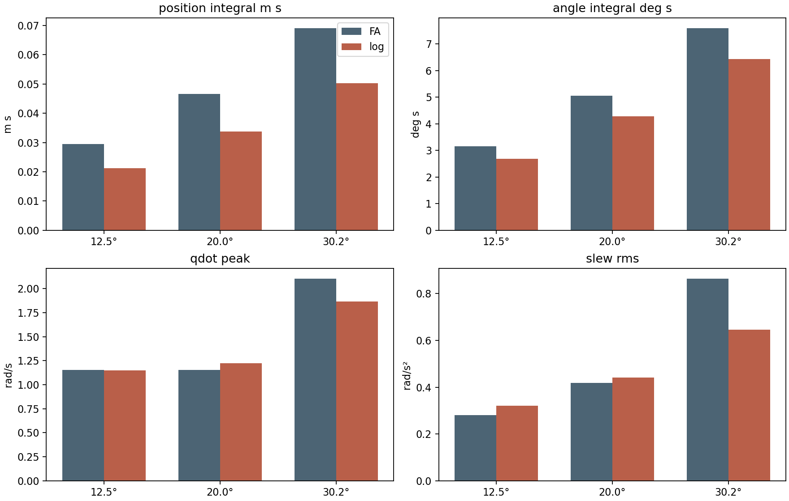
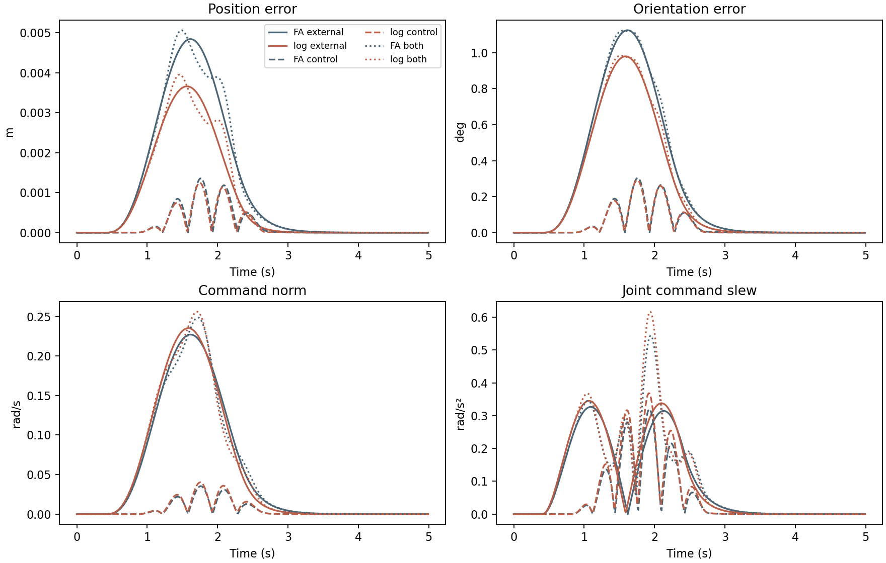

# 双通道螺旋对数速度控制器与 FA H∞ 控制器的直接速度积分对比

## 结论先行

在本文的三组 KUKA LBR4+ 跟踪工况中，一组固定的双通道参数
\(\gamma_R=0.300,\gamma_H=0.255\) 使对数控制器的关节指令速度 RMS 与 FA 相差不超过 0.381%，速度指令平方积分相差不超过 0.763%。位置误差时间积分降低 27.3%–27.7%，姿态误差时间积分降低 15.1%–15.5%。然而在较小误差工况，关节速度变化率 RMS 升高 5.7%–14.3%；20° 工况的速度范数峰值升高 6.3%。这种改善不能单独归因于对数误差：两控制器的局部反馈增益相同时，位置误差积分没有改善，姿态误差积分只改善不到 0.5%。

这些数值支持“通过双通道增益分配取得跟踪性能优势”的探索性结论，不构成物理 twist 扰动下分通道 \(H_\infty\) 上界的证明，也不代表真实摩擦与驱动器能耗。

## 控制器和比较条件

比较对象是 Figueredo、Adorno、Ishihara, *Robust H∞ kinematic control of manipulator robots using dual quaternion algebra*, Automatica 132 (2021) 109817, Theorem 1 的速度级控制律。实现为

$$
\dot q_{\mathrm{FA}}=J^+\left[\operatorname{vec}_6
\left(\widetilde{\breve x}\breve\xi_d\widetilde{\breve x}^{*}\right)
+\begin{bmatrix}\kappa_O O\\-\kappa_T T\end{bmatrix}\right],
\quad O=-\operatorname{Im}(\widetilde r),\quad
T=\widetilde p,
\quad \kappa_O=8,\ \kappa_T=4.
$$

本文控制器使用右不变误差
\(\widetilde{\breve x}=\breve x\breve x_d^*\)，以及

$$
2\ln\widetilde{\breve x}
=\widetilde\theta\widetilde{\mathbf n}
+\varepsilon\widetilde{\mathbf h}.
$$

其中 \(\widetilde{\mathbf h}\) 是含旋转与位移耦合的对偶对数部分，不是纯平移误差。实现的速度控制律为

$$
\dot q_{\log}=J^+\left[
\operatorname{vec}_6
\left(\widetilde{\breve x}\breve\xi_d\widetilde{\breve x}^{*}\right)
-\operatorname{dexp}_{\operatorname{vec}_6(2\ln\widetilde{\breve x})}
\begin{bmatrix}
\dfrac{\sqrt2}{\gamma_R}\widetilde\theta\widetilde{\mathbf n}\\[1mm]
\dfrac{\sqrt2}{\gamma_H}\widetilde{\mathbf h}
\end{bmatrix}\right].
$$

两者使用相同的正运动学、\(J^+\)（阻尼系数 0.001）、确定的期望 twist、采样周期 0.01 s 和 5 s 仿真时长。机械臂状态按

$$
q_{k+1}=q_k+0.01\left[\dot q_{c,k}+J_k^+
\bigl(v_{w,k}+v_{c,k}\bigr)\right]
$$

积分；无扰动时 \(v_w=v_c=0\)。这不是力矩积分或带速度内环的动力学仿真。所谓“输入能量”仅指 \(0.01\sum_k\|\dot q_{c,k}\|^2\)，单位为 \(\mathrm{rad}^2/\mathrm{s}\)，不等于电能或机械功。所谓“抖动”是关节速度指令一阶差分的 RMS 和峰值，不是实际结构振动。

初始关节偏移为 \(s[1,-1,1,-1,1,-1,1]^T\)，\(s=0.05,0.08,0.12\)，对应初始姿态误差约 12.5°、20.0°、30.2°。期望轨迹在 3.5 s 内平滑移动 \([0.15,0.10,-0.10]\) m，同时绕 z 轴旋转 0.5 rad。FA 保持 \(\gamma_O=\sqrt2/8\)、\(\gamma_T=\sqrt2/4\)。本控制器固定 \(\gamma_R=0.300\)、\(\gamma_H=0.255\) 用于全部三组工况。该参数来自这些工况上的探索性扫描，不是独立数据上的最优性证明。

所有位置和姿态指标均从同一物理末端误差计算。位置误差为 \(\|T\|\)，姿态误差角为 \(2\operatorname{atan2}(\|\operatorname{Im}(\widetilde r)\|,\operatorname{Re}(\widetilde r))\)；因此没有用各自内部误差坐标替代共同评价量。

## 固定参数的跟踪结果

“误差积分”是 5 s 内误差范数的时间积分；数值越低越好。

| 初始角度 | 控制器 | 速度 RMS (rad/s) | 输入平方积分 | 位置积分 (m·s) | 姿态积分 (°·s) | 位置 RMS (m) | 姿态 RMS (°) | 达到 5° / 2° (s) |
|---:|---|---:|---:|---:|---:|---:|---:|---:|
| 12.5° | FA | 0.595660 | 1.774054 | 0.029465 | 3.1560 | 0.018424 | 1.9967 | 0.23 / 0.45 |
| 12.5° | 对数 | 0.595887 | 1.775407 | 0.021291 | 2.6782 | 0.015717 | 1.8419 | 0.19 / 0.38 |
| 20.0° | FA | 0.605168 | 1.831141 | 0.046598 | 5.0487 | 0.029374 | 3.2053 | 0.35 / 0.57 |
| 20.0° | 对数 | 0.607472 | 1.845111 | 0.033733 | 4.2786 | 0.025097 | 2.9545 | 0.29 / 0.48 |
| 30.2° | FA | 0.632964 | 2.003219 | 0.069152 | 7.5982 | 0.043790 | 4.8308 | 0.45 / 0.67 |
| 30.2° | 对数 | 0.632230 | 1.998572 | 0.050258 | 6.4239 | 0.037525 | 4.4454 | 0.38 / 0.57 |

速度 RMS 差分别为 +0.038%、+0.381%、−0.116%；对应的输入平方积分差分别为 +0.076%、+0.763%、−0.232%。这个预算约束只约束总速度的二次平均，不约束瞬时峰值或频谱。

| 初始角度 | 控制器 | \(\|\dot q_c\|\) 峰值 (rad/s) | 单关节速度峰值 (rad/s) | 指令变化率 RMS (rad/s²) | 指令变化率峰值 (rad/s²) |
|---:|---|---:|---:|---:|---:|
| 12.5° | FA | 1.1522 | 0.7418 | 0.2811 | 2.2720 |
| 12.5° | 对数 | 1.1512 | 0.7412 | 0.3213 | 2.8317 |
| 20.0° | FA | 1.1520 | 0.7541 | 0.4174 | 6.4173 |
| 20.0° | 对数 | 1.2248 | 0.7412 | 0.4412 | 5.0352 |
| 30.2° | FA | 2.1055 | 1.5145 | 0.8644 | 16.2972 |
| 30.2° | 对数 | 1.8667 | 1.0349 | 0.6458 | 7.8827 |

对应地，12.5° 工况的指令变化率 RMS 增加 14.3%、峰值增加 24.6%；20° 工况速度范数峰值增加 6.3%、变化率 RMS 增加 5.7%；30.2° 工况速度峰值降低 11.3%、变化率 RMS 降低 25.3%。不能概括为“对数控制器总是更平滑”。

## 扰动响应

从零初始误差、静止期望位姿开始，分别注入外部任务空间 twist \(v_w\)（0.4–2.4 s 的平滑脉冲）和控制实现加性 twist 误差 \(v_c\)（0.8–2.8 s 的 1.5 Hz 包络正弦），以及二者叠加。两个控制器接受同一物理扰动信号，仍使用上面的固定参数。\(v_c\) 是对实现残差的简化注入，并未实际扰动雅可比矩阵或建模摩擦。

| 扰动 | 控制器 | 位置积分 (m·s) | 姿态积分 (°·s) | 对数旋转输出 \(L_2\) | 对偶对数输出 \(L_2\) | 指令平方积分 | 指令变化率 RMS (rad/s²) |
|---|---|---:|---:|---:|---:|---:|---:|
| 外部 | FA | 0.005414 | 1.2569 | 0.017666 | 0.004360 | 0.042320 | 0.05576 |
| 外部 | 对数 | 0.003905 | 1.0665 | 0.015249 | 0.003242 | 0.044385 | 0.05889 |
| 实现 | FA | 0.000894 | 0.1997 | 0.003318 | 0.000851 | 0.000493 | 0.03380 |
| 实现 | 对数 | 0.000823 | 0.1919 | 0.003210 | 0.000790 | 0.000649 | 0.03897 |
| 叠加 | FA | 0.005503 | 1.2814 | 0.017976 | 0.004442 | 0.042709 | 0.06477 |
| 叠加 | 对数 | 0.004040 | 1.0954 | 0.015583 | 0.003337 | 0.044935 | 0.07029 |

外部扰动下，对数控制器的位置、姿态误差积分分别降低约 27.9%、15.1%，但指令平方积分增加 4.9%、变化率 RMS 增加 5.6%。叠加扰动下，对应变化约为 −26.6%、−14.5%、+5.2%、+8.5%。因此在扰动实验中，这是以更高的控制活动换取更小误差，而不是等输入能量下的鲁棒性优势。

## 归因与泛化检查

在零误差附近，FA 的姿态反馈 \(8O\approx-4\widetilde\theta\widetilde{\mathbf n}\)，位移反馈约为 \(-4\widetilde p\)。固定参数的对数控制器局部系数为 \(\sqrt2/0.300=4.714\) 和 \(\sqrt2/0.255=5.546\)。因此两者虽然总体关节速度 RMS 很接近，局部反馈强度并不相同。

将对数控制器改成局部反馈系数恰好为 4、4（即 \(\gamma_R=\gamma_H=\sqrt2/4\)）后，得到以下对照。这里的“相同增益”是零误差邻域的反馈斜率相同，并不是在整条非线性轨迹上强制两个反馈函数相同。

| 初始角度 | 控制器 | 速度 RMS (rad/s) | 相对 FA 速度 RMS | 输入平方积分 | 位置误差积分 (m·s) | 姿态误差积分 (°·s) |
|---:|---|---:|---:|---:|---:|---:|
| 12.5° | FA | 0.595660 | 基准 | 1.774054 | 0.029465 | 3.156015 |
| 12.5° | 对数，同局部增益 | 0.597014 | +0.227% | 1.782131 | 0.029512 | 3.153724 |
| 20.0° | FA | 0.605168 | 基准 | 1.831141 | 0.046598 | 5.048669 |
| 20.0° | 对数，同局部增益 | 0.606751 | +0.262% | 1.840736 | 0.046770 | 5.039204 |
| 30.2° | FA | 0.632964 | 基准 | 2.003219 | 0.069152 | 7.598170 |
| 30.2° | 对数，同局部增益 | 0.626322 | −1.049% | 1.961398 | 0.069706 | 7.565922 |

前两组的速度 RMS 差都小于 0.3%，输入平方积分分别高约 0.46% 和 0.52%，符合本文的 1% 预算。30.2° 工况的速度 RMS 低 1.049%、输入平方积分低 2.09%，略超出既定预算；这个点不能作为严格等预算的误差性能比较。三组姿态误差积分相对 FA 仅变化 −0.07%、−0.19%、−0.42%，位置误差积分变化 +0.16%、+0.37%、+0.80%。因此“对数表示天然更快收敛”没有得到支持。

| 初始角度 | 控制器 | 速度范数峰值 (rad/s) | 指令变化率 RMS (rad/s²) | 指令变化率峰值 (rad/s²) |
|---:|---|---:|---:|---:|
| 12.5° | FA | 1.1522 | 0.2811 | 2.2720 |
| 12.5° | 对数，同局部增益 | 1.1524 | 0.2796 | 1.3799 |
| 20.0° | FA | 1.1520 | 0.4174 | 6.4173 |
| 20.0° | 对数，同局部增益 | 1.1527 | 0.3287 | 2.4033 |
| 30.2° | FA | 2.1055 | 0.8644 | 16.2972 |
| 30.2° | 对数，同局部增益 | 1.2722 | 0.4293 | 4.2495 |

同局部增益时，对数律在 20° 工况的指令变化率 RMS 低 21.2%、峰值低 62.5%，而位置和姿态误差积分几乎不变。这是当前实验中较可信的结构性优势：速度指令更平滑，并非误差收敛明显更快。30.2° 的平滑性改善更大，但该组总速度预算未严格匹配。

逐工况配平也揭示权衡：\(\gamma_H/\gamma_R=1\) 时，精确匹配总速度 RMS 的对数律在 12.5° 和 20° 的姿态误差积分分别比 FA 高 26.6% 和 10.8%，但变化率 RMS 分别低 6.3% 和 25.8%；到 30.2° 时，姿态积分低 16.8%、变化率 RMS 低 40.2%。\(\gamma_H/\gamma_R=0.5\) 会在前两组改善位置积分，却显著恶化姿态积分和速度峰值。\(\gamma_H/\gamma_R=2\) 在扫描的 \(\gamma_R\in[0.08,8]\) 内未达到 1% RMS 匹配，不应纳入公平优劣排序。

另用没有参与选参的反向平移/旋转轨迹 \(\Delta p=[0.08,-0.12,0.06]\) m、\(\Delta\theta=-0.35\) rad，在约 15° 和 25° 初始误差下检查固定参数：位置和姿态误差积分依旧分别约低 27.5% 和 15.3%，但关节速度 RMS 分别比 FA 高 2.09% 和 1.14%。它们超出预设 1% 公平预算，只能视为趋势检查，不能作为等投入性能优势的独立验证。

## (H_\infty) 解释的边界

原文 Theorem 1 对 \(1-\widetilde{\breve x}\) 的旋转/平移输出分别给出多输入扰动界。本文的对数旋转输出和对偶对数输出与其不是同一坐标；\(\gamma\) 数值及输出 \(L_2\) 范数不能逐项直接等价。现有分通道 Schur 补证明把两类扰动视为**对数坐标中的独立加性输入**。本仿真实际注入的是物理 twist；在对数坐标下它们经过 \(\operatorname{dexp}^{-1}\)，其对偶块一般含旋转/位移交叉项，因而不能直接套用相互独立的两个标量通道不等式。阻尼伪逆的任务空间残差也应纳入严格证明。

所以本实验给出的是这些选定扰动的经验 \(L_2\) 响应，不是诱导 \(L_2\) 增益的上确界，也没有验证所写 \(H_\infty\) 上界。要形成可信的多通道 \(H_\infty\) 论文结论，需要先修正物理扰动到对数输出的耦合证明，并在未参与调参的任务、扰动频谱和关节配置上满足同一速度/输入预算。

## 可复现文件

- 实验程序：`TNDQ_sim/experiments/compare_direct_velocity_log_hinf_current.py`
- 固定参数跟踪：`TNDQ_sim/results/direct_velocity_log_hinf_fixed.csv`
- 分源扰动：`TNDQ_sim/results/direct_velocity_log_hinf_disturbance.csv`
- 逐工况配平与匹配状态：`TNDQ_sim/results/direct_velocity_log_hinf_nominal.csv`、`TNDQ_sim/results/direct_velocity_log_hinf_matching.csv`
- 局部增益对照：`TNDQ_sim/results/direct_velocity_log_hinf_local_gain.csv`
- 另一条轨迹：`TNDQ_sim/results/direct_velocity_log_hinf_validation.csv`
