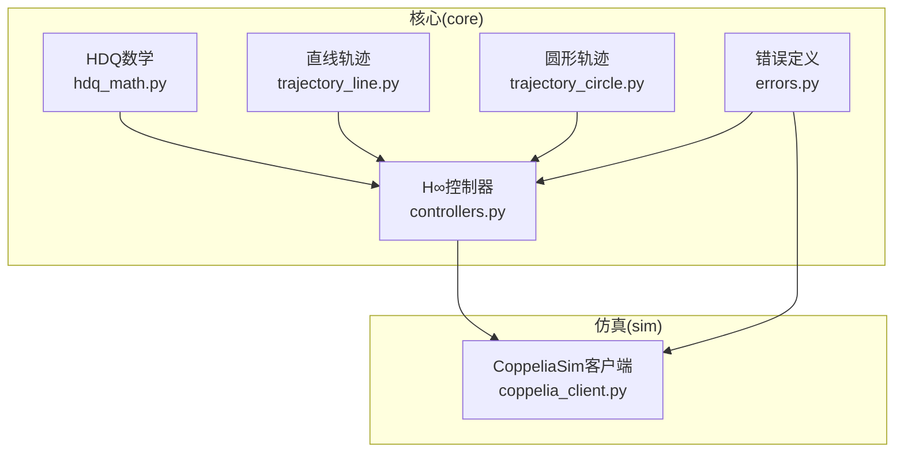
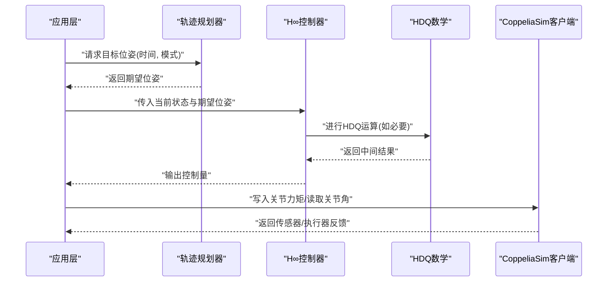
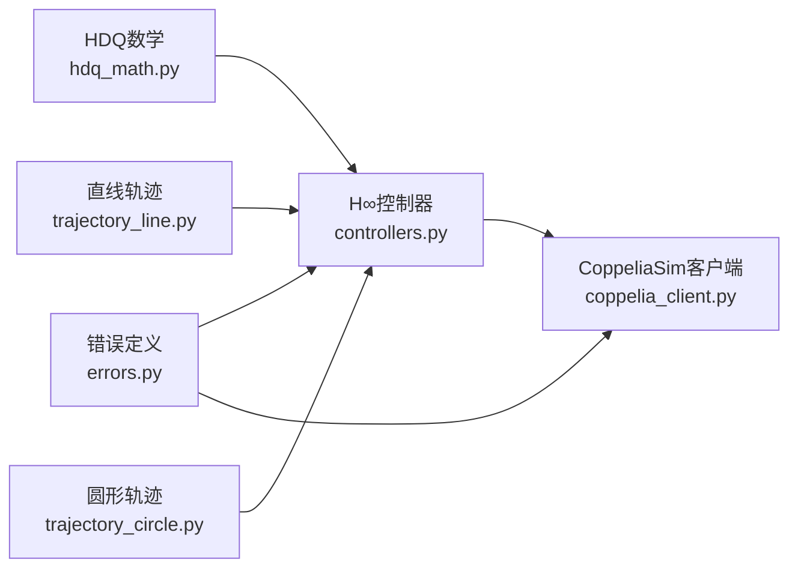

# API参考文档

<cite>
**本文档引用的文件**   
- [hdq_math.py](file://core/hdq_math.py)
- [controllers.py](file://core/controllers.py)
- [trajectory_line.py](file://core/trajectory_line.py)
- [trajectory_circle.py](file://core/trajectory_circle.py)
- [coppelia_client.py](file://sim/coppelia_client.py)
- [errors.py](file://core/errors.py)
</cite>

## 目录
1. [简介](#简介)
2. [项目结构](#项目结构)
3. [核心组件](#核心组件)
4. [架构总览](#架构总览)
5. [详细组件分析](#详细组件分析)
6. [依赖关系分析](#依赖关系分析)
7. [性能考虑](#性能考虑)
8. [故障排查指南](#故障排查指南)
9. [结论](#结论)
10. [附录](#附录)

## 简介
本API参考文档面向使用超对偶四元数（HDQ）建模与控制的机器人仿真系统，覆盖以下模块的公共接口：
- HDQ数学运算类：构造、基本运算、变换矩阵计算等
- H∞控制器类：初始化、控制量计算、状态更新
- 轨迹规划器：直线与圆形轨迹生成
- CoppeliaSim客户端：连接管理、数据读写、错误处理

文档为每个API提供函数签名、参数说明、返回值类型、使用示例与注意事项，并辅以架构图与流程图帮助理解。

## 项目结构
本项目采用分层组织方式：
- core：核心算法与模型（HDQ数学、控制器、轨迹规划、误差定义等）
- sim：CoppeliaSim通信客户端与关节名映射
- experiments：实验脚本（不在本API文档范围内）
- configs：配置项（不在本API文档范围内）

图表来源
- [hdq_math.py](file://core/hdq_math.py)
- [controllers.py](file://core/controllers.py)
- [trajectory_line.py](file://core/trajectory_line.py)
- [trajectory_circle.py](file://core/trajectory_circle.py)
- [coppelia_client.py](file://sim/coppelia_client.py)
- [errors.py](file://core/errors.py)

章节来源
- [hdq_math.py](file://core/hdq_math.py)
- [controllers.py](file://core/controllers.py)
- [trajectory_line.py](file://core/trajectory_line.py)
- [trajectory_circle.py](file://core/trajectory_circle.py)
- [coppelia_client.py](file://sim/coppelia_client.py)
- [errors.py](file://core/errors.py)

## 核心组件
本节概述各模块职责与对外暴露的主要能力，具体API细节见“详细组件分析”。

- HDQ数学运算类：提供超对偶四元数的构造、加减乘除、共轭、范数、归一化、指数/对数、旋转与平移组合以及从HDQ到齐次变换矩阵的转换方法。
- H∞控制器类：封装H∞控制器设计与在线控制流程，包括初始化、控制律计算、状态更新与稳定性相关属性。
- 轨迹规划器：提供直线与圆形轨迹的参数化生成方法，支持时间戳、速度限制与边界条件。
- CoppeliaSim客户端：封装与CoppeliaSim的通信，包括连接建立/断开、关节角度读取、关节力矩写入、异常处理与重试策略。

章节来源
- [hdq_math.py](file://core/hdq_math.py)
- [controllers.py](file://core/controllers.py)
- [trajectory_line.py](file://core/trajectory_line.py)
- [trajectory_circle.py](file://core/trajectory_circle.py)
- [coppelia_client.py](file://sim/coppelia_client.py)
- [errors.py](file://core/errors.py)

## 架构总览
下图展示从高层调用到具体实现的典型数据流与控制流。

图表来源
- [trajectory_line.py](file://core/trajectory_line.py)
- [trajectory_circle.py](file://core/trajectory_circle.py)
- [controllers.py](file://core/controllers.py)
- [hdq_math.py](file://core/hdq_math.py)
- [coppelia_client.py](file://sim/coppelia_client.py)

## 详细组件分析

### HDQ数学运算类
该类提供超对偶四元数的完整数学运算与几何变换能力。

- 构造
  - 构造函数
    - 功能：创建超对偶四元数实例
    - 参数：标量部分与向量部分（或按分量输入）
    - 返回：HDQ对象
    - 注意：需保证维度一致；若用于几何变换，建议后续归一化
  - 单位元素
    - 功能：返回单位超对偶四元数
    - 参数：无
    - 返回：HDQ对象
- 基本运算
  - 加法/减法
    - 功能：逐分量相加/相减
    - 参数：两个HDQ对象
    - 返回：HDQ对象
  - 乘法
    - 功能：HDQ乘法（含双对偶扩展）
    - 参数：两个HDQ对象
    - 返回：HDQ对象
  - 除法
    - 功能：乘以逆元实现除法
    - 参数：被除数HDQ、除数HDQ
    - 返回：HDQ对象
    - 注意：除数接近零时需做数值保护
  - 共轭
    - 功能：返回共轭HDQ
    - 参数：HDQ对象
    - 返回：HDQ对象
  - 范数/模长
    - 功能：计算范数
    - 参数：HDQ对象
    - 返回：标量
  - 归一化
    - 功能：将HDQ归一化为单位长度
    - 参数：HDQ对象
    - 返回：HDQ对象
- 指数/对数
  - 指数
    - 功能：计算HDQ指数
    - 参数：HDQ对象
    - 返回：HDQ对象
  - 对数
    - 功能：计算HDQ对数
    - 参数：HDQ对象
    - 返回：HDQ对象
- 几何变换
  - 旋转向量
    - 功能：用HDQ表示旋转并作用于向量
    - 参数：HDQ对象、三维向量
    - 返回：三维向量
  - 平移向量
    - 功能：用HDQ表示平移并作用于向量
    - 参数：HDQ对象、三维向量
    - 返回：三维向量
  - 齐次变换矩阵
    - 功能：由HDQ导出4x4齐次变换矩阵
    - 参数：HDQ对象
    - 返回：4x4矩阵
    - 注意：输入应为单位HDQ以保证纯旋转；否则包含缩放/剪切成分
- 实用工具
  - 比较/相等性
    - 功能：判断两个HDQ是否近似相等
    - 参数：两个HDQ对象、容差
    - 返回：布尔值
  - 打印/字符串化
    - 功能：格式化输出HDQ
    - 参数：HDQ对象
    - 返回：字符串

使用示例
- 构造与归一化：先构造再归一化，确保后续旋转正确
- 组合变换：通过指数/对数拼接多个小旋转，避免累积误差
- 变换矩阵：将HDQ转换为齐次矩阵后用于坐标变换或可视化

注意事项
- 数值稳定性：在接近奇异时（如极小范数）增加阈值保护
- 精度要求：几何变换建议使用双精度浮点
- 单位约束：用于旋转时应保持单位长度，必要时定期重归一化

章节来源
- [hdq_math.py](file://core/hdq_math.py)

### H∞控制器类
该类封装H∞控制器的设计参数与在线控制流程。

- 初始化
  - 构造函数
    - 功能：根据系统模型与权重设置H∞控制器
    - 参数：系统矩阵、输出矩阵、权重矩阵、采样时间等
    - 返回：控制器实例
    - 注意：需验证矩阵维度与可解性条件
- 控制量计算
  - 计算控制律
    - 功能：基于当前状态与参考输入计算控制量
    - 参数：当前状态向量、参考信号、可选扰动估计
    - 返回：控制量向量
    - 注意：输出限幅需在外部处理
- 状态更新
  - 更新内部状态
    - 功能：推进离散时间状态或观测器状态
    - 参数：上一时刻状态、控制量、测量值
    - 返回：新状态
- 属性与方法
  - 获取控制器增益
    - 功能：返回已计算的增益矩阵
    - 参数：无
    - 返回：矩阵
  - 重置
    - 功能：清空历史状态
    - 参数：无
    - 返回：无

使用示例
- 离线设计：依据模型与权重求解控制器
- 在线运行：在每个控制周期内调用计算控制律并更新状态

注意事项
- 数值条件：确保系统满足H∞设计的可解性假设
- 饱和与抗积分饱和：在实际控制中需加入限幅与补偿
- 采样一致性：控制器采样时间与仿真步长需匹配

章节来源
- [controllers.py](file://core/controllers.py)

### 轨迹规划器API

#### 直线轨迹规划器
- 生成直线轨迹
  - 功能：在给定起止位姿与时间窗口内生成直线插值轨迹
  - 参数：起始位姿、终止位姿、总时间、速度上限、加速度上限（可选）、时间戳序列（可选）
  - 返回：位姿序列（时间-位姿对）
  - 注意：起止位姿需为兼容格式（如齐次矩阵或HDQ）
- 查询某时刻位姿
  - 功能：根据时间戳查询当前期望位姿
  - 参数：时间戳、轨迹对象
  - 返回：位姿
  - 注意：越界时间需做截断或报错

使用示例
- 设定起点与终点，指定总时长与最大速度，生成平滑直线段
- 在控制循环中以固定频率查询当前期望位姿

注意事项
- 速度/加速度限制会影响实际可达时间
- 位姿插值建议使用HDQ或四元数以避免万向节锁

章节来源
- [trajectory_line.py](file://core/trajectory_line.py)

#### 圆形轨迹规划器
- 生成圆形轨迹
  - 功能：围绕中心点与半径生成平面圆轨迹
  - 参数：圆心、半径、起始角、角速度或周期、法向量、时间戳序列（可选）
  - 返回：位姿序列
  - 注意：法向量决定平面朝向；需保证非零半径
- 查询某时刻位姿
  - 功能：根据时间戳查询圆上对应位姿
  - 参数：时间戳、轨迹对象
  - 返回：位姿

使用示例
- 以z轴为法向量，在xy平面生成匀速圆周运动
- 结合H∞控制器跟踪该圆形轨迹

注意事项
- 角速度恒定可能导致瞬时加速度不连续，可在前后端加过渡段
- 大半径或高角速度需注意执行器能力与稳定性

章节来源
- [trajectory_circle.py](file://core/trajectory_circle.py)

### CoppeliaSim客户端API
该模块封装与CoppeliaSim的通信协议与常用操作。

- 连接管理
  - 建立连接
    - 功能：连接到CoppeliaSim服务
    - 参数：主机地址、端口、超时
    - 返回：连接句柄或成功标志
    - 异常：网络不可达、认证失败等
  - 断开连接
    - 功能：关闭与CoppeliaSim的连接
    - 参数：连接句柄
    - 返回：无
- 数据读写
  - 读取关节角度
    - 功能：批量读取关节位置
    - 参数：连接句柄、关节名称列表
    - 返回：角度数组
  - 写入关节力矩
    - 功能：批量写入关节力矩
    - 参数：连接句柄、关节名称列表、力矩数组
    - 返回：成功标志
  - 读取/写入自定义信号
    - 功能：通过通用信号通道交换数据
    - 参数：连接句柄、信号名、值
    - 返回：读取值或写入结果
- 错误处理
  - 统一异常类型
    - 功能：封装通信错误、超时、校验失败等
    - 参数：错误码、消息
    - 返回：异常对象
  - 重试机制
    - 功能：对瞬态错误自动重试
    - 参数：最大重试次数、退避策略
    - 返回：最终结果或抛出异常

使用示例
- 启动仿真后建立连接，周期性读取关节角并写入控制力矩
- 捕获通信异常并重试，保障鲁棒性

注意事项
- 线程安全：同一连接不建议并发写
- 时序同步：读写应在仿真步内完成，避免丢包
- 资源释放：退出前务必断开连接

章节来源
- [coppelia_client.py](file://sim/coppelia_client.py)
- [errors.py](file://core/errors.py)

## 依赖关系分析
模块间依赖如下：

图表来源
- [hdq_math.py](file://core/hdq_math.py)
- [controllers.py](file://core/controllers.py)
- [trajectory_line.py](file://core/trajectory_line.py)
- [trajectory_circle.py](file://core/trajectory_circle.py)
- [coppelia_client.py](file://sim/coppelia_client.py)
- [errors.py](file://core/errors.py)

章节来源
- [hdq_math.py](file://core/hdq_math.py)
- [controllers.py](file://core/controllers.py)
- [trajectory_line.py](file://core/trajectory_line.py)
- [trajectory_circle.py](file://core/trajectory_circle.py)
- [coppelia_client.py](file://sim/coppelia_client.py)
- [errors.py](file://core/errors.py)

## 性能考虑
- HDQ运算
  - 优先使用向量化实现减少Python循环开销
  - 频繁归一化时可采用增量修正而非每次全量重算
- 控制器
  - 预计算常数矩阵（如增益）以降低在线开销
  - 使用单精度仅在确认稳定且内存受限场景下
- 轨迹规划
  - 预生成轨迹表并在运行时查表，降低实时计算压力
- CoppeliaSim通信
  - 批量读写优于多次单条调用
  - 合理设置超时与重试退避，避免雪崩

[本节为通用指导，无需代码来源]

## 故障排查指南
- 常见错误分类
  - 连接错误：检查主机/端口、防火墙、仿真器是否运行
  - 数据不一致：核对关节名映射与维度
  - 数值不稳定：检查HDQ是否归一化、控制器是否满足可解性
- 定位步骤
  - 启用日志记录，记录关键变量与时间戳
  - 分模块隔离测试：先验证HDQ变换矩阵，再验证控制器开环响应，最后接入仿真
  - 最小复现：用静态位姿与零控制量验证通信链路
- 恢复策略
  - 自动重试与降级（如回退到PD控制）
  - 安全停机：超出阈值立即置零力矩并断开连接

章节来源
- [errors.py](file://core/errors.py)
- [coppelia_client.py](file://sim/coppelia_client.py)

## 结论
本API参考文档系统化梳理了HDQ数学、H∞控制器、轨迹规划与CoppeliaSim客户端的核心接口，提供了参数、返回、示例与注意事项，并辅以架构图与流程图帮助快速上手。建议在工程中遵循单位约束、数值稳定与资源释放的最佳实践，以获得可靠的实时控制体验。

[本节为总结，无需代码来源]

## 附录
- 术语
  - 超对偶四元数：在传统四元数基础上引入双对偶扩展，便于同时表达旋转与平移
  - H∞控制：一种鲁棒控制设计方法，旨在抑制最坏情况下的扰动影响
  - 齐次变换矩阵：描述刚体空间位姿的4x4矩阵
- 版本与兼容性
  - Python版本：建议使用3.8+
  - NumPy：建议使用1.20+
  - CoppeliaSim：建议使用官方最新稳定版

[本节为补充信息，无需代码来源]