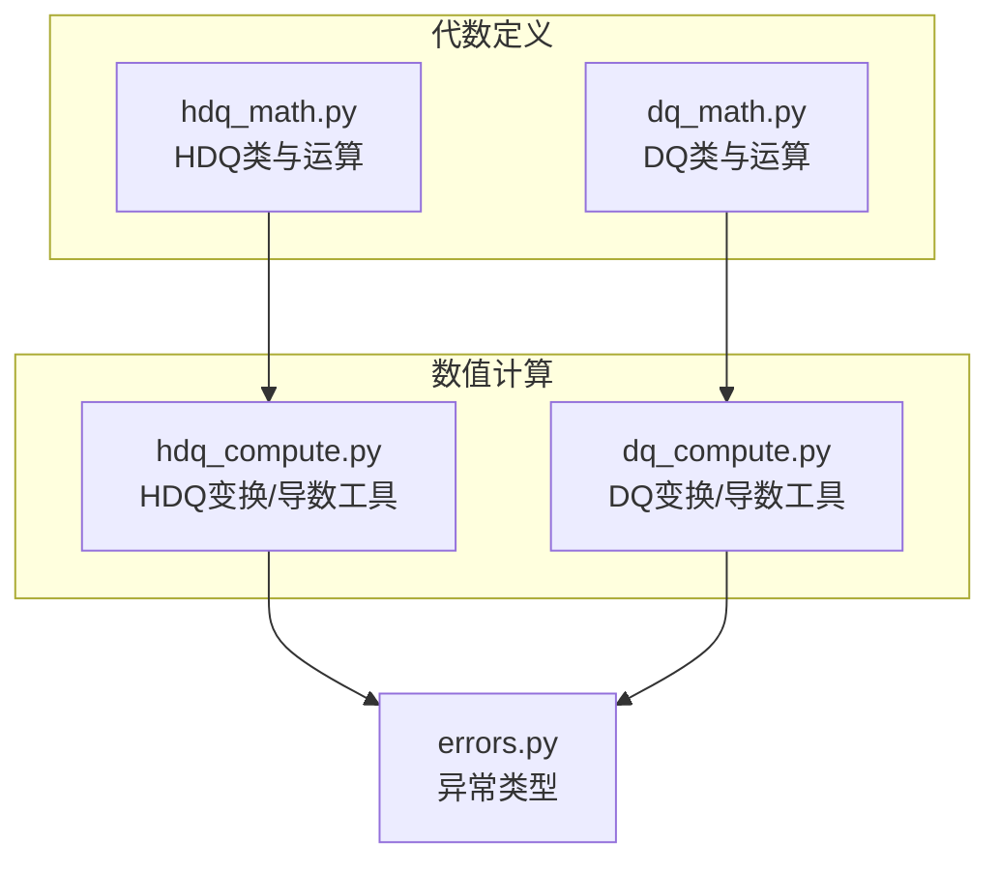
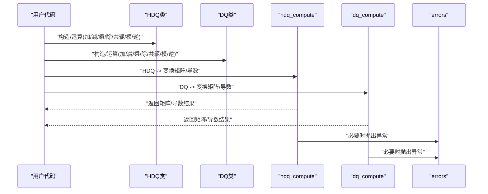
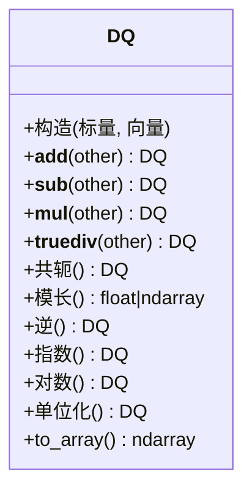
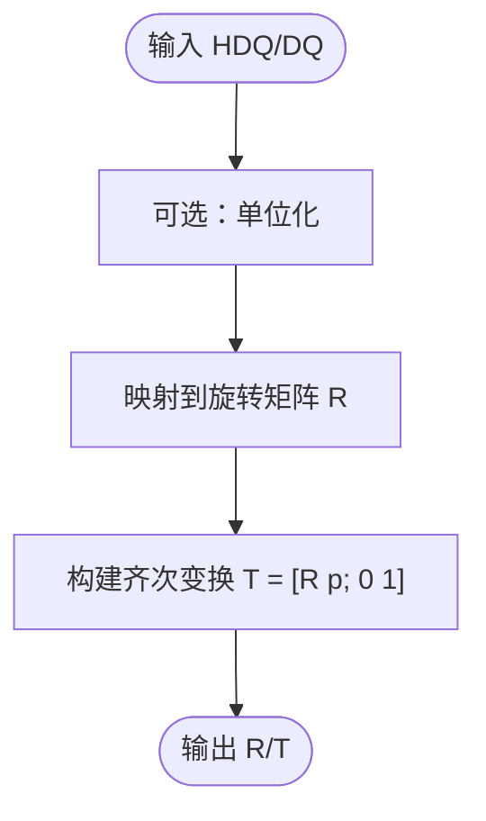
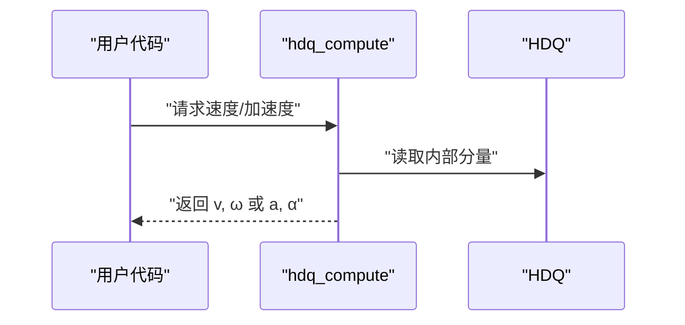
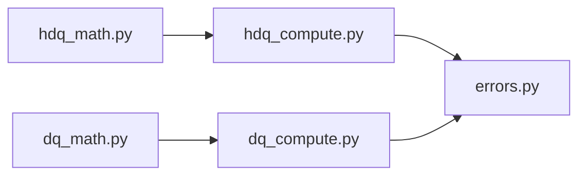

# HDQ数学库API

<cite>
**本文档引用的文件**   
- [core/hdq_math.py](file://core/hdq_math.py)
- [core/dq_math.py](file://core/dq_math.py)
- [core/hdq_compute.py](file://core/hdq_compute.py)
- [core/dq_compute.py](file://core/dq_compute.py)
- [core/errors.py](file://core/errors.py)
</cite>

## 目录
1. [简介](#简介)
2. [项目结构](#项目结构)
3. [核心组件](#核心组件)
4. [架构总览](#架构总览)
5. [详细组件分析](#详细组件分析)
6. [依赖关系分析](#依赖关系分析)
7. [性能考虑](#性能考虑)
8. [故障排查指南](#故障排查指南)
9. [结论](#结论)
10. [附录](#附录)

## 简介
本文件为HDQ数学库的完整API文档，覆盖超对偶四元数(HDQ)与双四元数(DQ)两类代数对象及其运算、变换矩阵计算、导数相关表示与计算等。文档面向不同技术背景的读者，提供从高层概念到代码级实现的渐进式说明，并包含错误处理与边界情况的注意事项。

## 项目结构
本项目围绕“代数定义”和“数值计算”两层组织：
- 代数定义层：提供HDQ与DQ的数据结构与基本运算（加减乘除、共轭、模长、逆等）。
- 数值计算层：基于代数定义实现变换矩阵计算、运动学量（位置、速度、加速度）的HDQ/DQ表示与求导。

图表来源
- [core/hdq_math.py](file://core/hdq_math.py)
- [core/dq_math.py](file://core/dq_math.py)
- [core/hdq_compute.py](file://core/hdq_compute.py)
- [core/dq_compute.py](file://core/dq_compute.py)
- [core/errors.py](file://core/errors.py)

章节来源
- [core/hdq_math.py](file://core/hdq_math.py)
- [core/dq_math.py](file://core/dq_math.py)
- [core/hdq_compute.py](file://core/hdq_compute.py)
- [core/dq_compute.py](file://core/dq_compute.py)
- [core/errors.py](file://core/errors.py)

## 核心组件
- HDQ类：超对偶四元数，用于同时表达旋转与一阶/二阶微分信息，支持加减乘除、共轭、模长、逆、指数/对数映射等。
- DQ类：双四元数，用于表达旋转与一阶微分信息，支持与HDQ类似的运算族。
- 变换矩阵工具：将HDQ/DQ转换为旋转矩阵或齐次变换矩阵。
- 导数工具：提供以HDQ/DQ表示的位置、速度、加速度及相应求导方法。

章节来源
- [core/hdq_math.py](file://core/hdq_math.py)
- [core/dq_math.py](file://core/dq_math.py)
- [core/hdq_compute.py](file://core/hdq_compute.py)
- [core/dq_compute.py](file://core/dq_compute.py)

## 架构总览
下图展示了HDQ/DQ在系统中的角色与调用关系：用户通过HDQ/DQ对象进行代数运算，再通过compute模块将其转换为几何/运动学量（如变换矩阵、速度、加速度），并在需要时抛出统一异常。

图表来源
- [core/hdq_math.py](file://core/hdq_math.py)
- [core/dq_math.py](file://core/dq_math.py)
- [core/hdq_compute.py](file://core/hdq_compute.py)
- [core/dq_compute.py](file://core/dq_compute.py)
- [core/errors.py](file://core/errors.py)

## 详细组件分析

### HDQ类 API
- 数据模型
  - 内部存储：标量部分与向量部分组合，扩展至超对偶维度以承载高阶导数信息。
  - 形状约定：遵循NumPy数组风格，便于批量计算。
- 构造函数
  - 输入：标量与向量分量（可为标量、数组或可迭代对象）。
  - 输出：HDQ实例。
  - 校验：检查维度一致性；非法输入将触发异常。
- 基本运算
  - 加法/减法：逐分量相加/相减。
  - 乘法：按HDQ乘法定义实现，满足结合律但不满足交换律。
  - 除法：通过右乘逆实现，需保证非奇异。
  - 共轭：反转向量部分符号。
  - 模长：基于内积定义的范数。
  - 逆：模长平方倒数乘以共轭，注意零模长保护。
- 高级映射
  - 指数/对数：在单位球附近稳定，建议先归一化再使用。
- 常用辅助
  - 单位化：将任意HDQ投影到单位流形。
  - 比较与序列化：支持相等性判断与转换到数组/字典。
- 参数与返回值
  - 所有算术方法均返回同类型的HDQ实例。
  - 标量属性（如模长）返回浮点数或数组。
- 示例路径
  - 参考：[core/hdq_math.py](file://core/hdq_math.py)

章节来源
- [core/hdq_math.py](file://core/hdq_math.py)

#### HDQ类关系图

图表来源
- [core/hdq_math.py](file://core/hdq_math.py)

### DQ类 API
- 数据模型
  - 内部存储：标量与向量部分，扩展至双对偶维度以承载一阶导数信息。
- 构造函数
  - 输入：标量与向量分量（可为标量、数组或可迭代对象）。
  - 输出：DQ实例。
  - 校验：检查维度一致性；非法输入将触发异常。
- 基本运算
  - 加法/减法：逐分量相加/相减。
  - 乘法：按DQ乘法定义实现。
  - 除法：通过右乘逆实现。
  - 共轭：反转向量部分符号。
  - 模长：基于内积定义的范数。
  - 逆：模长平方倒数乘以共轭，注意零模长保护。
- 高级映射
  - 指数/对数：在单位球附近稳定，建议先归一化再使用。
- 常用辅助
  - 单位化：将任意DQ投影到单位流形。
  - 比较与序列化：支持相等性判断与转换到数组/字典。
- 参数与返回值
  - 所有算术方法均返回同类型的DQ实例。
  - 标量属性（如模长）返回浮点数或数组。
- 示例路径
  - 参考：[core/dq_math.py](file://core/dq_math.py)

章节来源
- [core/dq_math.py](file://core/dq_math.py)

#### DQ类关系图

图表来源
- [core/dq_math.py](file://core/dq_math.py)

### 变换矩阵计算（HDQ/DQ）
- 功能概述
  - 将HDQ/DQ转换为旋转矩阵R或齐次变换矩阵T。
  - 对于HDQ，可同时输出与一阶/二阶导数相关的线性/角速度项。
- 主要接口
  - hdq_to_R(hdq): 由HDQ得到3x3旋转矩阵。
  - hdq_to_T(hdq): 由HDQ得到4x4齐次变换矩阵。
  - dq_to_R(dq): 由DQ得到3x3旋转矩阵。
  - dq_to_T(dq): 由DQ得到4x4齐次变换矩阵。
- 参数与返回值
  - 输入：HDQ/DQ实例。
  - 输出：numpy矩阵（float64）。
- 示例路径
  - 参考：[core/hdq_compute.py](file://core/hdq_compute.py), [core/dq_compute.py](file://core/dq_compute.py)

章节来源
- [core/hdq_compute.py](file://core/hdq_compute.py)
- [core/dq_compute.py](file://core/dq_compute.py)

#### 变换矩阵计算流程图

图表来源
- [core/hdq_compute.py](file://core/hdq_compute.py)
- [core/dq_compute.py](file://core/dq_compute.py)

### 导数计算（位置、速度、加速度）
- 背景
  - HDQ天然携带一阶与二阶导数信息，适合直接表达位姿、线速度、角速度及其变化率。
- 主要接口
  - hdq_position(hdq): 提取位置向量p。
  - hdq_velocity(hdq): 提取线速度v与角速度ω的组合表示。
  - hdq_acceleration(hdq): 提取线加速度a与角加速度α的组合表示。
  - dq_velocity(dq): 提取DQ对应的一阶速度信息。
- 参数与返回值
  - 输入：HDQ/DQ实例。
  - 输出：numpy向量或张量（根据批次维度而定）。
- 示例路径
  - 参考：[core/hdq_compute.py](file://core/hdq_compute.py), [core/dq_compute.py](file://core/dq_compute.py)

章节来源
- [core/hdq_compute.py](file://core/hdq_compute.py)
- [core/dq_compute.py](file://core/dq_compute.py)

#### 导数计算序列图

图表来源
- [core/hdq_compute.py](file://core/hdq_compute.py)

### 错误处理与边界情况
- 常见异常
  - 维度不匹配：当输入形状不一致时抛出异常。
  - 零模长/奇异：对逆或除法操作进行保护，避免除以零。
  - 数值不稳定：对接近奇异的输入给出警告或回退策略。
- 异常类型
  - 自定义异常类型集中定义于错误模块，便于统一捕获与日志记录。
- 示例路径
  - 参考：[core/errors.py](file://core/errors.py)

章节来源
- [core/errors.py](file://core/errors.py)

## 依赖关系分析
- 模块耦合
  - hdq_math.py与dq_math.py提供基础代数，被compute模块依赖。
  - compute模块依赖errors模块进行异常上报。
- 外部依赖
  - 主要依赖NumPy进行高效数值计算。
- 潜在循环依赖
  - 当前分层清晰，未见循环导入风险。

图表来源
- [core/hdq_math.py](file://core/hdq_math.py)
- [core/dq_math.py](file://core/dq_math.py)
- [core/hdq_compute.py](file://core/hdq_compute.py)
- [core/dq_compute.py](file://core/dq_compute.py)
- [core/errors.py](file://core/errors.py)

章节来源
- [core/hdq_math.py](file://core/hdq_math.py)
- [core/dq_math.py](file://core/dq_math.py)
- [core/hdq_compute.py](file://core/hdq_compute.py)
- [core/dq_compute.py](file://core/dq_compute.py)
- [core/errors.py](file://core/errors.py)

## 性能考虑
- 向量化优先：尽量使用NumPy广播与批量计算，减少Python循环。
- 内存布局：保持连续内存布局以提升缓存命中率。
- 数值稳定性：在指数/对数与逆运算前进行单位化与条件检测。
- 中间变量复用：避免重复计算，必要时缓存中间结果。

## 故障排查指南
- 症状：出现维度不匹配异常
  - 排查：确认输入是否为相同形状的HDQ/DQ实例或兼容的数组。
- 症状：逆运算失败或结果发散
  - 排查：检查模长是否接近零；必要时增加阈值保护或正则化。
- 症状：变换矩阵不符合预期
  - 排查：确认输入已单位化；检查坐标系约定与右手系规则。
- 症状：速度/加速度异常
  - 排查：确认时间步长与采样频率一致；检查初始条件与噪声。

章节来源
- [core/errors.py](file://core/errors.py)

## 结论
HDQ数学库通过清晰的代数定义与计算分层，提供了完整的HDQ/DQ运算与几何/运动学转换能力。建议在工程中优先使用单位化与数值保护策略，以获得更稳定的结果。

## 附录
- 术语
  - HDQ：超对偶四元数，用于同时表达旋转与一阶/二阶导数信息。
  - DQ：双四元数，用于表达旋转与一阶导数信息。
- 参考实现路径
  - HDQ类与运算：[core/hdq_math.py](file://core/hdq_math.py)
  - DQ类与运算：[core/dq_math.py](file://core/dq_math.py)
  - HDQ变换/导数工具：[core/hdq_compute.py](file://core/hdq_compute.py)
  - DQ变换/导数工具：[core/dq_compute.py](file://core/dq_compute.py)
  - 异常类型：[core/errors.py](file://core/errors.py)