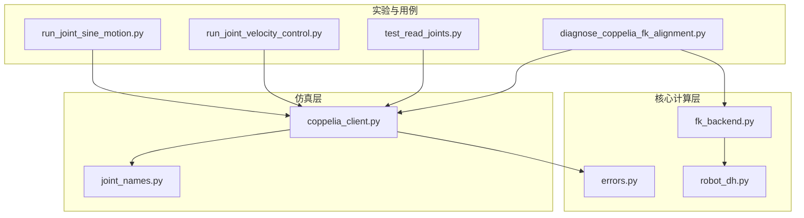
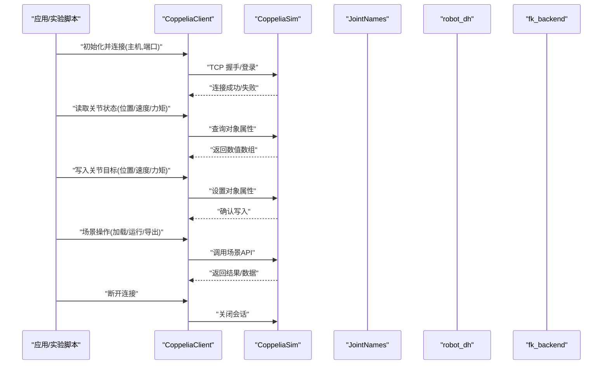
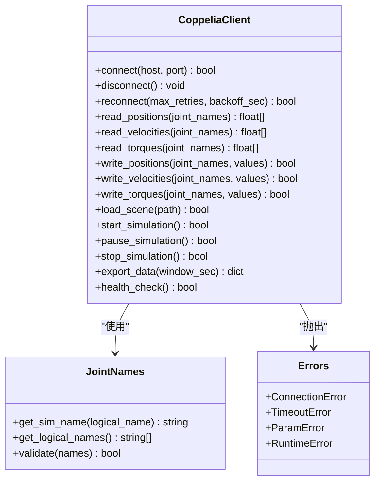
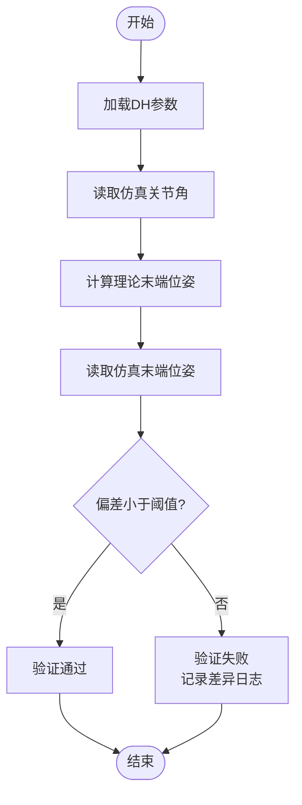
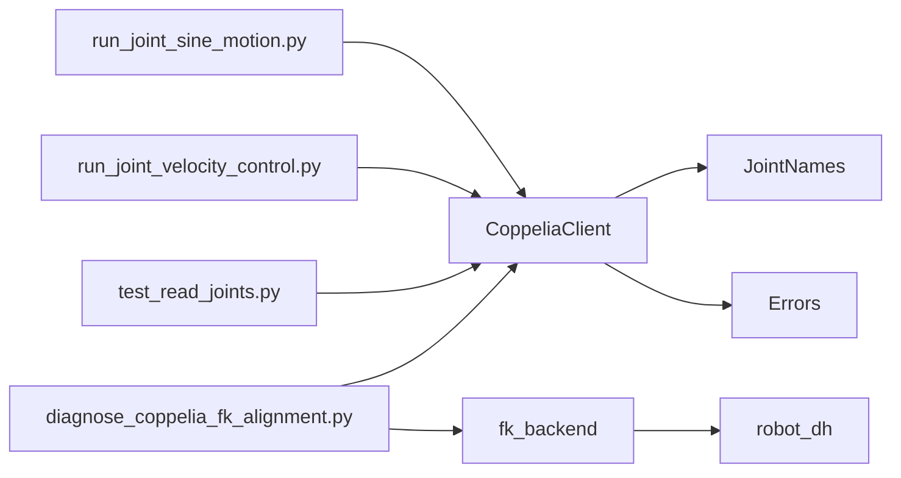

# 仿真接口API

<cite>
**本文引用的文件**   
- [sim/coppelia_client.py](file://sim/coppelia_client.py)
- [sim/joint_names.py](file://sim/joint_names.py)
- [core/robot_dh.py](file://core/robot_dh.py)
- [core/fk_backend.py](file://core/fk_backend.py)
- [core/errors.py](file://core/errors.py)
- [experiments/run_joint_sine_motion.py](file://experiments/run_joint_sine_motion.py)
- [experiments/run_joint_velocity_control.py](file://experiments/run_joint_velocity_control.py)
- [experiments/test_read_joints.py](file://experiments/test_read_joints.py)
- [experiments/diagnose_coppelia_fk_alignment.py](file://experiments/diagnose_coppelia_fk_alignment.py)
</cite>

## 目录
1. [简介](#简介)
2. [项目结构](#项目结构)
3. [核心组件](#核心组件)
4. [架构总览](#架构总览)
5. [详细组件分析](#详细组件分析)
6. [依赖关系分析](#依赖关系分析)
7. [性能考虑](#性能考虑)
8. [故障排查指南](#故障排查指南)
9. [结论](#结论)
10. [附录](#附录)

## 简介
本文件面向使用 CoppeliaSim 进行机器人仿真的开发者，提供一套完整的“仿真集成 API”文档。内容覆盖：
- 仿真客户端的连接管理（连接、断开、重连）
- 关节状态读写（位置、速度、力矩）
- 机器人模型加载与配置（DH 参数设置、模型验证）
- 实时通信的数据同步机制与错误处理策略
- 仿真场景管理（加载、运行控制、数据导出）
- 每个接口的参数说明、返回值格式与异常处理示例
- 实际仿真集成使用案例与调试技巧

## 项目结构
仓库采用分层组织方式：
- sim：CoppeliaSim 客户端封装与关节名称映射
- core：机器人学计算（正运动学、DH 参数）、误差定义等
- experiments：端到端实验脚本，演示连接、控制、读取、诊断等用法

图表来源
- [sim/coppelia_client.py](file://sim/coppelia_client.py)
- [sim/joint_names.py](file://sim/joint_names.py)
- [core/robot_dh.py](file://core/robot_dh.py)
- [core/fk_backend.py](file://core/fk_backend.py)
- [core/errors.py](file://core/errors.py)
- [experiments/run_joint_sine_motion.py](file://experiments/run_joint_sine_motion.py)
- [experiments/run_joint_velocity_control.py](file://experiments/run_joint_velocity_control.py)
- [experiments/test_read_joints.py](file://experiments/test_read_joints.py)
- [experiments/diagnose_coppelia_fk_alignment.py](file://experiments/diagnose_coppelia_fk_alignment.py)

章节来源
- [sim/coppelia_client.py](file://sim/coppelia_client.py)
- [sim/joint_names.py](file://sim/joint_names.py)
- [core/robot_dh.py](file://core/robot_dh.py)
- [core/fk_backend.py](file://core/fk_backend.py)
- [core/errors.py](file://core/errors.py)
- [experiments/run_joint_sine_motion.py](file://experiments/run_joint_sine_motion.py)
- [experiments/run_joint_velocity_control.py](file://experiments/run_joint_velocity_control.py)
- [experiments/test_read_joints.py](file://experiments/test_read_joints.py)
- [experiments/diagnose_coppelia_fk_alignment.py](file://experiments/diagnose_coppelia_fk_alignment.py)

## 核心组件
- 仿真客户端（CoppeliaClient）
  - 负责与 CoppeliaSim 建立/断开/重连 TCP 通信
  - 提供关节状态读写（位置、速度、力矩）
  - 提供场景与对象操作（加载、运行、导出）
- 关节名称映射（JointNames）
  - 维护仿真对象名到逻辑关节名的映射，确保跨平台一致性
- 机器人 DH 参数与正运动学后端
  - 提供 DH 参数解析与正运动学计算，用于模型配置与对齐校验
- 统一错误类型
  - 为连接、通信、参数校验等异常提供结构化错误类型

章节来源
- [sim/coppelia_client.py](file://sim/coppelia_client.py)
- [sim/joint_names.py](file://sim/joint_names.py)
- [core/robot_dh.py](file://core/robot_dh.py)
- [core/fk_backend.py](file://core/fk_backend.py)
- [core/errors.py](file://core/errors.py)

## 架构总览
整体交互流程如下：上层实验或应用通过 CoppeliaClient 与 CoppeliaSim 通信；在需要时借助 JointNames 完成对象名映射；利用 robot_dh 与 fk_backend 完成模型配置与正运动学校验；所有异常通过 errors 模块统一上报。

图表来源
- [sim/coppelia_client.py](file://sim/coppelia_client.py)
- [sim/joint_names.py](file://sim/joint_names.py)
- [core/robot_dh.py](file://core/robot_dh.py)
- [core/fk_backend.py](file://core/fk_backend.py)

## 详细组件分析

### 仿真客户端（CoppeliaClient）
职责
- 连接管理：建立、断开、自动重连
- 关节读写：位置、速度、力矩
- 场景管理：加载、运行、停止、数据导出
- 错误处理：网络异常、超时、参数校验

关键方法（按功能分组）
- 连接管理
  - 连接：指定主机与端口，建立 TCP 会话
  - 断开：安全关闭会话，释放资源
  - 重连：带退避策略的自动重连
- 关节状态
  - 读取位置/速度/力矩：批量或单关节
  - 写入目标位置/速度/力矩：支持向量输入
- 场景管理
  - 加载场景：从路径加载 .tscn/.ttm 等
  - 运行控制：开始/暂停/停止仿真
  - 数据导出：导出当前帧或一段时间窗口数据
- 辅助
  - 名称映射：将逻辑关节名映射到仿真对象名
  - 健康检查：心跳或最小请求探测连接存活

参数约定
- 主机/端口：字符串与整数
- 关节名列表：字符串数组
- 数值数组：浮点型一维数组，长度需与关节数一致
- 场景路径：绝对或相对路径字符串
- 超时/重试：秒级浮点数与次数整数

返回值约定
- 布尔：表示成功/失败
- 数值数组：对应关节状态的顺序与命名由 JointNames 保证
- 字典/元组：包含状态码、消息体、时间戳等

异常处理
- 连接异常：网络不可达、认证失败、超时
- 参数异常：关节名不存在、维度不匹配
- 运行时异常：仿真未运行、对象不存在、数据为空

章节来源
- [sim/coppelia_client.py](file://sim/coppelia_client.py)
- [sim/joint_names.py](file://sim/joint_names.py)
- [core/errors.py](file://core/errors.py)

#### 类图（代码级）

图表来源
- [sim/coppelia_client.py](file://sim/coppelia_client.py)
- [sim/joint_names.py](file://sim/joint_names.py)
- [core/errors.py](file://core/errors.py)

### 关节名称映射（JointNames）
职责
- 维护逻辑关节名与仿真对象名的双向映射
- 提供批量校验与缺失检测
- 保证不同平台/模型间的一致性

常用方法
- 获取仿真名：根据逻辑名返回仿真对象名
- 获取全部逻辑名：用于遍历与校验
- 批量校验：检查一组关节名是否有效

章节来源
- [sim/joint_names.py](file://sim/joint_names.py)

### 机器人 DH 参数与正运动学后端
职责
- 解析与存储 DH 参数（a, α, d, θ）
- 基于 DH 参数计算正运动学，输出末端位姿
- 提供模型验证工具（对比仿真与理论值）

常用方法
- 加载 DH 参数：从文件或配置对象
- 计算正运动学：给定关节角序列，返回位姿矩阵
- 模型验证：比较仿真测量与理论计算偏差

章节来源
- [core/robot_dh.py](file://core/robot_dh.py)
- [core/fk_backend.py](file://core/fk_backend.py)

#### 流程图（模型验证）

图表来源
- [core/robot_dh.py](file://core/robot_dh.py)
- [core/fk_backend.py](file://core/fk_backend.py)

### 统一错误类型（Errors）
职责
- 定义连接、超时、参数、运行时等错误类别
- 提供结构化错误信息（错误码、消息、上下文）

使用建议
- 捕获具体错误类型，避免吞掉异常
- 在重连与降级策略中区分可恢复与不可恢复错误

章节来源
- [core/errors.py](file://core/errors.py)

## 依赖关系分析
- CoppeliaClient 依赖 JointNames 进行名称映射，依赖 Errors 进行异常上报
- fk_backend 依赖 robot_dh 进行正运动学计算
- 实验脚本依赖 CoppeliaClient 进行仿真交互，部分脚本依赖 fk_backend 进行对齐诊断

图表来源
- [sim/coppelia_client.py](file://sim/coppelia_client.py)
- [sim/joint_names.py](file://sim/joint_names.py)
- [core/robot_dh.py](file://core/robot_dh.py)
- [core/fk_backend.py](file://core/fk_backend.py)
- [experiments/run_joint_sine_motion.py](file://experiments/run_joint_sine_motion.py)
- [experiments/run_joint_velocity_control.py](file://experiments/run_joint_velocity_control.py)
- [experiments/test_read_joints.py](file://experiments/test_read_joints.py)
- [experiments/diagnose_coppelia_fk_alignment.py](file://experiments/diagnose_coppelia_fk_alignment.py)

章节来源
- [sim/coppelia_client.py](file://sim/coppelia_client.py)
- [sim/joint_names.py](file://sim/joint_names.py)
- [core/robot_dh.py](file://core/robot_dh.py)
- [core/fk_backend.py](file://core/fk_backend.py)
- [experiments/run_joint_sine_motion.py](file://experiments/run_joint_sine_motion.py)
- [experiments/run_joint_velocity_control.py](file://experiments/run_joint_velocity_control.py)
- [experiments/test_read_joints.py](file://experiments/test_read_joints.py)
- [experiments/diagnose_coppelia_fk_alignment.py](file://experiments/diagnose_coppelia_fk_alignment.py)

## 性能考虑
- 批量读写：尽量一次性读取/写入多个关节，减少网络往返
- 采样频率：根据仿真步长与控制周期合理设置，避免阻塞
- 超时与重试：对网络波动设置合理的超时与指数退避
- 数据压缩：导出大数据集时考虑分块与增量保存
- 线程安全：若多线程访问客户端，需加锁或使用队列串行化

[本节为通用指导，无需特定文件引用]

## 故障排查指南
常见问题与定位步骤
- 无法连接
  - 检查主机与端口是否正确
  - 确认 CoppeliaSim 已启动且允许外部连接
  - 查看连接异常类型与错误码
- 关节名不匹配
  - 使用名称映射校验工具检查逻辑名与仿真对象名
  - 打印映射表，核对拼写与大小写
- 数据为空或维度不匹配
  - 确认仿真已运行且对象存在
  - 检查读取/写入的关节数量与数组长度一致
- 正运动学校验失败
  - 检查 DH 参数是否与仿真模型一致
  - 对比仿真末端位姿与理论计算，定位偏差来源

参考实现与用例
- 正弦关节运动：展示连接、写入位置、循环读取
- 速度控制：展示写入速度与读取反馈
- 读取关节测试：展示批量读取与校验
- FK 对齐诊断：展示 DH 参数与仿真对齐流程

章节来源
- [experiments/run_joint_sine_motion.py](file://experiments/run_joint_sine_motion.py)
- [experiments/run_joint_velocity_control.py](file://experiments/run_joint_velocity_control.py)
- [experiments/test_read_joints.py](file://experiments/test_read_joints.py)
- [experiments/diagnose_coppelia_fk_alignment.py](file://experiments/diagnose_coppelia_fk_alignment.py)
- [core/errors.py](file://core/errors.py)

## 结论
本 API 围绕 CoppeliaSim 提供了统一的连接管理、关节读写、场景控制与模型验证能力。通过严格的错误分类与名称映射机制，提升了鲁棒性与可移植性。结合实验脚本中的最佳实践，可在真实项目中快速搭建稳定可靠的仿真集成链路。

[本节为总结性内容，无需特定文件引用]

## 附录

### 使用案例与调试技巧
- 连接管理
  - 首次连接失败时启用自动重连与指数退避
  - 定期执行健康检查，必要时触发重连
- 关节控制
  - 先读取再写入，确保目标值在物理可行范围内
  - 使用批量接口减少网络开销
- 模型配置
  - 使用 FK 对齐诊断脚本验证 DH 参数
  - 逐步调整 a、α、d、θ，观察偏差收敛
- 场景管理
  - 加载场景后等待仿真就绪再进行控制
  - 导出数据时选择合适的时间窗口与采样率

章节来源
- [experiments/run_joint_sine_motion.py](file://experiments/run_joint_sine_motion.py)
- [experiments/run_joint_velocity_control.py](file://experiments/run_joint_velocity_control.py)
- [experiments/test_read_joints.py](file://experiments/test_read_joints.py)
- [experiments/diagnose_coppelia_fk_alignment.py](file://experiments/diagnose_coppelia_fk_alignment.py)