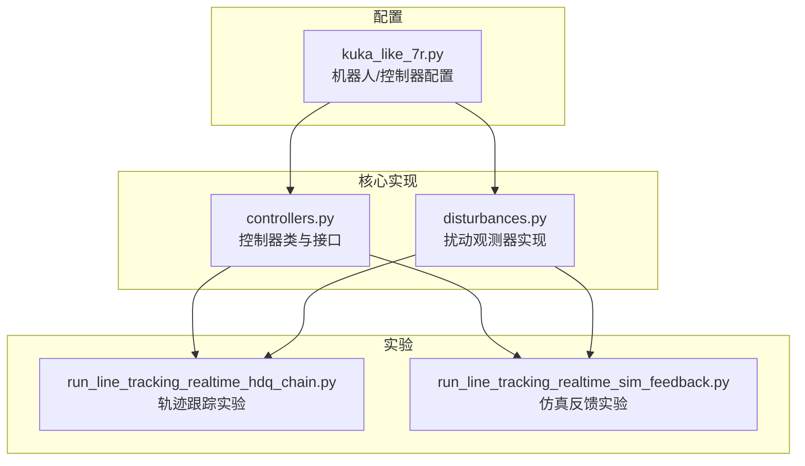
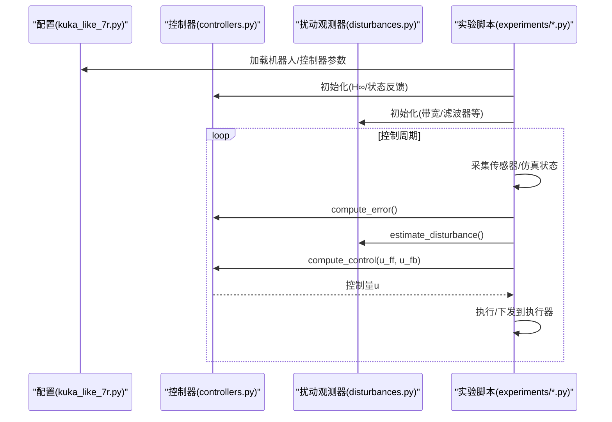
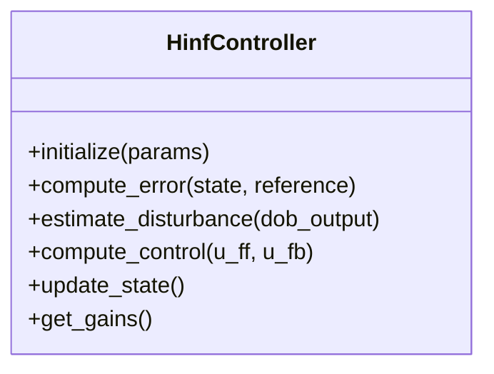
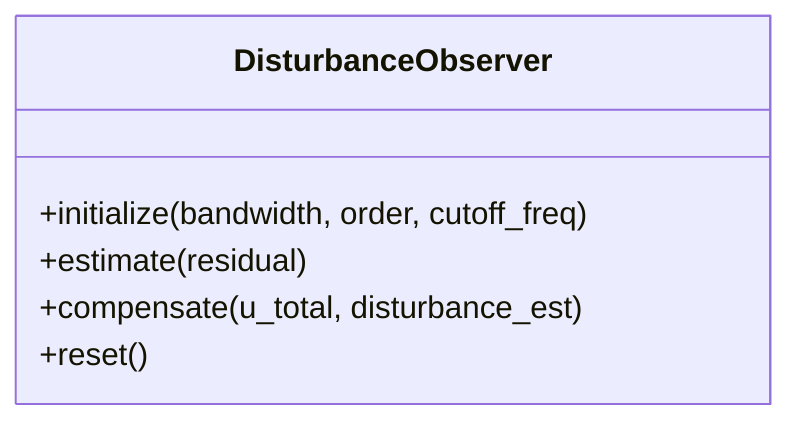
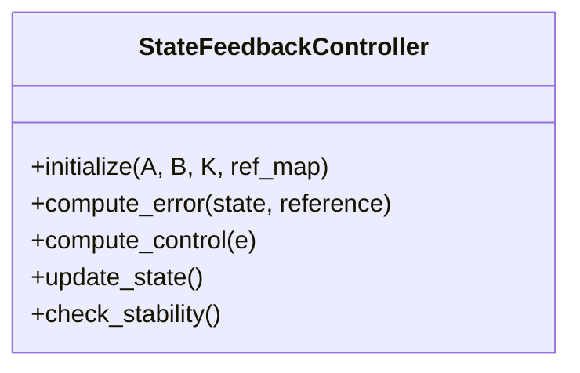
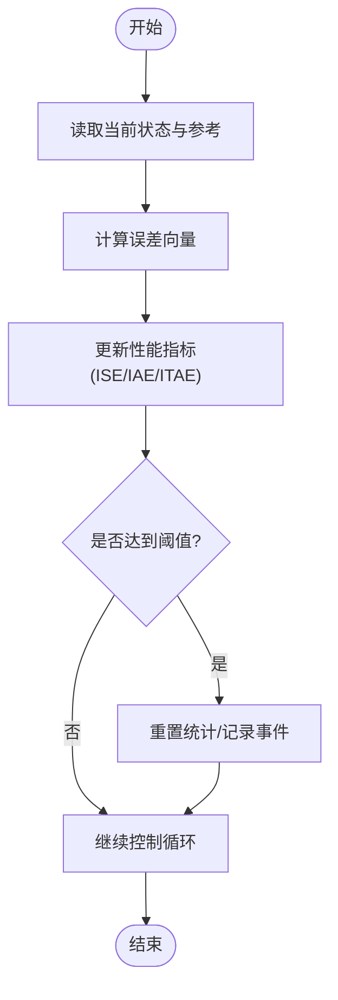
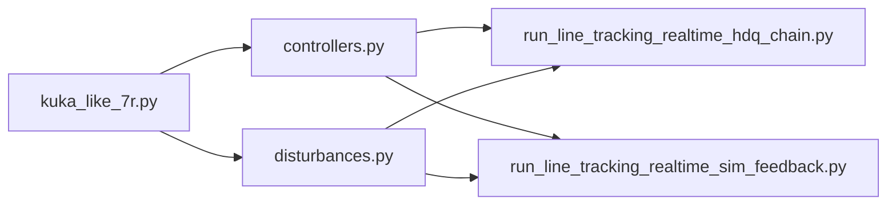

# 控制器API

<cite>
**本文引用的文件**   
- [core/controllers.py](file://core/controllers.py)
- [core/disturbances.py](file://core/disturbances.py)
- [configs/kuka_like_7r.py](file://configs/kuka_like_7r.py)
- [experiments/run_line_tracking_realtime_hdq_chain.py](file://experiments/run_line_tracking_realtime_hdq_chain.py)
- [experiments/run_line_tracking_realtime_sim_feedback.py](file://experiments/run_line_tracking_realtime_sim_feedback.py)
</cite>

## 目录
1. [简介](#简介)
2. [项目结构](#项目结构)
3. [核心组件](#核心组件)
4. [架构总览](#架构总览)
5. [详细组件分析](#详细组件分析)
6. [依赖关系分析](#依赖关系分析)
7. [性能考虑](#性能考虑)
8. [故障排查指南](#故障排查指南)
9. [结论](#结论)
10. [附录](#附录)

## 简介
本文件面向控制系统使用者与开发者，系统化梳理并记录本项目中与控制器相关的API，重点覆盖：
- H∞控制器的初始化参数、配置选项与控制算法调用方法
- 扰动观测器（Disturbance Observer）的设计与接口，包括扰动估计与补偿
- 状态反馈控制器的使用方法，含增益矩阵设置与稳定性分析要点
- 误差计算与性能评估相关API
- 每个控制器类的构造参数说明、控制量计算方法与状态更新接口
- 实际实验使用示例与参数调优建议

## 项目结构
围绕控制器API的核心代码主要位于 core 与 configs 目录，实验脚本位于 experiments 目录。下图给出与本API文档直接相关的模块组织概览。

图表来源
- [core/controllers.py](file://core/controllers.py)
- [core/disturbances.py](file://core/disturbances.py)
- [configs/kuka_like_7r.py](file://configs/kuka_like_7r.py)
- [experiments/run_line_tracking_realtime_hdq_chain.py](file://experiments/run_line_tracking_realtime_hdq_chain.py)
- [experiments/run_line_tracking_realtime_sim_feedback.py](file://experiments/run_line_tracking_realtime_sim_feedback.py)

章节来源
- [core/controllers.py](file://core/controllers.py)
- [core/disturbances.py](file://core/disturbances.py)
- [configs/kuka_like_7r.py](file://configs/kuka_like_7r.py)
- [experiments/run_line_tracking_realtime_hdq_chain.py](file://experiments/run_line_tracking_realtime_hdq_chain.py)
- [experiments/run_line_tracking_realtime_sim_feedback.py](file://experiments/run_line_tracking_realtime_sim_feedback.py)

## 核心组件
本节概述控制器API的关键组成与职责边界，便于快速定位所需功能。

- H∞控制器
  - 负责基于H∞综合或LQR近似生成控制律，支持在线/离线增益选择与权重配置
  - 提供初始化、控制量计算、状态更新等标准接口
- 扰动观测器
  - 对未建模动态与外部扰动进行估计，并提供前馈补偿接口
  - 支持带宽、滤波器阶数、截止频率等关键参数
- 状态反馈控制器
  - 基于线性化模型的状态反馈控制，支持增益矩阵K的设定与稳定性校验
- 误差与性能评估
  - 提供位置/速度误差计算、积分项、性能指标（如ISE/IAE/ITAE）统计

章节来源
- [core/controllers.py](file://core/controllers.py)
- [core/disturbances.py](file://core/disturbances.py)

## 架构总览
下图展示控制器在系统运行时的交互流程：配置加载后实例化控制器与扰动观测器，在控制循环中读取状态、计算误差、执行控制律并输出控制量。

图表来源
- [configs/kuka_like_7r.py](file://configs/kuka_like_7r.py)
- [core/controllers.py](file://core/controllers.py)
- [core/disturbances.py](file://core/disturbances.py)
- [experiments/run_line_tracking_realtime_hdq_chain.py](file://experiments/run_line_tracking_realtime_hdq_chain.py)
- [experiments/run_line_tracking_realtime_sim_feedback.py](file://experiments/run_line_tracking_realtime_sim_feedback.py)

## 详细组件分析

### H∞控制器
- 构造参数与配置
  - 系统模型维度与采样时间
  - H∞综合权重（参考跟踪、控制输入惩罚、鲁棒性权重）
  - 求解器选项（收敛容差、最大迭代次数）
  - 增益存储策略（离线预计算/在线自适应）
- 控制量计算方法
  - 输入：当前状态、参考轨迹、扰动估计
  - 输出：控制量（可包含前馈与反馈分量）
  - 内部：误差加权、Riccati/H∞解算、增益应用
- 状态更新接口
  - 更新内部状态（如积分项、滤波器状态）
  - 可选：自适应权重或增益插值
- 稳定性与鲁棒性
  - 通过权重调节保证闭环稳定与鲁棒性
  - 建议结合频域分析与时域仿真验证

章节来源
- [core/controllers.py](file://core/controllers.py)
- [configs/kuka_like_7r.py](file://configs/kuka_like_7r.py)

#### 类图（H∞控制器）

图表来源
- [core/controllers.py](file://core/controllers.py)

### 扰动观测器（Disturbance Observer）
- 设计目标
  - 估计集总扰动（外部干扰+未建模动态），用于前馈补偿
- 关键参数
  - 观测器带宽/截止频率
  - 滤波器阶数与类型
  - 初始条件与饱和限制
- 接口说明
  - 初始化：设置带宽、滤波器参数、采样时间
  - 估计：输入为残差或状态偏差，输出扰动估计
  - 补偿：将估计扰动转换为控制前馈量
- 注意事项
  - 带宽过高可能放大噪声，需权衡鲁棒性与灵敏度
  - 建议配合低通滤波与限幅保护

章节来源
- [core/disturbances.py](file://core/disturbances.py)

#### 类图（扰动观测器）

图表来源
- [core/disturbances.py](file://core/disturbances.py)

### 状态反馈控制器
- 用途
  - 基于线性化模型的状态反馈控制，适用于小范围工作点附近的高精度控制
- 增益矩阵设置
  - 通过LQR或极点配置获得K矩阵
  - 支持按工况切换或插值的多组增益
- 稳定性分析
  - 检查闭环特征值是否位于稳定区域
  - 结合李雅普诺夫或频域裕度进行验证
- 接口说明
  - 初始化：系统A/B矩阵、K矩阵、参考映射
  - 计算：u = -K·e + u_ref
  - 更新：必要时更新内部积分或滤波器状态

章节来源
- [core/controllers.py](file://core/controllers.py)

#### 类图（状态反馈控制器）

图表来源
- [core/controllers.py](file://core/controllers.py)

### 误差计算与性能评估
- 误差计算
  - 位置误差、速度误差、姿态误差（根据自由度定义）
  - 支持坐标变换与参考轨迹对齐
- 性能指标
  - ISE（误差平方积分）、IAE（绝对误差积分）、ITAE（时间加权绝对误差）
  - 峰值误差、超调、稳态误差、上升时间等
- API建议
  - reset_metrics()：重置统计
  - accumulate(error)：增量累积
  - get_summary()：返回汇总指标

章节来源
- [core/controllers.py](file://core/controllers.py)

#### 流程图（误差与性能评估）

图表来源
- [core/controllers.py](file://core/controllers.py)

## 依赖关系分析
控制器与扰动观测器均依赖配置模块提供的机器人参数与默认权重；实验脚本负责编排控制循环与数据记录。

图表来源
- [configs/kuka_like_7r.py](file://configs/kuka_like_7r.py)
- [core/controllers.py](file://core/controllers.py)
- [core/disturbances.py](file://core/disturbances.py)
- [experiments/run_line_tracking_realtime_hdq_chain.py](file://experiments/run_line_tracking_realtime_hdq_chain.py)
- [experiments/run_line_tracking_realtime_sim_feedback.py](file://experiments/run_line_tracking_realtime_sim_feedback.py)

章节来源
- [configs/kuka_like_7r.py](file://configs/kuka_like_7r.py)
- [core/controllers.py](file://core/controllers.py)
- [core/disturbances.py](file://core/disturbances.py)
- [experiments/run_line_tracking_realtime_hdq_chain.py](file://experiments/run_line_tracking_realtime_hdq_chain.py)
- [experiments/run_line_tracking_realtime_sim_feedback.py](file://experiments/run_line_tracking_realtime_sim_feedback.py)

## 性能考虑
- 数值稳定性
  - 合理设置求解器容差与步长，避免病态矩阵
  - 对高带宽观测器加入抗饱和与限幅
- 实时性
  - 预计算增益与查表插值降低在线开销
  - 批量处理误差与指标统计，减少频繁I/O
- 鲁棒性
  - 通过H∞权重抑制高频噪声与模型不确定性
  - 扰动观测器带宽与滤波器阶数需折衷

[本节为通用指导，不直接分析具体文件]

## 故障排查指南
- 常见问题
  - 控制发散：检查H∞权重与K矩阵是否满足稳定性条件
  - 振荡：降低扰动观测器带宽或增加阻尼
  - 跟踪误差大：提高参考映射精度或调整权重
- 诊断步骤
  - 打印误差与扰动估计曲线，观察是否出现饱和或噪声放大
  - 逐步关闭扰动补偿，验证反馈控制是否稳定
  - 对比不同权重组合下的频域响应与时域表现

章节来源
- [core/controllers.py](file://core/controllers.py)
- [core/disturbances.py](file://core/disturbances.py)

## 结论
本控制器API以模块化方式提供H∞控制、扰动观测与状态反馈能力，并通过统一接口与配置管理支撑多场景实验。建议在实际应用中结合频域分析与时域仿真进行参数整定，确保稳定性与鲁棒性。

[本节为总结性内容，不直接分析具体文件]

## 附录

### 实际实验使用示例（路径指引）
- 轨迹跟踪实时实验（HDQ链式）
  - 入口脚本：[experiments/run_line_tracking_realtime_hdq_chain.py](file://experiments/run_line_tracking_realtime_hdq_chain.py)
  - 典型流程：加载配置→初始化控制器与观测器→循环计算误差/扰动/控制量→下发执行
- 仿真反馈实验
  - 入口脚本：[experiments/run_line_tracking_realtime_sim_feedback.py](file://experiments/run_line_tracking_realtime_sim_feedback.py)
  - 典型流程：连接仿真环境→读取关节/末端状态→执行控制律→记录数据

章节来源
- [experiments/run_line_tracking_realtime_hdq_chain.py](file://experiments/run_line_tracking_realtime_hdq_chain.py)
- [experiments/run_line_tracking_realtime_sim_feedback.py](file://experiments/run_line_tracking_realtime_sim_feedback.py)

### 参数调优建议
- H∞权重
  - 跟踪权重：提升参考跟踪性能，但可能牺牲鲁棒性
  - 控制输入权重：抑制控制量过大与执行器饱和
  - 鲁棒权重：增强对未建模动态的容忍度
- 扰动观测器
  - 从较低带宽起步，逐步提升直至出现噪声放大再回调
  - 适当增加滤波器阶数以平滑估计，注意相位滞后
- 状态反馈增益
  - 优先采用LQR设计，随后微调以平衡响应速度与超调
  - 分工作点增益库+插值可改善大范围轨迹跟踪

章节来源
- [configs/kuka_like_7r.py](file://configs/kuka_like_7r.py)
- [core/controllers.py](file://core/controllers.py)
- [core/disturbances.py](file://core/disturbances.py)