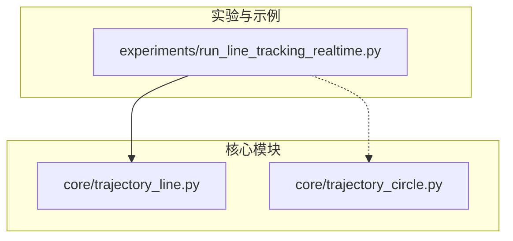
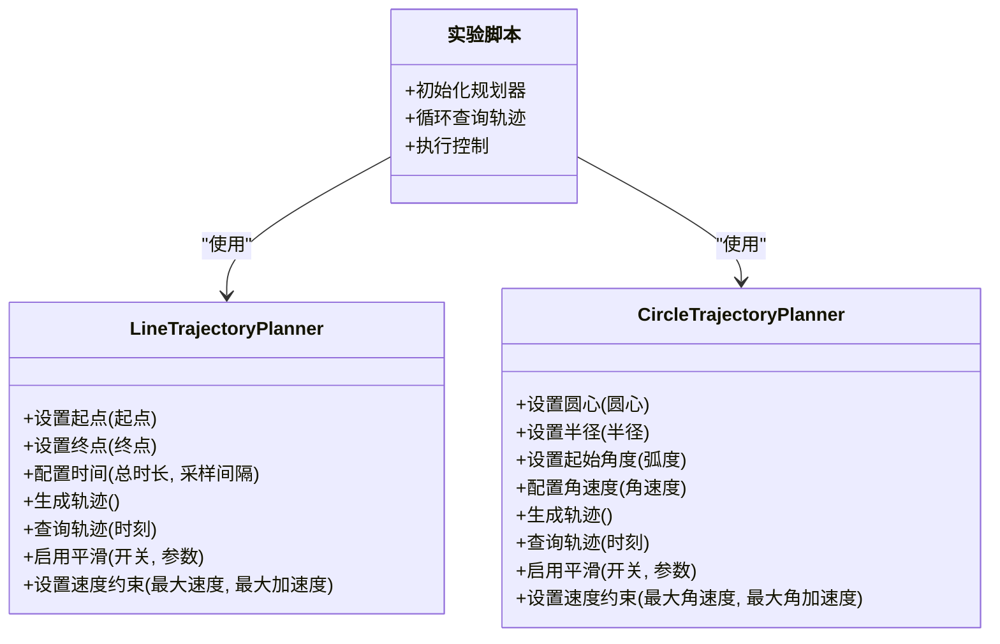
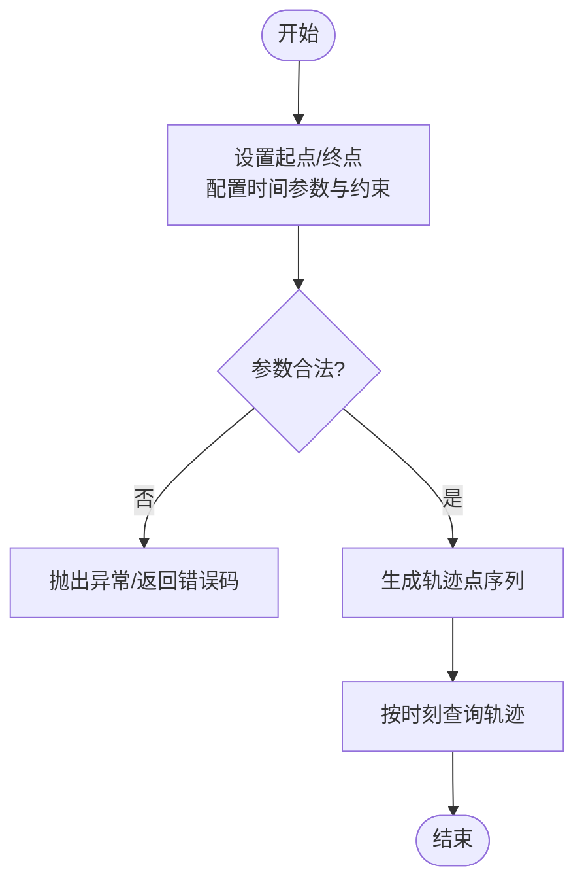
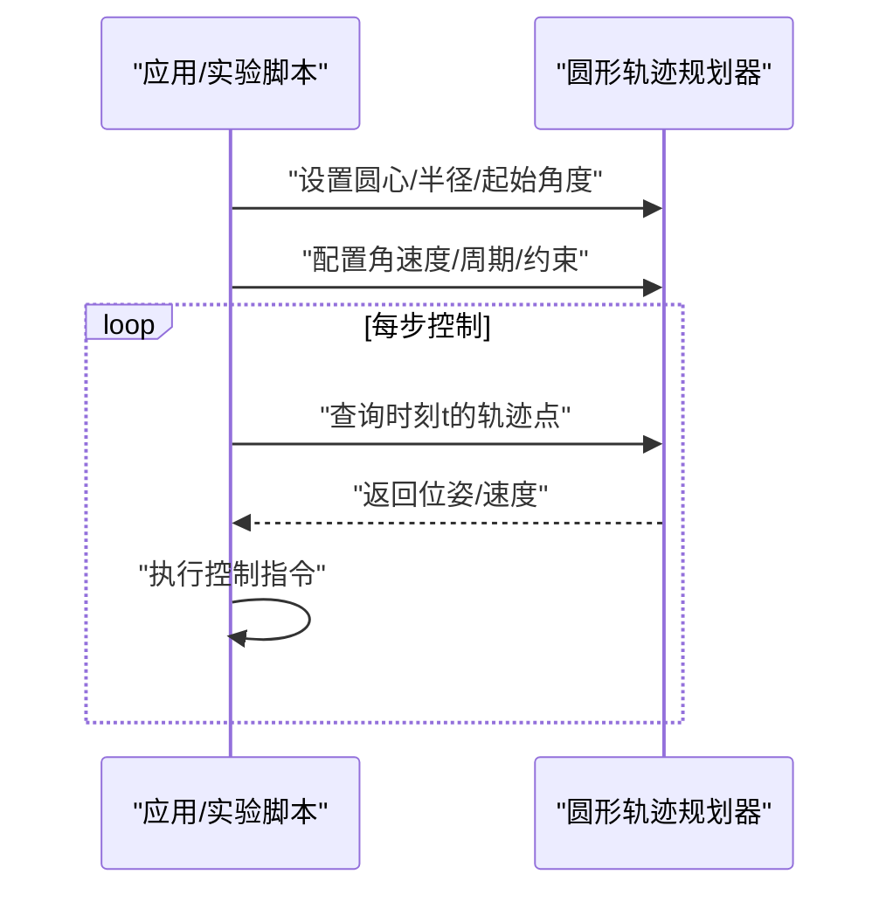
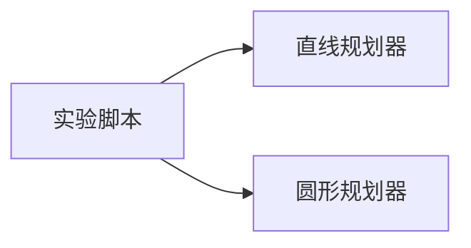

# 轨迹规划API

<cite>
**本文引用的文件**   
- [core/trajectory_line.py](file://core/trajectory_line.py)
- [core/trajectory_circle.py](file://core/trajectory_circle.py)
- [experiments/run_line_tracking_realtime.py](file://experiments/run_line_tracking_realtime.py)
</cite>

## 目录
1. [简介](#简介)
2. [项目结构](#项目结构)
3. [核心组件](#核心组件)
4. [架构总览](#架构总览)
5. [详细组件分析](#详细组件分析)
6. [依赖关系分析](#依赖关系分析)
7. [性能考虑](#性能考虑)
8. [故障排查指南](#故障排查指南)
9. [结论](#结论)
10. [附录](#附录)

## 简介
本文件为轨迹规划模块的完整API文档，聚焦直线与圆形两类轨迹规划器。内容覆盖：
- 直线轨迹规划器的类与方法：起点/终点设置、时间参数配置、轨迹点生成接口
- 圆形轨迹规划器的API：圆心/半径定义、起始角度设置、圆周运动控制
- 轨迹插值算法的使用方法与参数调节选项
- 轨迹平滑处理与速度约束相关接口
- 每个规划器的初始化参数、轨迹生成方法、实时轨迹查询接口
- 使用示例路径与性能优化建议

## 项目结构
轨迹规划相关代码位于 core 目录下的两个独立模块中，分别实现直线与圆形轨迹规划；实验脚本展示了典型用法。

图表来源
- [core/trajectory_line.py](file://core/trajectory_line.py)
- [core/trajectory_circle.py](file://core/trajectory_circle.py)
- [experiments/run_line_tracking_realtime.py](file://experiments/run_line_tracking_realtime.py)

章节来源
- [core/trajectory_line.py](file://core/trajectory_line.py)
- [core/trajectory_circle.py](file://core/trajectory_circle.py)
- [experiments/run_line_tracking_realtime.py](file://experiments/run_line_tracking_realtime.py)

## 核心组件
- 直线轨迹规划器（LineTrajectoryPlanner）
  - 职责：根据起点、终点与时间参数，生成沿直线的等时或可变速率轨迹点序列，并提供按时间查询接口。
  - 关键能力：
    - 起点/终点设置
    - 时间参数配置（总时长、采样间隔、起止时间）
    - 轨迹点生成（批量或增量）
    - 实时轨迹查询（给定时刻返回位姿/状态）
    - 可选：速度/加速度约束与平滑处理
- 圆形轨迹规划器（CircleTrajectoryPlanner）
  - 职责：在指定平面内围绕圆心以给定半径做圆周运动，支持起始角度、角速度/周期、方向等控制。
  - 关键能力：
    - 圆心/半径定义
    - 起始角度设置
    - 圆周运动控制（角速度、周期、方向）
    - 轨迹点生成与实时查询
    - 可选：平滑与速度约束

章节来源
- [core/trajectory_line.py](file://core/trajectory_line.py)
- [core/trajectory_circle.py](file://core/trajectory_circle.py)

## 架构总览
下图展示直线与圆形轨迹规划器的整体交互关系与数据流。

图表来源
- [core/trajectory_line.py](file://core/trajectory_line.py)
- [core/trajectory_circle.py](file://core/trajectory_circle.py)
- [experiments/run_line_tracking_realtime.py](file://experiments/run_line_tracking_realtime.py)

## 详细组件分析

### 直线轨迹规划器 API
- 初始化与参数
  - 起点/终点：用于定义空间中的线段端点
  - 时间参数：总时长、采样间隔、起止时间窗口
  - 速度/加速度约束：限制最大速度与加速度，确保动力学可行性
  - 平滑选项：开启后对位置/速度曲线进行滤波或S型加减速
- 轨迹生成
  - 批量生成：一次性生成从起始到终止时刻的离散轨迹点序列
  - 增量生成：按需生成下一段轨迹片段，便于实时闭环
- 实时查询
  - 给定时刻 t，返回对应位姿/速度/加速度（若启用约束）
- 插值算法与参数
  - 线性插值：位置随时间线性变化
  - 多项式/样条插值：如需更平滑的速度/加速度曲线
  - 参数调节：插值阶数、平滑系数、边界条件（零初末速度等）
- 错误处理
  - 非法输入（起点=终点、负时长、越界时刻）
  - 约束冲突（无法在给定时间内满足速度/加速度上限）

图表来源
- [core/trajectory_line.py](file://core/trajectory_line.py)

章节来源
- [core/trajectory_line.py](file://core/trajectory_line.py)

### 圆形轨迹规划器 API
- 初始化与参数
  - 圆心/半径：定义圆周几何
  - 起始角度：初始相位（弧度）
  - 角速度/周期：控制旋转速率与方向
  - 速度/角加速度约束：限制最大角速度与角加速度
  - 平滑选项：对角度/角速度曲线进行平滑
- 轨迹生成
  - 批量生成：生成一个或多个周期的离散轨迹点
  - 增量生成：按步长推进角度，输出下一点
- 实时查询
  - 给定时刻 t，计算当前角度并返回圆周上的位姿/速度
- 插值算法与参数
  - 角度线性插值：匀速圆周运动
  - 角度多项式/样条插值：实现启停平滑、变角速度
  - 参数调节：平滑系数、边界条件（零初末角速度）
- 错误处理
  - 非法输入（半径<=0、无效角度范围、负时长）
  - 约束冲突（无法在给定时间内达到目标角度且满足角速度/角加速度上限）

图表来源
- [core/trajectory_circle.py](file://core/trajectory_circle.py)
- [experiments/run_line_tracking_realtime.py](file://experiments/run_line_tracking_realtime.py)

章节来源
- [core/trajectory_circle.py](file://core/trajectory_circle.py)

### 轨迹插值算法与参数调节
- 常用插值方式
  - 线性插值：简单高效，适合快速响应场景
  - 三次/五次多项式：保证位置/速度/加速度连续性
  - S型速度曲线：限制加加速度，提升平滑性
- 参数调节要点
  - 平滑系数：越大越平滑，但可能降低跟踪精度
  - 边界条件：是否要求初末速度/加速度为零
  - 采样间隔：影响实时性与计算开销
- 适用场景
  - 高速短行程：优先线性插值+速度约束
  - 高精度/高平滑：多项式/S型曲线+较小采样间隔

章节来源
- [core/trajectory_line.py](file://core/trajectory_line.py)
- [core/trajectory_circle.py](file://core/trajectory_circle.py)

### 平滑处理与速度约束接口
- 平滑处理
  - 位置平滑：低通滤波或移动平均
  - 速度/加速度平滑：S型曲线或加加速度限幅
- 速度约束
  - 最大速度/加速度：避免超调与抖动
  - 角速度/角加速度：针对圆周运动的专项约束
- 组合策略
  - 先基于约束生成参考轨迹，再施加平滑滤波
  - 在线修正：根据实际误差动态调整速度上限

章节来源
- [core/trajectory_line.py](file://core/trajectory_line.py)
- [core/trajectory_circle.py](file://core/trajectory_circle.py)

### 使用示例与最佳实践
- 示例入口
  - 直线轨迹实时跟踪示例：[experiments/run_line_tracking_realtime.py](file://experiments/run_line_tracking_realtime.py)
- 典型流程
  - 初始化规划器并设置几何/时间参数
  - 生成轨迹或进入实时查询循环
  - 将轨迹点转换为控制指令并执行
  - 监控误差与约束，必要时调整参数
- 最佳实践
  - 合理设置采样间隔与总时长，避免过密导致计算压力
  - 先设定速度/加速度上限，再选择插值阶数
  - 对高频噪声环境启用适度平滑

章节来源
- [experiments/run_line_tracking_realtime.py](file://experiments/run_line_tracking_realtime.py)
- [core/trajectory_line.py](file://core/trajectory_line.py)
- [core/trajectory_circle.py](file://core/trajectory_circle.py)

## 依赖关系分析
- 模块内聚
  - 直线与圆形规划器各自封装几何、时间与约束逻辑，内聚度高
- 外部耦合
  - 实验脚本依赖规划器提供轨迹查询接口，形成松耦合调用关系
- 潜在风险
  - 若引入全局状态或共享缓存，需警惕并发访问与一致性

图表来源
- [experiments/run_line_tracking_realtime.py](file://experiments/run_line_tracking_realtime.py)
- [core/trajectory_line.py](file://core/trajectory_line.py)
- [core/trajectory_circle.py](file://core/trajectory_circle.py)

章节来源
- [experiments/run_line_tracking_realtime.py](file://experiments/run_line_tracking_realtime.py)
- [core/trajectory_line.py](file://core/trajectory_line.py)
- [core/trajectory_circle.py](file://core/trajectory_circle.py)

## 性能考虑
- 计算复杂度
  - 线性插值：O(1) 单次查询；批量生成 O(N)
  - 多项式/样条插值：常数级求值，但系数求解可能更高阶
- 内存占用
  - 批量生成需存储 N 个点；实时查询可仅保留必要历史
- 实时性
  - 减小采样间隔会提高精度但增加CPU负载
  - 预计算轨迹表可减少运行时开销
- 数值稳定性
  - 注意浮点误差累积，定期归一化角度（圆周）
  - 约束检查失败时应回退到保守策略

## 故障排查指南
- 常见问题
  - 参数非法：起点=终点、半径<=0、负时长
  - 约束冲突：无法在给定时间内满足速度/加速度上限
  - 角度越界：未对角度进行模运算导致跳变
- 定位步骤
  - 打印/记录关键参数与中间结果
  - 逐步关闭平滑与约束，验证基础插值是否正确
  - 缩小问题范围至单步查询，复现最小用例
- 恢复策略
  - 自动降级：放宽约束或增大总时长
  - 安全停止：触发急停或保持上一有效点

章节来源
- [core/trajectory_line.py](file://core/trajectory_line.py)
- [core/trajectory_circle.py](file://core/trajectory_circle.py)

## 结论
直线与圆形轨迹规划器提供了完整的初始化、轨迹生成与实时查询能力，并通过插值、平滑与速度约束接口满足不同精度与动力学需求。结合示例脚本，可在仿真或实机环境中快速集成与验证。建议在实际部署中优先确定约束与采样策略，再选择合适的插值与平滑方案，以获得稳定高效的轨迹跟踪性能。

## 附录
- 术语
  - 插值：在已知离散点之间估计连续轨迹的方法
  - 平滑：对轨迹进行滤波或加减速整形以提升连续性
  - 约束：对速度/加速度/角速度/角加速度的上限限制
- 扩展建议
  - 增加多段拼接与过渡段规划
  - 引入自适应采样与在线重规划
  - 添加可视化与诊断工具