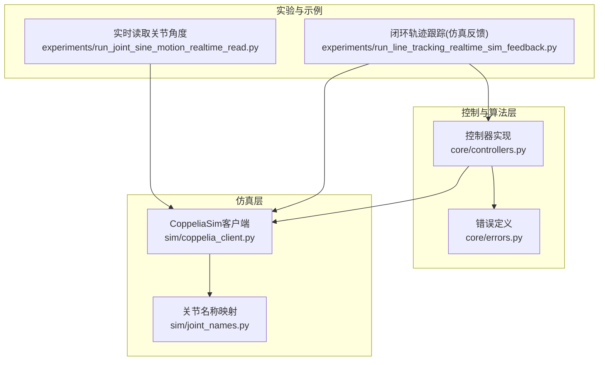
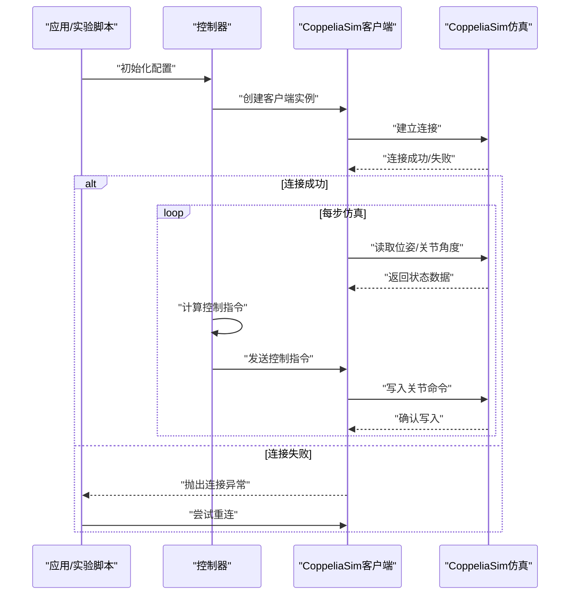
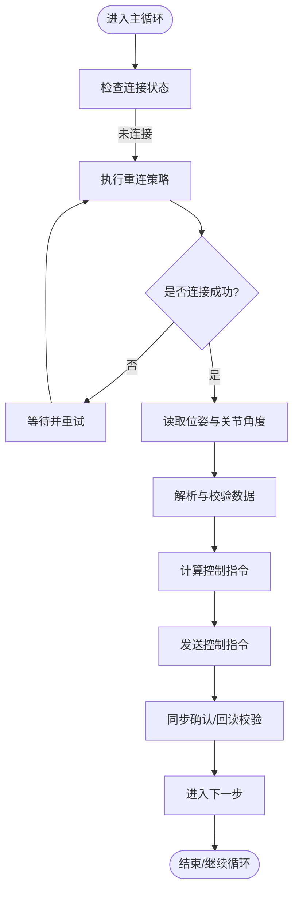
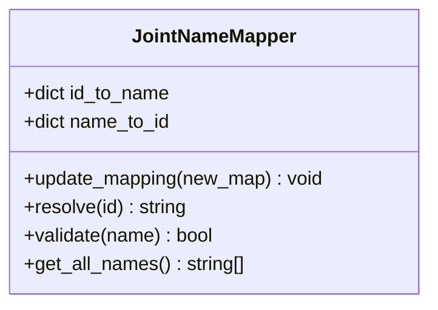
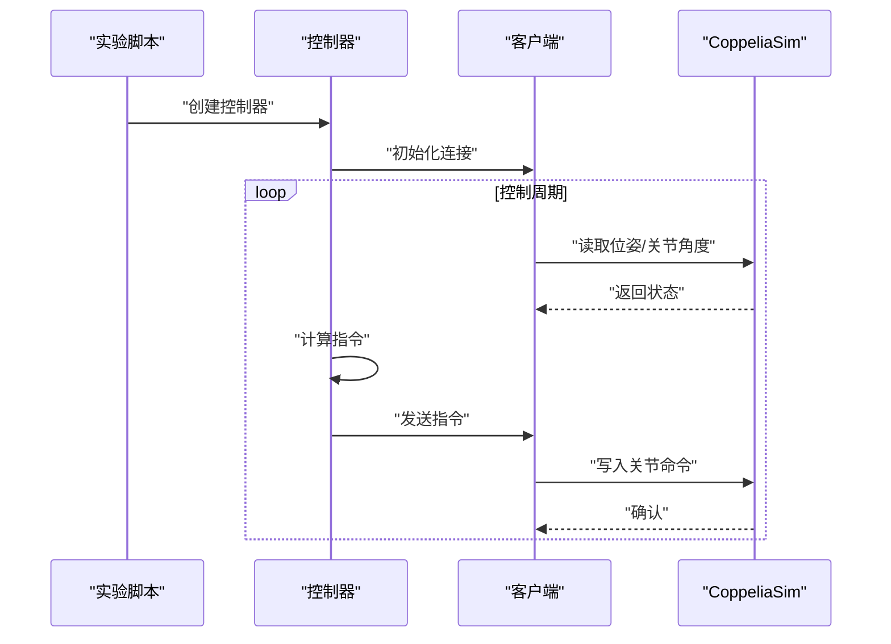
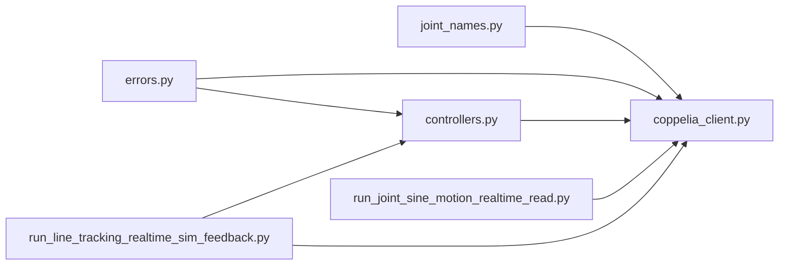

# CoppeliaSim客户端

<cite>
**本文引用的文件**   
- [coppelia_client.py](file://sim/coppelia_client.py)
- [joint_names.py](file://sim/joint_names.py)
- [controllers.py](file://core/controllers.py)
- [errors.py](file://core/errors.py)
- [run_joint_sine_motion_realtime_read.py](file://experiments/run_joint_sine_motion_realtime_read.py)
- [run_line_tracking_realtime_sim_feedback.py](file://experiments/run_line_tracking_realtime_sim_feedback.py)
</cite>

## 目录
1. [简介](#简介)
2. [项目结构](#项目结构)
3. [核心组件](#核心组件)
4. [架构总览](#架构总览)
5. [详细组件分析](#详细组件分析)
6. [依赖关系分析](#依赖关系分析)
7. [性能考虑](#性能考虑)
8. [故障排查指南](#故障排查指南)
9. [结论](#结论)
10. [附录](#附录)

## 简介
本技术文档面向CoppeliaSim客户端的实现与使用，聚焦以下目标：
- 连接管理：建立、断开与异常恢复策略
- 通信协议与数据同步：读取位姿、获取关节角度、发送控制指令的时序与一致性保障
- 关节名称映射系统：关节ID与名称的对应关系及动态配置方法
- 实时通信的时间控制、延迟优化与错误处理机制
- 客户端初始化配置、参数设置与性能调优示例

## 项目结构
本项目围绕CoppeliaSim仿真环境进行机器人控制实验。与客户端直接相关的代码主要位于sim与core目录，并在experiments中提供多种运行脚本以演示不同场景（正弦运动、轨迹跟踪、实时反馈等）。

图表来源
- [coppelia_client.py](file://sim/coppelia_client.py)
- [joint_names.py](file://sim/joint_names.py)
- [controllers.py](file://core/controllers.py)
- [errors.py](file://core/errors.py)
- [run_joint_sine_motion_realtime_read.py](file://experiments/run_joint_sine_motion_realtime_read.py)
- [run_line_tracking_realtime_sim_feedback.py](file://experiments/run_line_tracking_realtime_sim_feedback.py)

章节来源
- [coppelia_client.py](file://sim/coppelia_client.py)
- [joint_names.py](file://sim/joint_names.py)
- [controllers.py](file://core/controllers.py)
- [errors.py](file://core/errors.py)
- [run_joint_sine_motion_realtime_read.py](file://experiments/run_joint_sine_motion_realtime_read.py)
- [run_line_tracking_realtime_sim_feedback.py](file://experiments/run_line_tracking_realtime_sim_feedback.py)

## 核心组件
- CoppeliaSim客户端：封装与CoppeliaSim的通信接口，负责连接生命周期管理、读写操作、超时与重试、以及数据同步。
- 关节名称映射：维护关节ID与物理/逻辑名称之间的双向映射，支持动态更新与校验。
- 控制器：将高层控制指令转换为底层关节命令，并协调读取传感器/状态数据。
- 错误定义：统一异常类型与错误码，便于上层捕获与恢复。

章节来源
- [coppelia_client.py](file://sim/coppelia_client.py)
- [joint_names.py](file://sim/joint_names.py)
- [controllers.py](file://core/controllers.py)
- [errors.py](file://core/errors.py)

## 架构总览
下图展示了从应用侧到CoppeliaSim仿真的端到端调用链，包括连接建立、数据读取与控制下发流程。

图表来源
- [coppelia_client.py](file://sim/coppelia_client.py)
- [controllers.py](file://core/controllers.py)
- [run_line_tracking_realtime_sim_feedback.py](file://experiments/run_line_tracking_realtime_sim_feedback.py)

## 详细组件分析

### CoppeliaSim客户端
职责与能力
- 连接管理：支持主机地址、端口、超时、最大重试次数等参数；提供连接、断开、健康检查与自动重连。
- 通信协议：封装对CoppeliaSim的读写API，确保请求-响应一致性与幂等性。
- 数据同步：在循环控制中保证“先读后写”的顺序，避免脏数据或乱序导致的抖动。
- 错误处理：区分网络异常、超时、无效对象名等错误，并提供可恢复策略。

关键流程
- 初始化：加载配置、建立连接、预解析关节名称映射。
- 读取：批量读取位姿与关节角度，必要时做单位转换与坐标变换。
- 写入：按关节顺序发送控制指令，支持速度/位置/混合模式。
- 关闭：优雅断开，释放资源。

图表来源
- [coppelia_client.py](file://sim/coppelia_client.py)

章节来源
- [coppelia_client.py](file://sim/coppelia_client.py)

### 关节名称映射系统
设计要点
- 映射表：维护“关节ID ↔ 关节名称”的双向字典，支持多关节、冗余命名与别名。
- 动态配置：允许运行时更新映射表，例如通过配置文件或外部服务注入新关节。
- 校验与容错：写入前校验名称有效性，缺失时给出明确错误信息并拒绝写入。
- 扩展性：为不同机器人构型提供独立映射模块，便于复用与切换。

典型用法
- 初始化时加载默认映射。
- 根据实际模型或标定结果覆盖部分条目。
- 在控制循环中使用名称索引访问具体关节。

图表来源
- [joint_names.py](file://sim/joint_names.py)

章节来源
- [joint_names.py](file://sim/joint_names.py)

### 控制器与数据流
职责
- 将高层任务（如轨迹跟踪）分解为关节级指令。
- 协调读取与写入，确保时序正确与数据一致性。
- 集成错误处理与降级策略（如只读不控、限速保护）。

数据流
- 读取：位姿与关节角度 → 控制器内部状态估计 → 生成指令
- 写入：指令序列 → 客户端 → CoppeliaSim

图表来源
- [controllers.py](file://core/controllers.py)
- [run_line_tracking_realtime_sim_feedback.py](file://experiments/run_line_tracking_realtime_sim_feedback.py)

章节来源
- [controllers.py](file://core/controllers.py)
- [run_line_tracking_realtime_sim_feedback.py](file://experiments/run_line_tracking_realtime_sim_feedback.py)

### 错误处理与异常恢复
分类
- 连接类：无法连接、连接中断、握手失败
- 通信类：超时、读写失败、对象不存在
- 业务类：关节名称无效、指令越界、单位不一致

策略
- 指数退避重连：在短暂故障下快速恢复，避免雪崩。
- 降级模式：当仅能读取时，停止写入并告警。
- 细粒度日志：记录错误上下文（时间戳、对象名、参数），便于定位。

章节来源
- [errors.py](file://core/errors.py)
- [coppelia_client.py](file://sim/coppelia_client.py)

## 依赖关系分析
- 客户端依赖关节名称映射，用于解析与校验关节标识。
- 控制器依赖客户端完成I/O，同时依赖错误定义进行异常处理。
- 实验脚本组合控制器与客户端，形成完整闭环。

图表来源
- [coppelia_client.py](file://sim/coppelia_client.py)
- [joint_names.py](file://sim/joint_names.py)
- [controllers.py](file://core/controllers.py)
- [errors.py](file://core/errors.py)
- [run_joint_sine_motion_realtime_read.py](file://experiments/run_joint_sine_motion_realtime_read.py)
- [run_line_tracking_realtime_sim_feedback.py](file://experiments/run_line_tracking_realtime_sim_feedback.py)

章节来源
- [coppelia_client.py](file://sim/coppelia_client.py)
- [joint_names.py](file://sim/joint_names.py)
- [controllers.py](file://core/controllers.py)
- [errors.py](file://core/errors.py)
- [run_joint_sine_motion_realtime_read.py](file://experiments/run_joint_sine_motion_realtime_read.py)
- [run_line_tracking_realtime_sim_feedback.py](file://experiments/run_line_tracking_realtime_sim_feedback.py)

## 性能考虑
- 批量化读写：合并多次读取/写入以减少往返开销。
- 非阻塞与超时：合理设置超时与心跳，避免长时间阻塞。
- 节流与限幅：限制指令频率与幅度，降低仿真负载。
- 缓存与去抖：对稳定状态的数据做短时缓存，减少重复计算。
- 线程隔离：将I/O与计算分离，避免相互影响。

[本节为通用指导，无需特定文件引用]

## 故障排查指南
常见问题与定位步骤
- 无法连接
  - 检查主机地址、端口与防火墙规则
  - 查看客户端日志中的连接重试与超时信息
- 读取为空或异常
  - 确认对象名称与层级路径是否正确
  - 验证单位与坐标系是否与控制器期望一致
- 写入无效
  - 校验关节名称映射是否包含目标关节
  - 检查指令范围与约束条件
- 实时性不足
  - 增大系统优先级、减少无关进程
  - 调整控制周期与批量化策略

章节来源
- [coppelia_client.py](file://sim/coppelia_client.py)
- [errors.py](file://core/errors.py)

## 结论
CoppeliaSim客户端通过清晰的连接管理、健壮的通信协议与严格的数据同步机制，为上层控制器提供了稳定可靠的仿真交互能力。配合关节名称映射系统与完善的错误处理，可在复杂场景中实现高可靠、低延迟的实时控制。建议在生产环境中结合批量化读写、超时与重连策略，并进行充分的压力测试与回归验证。

[本节为总结性内容，无需特定文件引用]

## 附录

### 客户端初始化与参数设置示例
- 基本初始化
  - 指定主机地址、端口、超时与最大重试次数
  - 启用连接健康检查与自动重连
- 关节映射配置
  - 加载默认映射，按需覆盖或追加新关节
  - 启动前执行名称有效性校验
- 控制周期与批量化
  - 设定控制周期、批量大小与最小间隔
  - 开启指令限幅与速率限制

章节来源
- [coppelia_client.py](file://sim/coppelia_client.py)
- [joint_names.py](file://sim/joint_names.py)

### 实时通信与延迟优化示例
- 时间控制
  - 固定周期调度器，确保稳定的采样与执行节奏
  - 使用高精度计时器测量端到端延迟
- 延迟优化
  - 合并读取/写入请求，减少网络往返
  - 在非关键路径上异步处理日志与可视化
- 错误处理
  - 对瞬时故障采用指数退避重连
  - 对持续故障触发降级模式并告警

章节来源
- [run_joint_sine_motion_realtime_read.py](file://experiments/run_joint_sine_motion_realtime_read.py)
- [run_line_tracking_realtime_sim_feedback.py](file://experiments/run_line_tracking_realtime_sim_feedback.py)