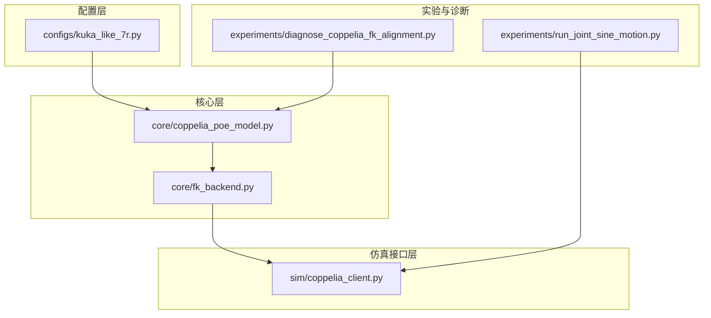
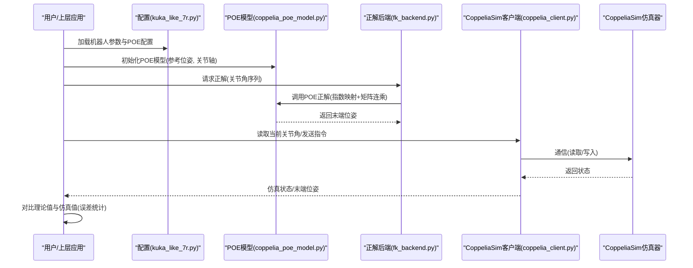
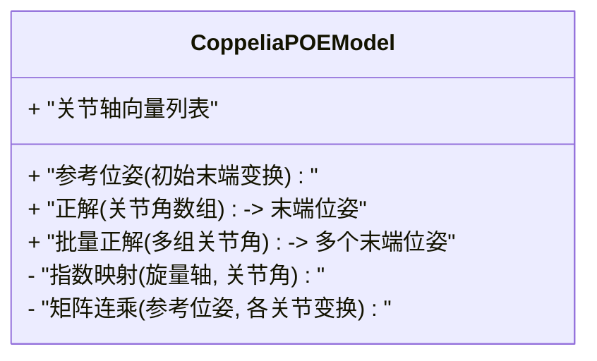
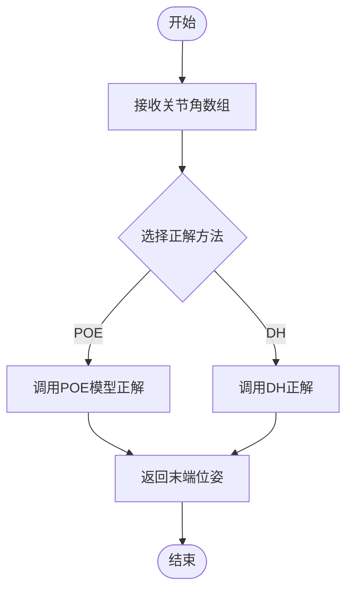
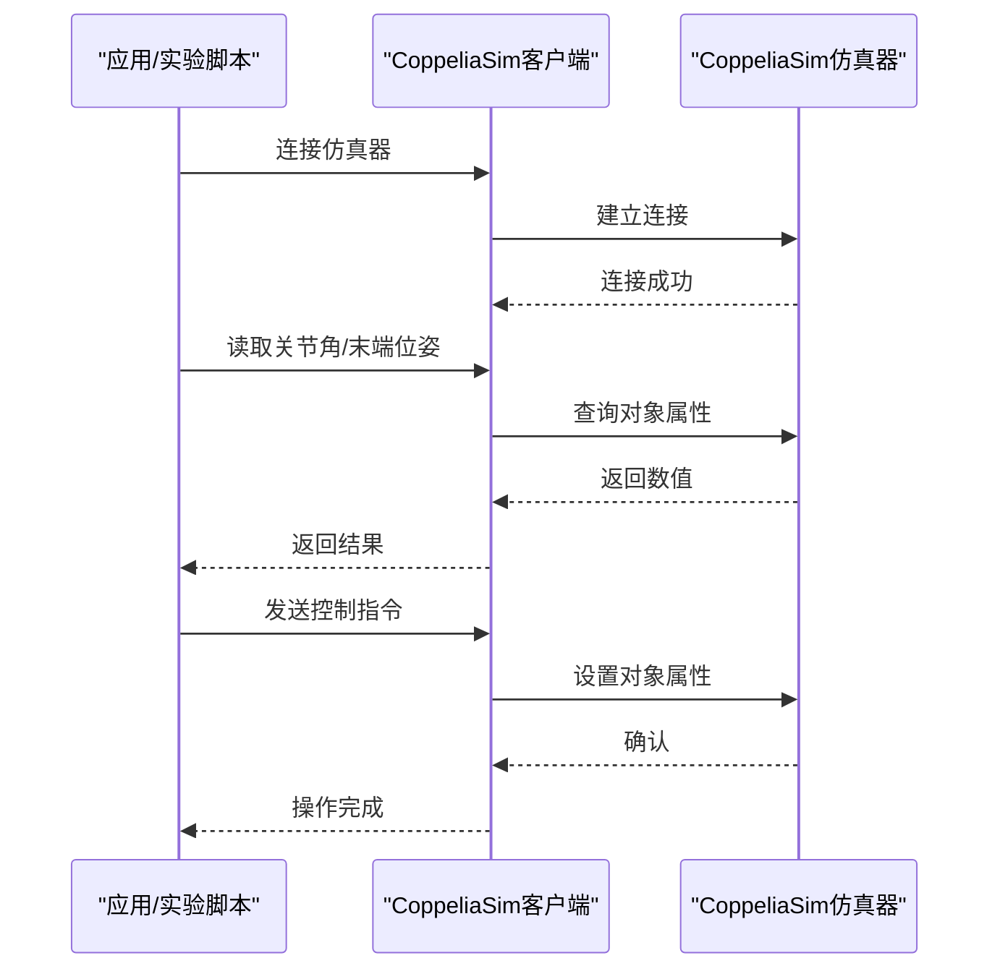
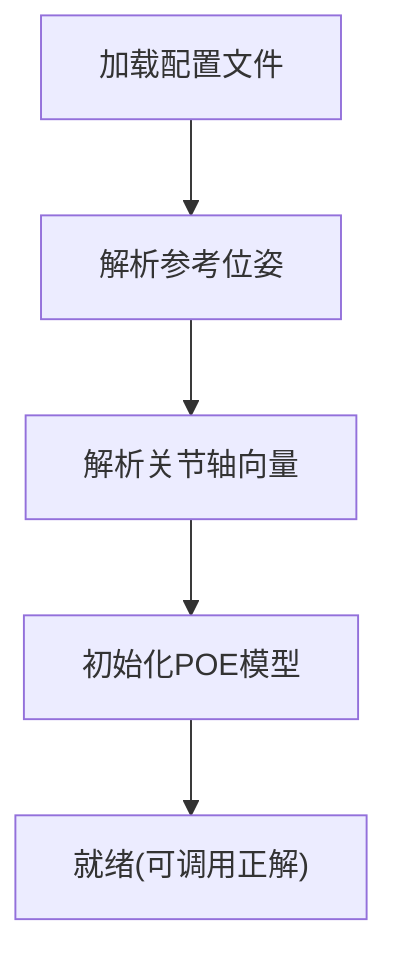
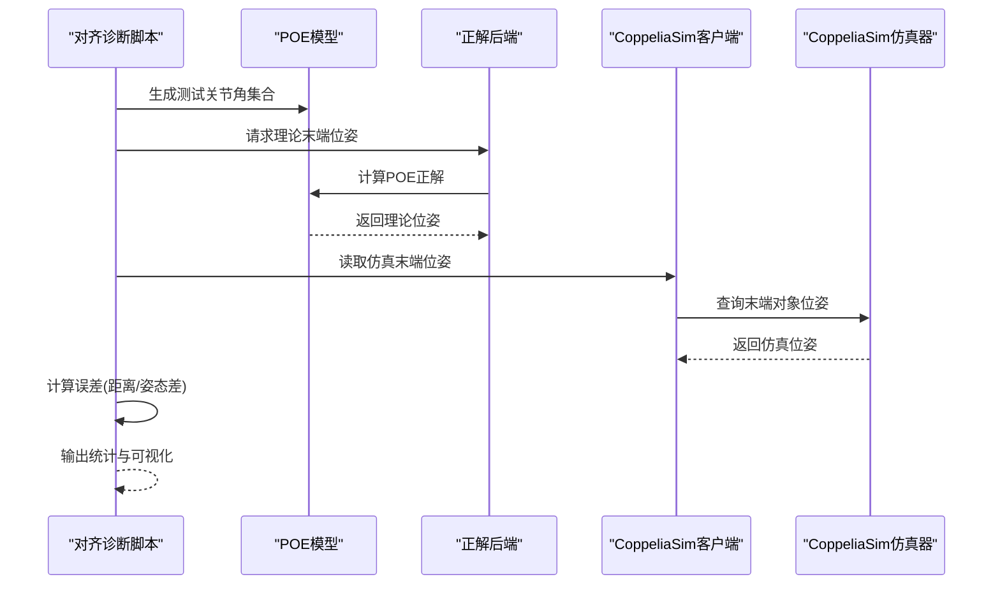
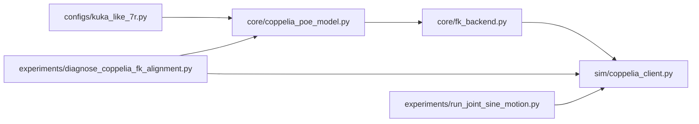

# POE模型构建

<cite>
**本文引用的文件**   
- [core/coppelia_poe_model.py](file://core/coppelia_poe_model.py)
- [configs/kuka_like_7r.py](file://configs/kuka_like_7r.py)
- [core/fk_backend.py](file://core/fk_backend.py)
- [sim/coppelia_client.py](file://sim/coppelia_client.py)
- [experiments/diagnose_coppelia_fk_alignment.py](file://experiments/diagnose_coppelia_fk_alignment.py)
- [experiments/run_joint_sine_motion.py](file://experiments/run_joint_sine_motion.py)
</cite>

## 目录
1. [简介](#简介)
2. [项目结构](#项目结构)
3. [核心组件](#核心组件)
4. [架构总览](#架构总览)
5. [详细组件分析](#详细组件分析)
6. [依赖关系分析](#依赖关系分析)
7. [性能考虑](#性能考虑)
8. [故障排查指南](#故障排查指南)
9. [结论](#结论)
10. [附录](#附录)

## 简介
本技术文档围绕POE（指数积，Product of Exponentials）模型在机器人运动学中的应用展开，重点说明其在CoppeliaSim环境中的建模、配置与验证流程。文档涵盖：
- POE公式的数学基础与在正解计算中的作用
- CoppeliaSim中POE模型的构建步骤：参考位姿定义、关节轴向量计算、变换矩阵组合
- 模型验证方法与精度评估策略
- 面向串联机械臂与并联机构的配置示例思路
- 调试工具与使用指南，帮助开发者正确构建和验证POE模型

## 项目结构
仓库采用分层组织方式：
- configs：机器人参数与POE模型配置
- core：核心算法与后端实现（含POE模型、DH建模、四元数/HDQ运算等）
- sim：与CoppeliaSim交互的客户端封装
- experiments：实验脚本与诊断工具

图表来源
- [core/coppelia_poe_model.py](file://core/coppelia_poe_model.py)
- [configs/kuka_like_7r.py](file://configs/kuka_like_7r.py)
- [core/fk_backend.py](file://core/fk_backend.py)
- [sim/coppelia_client.py](file://sim/coppelia_client.py)
- [experiments/diagnose_coppelia_fk_alignment.py](file://experiments/diagnose_coppelia_fk_alignment.py)
- [experiments/run_joint_sine_motion.py](file://experiments/run_joint_sine_motion.py)

章节来源
- [core/coppelia_poe_model.py](file://core/coppelia_poe_model.py)
- [configs/kuka_like_7r.py](file://configs/kuka_like_7r.py)
- [core/fk_backend.py](file://core/fk_backend.py)
- [sim/coppelia_client.py](file://sim/coppelia_client.py)
- [experiments/diagnose_coppelia_fk_alignment.py](file://experiments/diagnose_coppelia_fk_alignment.py)
- [experiments/run_joint_sine_motion.py](file://experiments/run_joint_sine_motion.py)

## 核心组件
- CoppeliaSim POE模型封装：提供从配置到正解计算的完整链路，包括参考位姿、关节轴向量、指数映射与矩阵连乘。
- 正解后端：统一调用POE模型或传统DH方法，屏蔽底层差异。
- CoppeliaSim客户端：负责与仿真器通信，读取关节角、控制执行器、获取末端位姿等。
- 诊断与实验脚本：用于对齐检查、轨迹跟踪与正弦激励测试，辅助模型校准与验证。

章节来源
- [core/coppelia_poe_model.py](file://core/coppelia_poe_model.py)
- [core/fk_backend.py](file://core/fk_backend.py)
- [sim/coppelia_client.py](file://sim/coppelia_client.py)
- [experiments/diagnose_coppelia_fk_alignment.py](file://experiments/diagnose_coppelia_fk_alignment.py)
- [experiments/run_joint_sine_motion.py](file://experiments/run_joint_sine_motion.py)

## 架构总览
下图展示了从配置到仿真反馈的整体数据流与控制流。

图表来源
- [core/coppelia_poe_model.py](file://core/coppelia_poe_model.py)
- [core/fk_backend.py](file://core/fk_backend.py)
- [sim/coppelia_client.py](file://sim/coppelia_client.py)
- [configs/kuka_like_7r.py](file://configs/kuka_like_7r.py)

## 详细组件分析

### CoppeliaSim POE模型（coppelia_poe_model.py）
该模块是POE建模的核心，负责：
- 解析并存储参考位姿（初始末端相对于基座的变换）
- 存储各关节的旋量轴向量（空间坐标系下的轴向量）
- 实现指数映射与矩阵连乘以计算末端位姿
- 提供批量正解接口，便于与后端和实验脚本集成

关键要点
- 参考位姿：定义在零位形下末端相对于基座坐标系的变换矩阵，作为POE计算的起点。
- 关节轴向量：每个旋转关节对应一个空间旋量轴（包含方向与过点信息），平移关节对应纯平移旋量。
- 指数映射：将关节角乘以旋量轴后取矩阵指数，得到单关节的运动变换。
- 矩阵连乘：按顺序将各关节变换与参考位姿相乘，得到最终末端位姿。

图表来源
- [core/coppelia_poe_model.py](file://core/coppelia_poe_model.py)

章节来源
- [core/coppelia_poe_model.py](file://core/coppelia_poe_model.py)

### 正解后端（fk_backend.py）
正解后端对上层隐藏具体实现细节，支持：
- 通过POE模型进行正解计算
- 与传统DH方法切换（如需要）
- 统一的输入输出接口，便于实验与诊断脚本复用

图表来源
- [core/fk_backend.py](file://core/fk_backend.py)

章节来源
- [core/fk_backend.py](file://core/fk_backend.py)

### CoppeliaSim客户端（coppelia_client.py）
负责与CoppeliaSim仿真器通信，典型功能包括：
- 连接/断开仿真器
- 读取关节角度与末端位姿
- 发送控制指令（位置/速度/力矩）
- 错误处理与重试机制

图表来源
- [sim/coppelia_client.py](file://sim/coppelia_client.py)

章节来源
- [sim/coppelia_client.py](file://sim/coppelia_client.py)

### 配置示例（kuka_like_7r.py）
配置文件集中管理机器人的几何与运动学参数，供POE模型初始化使用。典型内容包括：
- 参考位姿（初始末端变换）
- 各关节的旋量轴向量（空间坐标系表示）
- 可选的DH参数（用于对比或兼容）

图表来源
- [configs/kuka_like_7r.py](file://configs/kuka_like_7r.py)

章节来源
- [configs/kuka_like_7r.py](file://configs/kuka_like_7r.py)

### 诊断与验证脚本
- 对齐诊断（diagnose_coppelia_fk_alignment.py）：用于检查理论正解与仿真端位姿的对齐情况，输出误差分布与可视化指标。
- 正弦激励（run_joint_sine_motion.py）：通过正弦关节角激励覆盖工作空间，评估POE模型在不同构型下的稳定性与一致性。

图表来源
- [experiments/diagnose_coppelia_fk_alignment.py](file://experiments/diagnose_coppelia_fk_alignment.py)
- [core/coppelia_poe_model.py](file://core/coppelia_poe_model.py)
- [core/fk_backend.py](file://core/fk_backend.py)
- [sim/coppelia_client.py](file://sim/coppelia_client.py)

章节来源
- [experiments/diagnose_coppelia_fk_alignment.py](file://experiments/diagnose_coppelia_fk_alignment.py)
- [experiments/run_joint_sine_motion.py](file://experiments/run_joint_sine_motion.py)

## 依赖关系分析
- 配置层向核心层注入POE模型所需参数（参考位姿、关节轴向量）。
- 核心层通过正解后端统一对外暴露正解能力。
- 实验与诊断脚本依赖核心层与仿真客户端，形成“理论-仿真”闭环验证。

图表来源
- [configs/kuka_like_7r.py](file://configs/kuka_like_7r.py)
- [core/coppelia_poe_model.py](file://core/coppelia_poe_model.py)
- [core/fk_backend.py](file://core/fk_backend.py)
- [sim/coppelia_client.py](file://sim/coppelia_client.py)
- [experiments/diagnose_coppelia_fk_alignment.py](file://experiments/diagnose_coppelia_fk_alignment.py)
- [experiments/run_joint_sine_motion.py](file://experiments/run_joint_sine_motion.py)

章节来源
- [configs/kuka_like_7r.py](file://configs/kuka_like_7r.py)
- [core/coppelia_poe_model.py](file://core/coppelia_poe_model.py)
- [core/fk_backend.py](file://core/fk_backend.py)
- [sim/coppelia_client.py](file://sim/coppelia_client.py)
- [experiments/diagnose_coppelia_fk_alignment.py](file://experiments/diagnose_coppelia_fk_alignment.py)
- [experiments/run_joint_sine_motion.py](file://experiments/run_joint_sine_motion.py)

## 性能考虑
- 批量正解：优先使用批量接口减少函数调用开销，提高实验脚本吞吐。
- 数值稳定：确保旋量轴单位化与参考位姿为有效SE(3)，避免奇异与数值溢出。
- 缓存策略：对于静态配置，可在进程内缓存中间结果（如参考位姿逆），减少重复计算。
- I/O优化：与CoppeliaSim通信时合并读写请求，降低网络往返次数。

[本节为通用指导，不直接分析具体文件]

## 故障排查指南
常见问题与定位建议：
- 参考位姿不正确：检查初始末端变换是否与仿真场景一致；可通过对齐诊断脚本观察系统误差。
- 关节轴向量定义错误：确认旋量轴在空间坐标系下的表达是否正确，尤其是过点与方向。
- 坐标系不一致：确保所有参数在同一坐标系下定义，避免混用基座与末端局部系。
- 仿真通信异常：检查CoppeliaSim客户端的连接状态与对象名称，必要时增加重试与超时处理。
- 误差偏大：使用正弦激励脚本在工作空间内采样，分析误差随关节角的变化趋势，定位潜在标定问题。

章节来源
- [experiments/diagnose_coppelia_fk_alignment.py](file://experiments/diagnose_coppelia_fk_alignment.py)
- [sim/coppelia_client.py](file://sim/coppelia_client.py)

## 结论
POE模型为机器人正解提供了简洁而强大的数学框架。在本仓库中，通过清晰的配置、稳健的POE实现与完善的诊断工具链，开发者可以快速构建、验证并优化不同构型机器人的POE模型。建议在实际项目中结合仿真与真实数据进行迭代标定，以获得更高的精度与鲁棒性。

[本节为总结性内容，不直接分析具体文件]

## 附录

### POE数学基础与应用要点
- 指数映射：将旋量轴与关节角映射为SE(3)变换，体现单关节运动。
- 矩阵连乘：按关节顺序将各变换与参考位姿组合，得到末端位姿。
- 空间旋量：适用于空间坐标系下的轴向量定义，便于与仿真场景对齐。
- 平移关节：旋量为纯平移形式，指数映射退化为平移变换。

[本节为概念性说明，不直接分析具体文件]

### 不同构型配置示例思路
- 串联机械臂（如KUKA-like 7R）：
  - 参考位姿：零位形下末端相对基座的变换
  - 关节轴向量：各旋转关节的空间旋量轴
  - 正解：按顺序连乘指数映射与参考位姿
- 并联机构：
  - 可将每条支链视为独立串联子树，分别计算末端贡献
  - 通过约束方程求解整体位姿（例如闭链约束）
  - 验证时需关注支链间的耦合与误差传播

[本节为概念性说明，不直接分析具体文件]

### 使用指南与最佳实践
- 初始化流程：
  - 加载配置文件，解析参考位姿与关节轴向量
  - 实例化POE模型并校验参数有效性
- 正解调用：
  - 使用后端统一接口传入关节角数组
  - 批量调用以提升性能
- 验证与评估：
  - 运行对齐诊断脚本，输出误差统计
  - 使用正弦激励覆盖工作空间，评估稳定性
- 调试技巧：
  - 逐步缩小范围：先验证单个关节，再扩展到多关节
  - 对比DH方法结果，定位差异来源
  - 检查坐标系命名与对象ID，避免仿真通信错误

[本节为通用指导，不直接分析具体文件]