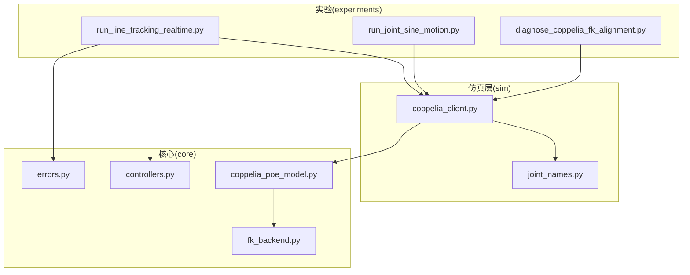
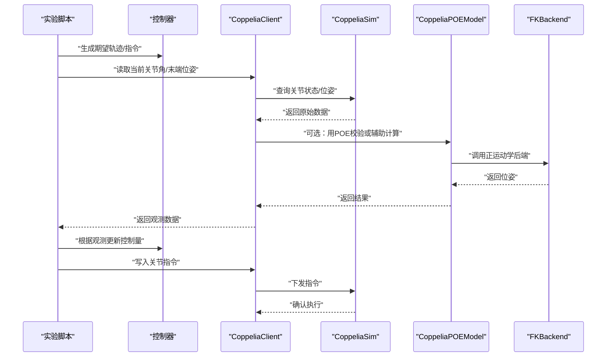
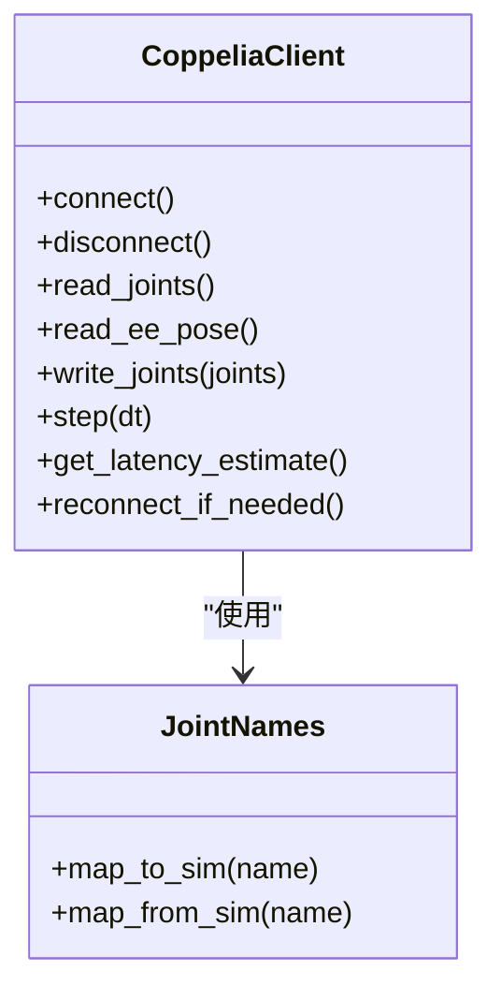
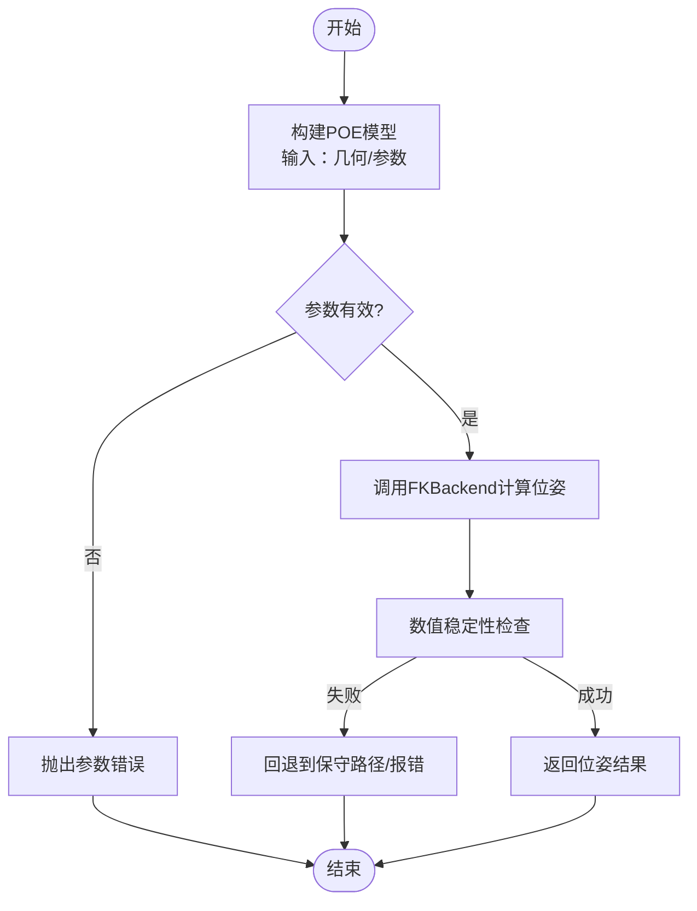
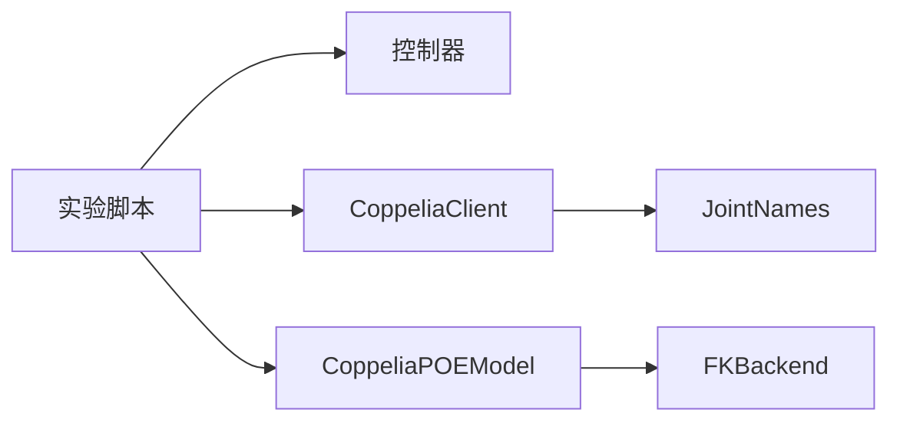

# 仿真系统集成

<cite>
**本文引用的文件**   
- [coppelia_client.py](file://sim/coppelia_client.py)
- [joint_names.py](file://sim/joint_names.py)
- [coppelia_poe_model.py](file://core/coppelia_poe_model.py)
- [fk_backend.py](file://core/fk_backend.py)
- [controllers.py](file://core/controllers.py)
- [errors.py](file://core/errors.py)
- [run_line_tracking_realtime.py](file://experiments/run_line_tracking_realtime.py)
- [run_joint_sine_motion.py](file://experiments/run_joint_sine_motion.py)
- [diagnose_coppelia_fk_alignment.py](file://experiments/diagnose_coppelia_fk_alignment.py)
</cite>

## 目录
1. [简介](#简介)
2. [项目结构](#项目结构)
3. [核心组件](#核心组件)
4. [架构总览](#架构总览)
5. [详细组件分析](#详细组件分析)
6. [依赖关系分析](#依赖关系分析)
7. [性能考虑](#性能考虑)
8. [故障排查指南](#故障排查指南)
9. [结论](#结论)
10. [附录](#附录)

## 简介
本技术文档面向CoppeliaSim仿真集成，围绕仿真客户端设计、连接管理、通信协议与数据同步机制展开，系统阐述关节名称映射、位姿读取与关节指令发送的实现方法；并详细说明POE模型的构建流程与正运动学后端集成方式。同时提供实时仿真的时间步长控制、延迟处理与错误恢复策略，以及仿真环境配置、机器人模型导入与传感器设置的具体步骤，最后给出调试工具与性能监控方法，帮助开发者优化仿真效率与准确性。

## 项目结构
仓库采用分层组织：
- sim/：仿真客户端与仿真侧资源（如关节名映射）
- core/：算法与模型（POE模型、正运动学后端、控制器、误差定义等）
- experiments/：实验脚本（轨迹跟踪、正弦关节运动、诊断对齐等）
- configs/：配置文件（例如KUKA-like 7R参数）



图表来源
- [coppelia_client.py:1-200](file://sim/coppelia_client.py#L1-L200)
- [joint_names.py:1-200](file://sim/joint_names.py#L1-L200)
- [coppelia_poe_model.py:1-200](file://core/coppelia_poe_model.py#L1-L200)
- [fk_backend.py:1-200](file://core/fk_backend.py#L1-L200)
- [controllers.py:1-200](file://core/controllers.py#L1-L200)
- [errors.py:1-200](file://core/errors.py#L1-L200)
- [run_line_tracking_realtime.py:1-200](file://experiments/run_line_tracking_realtime.py#L1-L200)
- [run_joint_sine_motion.py:1-200](file://experiments/run_joint_sine_motion.py#L1-L200)
- [diagnose_coppelia_fk_alignment.py:1-200](file://experiments/diagnose_coppelia_fk_alignment.py#L1-L200)

章节来源
- [coppelia_client.py:1-200](file://sim/coppelia_client.py#L1-L200)
- [coppelia_poe_model.py:1-200](file://core/coppelia_poe_model.py#L1-L200)
- [fk_backend.py:1-200](file://core/fk_backend.py#L1-L200)
- [controllers.py:1-200](file://core/controllers.py#L1-L200)
- [errors.py:1-200](file://core/errors.py#L1-L200)
- [run_line_tracking_realtime.py:1-200](file://experiments/run_line_tracking_realtime.py#L1-L200)
- [run_joint_sine_motion.py:1-200](file://experiments/run_joint_sine_motion.py#L1-L200)
- [diagnose_coppelia_fk_alignment.py:1-200](file://experiments/diagnose_coppelia_fk_alignment.py#L1-L200)

## 核心组件
- 仿真客户端（CoppeliaClient）
  - 负责与CoppeliaSim建立和维持连接、收发命令、读取关节状态与末端位姿、写入关节指令、管理时间步与延迟补偿。
- 关节名称映射（JointNames）
  - 维护仿真场景中的关节名与内部命名空间的一致映射，确保读写操作正确定位到目标关节。
- POE模型（CoppeliaPOEModel）
  - 基于POE公式构建机器人运动学模型，封装正运动学计算接口，供上层控制器使用。
- 正运动学后端（FKBackend）
  - 提供高效、稳定的正运动学实现，支持批量计算与数值稳定性保障。
- 控制器（Controllers）
  - 提供位置/速度/力矩等控制律实现，并与仿真客户端协同完成闭环控制。
- 错误定义（Errors）
  - 统一异常类型与错误码，便于跨模块的错误传播与恢复。

章节来源
- [coppelia_client.py:1-200](file://sim/coppelia_client.py#L1-L200)
- [joint_names.py:1-200](file://sim/joint_names.py#L1-L200)
- [coppelia_poe_model.py:1-200](file://core/coppelia_poe_model.py#L1-L200)
- [fk_backend.py:1-200](file://core/fk_backend.py#L1-L200)
- [controllers.py:1-200](file://core/controllers.py#L1-L200)
- [errors.py:1-200](file://core/errors.py#L1-L200)

## 架构总览
整体架构分为三层：
- 应用层（实验脚本）：编排仿真循环、调用控制器、记录数据与可视化。
- 核心层（POE/FK/控制器）：提供运动学与控制算法。
- 仿真层（Coppelia客户端）：封装与CoppeliaSim的通信细节，屏蔽底层API差异。



图表来源
- [run_line_tracking_realtime.py:1-200](file://experiments/run_line_tracking_realtime.py#L1-L200)
- [coppelia_client.py:1-200](file://sim/coppelia_client.py#L1-L200)
- [coppelia_poe_model.py:1-200](file://core/coppelia_poe_model.py#L1-L200)
- [fk_backend.py:1-200](file://core/fk_backend.py#L1-L200)
- [controllers.py:1-200](file://core/controllers.py#L1-L200)

## 详细组件分析

### CoppeliaClient：连接管理与通信协议
- 连接管理
  - 初始化时尝试连接CoppeliaSim远程API，支持重试与超时配置；断开后自动重连策略可配置。
- 通信协议
  - 通过远程API进行命令/响应式交互，包括读取关节角度、读取末端位姿、写入关节指令等。
- 数据同步
  - 在仿真循环中按固定步长推进，必要时对网络/仿真延迟进行估计与补偿，保证控制周期稳定。
- 错误恢复
  - 捕获连接异常、超时、空响应等错误，触发指数退避重连与降级策略（如仅读不写）。



图表来源
- [coppelia_client.py:1-200](file://sim/coppelia_client.py#L1-L200)
- [joint_names.py:1-200](file://sim/joint_names.py#L1-L200)

章节来源
- [coppelia_client.py:1-200](file://sim/coppelia_client.py#L1-L200)
- [joint_names.py:1-200](file://sim/joint_names.py#L1-L200)

### 关节名称映射：命名一致性与容错
- 作用
  - 将内部统一的关节名与CoppeliaSim场景中的实际关节名进行双向映射，避免硬编码带来的耦合。
- 特性
  - 支持别名与大小写规范化；缺失映射时抛出明确错误，便于快速定位问题。
- 扩展
  - 新增机器人或场景时，仅需更新映射表即可复用客户端逻辑。

章节来源
- [joint_names.py:1-200](file://sim/joint_names.py#L1-L200)

### POE模型构建与正运动学后端集成
- POE模型
  - 以POE公式描述机器人运动学，便于从DH参数或几何描述直接构建模型，减少中间变换误差。
- 后端集成
  - 通过FKBackend提供高性能正运动学计算，支持批量输入与数值稳定性检查。
- 校验与对齐
  - 提供诊断工具对比POE结果与CoppeliaSim原生FK，用于标定与对齐验证。



图表来源
- [coppelia_poe_model.py:1-200](file://core/coppelia_poe_model.py#L1-L200)
- [fk_backend.py:1-200](file://core/fk_backend.py#L1-L200)

章节来源
- [coppelia_poe_model.py:1-200](file://core/coppelia_poe_model.py#L1-L200)
- [fk_backend.py:1-200](file://core/fk_backend.py#L1-L200)
- [diagnose_coppelia_fk_alignment.py:1-200](file://experiments/diagnose_coppelia_fk_alignment.py#L1-L200)

### 控制器与仿真循环
- 控制器
  - 提供多种控制律（位置/速度/力矩），接收期望轨迹与当前观测，输出控制指令。
- 仿真循环
  - 实验脚本驱动固定步长的主循环，周期性读取观测、计算控制量、下发指令，并记录数据。
- 时序与延迟
  - 结合客户端延迟估计，调整控制周期与预测，降低网络与仿真延迟影响。

```mermaid
sequenceDiagram
participant Loop as "仿真循环"
participant C as "控制器"
participant Cl as "CoppeliaClient"
participant S as "CoppeliaSim"
Loop->>Cl : "读取关节/位姿"
Cl->>S : "查询状态"
S-->>Cl : "返回观测"
Cl-->>Loop : "观测数据"
Loop->>C : "计算控制量"
Loop->>Cl : "写入关节指令"
Cl->>S : "下发指令"
S-->>Cl : "执行确认"
```

图表来源
- [run_line_tracking_realtime.py:1-200](file://experiments/run_line_tracking_realtime.py#L1-L200)
- [controllers.py:1-200](file://core/controllers.py#L1-L200)
- [coppelia_client.py:1-200](file://sim/coppelia_client.py#L1-L200)

章节来源
- [run_line_tracking_realtime.py:1-200](file://experiments/run_line_tracking_realtime.py#L1-L200)
- [controllers.py:1-200](file://core/controllers.py#L1-L200)
- [coppelia_client.py:1-200](file://sim/coppelia_client.py#L1-L200)

### 正弦关节运动示例
- 目的
  - 验证客户端写入能力、关节映射正确性与仿真稳定性。
- 要点
  - 按固定频率生成正弦轨迹，周期性写入各关节角度；观察是否出现抖动或累积误差。

章节来源
- [run_joint_sine_motion.py:1-200](file://experiments/run_joint_sine_motion.py#L1-L200)

## 依赖关系分析
- 模块耦合
  - 实验脚本依赖控制器与仿真客户端；客户端依赖关节名映射；POE模型依赖正运动学后端。
- 外部依赖
  - CoppeliaSim远程API为唯一外部运行时依赖；其他均为纯Python实现。
- 潜在环依赖
  - 当前结构无循环依赖；若引入回调需小心避免循环引用。



图表来源
- [run_line_tracking_realtime.py:1-200](file://experiments/run_line_tracking_realtime.py#L1-L200)
- [controllers.py:1-200](file://core/controllers.py#L1-L200)
- [coppelia_client.py:1-200](file://sim/coppelia_client.py#L1-L200)
- [joint_names.py:1-200](file://sim/joint_names.py#L1-L200)
- [coppelia_poe_model.py:1-200](file://core/coppelia_poe_model.py#L1-L200)
- [fk_backend.py:1-200](file://core/fk_backend.py#L1-L200)

章节来源
- [run_line_tracking_realtime.py:1-200](file://experiments/run_line_tracking_realtime.py#L1-L200)
- [controllers.py:1-200](file://core/controllers.py#L1-L200)
- [coppelia_client.py:1-200](file://sim/coppelia_client.py#L1-L200)
- [joint_names.py:1-200](file://sim/joint_names.py#L1-L200)
- [coppelia_poe_model.py:1-200](file://core/coppelia_poe_model.py#L1-L200)
- [fk_backend.py:1-200](file://core/fk_backend.py#L1-L200)

## 性能考虑
- 时间步长控制
  - 建议固定仿真步长（如1ms~10ms），并在客户端内做周期调度，避免阻塞I/O。
- 延迟处理
  - 使用滑动窗口估计网络/仿真延迟，对控制指令进行前馈补偿或预测。
- 批量化
  - 尽量合并多次读取/写入请求，减少远程API往返次数。
- 数值稳定性
  - 在FK后端加入条件数检查与奇异点保护，防止极端姿态导致发散。
- I/O与日志
  - 限制高频日志输出，关键指标采样降频，避免磁盘/控制台瓶颈。

[本节为通用指导，无需具体文件来源]

## 故障排查指南
- 连接问题
  - 症状：无法连接、频繁断线
  - 排查：检查CoppeliaSim是否启动、端口与权限；启用重连与退避策略；查看错误码定位原因。
- 关节名不一致
  - 症状：写入无效或读取为空
  - 排查：核对JointNames映射；打印场景关节列表比对；增加缺失映射时的告警。
- 位姿异常
  - 症状：末端位姿跳变或不收敛
  - 排查：运行FK对齐诊断脚本；检查POE参数与坐标系定义；对比CoppeliaSim原生FK结果。
- 控制不稳定
  - 症状：振荡或漂移
  - 排查：降低控制增益；增大滤波；检查时间步与延迟估计；确认传感器噪声与采样率。
- 错误恢复
  - 策略：捕获异常后进入安全模式（停止写入、保持只读），等待恢复后逐步恢复控制。

章节来源
- [errors.py:1-200](file://core/errors.py#L1-L200)
- [diagnose_coppelia_fk_alignment.py:1-200](file://experiments/diagnose_coppelia_fk_alignment.py#L1-L200)
- [coppelia_client.py:1-200](file://sim/coppelia_client.py#L1-L200)

## 结论
本集成通过清晰的层次划分与模块化设计，实现了与CoppeliaSim的稳定通信与高效控制。借助POE模型与专用FK后端，保证了运动学计算的准确性与鲁棒性；配合完善的错误恢复与诊断工具，显著提升了开发效率与仿真可靠性。建议在工程实践中严格遵循固定步长与延迟补偿策略，并结合诊断脚本持续校准模型与参数。

[本节为总结性内容，无需具体文件来源]

## 附录
- 仿真环境配置
  - 启动CoppeliaSim并开启远程API服务；确认端口与访问权限；在客户端配置连接参数。
- 机器人模型导入
  - 在场景中导入URDF/CAD模型；导出或记录关节名；更新JointNames映射。
- 传感器设置
  - 在场景中放置视觉/IMU等传感器；在客户端增加对应读取接口；注意采样频率与数据格式。
- 调试工具
  - 使用FK对齐诊断脚本对比POE与CoppeliaSim结果；记录关键指标（延迟、丢包、误差）进行趋势分析。

[本节为概念性说明，无需具体文件来源]