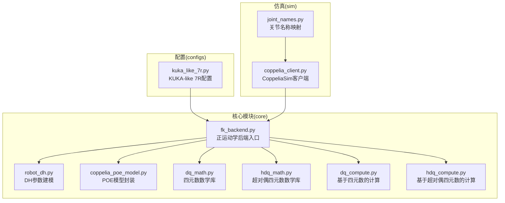
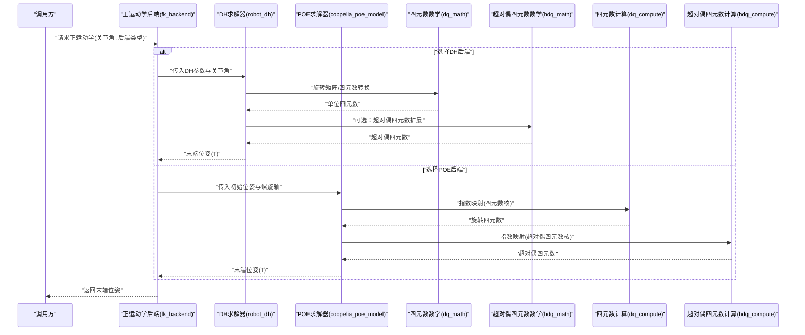
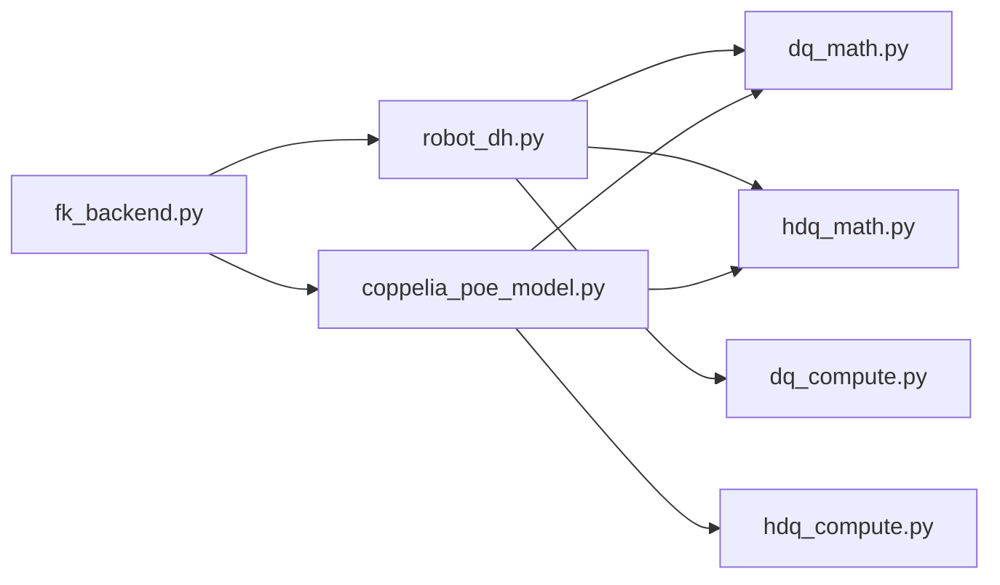

# 正运动学后端

<cite>
**本文引用的文件**   
- [fk_backend.py](file://core/fk_backend.py)
- [robot_dh.py](file://core/robot_dh.py)
- [coppelia_poe_model.py](file://core/coppelia_poe_model.py)
- [dq_math.py](file://core/dq_math.py)
- [hdq_math.py](file://core/hdq_math.py)
- [dq_compute.py](file://core/dq_compute.py)
- [hdq_compute.py](file://core/hdq_compute.py)
- [kuka_like_7r.py](file://configs/kuka_like_7r.py)
</cite>

## 目录
1. [简介](#简介)
2. [项目结构](#项目结构)
3. [核心组件](#核心组件)
4. [架构总览](#架构总览)
5. [详细组件分析](#详细组件分析)
6. [依赖关系分析](#依赖关系分析)
7. [性能与精度考量](#性能与精度考量)
8. [故障排查指南](#故障排查指南)
9. [结论](#结论)
10. [附录：配置示例与验证方法](#附录配置示例与验证方法)

## 简介
本技术文档聚焦于“正运动学后端”的实现与使用，围绕以下目标展开：
- 解释正运动学求解算法原理，包括DH参数法与POE（Product of Exponentials）公式的应用。
- 阐述多后端架构设计，支持不同运动学求解方法与精度要求。
- 说明坐标变换、旋转矩阵计算与位置矢量处理的实现细节。
- 提供不同机器人构型的配置示例与性能对比思路。
- 给出求解精度分析、数值稳定性与计算效率优化策略。
- 提供调试工具与结果验证方法，确保运动学计算的准确性。

## 项目结构
仓库采用按功能分层与模块化组织的方式，核心逻辑集中在 core 目录，配置在 configs 目录，仿真交互在 sim 目录，实验脚本在 experiments 目录。

图表来源
- [fk_backend.py:1-200](file://core/fk_backend.py#L1-L200)
- [robot_dh.py:1-200](file://core/robot_dh.py#L1-L200)
- [coppelia_poe_model.py:1-200](file://core/coppelia_poe_model.py#L1-L200)
- [dq_math.py:1-200](file://core/dq_math.py#L1-L200)
- [hdq_math.py:1-200](file://core/hdq_math.py#L1-L200)
- [dq_compute.py:1-200](file://core/dq_compute.py#L1-L200)
- [hdq_compute.py:1-200](file://core/hdq_compute.py#L1-L200)
- [kuka_like_7r.py:1-200](file://configs/kuka_like_7r.py#L1-L200)

章节来源
- [fk_backend.py:1-200](file://core/fk_backend.py#L1-L200)
- [robot_dh.py:1-200](file://core/robot_dh.py#L1-L200)
- [coppelia_poe_model.py:1-200](file://core/coppelia_poe_model.py#L1-L200)
- [dq_math.py:1-200](file://core/dq_math.py#L1-L200)
- [hdq_math.py:1-200](file://core/hdq_math.py#L1-L200)
- [dq_compute.py:1-200](file://core/dq_compute.py#L1-L200)
- [hdq_compute.py:1-200](file://core/hdq_compute.py#L1-L200)
- [kuka_like_7r.py:1-200](file://configs/kuka_like_7r.py#L1-L200)

## 核心组件
- 正运动学后端入口：统一对外接口，负责选择具体求解器（DH或POE）、执行计算并返回位姿。
- DH参数建模：根据连杆DH参数构建各关节变换矩阵，串联得到末端位姿。
- POE模型封装：基于初始位姿与螺旋轴（Screw Axis）指数映射计算末端位姿。
- 四元数与超对偶四元数数学库：提供旋转表示、组合与微分运算的底层能力。
- 计算层：分别基于四元数和超对偶四元数进行高效计算，用于提升数值稳定性与求导能力。
- 配置模块：为特定机器人（如KUKA-like 7R）提供DH参数与POE参数的集中管理。

章节来源
- [fk_backend.py:1-200](file://core/fk_backend.py#L1-L200)
- [robot_dh.py:1-200](file://core/robot_dh.py#L1-L200)
- [coppelia_poe_model.py:1-200](file://core/coppelia_poe_model.py#L1-L200)
- [dq_math.py:1-200](file://core/dq_math.py#L1-L200)
- [hdq_math.py:1-200](file://core/hdq_math.py#L1-L200)
- [dq_compute.py:1-200](file://core/dq_compute.py#L1-L200)
- [hdq_compute.py:1-200](file://core/hdq_compute.py#L1-L200)
- [kuka_like_7r.py:1-200](file://configs/kuka_like_7r.py#L1-L200)

## 架构总览
正运动学后端采用“多后端+统一接口”的设计：上层通过统一API调用，内部根据配置选择DH或POE求解路径；同时可切换四元数或超对偶四元数计算内核以平衡精度与性能。

图表来源
- [fk_backend.py:1-200](file://core/fk_backend.py#L1-L200)
- [robot_dh.py:1-200](file://core/robot_dh.py#L1-L200)
- [coppelia_poe_model.py:1-200](file://core/coppelia_poe_model.py#L1-L200)
- [dq_math.py:1-200](file://core/dq_math.py#L1-L200)
- [hdq_math.py:1-200](file://core/hdq_math.py#L1-L200)
- [dq_compute.py:1-200](file://core/dq_compute.py#L1-L200)
- [hdq_compute.py:1-200](file://core/hdq_compute.py#L1-L200)

## 详细组件分析

### 正运动学后端（统一接口与调度）
- 职责：接收关节角与后端选择，路由到DH或POE求解器；统一输出格式（位姿T）。
- 关键点：
  - 后端选择策略：根据配置或运行时参数决定使用DH或POE。
  - 输入校验：关节角范围、维度一致性检查。
  - 输出标准化：返回齐次变换矩阵或等效表示（四元数+位置矢量）。
- 错误处理：对非法输入抛出明确异常，记录日志以便调试。

章节来源
- [fk_backend.py:1-200](file://core/fk_backend.py#L1-L200)

### DH参数法实现（robot_dh.py）
- 原理：基于标准DH参数（a_i, α_i, d_i, θ_i）构造相邻连杆间的变换矩阵，逐链相乘得到末端位姿。
- 数据结构：
  - 连杆参数表：包含每根连杆的DH参数。
  - 关节角序列：对应每个活动关节的θ值。
- 计算流程：
  - 初始化基坐标系到第一连杆的变换。
  - 循环累积各连杆变换矩阵。
  - 提取末端位姿（旋转矩阵与位置矢量）。
- 数值稳定：
  - 三角函数计算注意角度归一化。
  - 避免奇异点附近的数值溢出。
- 复杂度：O(n)，n为关节数。

章节来源
- [robot_dh.py:1-200](file://core/robot_dh.py#L1-L200)

### POE公式实现（coppelia_poe_model.py）
- 原理：基于初始位姿M与各关节螺旋轴S_i，利用指数映射exp(S_i θ_i)连乘得到末端位姿。
- 数据结构：
  - 初始位姿M：基座到末端的参考位姿。
  - 螺旋轴集合{S_i}：描述各关节的运动轴与方向。
- 计算流程：
  - 将关节角转换为螺旋轴的指数映射。
  - 从基座开始依次左乘或右乘（取决于约定）各指数项。
  - 得到最终位姿T。
- 数值稳定：
  - 指数映射采用稳定的四元数或旋转向量实现。
  - 对大角度进行模2π处理。
- 复杂度：O(n)。

章节来源
- [coppelia_poe_model.py:1-200](file://core/coppelia_poe_model.py#L1-L200)

### 四元数与超对偶四元数数学库（dq_math.py, hdq_math.py）
- 四元数数学：
  - 提供单位四元数生成、乘法、共轭、逆、与旋转矩阵互转等基础操作。
  - 保证单位性约束（必要时重新归一化）。
- 超对偶四元数数学：
  - 在四元数基础上引入对偶部分，便于同时表示旋转与平移的微分信息。
  - 支持超对偶四元数的乘法、指数映射与反演。
- 数值特性：
  - 相比欧拉角避免万向锁问题。
  - 超对偶四元数在雅可比与灵敏度分析中更具优势。

章节来源
- [dq_math.py:1-200](file://core/dq_math.py#L1-L200)
- [hdq_math.py:1-200](file://core/hdq_math.py#L1-L200)

### 计算层（dq_compute.py, hdq_compute.py）
- 四元数计算：
  - 基于四元数核的快速旋转组合与位移传播。
  - 适用于实时控制与高频更新场景。
- 超对偶四元数计算：
  - 在保持旋转的同时携带平移微分信息，适合高精度建模与误差补偿。
  - 在需要解析导数或线性化的任务中更高效。

章节来源
- [dq_compute.py:1-200](file://core/dq_compute.py#L1-L200)
- [hdq_compute.py:1-200](file://core/hdq_compute.py#L1-L200)

### 配置示例（kuka_like_7r.py）
- 内容：定义KUKA-like 7R机器人的DH参数或POE参数，供后端加载。
- 用法：
  - 在运行前导入配置对象。
  - 将配置注入到后端实例，指定后端类型（DH或POE）。
- 扩展：
  - 新增机器人构型时，仅需添加新的配置文件并在后端注册。

章节来源
- [kuka_like_7r.py:1-200](file://configs/kuka_like_7r.py#L1-L200)

## 依赖关系分析
- 耦合关系：
  - fk_backend.py 依赖 robot_dh.py 与 coppelia_poe_model.py 作为具体求解器。
  - 两者均依赖 dq_math.py 与 hdq_math.py 提供的数学原语。
  - dq_compute.py 与 hdq_compute.py 作为计算内核被求解器调用。
- 外部集成：
  - sim/coppelia_client.py 与 sim/joint_names.py 提供仿真环境中的关节名映射与通信接口，便于端到端验证。

图表来源
- [fk_backend.py:1-200](file://core/fk_backend.py#L1-L200)
- [robot_dh.py:1-200](file://core/robot_dh.py#L1-L200)
- [coppelia_poe_model.py:1-200](file://core/coppelia_poe_model.py#L1-L200)
- [dq_math.py:1-200](file://core/dq_math.py#L1-L200)
- [hdq_math.py:1-200](file://core/hdq_math.py#L1-L200)
- [dq_compute.py:1-200](file://core/dq_compute.py#L1-L200)
- [hdq_compute.py:1-200](file://core/hdq_compute.py#L1-L200)

章节来源
- [fk_backend.py:1-200](file://core/fk_backend.py#L1-L200)
- [robot_dh.py:1-200](file://core/robot_dh.py#L1-L200)
- [coppelia_poe_model.py:1-200](file://core/coppelia_poe_model.py#L1-L200)
- [dq_math.py:1-200](file://core/dq_math.py#L1-L200)
- [hdq_math.py:1-200](file://core/hdq_math.py#L1-L200)
- [dq_compute.py:1-200](file://core/dq_compute.py#L1-L200)
- [hdq_compute.py:1-200](file://core/hdq_compute.py#L1-L200)

## 性能与精度考量
- 算法选择：
  - DH法：直观、易于标定，适合传统机器人建模。
  - POE法：更紧凑、对奇异点鲁棒，适合现代建模与误差补偿。
- 数值稳定性：
  - 四元数避免欧拉角奇异性；超对偶四元数在微分计算中更稳定。
  - 指数映射需处理大角度与周期性。
- 计算效率：
  - O(n)复杂度，适合实时控制。
  - 预计算常量（如固定变换）可减少重复计算。
- 精度评估：
  - 与CAD/仿真软件结果对比，统计位置误差与姿态误差。
  - 在不同构型与关节空间采样点进行蒙特卡洛测试。

[本节为通用指导，不直接分析具体文件]

## 故障排查指南
- 常见问题：
  - 关节角维度不一致：检查输入数组长度与配置关节数是否匹配。
  - 奇异点附近发散：检查姿态表示与角度归一化逻辑。
  - 仿真对齐偏差：核对基座与末端参考位姿的定义。
- 调试建议：
  - 打印中间变换矩阵与四元数，定位误差来源。
  - 使用独立工具（如MATLAB/Python脚本）交叉验证。
  - 逐步启用DH与POE后端，比较结果差异。

章节来源
- [fk_backend.py:1-200](file://core/fk_backend.py#L1-L200)
- [robot_dh.py:1-200](file://core/robot_dh.py#L1-L200)
- [coppelia_poe_model.py:1-200](file://core/coppelia_poe_model.py#L1-L200)

## 结论
正运动学后端通过统一接口与多后端架构，灵活支持DH与POE两种主流建模方法，并结合四元数与超对偶四元数数学库，兼顾数值稳定性与计算效率。合理的配置管理与调试验证流程，确保了不同机器人构型下的准确性与可靠性。

[本节为总结，不直接分析具体文件]

## 附录：配置示例与验证方法
- 配置示例：
  - KUKA-like 7R：在配置文件中定义DH参数或POE参数，并在后端初始化时加载。
- 验证方法：
  - 与仿真软件（CoppeliaSim）结果对比，统计误差分布。
  - 随机关节角采样，评估全局精度与边界行为。
  - 针对关键工作区域进行局部精度评估。

章节来源
- [kuka_like_7r.py:1-200](file://configs/kuka_like_7r.py#L1-L200)
- [fk_backend.py:1-200](file://core/fk_backend.py#L1-L200)