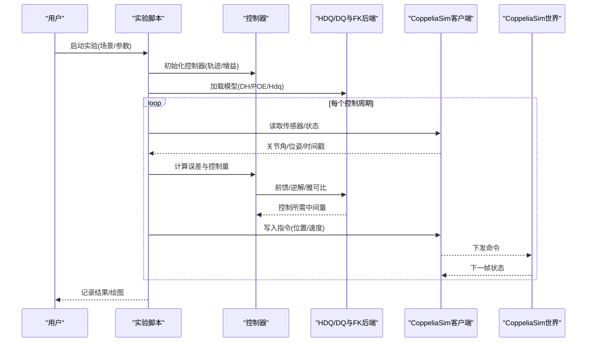
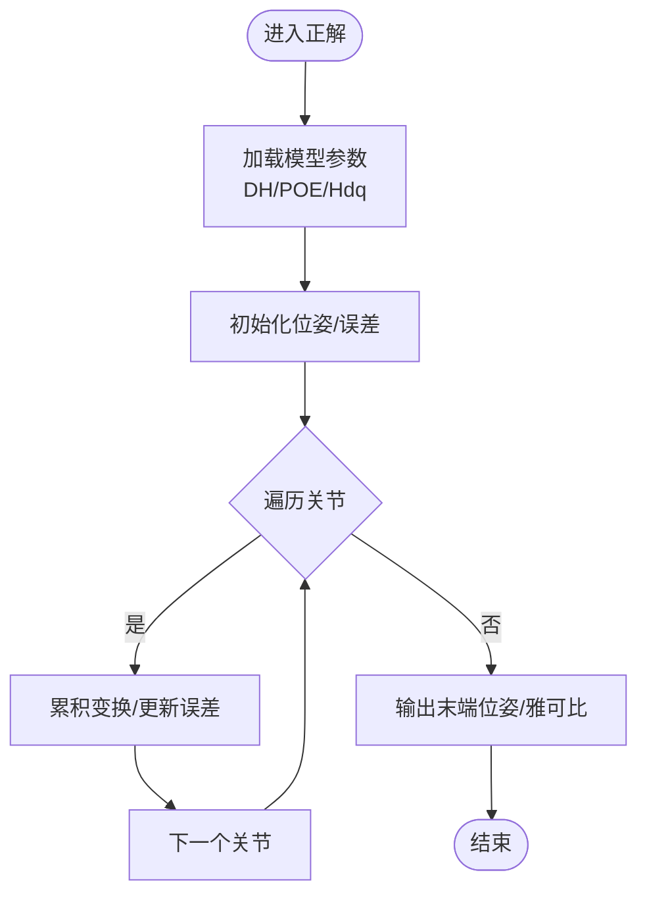
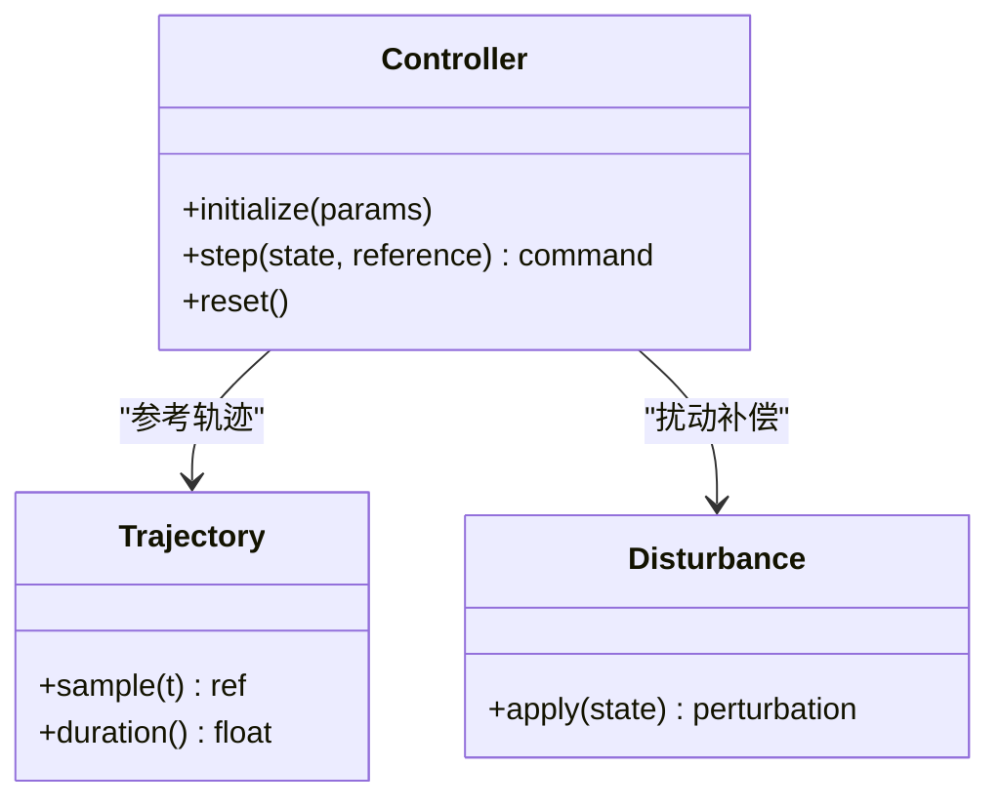
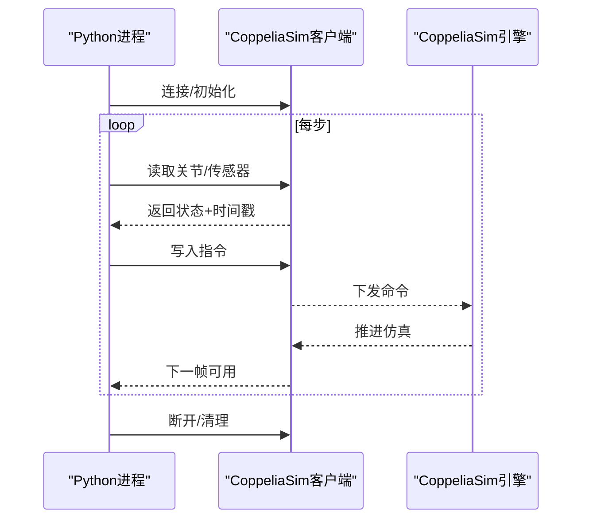
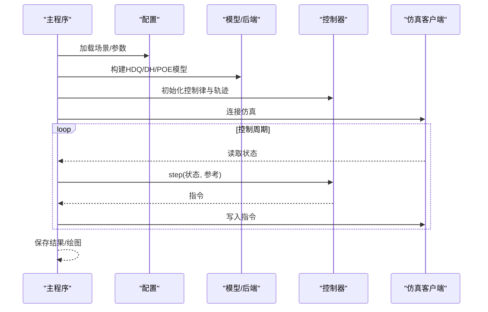
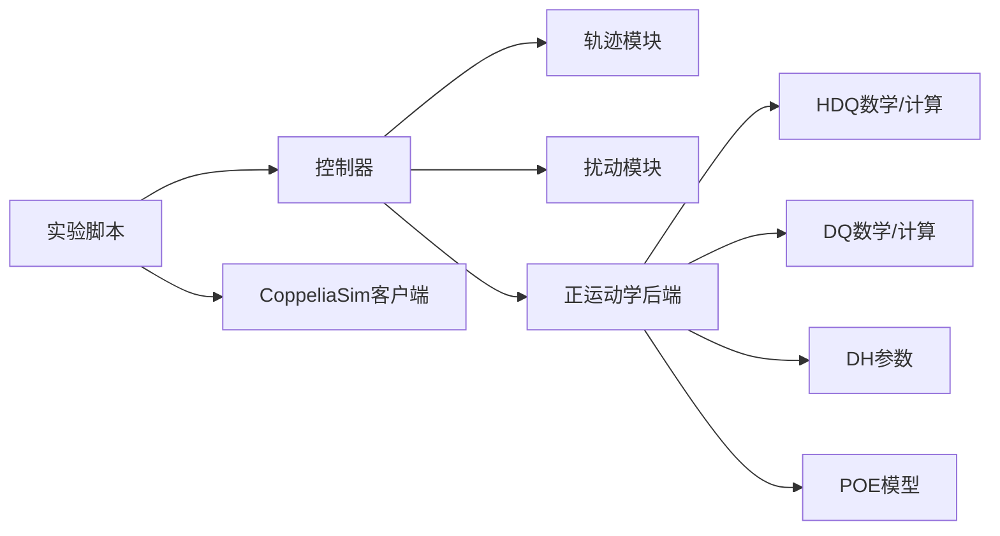

# 仿真验证实验

<cite>
**本文引用的文件**   
- [configs/kuka_like_7r.py](file://configs/kuka_like_7r.py)
- [core/controllers.py](file://core/controllers.py)
- [core/coppelia_poe_model.py](file://core/coppelia_poe_model.py)
- [core/disturbances.py](file://core/disturbances.py)
- [core/dq_compute.py](file://core/dq_compute.py)
- [core/dq_math.py](file://core/dq_math.py)
- [core/errors.py](file://core/errors.py)
- [core/fk_backend.py](file://core/fk_backend.py)
- [core/hdq_compute.py](file://core/hdq_compute.py)
- [core/hdq_math.py](file://core/hdq_math.py)
- [core/robot_dh.py](file://core/robot_dh.py)
- [core/trajectory_circle.py](file://core/trajectory_circle.py)
- [core/trajectory_line.py](file://core/trajectory_line.py)
- [experiments/run_line_tracking_realtime_hdq_chain.py](file://experiments/run_line_tracking_realtime_hdq_chain.py)
- [experiments/run_line_tracking_realtime_calibrated.py](file://experiments/run_line_tracking_realtime_calibrated.py)
- [experiments/diagnose_coppelia_fk_alignment.py](file://experiments/diagnose_coppelia_fk_alignment.py)
- [experiments/run_joint_sine_motion.py](file://experiments/run_joint_sine_motion.py)
- [experiments/run_joint_sine_motion_realtime_read.py](file://experiments/run_joint_sine_motion_realtime_read.py)
- [experiments/run_joint_velocity_control.py](file://experiments/run_joint_velocity控制.py)
- [experiments/run_line_tracking_realtime.py](file://experiments/run_line_tracking_realtime.py)
- [experiments/run_line_tracking_realtime_consistent.py](file://experiments/run_line_tracking_realtime_consistent.py)
- [experiments/run_line_tracking_realtime_modified.py](file://experiments/run_line_tracking_realtime_modified.py)
- [experiments/run_line_tracking_realtime_sim_feedback.py](file://experiments/run_line_tracking_realtime_sim_feedback.py)
- [experiments/test_read_joints.py](file://experiments/test_read_joints.py)
- [sim/coppelia_client.py](file://sim/coppelia_client.py)
- [sim/joint_names.py](file://sim/joint_names.py)
</cite>

## 目录
1. [引言](#引言)
2. [项目结构](#项目结构)
3. [核心组件](#核心组件)
4. [架构总览](#架构总览)
5. [详细组件分析](#详细组件分析)
6. [依赖关系分析](#依赖关系分析)
7. [性能与精度考量](#性能与精度考量)
8. [故障注入与鲁棒性验证](#故障注入与鲁棒性验证)
9. [仿真与真实系统差异分析与模型修正](#仿真与真实系统差异分析与模型修正)
10. [结论](#结论)
11. [附录：标准化测试流程与配置清单](#附录标准化测试流程与配置清单)

## 引言
本文件面向HDQ（双四元数）链式模型的仿真验证，围绕以下目标展开：
- 建立可复现的仿真验证框架，覆盖轨迹跟踪、关节正弦运动、速度控制等典型场景
- 说明CoppeliaSim集成方式、实时通信机制与数据同步策略
- 给出模型校准的参数优化方法、仿真精度验证与计算效率分析方法
- 提供不同仿真场景的配置方法、故障注入测试与鲁棒性验证方案
- 解释仿真与真实系统的差异来源、模型修正方法与验证标准
- 形成标准化的测试流程，支撑后续研究与工程落地

## 项目结构
仓库采用分层组织：
- configs：机器人参数与场景配置
- core：数学库、动力学/运动学后端、控制器、扰动与轨迹生成
- experiments：端到端实验脚本（离线/在线、开环/闭环、标定/诊断）
- sim：CoppeliaSim客户端封装与关节名映射
- results：结果数据与图表输出

```mermaid
graph TB
subgraph "配置层"
Cfg["configs/kuka_like_7r.py"]
end
subgraph "核心算法层"
HDQMath["core/hdq_math.py"]
HDQCompute["core/hdq_compute.py"]
DQMath["core/dq_math.py"]
DQCompute["core/dq_compute.py"]
FKBackend["core/fk_backend.py"]
POEModel["core/coppelia_poe_model.py"]
DH["core/robot_dh.py"]
Controllers["core/controllers.py"]
Disturb["core/disturbances.py"]
TrajLine["core/trajectory_line.py"]
TrajCircle["core/trajectory_circle.py"]
Errors["core/errors.py"]
end
subgraph "仿真接口层"
SimClient["sim/coppelia_client.py"]
JointNames["sim/joint_names.py"]
end
subgraph "实验脚本层"
ExpChain["experiments/run_line_tracking_realtime_hdq_chain.py"]
ExpCalib["experiments/run_line_tracking_realtime_calibrated.py"]
ExpDiagFK["experiments/diagnose_coppelia_fk_alignment.py"]
ExpSine["experiments/run_joint_sine_motion.py"]
ExpSineRT["experiments/run_joint_sine_motion_realtime_read.py"]
ExpVelCtrl["experiments/run_joint_velocity_control.py"]
ExpRT["experiments/run_line_tracking_realtime.py"]
ExpCons["experiments/run_line_tracking_realtime_consistent.py"]
ExpMod["experiments/run_line_tracking_realtime_modified.py"]
ExpSimFB["experiments/run_line_tracking_realtime_sim_feedback.py"]
ExpTestJoints["experiments/test_read_joints.py"]
end
Cfg --> Controllers
Cfg --> TrajLine
Cfg --> TrajCircle
HDQMath --> HDQCompute
DQMath --> DQCompute
DH --> FKBackend
POEModel --> FKBackend
FKBackend --> Controllers
Controllers --> ExpChain
Controllers --> ExpCalib
Controllers --> ExpRT
Controllers --> ExpCons
Controllers --> ExpMod
Controllers --> ExpSimFB
Disturb --> Controllers
SimClient --> ExpChain
SimClient --> ExpCalib
SimClient --> ExpRT
SimClient --> ExpCons
SimClient --> ExpMod
SimClient --> ExpSimFB
JointNames --> SimClient
```

图示来源
- [configs/kuka_like_7r.py](file://configs/kuka_like_7r.py)
- [core/hdq_math.py](file://core/hdq_math.py)
- [core/hdq_compute.py](file://core/hdq_compute.py)
- [core/dq_math.py](file://core/dq_math.py)
- [core/dq_compute.py](file://core/dq_compute.py)
- [core/robot_dh.py](file://core/robot_dh.py)
- [core/fk_backend.py](file://core/fk_backend.py)
- [core/coppelia_poe_model.py](file://core/coppelia_poe_model.py)
- [core/controllers.py](file://core/controllers.py)
- [core/disturbances.py](file://core/disturbances.py)
- [core/trajectory_line.py](file://core/trajectory_line.py)
- [core/trajectory_circle.py](file://core/trajectory_circle.py)
- [sim/coppelia_client.py](file://sim/coppelia_client.py)
- [sim/joint_names.py](file://sim/joint_names.py)
- [experiments/run_line_tracking_realtime_hdq_chain.py](file://experiments/run_line_tracking_realtime_hdq_chain.py)
- [experiments/run_line_tracking_realtime_calibrated.py](file://experiments/run_line_tracking_realtime_calibrated.py)
- [experiments/run_line_tracking_realtime.py](file://experiments/run_line_tracking_realtime.py)
- [experiments/run_line_tracking_realtime_consistent.py](file://experiments/run_line_tracking_realtime_consistent.py)
- [experiments/run_line_tracking_realtime_modified.py](file://experiments/run_line_tracking_realtime_modified.py)
- [experiments/run_line_tracking_realtime_sim_feedback.py](file://experiments/run_line_tracking_realtime_sim_feedback.py)

章节来源
- [configs/kuka_like_7r.py](file://configs/kuka_like_7r.py)
- [core/controllers.py](file://core/controllers.py)
- [core/fk_backend.py](file://core/fk_backend.py)
- [core/hdq_compute.py](file://core/hdq_compute.py)
- [core/hdq_math.py](file://core/hdq_math.py)
- [core/dq_compute.py](file://core/dq_compute.py)
- [core/dq_math.py](file://core/dq_math.py)
- [core/robot_dh.py](file://core/robot_dh.py)
- [core/coppelia_poe_model.py](file://core/coppelia_poe_model.py)
- [core/disturbances.py](file://core/disturbances.py)
- [core/trajectory_line.py](file://core/trajectory_line.py)
- [core/trajectory_circle.py](file://core/trajectory_circle.py)
- [sim/coppelia_client.py](file://sim/coppelia_client.py)
- [sim/joint_names.py](file://sim/joint_names.py)
- [experiments/run_line_tracking_realtime_hdq_chain.py](file://experiments/run_line_tracking_realtime_hdq_chain.py)
- [experiments/run_line_tracking_realtime_calibrated.py](file://experiments/run_line_tracking_realtime_calibrated.py)
- [experiments/run_line_tracking_realtime.py](file://experiments/run_line_tracking_realtime.py)
- [experiments/run_line_tracking_realtime_consistent.py](file://experiments/run_line_tracking_realtime_consistent.py)
- [experiments/run_line_tracking_realtime_modified.py](file://experiments/run_line_tracking_realtime_modified.py)
- [experiments/run_line_tracking_realtime_sim_feedback.py](file://experiments/run_line_tracking_realtime_sim_feedback.py)

## 核心组件
- HDQ/DQ数学与计算模块
  - 负责双四元数与四元数的代数运算、变换与微分，为运动学与误差传播提供基础。
  - 关键职责：旋量/位移表示、导数与雅可比近似、数值稳定性处理。
- 正运动学后端
  - 支持基于DH参数与POE公式的正解实现，并对接CoppeliaSim中的POE模型，用于一致性校验与对齐诊断。
- 控制器
  - 提供轨迹跟踪、速度控制等控制律；可与扰动模块组合进行鲁棒性评估。
- 轨迹生成
  - 直线与圆形轨迹模板，便于在仿真中构造基准信号。
- CoppeliaSim客户端
  - 封装与CoppeliaSim的通信、关节读写、时间同步与错误恢复。
- 实验脚本
  - 将上述模块组装成端到端流程，覆盖离线/在线、开环/闭环、标定/诊断等场景。

章节来源
- [core/hdq_math.py](file://core/hdq_math.py)
- [core/hdq_compute.py](file://core/hdq_compute.py)
- [core/dq_math.py](file://core/dq_math.py)
- [core/dq_compute.py](file://core/dq_compute.py)
- [core/fk_backend.py](file://core/fk_backend.py)
- [core/coppelia_poe_model.py](file://core/coppelia_poe_model.py)
- [core/controllers.py](file://core/controllers.py)
- [core/trajectory_line.py](file://core/trajectory_line.py)
- [core/trajectory_circle.py](file://core/trajectory_circle.py)
- [sim/coppelia_client.py](file://sim/coppelia_client.py)

## 架构总览
整体架构分为四层：配置层、核心算法层、仿真接口层、实验脚本层。核心算法层通过统一的数据结构与接口被上层实验调用；仿真接口层屏蔽底层通信细节，向上提供一致的读取/写入与时钟同步能力。

图示来源
- [experiments/run_line_tracking_realtime_hdq_chain.py](file://experiments/run_line_tracking_realtime_hdq_chain.py)
- [experiments/run_line_tracking_realtime_sim_feedback.py](file://experiments/run_line_tracking_realtime_sim_feedback.py)
- [core/controllers.py](file://core/controllers.py)
- [core/fk_backend.py](file://core/fk_backend.py)
- [core/hdq_compute.py](file://core/hdq_compute.py)
- [core/dq_compute.py](file://core/dq_compute.py)
- [sim/coppelia_client.py](file://sim/coppelia_client.py)

## 详细组件分析

### HDQ链式模型与正运动学后端
- 设计要点
  - 使用HDQ/DQ表达位姿与误差，结合雅可比或线性化近似实现快速迭代求解。
  - 正运动学同时支持DH与POE两种路径，便于与CoppeliaSim内置POE模型对齐。
- 关键流程
  - 输入：关节角序列、连杆参数(HDQ/DH/POE)
  - 处理：逐段累积变换、误差传播、数值稳定化
  - 输出：末端位姿、雅可比矩阵、中间变量缓存
- 复杂度与稳定性
  - 单次正向传播O(n)，雅可比近似O(n^2)；注意单位一致性与四元数归一化。

图示来源
- [core/fk_backend.py](file://core/fk_backend.py)
- [core/coppelia_poe_model.py](file://core/coppelia_poe_model.py)
- [core/hdq_compute.py](file://core/hdq_compute.py)
- [core/dq_compute.py](file://core/dq_compute.py)
- [core/robot_dh.py](file://core/robot_dh.py)

章节来源
- [core/fk_backend.py](file://core/fk_backend.py)
- [core/coppelia_poe_model.py](file://core/coppelia_poe_model.py)
- [core/hdq_compute.py](file://core/hdq_compute.py)
- [core/dq_compute.py](file://core/dq_compute.py)
- [core/robot_dh.py](file://core/robot_dh.py)

### 控制器与轨迹跟踪
- 功能范围
  - 支持位置/速度控制模式，提供轨迹跟踪控制律与扰动补偿接口。
- 数据流
  - 读取当前状态 → 计算跟踪误差 → 应用控制律 → 输出指令
- 与仿真集成
  - 通过CoppeliaSim客户端完成读/写与时间同步，确保闭环稳定。

图示来源
- [core/controllers.py](file://core/controllers.py)
- [core/trajectory_line.py](file://core/trajectory_line.py)
- [core/trajectory_circle.py](file://core/trajectory_circle.py)
- [core/disturbances.py](file://core/disturbances.py)

章节来源
- [core/controllers.py](file://core/controllers.py)
- [core/trajectory_line.py](file://core/trajectory_line.py)
- [core/trajectory_circle.py](file://core/trajectory_circle.py)
- [core/disturbances.py](file://core/disturbances.py)

### CoppeliaSim集成与实时通信
- 通信机制
  - 客户端封装了连接管理、命令发送、状态读取与异常重试。
- 时间同步
  - 以仿真步长为基准，采用固定步长循环与时间戳对齐，避免累积漂移。
- 数据一致性
  - 关节名映射表保证Python侧与仿真侧命名一致，减少误配风险。

图示来源
- [sim/coppelia_client.py](file://sim/coppelia_client.py)
- [sim/joint_names.py](file://sim/joint_names.py)

章节来源
- [sim/coppelia_client.py](file://sim/coppelia_client.py)
- [sim/joint_names.py](file://sim/joint_names.py)

### 端到端实验流程（示例：HDQ链式轨迹跟踪）
- 步骤概览
  - 加载配置与模型 → 初始化控制器与轨迹 → 打开仿真连接 → 进入控制循环 → 记录数据与可视化
- 关键点
  - 实时性：固定步长、最小I/O开销
  - 一致性：同一套参数在仿真与离线计算间复用
  - 可重复：随机种子、日志与结果落盘

图示来源
- [experiments/run_line_tracking_realtime_hdq_chain.py](file://experiments/run_line_tracking_realtime_hdq_chain.py)
- [configs/kuka_like_7r.py](file://configs/kuka_like_7r.py)
- [core/controllers.py](file://core/controllers.py)
- [core/fk_backend.py](file://core/fk_backend.py)
- [sim/coppelia_client.py](file://sim/coppelia_client.py)

章节来源
- [experiments/run_line_tracking_realtime_hdq_chain.py](file://experiments/run_line_tracking_realtime_hdq_chain.py)
- [configs/kuka_like_7r.py](file://configs/kuka_like_7r.py)
- [core/controllers.py](file://core/controllers.py)
- [core/fk_backend.py](file://core/fk_backend.py)
- [sim/coppelia_client.py](file://sim/coppelia_client.py)

## 依赖关系分析
- 模块耦合
  - 控制器强依赖轨迹与扰动模块；正运动学后端依赖DH/POE与HDQ/DQ数学库；实验脚本聚合以上模块并通过仿真客户端与外部世界交互。
- 潜在环路
  - 建议保持“实验→控制器→模型→仿真”单向依赖，避免反向导入造成循环。
- 外部依赖
  - CoppeliaSim运行时与网络/共享内存通道；需确保端口、权限与版本兼容。

图示来源
- [experiments/run_line_tracking_realtime_hdq_chain.py](file://experiments/run_line_tracking_realtime_hdq_chain.py)
- [core/controllers.py](file://core/controllers.py)
- [core/trajectory_line.py](file://core/trajectory_line.py)
- [core/trajectory_circle.py](file://core/trajectory_circle.py)
- [core/disturbances.py](file://core/disturbances.py)
- [core/fk_backend.py](file://core/fk_backend.py)
- [core/hdq_math.py](file://core/hdq_math.py)
- [core/hdq_compute.py](file://core/hdq_compute.py)
- [core/dq_math.py](file://core/dq_math.py)
- [core/dq_compute.py](file://core/dq_compute.py)
- [core/robot_dh.py](file://core/robot_dh.py)
- [core/coppelia_poe_model.py](file://core/coppelia_poe_model.py)
- [sim/coppelia_client.py](file://sim/coppelia_client.py)

章节来源
- [core/controllers.py](file://core/controllers.py)
- [core/fk_backend.py](file://core/fk_backend.py)
- [core/hdq_math.py](file://core/hdq_math.py)
- [core/hdq_compute.py](file://core/hdq_compute.py)
- [core/dq_math.py](file://core/dq_math.py)
- [core/dq_compute.py](file://core/dq_compute.py)
- [core/robot_dh.py](file://core/robot_dh.py)
- [core/coppelia_poe_model.py](file://core/coppelia_poe_model.py)
- [sim/coppelia_client.py](file://sim/coppelia_client.py)

## 性能与精度考量
- 计算效率
  - 正解与雅可比近似应缓存中间结果，避免重复计算；尽量向量化批量操作。
  - 控制循环内仅保留必要I/O与算术，降低延迟抖动。
- 精度验证
  - 对比HDQ/DQ正解与CoppeliaSim POE正解的一致性误差分布；对关键姿态分量设置阈值。
  - 使用多组初始条件与扰动强度进行蒙特卡洛采样，统计误差上界。
- 实时性指标
  - 单步耗时、最大抖动、丢包率、重连次数；建议在相同硬件与负载下采集。

[本节为通用指导，不直接分析具体文件]

## 故障注入与鲁棒性验证
- 故障类型
  - 传感器噪声/偏置、通信延迟/丢包、执行器饱和/死区、模型参数失配。
- 注入方式
  - 通过扰动模块与仿真客户端在控制回路中注入；在仿真侧也可启用物理噪声或碰撞干扰。
- 评估指标
  - 跟踪误差峰值/均值、超调、收敛时间、稳态误差、控制量幅值与频率。
- 推荐用例
  - 正弦关节运动、速度控制、带扰动的轨迹跟踪、断线重连恢复。

章节来源
- [core/disturbances.py](file://core/disturbances.py)
- [experiments/run_joint_sine_motion.py](file://experiments/run_joint_sine_motion.py)
- [experiments/run_joint_velocity_control.py](file://experiments/run_joint_velocity控制.py)
- [experiments/run_line_tracking_realtime.py](file://experiments/run_line_tracking_realtime.py)
- [experiments/run_line_tracking_realtime_sim_feedback.py](file://experiments/run_line_tracking_realtime_sim_feedback.py)

## 仿真与真实系统差异分析与模型修正
- 差异来源
  - 摩擦/间隙、柔性变形、传感器延迟与量化、执行器带宽限制、环境扰动。
- 修正方法
  - 基于残差拟合的摩擦/偏置辨识；时延估计与前置补偿；刚度/阻尼参数微调。
- 验证标准
  - 离线-仿真-实机三阶段一致性：误差随工况单调下降、置信区间收敛、跨场景泛化良好。
- 诊断工具
  - 使用FK对齐诊断脚本定位坐标系/参数不一致问题。

章节来源
- [experiments/diagnose_coppelia_fk_alignment.py](file://experiments/diagnose_coppelia_fk_alignment.py)
- [core/fk_backend.py](file://core/fk_backend.py)
- [core/coppelia_poe_model.py](file://core/coppelia_poe_model.py)

## 结论
本工作构建了面向HDQ链式模型的仿真验证框架，涵盖从数学库、正运动学后端、控制器到CoppeliaSim集成的完整链路，并提供多种实验脚本以支撑轨迹跟踪、关节运动、速度控制与鲁棒性评估。通过统一的参数配置与标准化流程，可在仿真中高效开展模型校准、精度验证与差异分析，为后续迁移至真实系统奠定可靠基础。

[本节为总结性内容，不直接分析具体文件]

## 附录：标准化测试流程与配置清单

### 标准化测试流程
- 准备
  - 确认CoppeliaSim运行环境与端口；检查关节名映射与坐标轴方向。
- 基线验证
  - 运行FK对齐诊断与静态位姿比对，确保模型与仿真一致。
- 开环测试
  - 正弦关节运动、速度阶跃响应，记录响应曲线与频谱。
- 闭环测试
  - 直线/圆形轨迹跟踪，逐步增加扰动强度与参数失配度。
- 鲁棒性
  - 注入通信延迟/丢包、传感器噪声/偏置，评估稳定性裕度。
- 标定与修正
  - 基于离线数据与仿真反馈，迭代优化参数并回归验证。
- 报告
  - 汇总误差指标、性能指标与失败案例，归档数据与图件。

章节来源
- [experiments/diagnose_coppelia_fk_alignment.py](file://experiments/diagnose_coppelia_fk_alignment.py)
- [experiments/run_joint_sine_motion.py](file://experiments/run_joint_sine_motion.py)
- [experiments/run_joint_velocity_control.py](file://experiments/run_joint_velocity控制.py)
- [experiments/run_line_tracking_realtime.py](file://experiments/run_line_tracking_realtime.py)
- [experiments/run_line_tracking_realtime_sim_feedback.py](file://experiments/run_line_tracking_realtime_sim_feedback.py)

### 场景配置清单（示例）
- 场景A：直线轨迹跟踪（HDQ链式）
  - 配置文件：configs/kuka_like_7r.py
  - 实验脚本：experiments/run_line_tracking_realtime_hdq_chain.py
  - 关注点：轨迹平滑度、控制量限幅、仿真步长匹配
- 场景B：带仿真的闭环反馈
  - 实验脚本：experiments/run_line_tracking_realtime_sim_feedback.py
  - 关注点：通信延迟补偿、时间戳对齐、异常恢复
- 场景C：参数标定与一致性
  - 实验脚本：experiments/run_line_tracking_realtime_calibrated.py
  - 关注点：参数搜索空间、收敛判据、过拟合防护
- 场景D：FK对齐诊断
  - 实验脚本：experiments/diagnose_coppelia_fk_alignment.py
  - 关注点：坐标系定义、零位偏移、连杆长度/角度误差
- 场景E：关节正弦运动
  - 实验脚本：experiments/run_joint_sine_motion.py / run_joint_sine_motion_realtime_read.py
  - 关注点：幅频特性、相位滞后、谐波失真
- 场景F：速度控制
  - 实验脚本：experiments/run_joint_velocity_control.py
  - 关注点：带宽、饱和、积分抗饱和
- 场景G：一致性/修改版对比
  - 实验脚本：experiments/run_line_tracking_realtime_consistent.py / run_line_tracking_realtime_modified.py
  - 关注点：改动影响面、回归测试、差异可视化
- 场景H：关节读取自检
  - 实验脚本：experiments/test_read_joints.py
  - 关注点：通信连通性、命名一致性、数据有效性

章节来源
- [configs/kuka_like_7r.py](file://configs/kuka_like_7r.py)
- [experiments/run_line_tracking_realtime_hdq_chain.py](file://experiments/run_line_tracking_realtime_hdq_chain.py)
- [experiments/run_line_tracking_realtime_sim_feedback.py](file://experiments/run_line_tracking_realtime_sim_feedback.py)
- [experiments/run_line_tracking_realtime_calibrated.py](file://experiments/run_line_tracking_realtime_calibrated.py)
- [experiments/diagnose_coppelia_fk_alignment.py](file://experiments/diagnose_coppelia_fk_alignment.py)
- [experiments/run_joint_sine_motion.py](file://experiments/run_joint_sine_motion.py)
- [experiments/run_joint_sine_motion_realtime_read.py](file://experiments/run_joint_sine_motion_realtime_read.py)
- [experiments/run_joint_velocity_control.py](file://experiments/run_joint_velocity控制.py)
- [experiments/run_line_tracking_realtime_consistent.py](file://experiments/run_line_tracking_realtime_consistent.py)
- [experiments/run_line_tracking_realtime_modified.py](file://experiments/run_line_tracking_realtime_modified.py)
- [experiments/test_read_joints.py](file://experiments/test_read_joints.py)