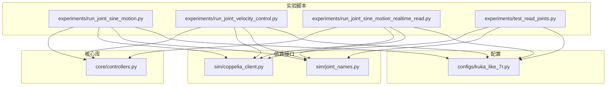
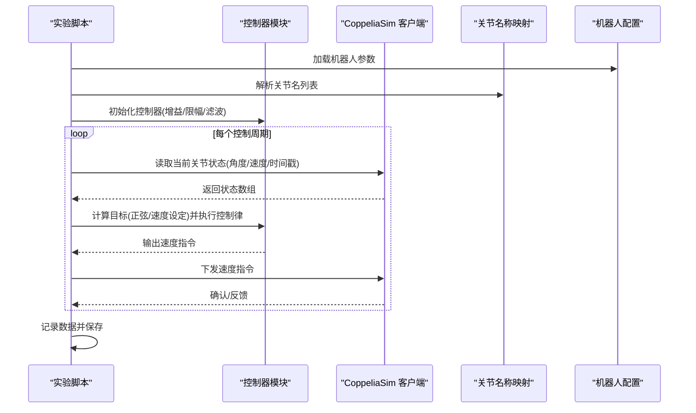
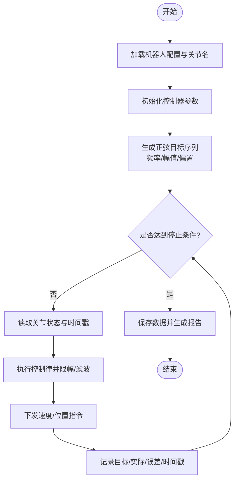
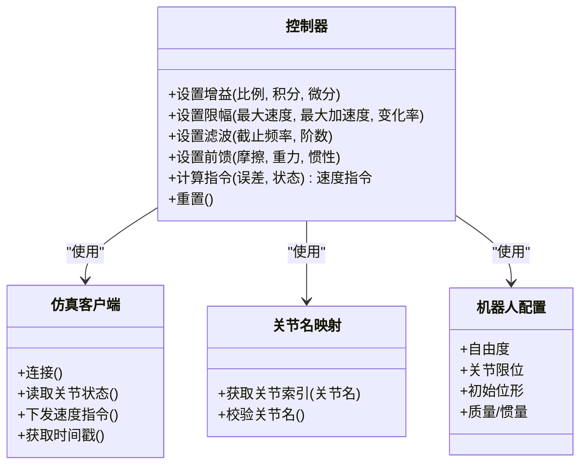
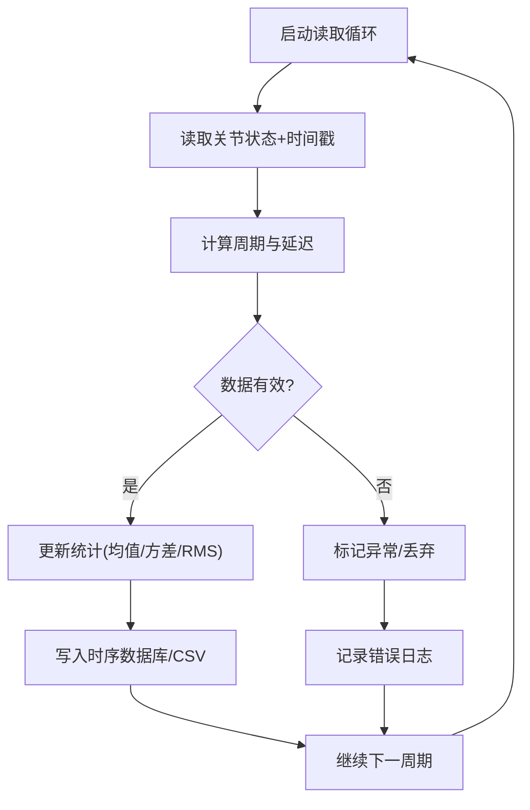
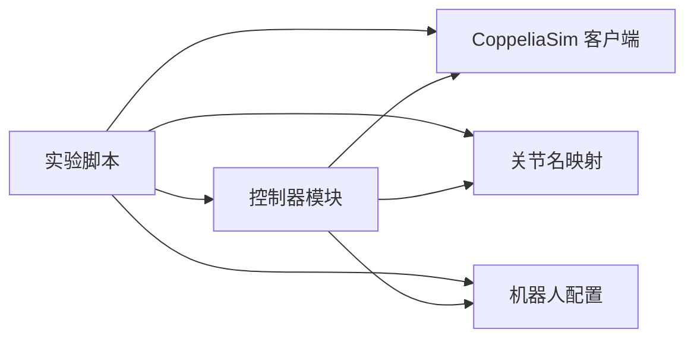

# 关节运动测试

<cite>
**本文引用的文件**   
- [run_joint_sine_motion.py](file://experiments/run_joint_sine_motion.py)
- [run_joint_velocity_control.py](file://experiments/run_joint_velocity_control.py)
- [run_joint_sine_motion_realtime_read.py](file://experiments/run_joint_sine_motion_realtime_read.py)
- [test_read_joints.py](file://experiments/test_read_joints.py)
- [controllers.py](file://core/controllers.py)
- [coppelia_client.py](file://sim/coppelia_client.py)
- [joint_names.py](file://sim/joint_names.py)
- [kuka_like_7r.py](file://configs/kuka_like_7r.py)
</cite>

## 目录
1. [引言](#引言)
2. [项目结构](#项目结构)
3. [核心组件](#核心组件)
4. [架构总览](#架构总览)
5. [详细组件分析](#详细组件分析)
6. [依赖关系分析](#依赖关系分析)
7. [性能考虑](#性能考虑)
8. [故障排查指南](#故障排查指南)
9. [结论](#结论)
10. [附录](#附录)

## 引言
本文件面向控制系统与机器人仿真/实机调试工程师，提供一套标准化的“关节运动测试”文档。重点覆盖：
- 正弦运动测试的目的、实现方法与典型应用场景
- 关节速度控制的实现原理、参数配置与控制策略
- 关节状态读取测试的数据采集方法与精度验证
- 多运动模式的测试用例、参数扫描方法与响应特性分析
- 传感器数据验证、通信延迟测量与实时性测试方法
- 为控制系统调试与性能验证提供可复用的工具与流程

## 项目结构
仓库采用按功能分层组织的方式：
- experiments：各类测试脚本（正弦运动、速度控制、读取关节等）
- core：控制器、数学计算、轨迹生成等核心逻辑
- sim：CoppeliaSim 客户端封装与关节名映射
- configs：机器人模型与参数配置
- results：结果数据与绘图输出

图表来源
- [run_joint_sine_motion.py](file://experiments/run_joint_sine_motion.py)
- [run_joint_velocity_control.py](file://experiments/run_joint_velocity_control.py)
- [run_joint_sine_motion_realtime_read.py](file://experiments/run_joint_sine_motion_realtime_read.py)
- [test_read_joints.py](file://experiments/test_read_joints.py)
- [controllers.py](file://core/controllers.py)
- [coppelia_client.py](file://sim/coppelia_client.py)
- [joint_names.py](file://sim/joint_names.py)
- [kuka_like_7r.py](file://configs/kuka_like_7r.py)

章节来源
- [run_joint_sine_motion.py](file://experiments/run_joint_sine_motion.py)
- [run_joint_velocity_control.py](file://experiments/run_joint_velocity_control.py)
- [run_joint_sine_motion_realtime_read.py](file://experiments/run_joint_sine_motion_realtime_read.py)
- [test_read_joints.py](file://experiments/test_read_joints.py)
- [controllers.py](file://core/controllers.py)
- [coppelia_client.py](file://sim/coppelia_client.py)
- [joint_names.py](file://sim/joint_names.py)
- [kuka_like_7r.py](file://configs/kuka_like_7r.py)

## 核心组件
- 正弦运动测试脚本：用于驱动各关节按正弦规律运动，记录目标与实际轨迹，便于频域与时域分析
- 关节速度控制脚本：基于控制器模块实现速度环控制，支持增益、限幅、滤波等参数配置
- 实时读取脚本：在正弦运动过程中同步读取关节状态，评估采样率、抖动与丢包
- 关节读取测试：独立验证传感器/仿真端数据读取链路，进行一致性、范围与噪声检查
- 控制器模块：封装速度控制算法、限幅与滤波、误差计算与指令生成
- CoppeliaSim 客户端：统一封装仿真通信接口（连接、发送命令、读取状态、时间戳）
- 关节名称映射：维护关节命名规范，确保不同平台/模型间的一致性
- 机器人配置：定义自由度、关节限位、初始位形、惯性与质量等模型参数

章节来源
- [run_joint_sine_motion.py](file://experiments/run_joint_sine_motion.py)
- [run_joint_velocity_control.py](file://experiments/run_joint_velocity_control.py)
- [run_joint_sine_motion_realtime_read.py](file://experiments/run_joint_sine_motion_realtime_read.py)
- [test_read_joints.py](file://experiments/test_read_joints.py)
- [controllers.py](file://core/controllers.py)
- [coppelia_client.py](file://sim/coppelia_client.py)
- [joint_names.py](file://sim/joint_names.py)
- [kuka_like_7r.py](file://configs/kuka_like_7r.py)

## 架构总览
整体数据流与控制流如下：
- 上层实验脚本负责任务编排、参数注入、数据采集与结果保存
- 控制器模块提供速度控制闭环逻辑
- 仿真客户端负责与 CoppeliaSim 的通信与时间同步
- 配置模块提供机器人模型与边界约束

图表来源
- [run_joint_sine_motion.py](file://experiments/run_joint_sine_motion.py)
- [run_joint_velocity_control.py](file://experiments/run_joint_velocity_control.py)
- [run_joint_sine_motion_realtime_read.py](file://experiments/run_joint_sine_motion_realtime_read.py)
- [controllers.py](file://core/controllers.py)
- [coppelia_client.py](file://sim/coppelia_client.py)
- [joint_names.py](file://sim/joint_names.py)
- [kuka_like_7r.py](file://configs/kuka_like_7r.py)

## 详细组件分析

### 正弦运动测试
- 目的
  - 验证关节跟踪能力、相位滞后与幅值衰减
  - 评估控制带宽、稳态误差与动态响应
  - 为后续频域辨识与控制器整定提供基准激励
- 关键实现要点
  - 目标生成：对每个关节按频率与幅值合成正弦信号，必要时叠加偏置以落在安全范围内
  - 指令下发：将位置或速度目标转换为控制器输入，结合限幅与滤波避免冲击
  - 数据采集：记录目标、实际、误差、时间戳，便于时频分析
  - 参数扫描：批量遍历频率、幅值、偏置、滤波器截止频率等，形成矩阵化试验计划
- 典型应用场景
  - 控制器带宽估计
  - 共振点识别与抑制
  - 传感器噪声与量化误差评估
  - 通信延迟与抖动对跟踪的影响分析

图表来源
- [run_joint_sine_motion.py](file://experiments/run_joint_sine_motion.py)
- [controllers.py](file://core/controllers.py)
- [coppelia_client.py](file://sim/coppelia_client.py)
- [joint_names.py](file://sim/joint_names.py)
- [kuka_like_7r.py](file://configs/kuka_like_7r.py)

章节来源
- [run_joint_sine_motion.py](file://experiments/run_joint_sine_motion.py)
- [controllers.py](file://core/controllers.py)
- [coppelia_client.py](file://sim/coppelia_client.py)
- [joint_names.py](file://sim/joint_names.py)
- [kuka_like_7r.py](file://configs/kuka_like_7r.py)

### 关节速度控制
- 实现原理
  - 速度环控制：根据速度误差经比例/积分/微分或更复杂策略生成指令
  - 限幅与饱和保护：限制最大速度、加速度与指令变化率，防止超调与冲击
  - 滤波与平滑：对参考轨迹与反馈进行低通滤波，降低噪声放大
  - 前馈补偿：可选加入摩擦/重力/惯性前馈以提升跟踪精度
- 参数配置
  - 控制增益：比例、积分、微分系数
  - 限幅阈值：最大速度、最大加速度、指令变化率
  - 滤波参数：截止频率、阶数、窗长
  - 前馈权重：摩擦、重力、惯性的补偿系数
- 控制策略
  - 纯速度环：适用于直接速度控制场景
  - 位置-速度串级：外层位置环生成速度参考，内层速度环执行
  - 自适应/鲁棒：针对负载变化与未建模动态增强稳定性

图表来源
- [controllers.py](file://core/controllers.py)
- [coppelia_client.py](file://sim/coppelia_client.py)
- [joint_names.py](file://sim/joint_names.py)
- [kuka_like_7r.py](file://configs/kuka_like_7r.py)

章节来源
- [run_joint_velocity_control.py](file://experiments/run_joint_velocity_control.py)
- [controllers.py](file://core/controllers.py)
- [coppelia_client.py](file://sim/coppelia_client.py)
- [joint_names.py](file://sim/joint_names.py)
- [kuka_like_7r.py](file://configs/kuka_like_7r.py)

### 实时读取与状态采集
- 数据采集方法
  - 周期性读取关节角度、角速度与时间戳
  - 记录仿真步长与系统时钟偏差，评估抖动
  - 统计丢包率与异常帧，标记不可用数据
- 精度验证
  - 对比目标与实际的最小/最大误差、均方根误差
  - 检查数值范围与物理合理性（限位、连续性）
  - 通过频谱分析评估高频噪声与混叠
- 实时性指标
  - 平均/最大/方差控制周期
  - 端到端延迟（从目标生成到指令下发）
  - 抖动分布与峰值

图表来源
- [run_joint_sine_motion_realtime_read.py](file://experiments/run_joint_sine_motion_realtime_read.py)
- [test_read_joints.py](file://experiments/test_read_joints.py)
- [coppelia_client.py](file://sim/coppelia_client.py)
- [joint_names.py](file://sim/joint_names.py)

章节来源
- [run_joint_sine_motion_realtime_read.py](file://experiments/run_joint_sine_motion_realtime_read.py)
- [test_read_joints.py](file://experiments/test_read_joints.py)
- [coppelia_client.py](file://sim/coppelia_client.py)
- [joint_names.py](file://sim/joint_names.py)

### 传感器数据验证
- 一致性检查：多源数据对齐、单位换算、符号约定
- 范围与连续性：限位、跳变检测、缺失插值策略
- 噪声与分辨率：量化噪声估计、白噪声功率谱密度
- 标定与偏移：零点校准、零偏去除、线性度检验

章节来源
- [test_read_joints.py](file://experiments/test_read_joints.py)
- [coppelia_client.py](file://sim/coppelia_client.py)
- [joint_names.py](file://sim/joint_names.py)

### 通信延迟测量与实时性测试
- 延迟测量
  - 往返时间（RTT）：请求-应答时间戳差
  - 单向延迟：利用高精度时钟或仿真内部时间戳估算
- 实时性测试
  - 控制周期分布：直方图与分位数
  - 抖动上限：P95/P99延迟
  - 丢包与重传：失败重试与超时处理

章节来源
- [run_joint_sine_motion_realtime_read.py](file://experiments/run_joint_sine_motion_realtime_read.py)
- [coppelia_client.py](file://sim/coppelia_client.py)

## 依赖关系分析
- 耦合与内聚
  - 实验脚本与控制器松耦合，通过统一接口交互
  - 仿真客户端集中管理通信细节，提升复用性
  - 关节名映射与配置解耦，便于移植不同机器人模型
- 外部依赖
  - CoppeliaSim 作为仿真后端，提供动力学与传感器模拟
  - 标准数学库用于信号处理与统计分析

图表来源
- [run_joint_sine_motion.py](file://experiments/run_joint_sine_motion.py)
- [run_joint_velocity_control.py](file://experiments/run_joint_velocity_control.py)
- [run_joint_sine_motion_realtime_read.py](file://experiments/run_joint_sine_motion_realtime_read.py)
- [controllers.py](file://core/controllers.py)
- [coppelia_client.py](file://sim/coppelia_client.py)
- [joint_names.py](file://sim/joint_names.py)
- [kuka_like_7r.py](file://configs/kuka_like_7r.py)

章节来源
- [run_joint_sine_motion.py](file://experiments/run_joint_sine_motion.py)
- [run_joint_velocity_control.py](file://experiments/run_joint_velocity_control.py)
- [run_joint_sine_motion_realtime_read.py](file://experiments/run_joint_sine_motion_realtime_read.py)
- [controllers.py](file://core/controllers.py)
- [coppelia_client.py](file://sim/coppelia_client.py)
- [joint_names.py](file://sim/joint_names.py)
- [kuka_like_7r.py](file://configs/kuka_like_7r.py)

## 性能考虑
- 控制周期选择：需满足奈奎斯特准则并留有余量，避免混叠
- 滤波与带宽权衡：提高截止频率改善跟踪但放大噪声；降低则稳定但滞后增大
- 限幅与饱和：合理设置最大速度/加速度，避免机械冲击与仿真不稳定
- 数据吞吐：批量写入与异步记录可降低主循环开销
- 内存与缓存：大样本数据分段存储，避免一次性加载导致卡顿

[本节为通用指导，不直接分析具体文件]

## 故障排查指南
- 常见问题
  - 无法连接仿真：检查端口、权限与仿真进程状态
  - 关节名不一致：核对映射表与配置中的命名约定
  - 指令超限：检查限幅与初始偏置，避免越界
  - 数据异常：检查时间戳连续性与单位换算
- 定位步骤
  - 最小化复现：仅启用单关节与最低复杂度控制
  - 日志分析：关注错误码、警告信息与堆栈
  - 断点与可视化：绘制目标/实际/误差曲线，观察相位与幅值
- 恢复策略
  - 重启仿真与客户端
  - 回退到保守参数（小增益、强滤波、宽限幅）
  - 逐步放宽参数并监控稳定性

章节来源
- [run_joint_sine_motion.py](file://experiments/run_joint_sine_motion.py)
- [run_joint_velocity_control.py](file://experiments/run_joint_velocity_control.py)
- [run_joint_sine_motion_realtime_read.py](file://experiments/run_joint_sine_motion_realtime_read.py)
- [test_read_joints.py](file://experiments/test_read_joints.py)
- [coppelia_client.py](file://sim/coppelia_client.py)

## 结论
本测试体系围绕正弦激励与速度控制展开，覆盖了从目标生成、控制执行、数据采集到性能评估的完整闭环。通过标准化参数扫描与实时性度量，可为控制器整定、传感器验证与通信链路优化提供可靠依据。建议在实际部署前完成基线测试与回归验证，确保在不同负载与环境条件下保持一致的性能表现。

[本节为总结性内容，不直接分析具体文件]

## 附录
- 术语
  - 控制带宽：系统能稳定跟踪的频率范围
  - 相位滞后：输出相对输入的相位延迟
  - 幅值衰减：输出幅值相对输入的减小程度
  - 抖动：控制周期的波动程度
- 推荐流程
  - 基线测试：固定低频小幅值正弦，验证基本跟踪
  - 参数扫描：逐频扫描，记录幅频与相频特性
  - 压力测试：提高频率与幅值，评估极限性能
  - 回归验证：变更参数后重复基线，确保无退化

[本节为补充信息，不直接分析具体文件]