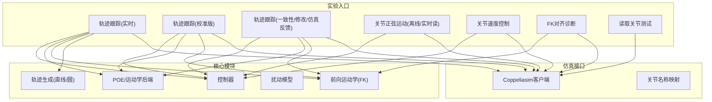
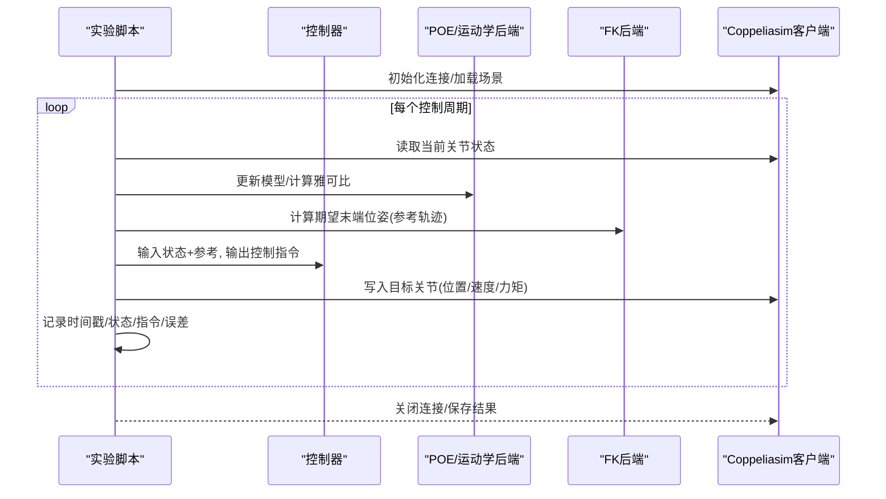
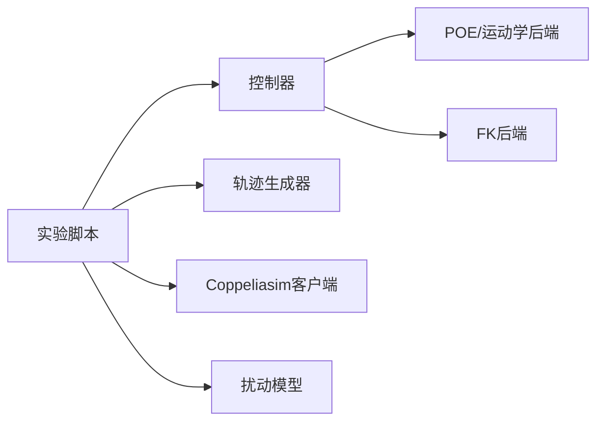

# 实验与测试

<cite>
**本文引用的文件**   
- [experiments/run_line_tracking_realtime_hdq_chain.py](file://experiments/run_line_tracking_realtime_hdq_chain.py)
- [experiments/run_line_tracking_realtime_calibrated.py](file://experiments/run_line_tracking_realtime_calibrated.py)
- [experiments/diagnose_coppelia_fk_alignment.py](file://experiments/diagnose_coppelia_fk_alignment.py)
- [experiments/run_joint_sine_motion.py](file://experiments/run_joint_sine_motion.py)
- [experiments/run_joint_sine_motion_realtime_read.py](file://experiments/run_joint_sine_motion_realtime_read.py)
- [experiments/run_joint_velocity_control.py](file://experiments/run_joint_velocity控制.py)
- [experiments/run_line_tracking_realtime.py](file://experiments/run_line_tracking_realtime.py)
- [experiments/run_line_tracking_realtime_consistent.py](file://experiments/run_line_tracking_realtime_consistent.py)
- [experiments/run_line_tracking_realtime_modified.py](file://experiments/run_line_tracking_realtime_modified.py)
- [experiments/run_line_tracking_realtime_sim_feedback.py](file://experiments/run_line_tracking_realtime_sim_feedback.py)
- [experiments/test_read_joints.py](file://experiments/test_read_joints.py)
- [core/controllers.py](file://core/controllers.py)
- [core/coppelia_poe_model.py](file://core/coppelia_poe_model.py)
- [core/disturbances.py](file://core/disturbances.py)
- [core/fk_backend.py](file://core/fk_backend.py)
- [core/trajectory_line.py](file://core/trajectory_line.py)
- [core/trajectory_circle.py](file://core/trajectory_circle.py)
- [sim/coppelia_client.py](file://sim/coppelia_client.py)
- [sim/joint_names.py](file://sim/joint_names.py)
</cite>

## 目录
1. [简介](#简介)
2. [项目结构](#项目结构)
3. [核心组件](#核心组件)
4. [架构总览](#架构总览)
5. [详细组件分析](#详细组件分析)
6. [依赖关系分析](#依赖关系分析)
7. [性能考虑](#性能考虑)
8. [故障注入与鲁棒性验证](#故障注入与鲁棒性验证)
9. [可视化与数据分析](#可视化与数据分析)
10. [结论](#结论)
11. [附录：标准化测试流程](#附录标准化测试流程)

## 简介
本文件面向研究人员与工程师，提供一套可重复的实验与测试框架说明。围绕轨迹跟踪、关节正弦运动、实时仿真闭环以及FK对齐诊断四类典型场景，给出实验目的、参数设置、数据采集与分析方法，并定义跟踪误差、控制输入幅值、计算效率等评估指标。同时包含故障注入与鲁棒性验证设计，以及结果可视化与数据处理的建议，帮助快速复现实验并对比不同控制器或模型配置的性能。

## 项目结构
仓库采用“实验脚本 + 核心算法 + 仿真接口”的分层组织方式：
- experiments：各类实验入口脚本（轨迹跟踪、正弦运动、速度控制、FK对齐诊断、读取关节等）
- core：控制器、动力学/运动学后端、扰动模型、轨迹生成器
- sim：Coppeliasim客户端与关节命名映射
- results：数据与图表输出目录

图示来源
- [experiments/run_line_tracking_realtime.py](file://experiments/run_line_tracking_realtime.py)
- [experiments/run_line_tracking_realtime_calibrated.py](file://experiments/run_line_tracking_realtime_calibrated.py)
- [experiments/run_line_tracking_realtime_consistent.py](file://experiments/run_line_tracking_realtime_consistent.py)
- [experiments/run_line_tracking_realtime_modified.py](file://experiments/run_line_tracking_realtime_modified.py)
- [experiments/run_line_tracking_realtime_sim_feedback.py](file://experiments/run_line_tracking_realtime_sim_feedback.py)
- [experiments/run_joint_sine_motion.py](file://experiments/run_joint_sine_motion.py)
- [experiments/run_joint_sine_motion_realtime_read.py](file://experiments/run_joint_sine_motion_realtime_read.py)
- [experiments/run_joint_velocity_control.py](file://experiments/run_joint_velocity控制.py)
- [experiments/diagnose_coppelia_fk_alignment.py](file://experiments/diagnose_coppelia_fk_alignment.py)
- [experiments/test_read_joints.py](file://experiments/test_read_joints.py)
- [core/controllers.py](file://core/controllers.py)
- [core/coppelia_poe_model.py](file://core/coppelia_poe_model.py)
- [core/fk_backend.py](file://core/fk_backend.py)
- [core/trajectory_line.py](file://core/trajectory_line.py)
- [core/trajectory_circle.py](file://core/trajectory_circle.py)
- [sim/coppelia_client.py](file://sim/coppelia_client.py)
- [sim/joint_names.py](file://sim/joint_names.py)

章节来源
- [experiments/run_line_tracking_realtime.py](file://experiments/run_line_tracking_realtime.py)
- [experiments/run_joint_sine_motion.py](file://experiments/run_joint_sine_motion.py)
- [experiments/diagnose_coppelia_fk_alignment.py](file://experiments/diagnose_coppelia_fk_alignment.py)
- [core/controllers.py](file://core/controllers.py)
- [core/fk_backend.py](file://core/fk_backend.py)
- [core/trajectory_line.py](file://core/trajectory_line.py)
- [sim/coppelia_client.py](file://sim/coppelia_client.py)

## 核心组件
- 控制器：实现H∞或其他策略的控制律，接收状态估计与参考轨迹，输出控制指令（位置/速度/力矩）。
- 运动学/动力学后端：基于POE的机器人建模与前向运动学求解，为控制器提供状态与雅可比信息。
- 扰动模型：用于在仿真中注入外部干扰，支撑鲁棒性与抗扰能力评估。
- 轨迹生成器：提供直线与圆形参考轨迹，支持时间参数化与速度规划。
- 仿真客户端：封装Coppeliasim通信，负责关节读写、场景同步与时间步管理。

章节来源
- [core/controllers.py](file://core/controllers.py)
- [core/coppelia_poe_model.py](file://core/coppelia_poe_model.py)
- [core/disturbances.py](file://core/disturbances.py)
- [core/trajectory_line.py](file://core/trajectory_line.py)
- [core/trajectory_circle.py](file://core/trajectory_circle.py)
- [sim/coppelia_client.py](file://sim/coppelia_client.py)

## 架构总览
下图展示一次典型的“轨迹跟踪实时闭环”调用序列：实验脚本驱动主循环，按固定周期采样当前关节状态，计算参考位姿，控制器输出指令，通过仿真客户端写入目标关节，并在每步记录数据。

图示来源
- [experiments/run_line_tracking_realtime.py](file://experiments/run_line_tracking_realtime.py)
- [core/controllers.py](file://core/controllers.py)
- [core/coppelia_poe_model.py](file://core/coppelia_poe_model.py)
- [core/fk_backend.py](file://core/fk_backend.py)
- [sim/coppelia_client.py](file://sim/coppelia_client.py)

## 详细组件分析

### 轨迹跟踪实验（直线/圆）
- 目的：验证控制器对时变参考轨迹的跟踪精度与稳定性，比较不同控制器或参数配置下的表现。
- 关键步骤：
  - 选择轨迹类型（直线/圆），设定起点、终点、半径、速度曲线与持续时间。
  - 在每个控制周期计算参考末端位姿，结合当前状态估计，由控制器输出指令。
  - 将指令下发至仿真环境，采集实际响应并计算误差。
- 参数设置要点：
  - 控制周期、积分/微分增益、滤波器截止频率、轨迹平滑度。
  - 初始位姿与零偏校准（若使用校准版本）。
- 数据采集：
  - 时间戳、参考位姿、实际位姿、关节角度/速度、控制输入、误差序列。
- 结果分析：
  - 跟踪误差时序图、误差统计量（均值、方差、峰值）、频谱分析（高频噪声识别）。
  - 控制输入幅值与变化率，评估执行器饱和风险。

章节来源
- [experiments/run_line_tracking_realtime.py](file://experiments/run_line_tracking_realtime.py)
- [experiments/run_line_tracking_realtime_consistent.py](file://experiments/run_line_tracking_realtime_consistent.py)
- [experiments/run_line_tracking_realtime_modified.py](file://experiments/run_line_tracking_realtime_modified.py)
- [experiments/run_line_tracking_realtime_sim_feedback.py](file://experiments/run_line_tracking_realtime_sim_feedback.py)
- [core/trajectory_line.py](file://core/trajectory_line.py)
- [core/trajectory_circle.py](file://core/trajectory_circle.py)
- [core/controllers.py](file://core/controllers.py)
- [core/fk_backend.py](file://core/fk_backend.py)
- [sim/coppelia_client.py](file://sim/coppelia_client.py)

### 关节正弦运动测试
- 目的：在频域层面评估系统动态特性与相位滞后，便于辨识带宽与阻尼。
- 关键步骤：
  - 为各关节指定不同频率的正弦参考，逐步扫描频率范围。
  - 记录关节角度与速度响应，计算幅频与相频特性。
- 参数设置要点：
  - 频率扫描步长、稳态等待时间、振幅限制（避免超限）。
- 结果分析：
  - Bode图、谐振峰识别、相位裕度估算。
  - 对比不同控制器参数下的带宽与超调。

章节来源
- [experiments/run_joint_sine_motion.py](file://experiments/run_joint_sine_motion.py)
- [experiments/run_joint_sine_motion_realtime_read.py](file://experiments/run_joint_sine_motion_realtime_read.py)
- [sim/coppelia_client.py](file://sim/coppelia_client.py)

### 实时仿真验证（含仿真反馈）
- 目的：在真实时间步下验证闭环稳定性与延迟影响，确保部署可行性。
- 关键步骤：
  - 固定控制周期，严格同步仿真时钟；必要时引入仿真反馈路径以补偿延迟。
  - 监控CPU占用与通信延迟，保证实时性。
- 参数设置要点：
  - 控制周期、仿真步长、通信重试与超时策略。
- 结果分析：
  - 周期抖动分布、丢包率、平均/最大延迟。
  - 在相同轨迹下对比非实时与实时的误差差异。

章节来源
- [experiments/run_line_tracking_realtime.py](file://experiments/run_line_tracking_realtime.py)
- [experiments/run_line_tracking_realtime_sim_feedback.py](file://experiments/run_line_tracking_realtime_sim_feedback.py)
- [sim/coppelia_client.py](file://sim/coppelia_client.py)

### FK对齐诊断
- 目的：验证前向运动学模型与仿真环境的几何一致性，定位坐标系/连杆参数偏差。
- 关键步骤：
  - 给定一组关节角，分别用模型FK与仿真端FK计算末端位姿。
  - 比较两者差异，绘制误差分布与方向分量误差。
- 参数设置要点：
  - 关节角采样范围、网格密度、随机扰动幅度。
- 结果分析：
  - 位姿误差直方图、最大误差点定位、异常关节排查。
  - 根据误差模式调整DH/POE参数或标定零点。

章节来源
- [experiments/diagnose_coppelia_fk_alignment.py](file://experiments/diagnose_coppelia_fk_alignment.py)
- [core/fk_backend.py](file://core/fk_backend.py)
- [sim/coppelia_client.py](file://sim/coppelia_client.py)

### 关节速度控制与读取测试
- 目的：验证底层速度环与传感器读取链路，确保基础执行与感知可用。
- 关键步骤：
  - 发送速度指令，读取实际速度与位置，检查一致性与延迟。
- 参数设置要点：
  - 速度限幅、加速度限幅、采样频率。
- 结果分析：
  - 速度跟踪误差、阶跃响应上升时间与超调。

章节来源
- [experiments/run_joint_velocity_control.py](file://experiments/run_joint_velocity控制.py)
- [experiments/test_read_joints.py](file://experiments/test_read_joints.py)
- [sim/coppelia_client.py](file://sim/coppelia_client.py)

## 依赖关系分析
- 实验脚本依赖控制器与轨迹生成器，并通过仿真客户端与Coppeliasim交互。
- 控制器依赖POE/运动学后端获取状态与雅可比；部分实验直接调用FK后端进行对齐诊断。
- 扰动模型可在轨迹跟踪实验中按需启用，以评估鲁棒性。

图示来源
- [experiments/run_line_tracking_realtime.py](file://experiments/run_line_tracking_realtime.py)
- [experiments/diagnose_coppelia_fk_alignment.py](file://experiments/diagnose_coppelia_fk_alignment.py)
- [core/controllers.py](file://core/controllers.py)
- [core/coppelia_poe_model.py](file://core/coppelia_poe_model.py)
- [core/fk_backend.py](file://core/fk_backend.py)
- [core/trajectory_line.py](file://core/trajectory_line.py)
- [core/trajectory_circle.py](file://core/trajectory_circle.py)
- [core/disturbances.py](file://core/disturbances.py)
- [sim/coppelia_client.py](file://sim/coppelia_client.py)

章节来源
- [core/controllers.py](file://core/controllers.py)
- [core/coppelia_poe_model.py](file://core/coppelia_poe_model.py)
- [core/fk_backend.py](file://core/fk_backend.py)
- [core/trajectory_line.py](file://core/trajectory_line.py)
- [core/trajectory_circle.py](file://core/trajectory_circle.py)
- [core/disturbances.py](file://core/disturbances.py)
- [sim/coppelia_client.py](file://sim/coppelia_client.py)

## 性能考虑
- 控制周期与实时性：确保主循环周期稳定，避免抖动导致不稳定或误差增大。
- 数值稳定性：轨迹平滑与滤波可降低高频噪声，减少控制输入剧烈波动。
- 计算开销：优先复用已计算的雅可比与中间变量，减少重复求逆与矩阵运算。
- 通信延迟：合理设置超时与重试，必要时引入预测或补偿策略。

[本节为通用指导，不直接分析具体文件]

## 故障注入与鲁棒性验证
- 故障类型：
  - 传感器噪声与偏移：在读取环节叠加高斯噪声或恒定偏置。
  - 执行器饱和与延迟：限制指令幅值与速率，或在仿真中增加通信延迟。
  - 模型失配：在POE/运动学后端引入参数扰动，模拟标定误差。
  - 外部扰动：通过扰动模型施加周期性或随机外力/力矩。
- 实验设计：
  - 基线运行（无故障）→ 单故障注入 → 多故障组合，逐步提升严重程度。
  - 保持其他条件不变，仅改变故障强度，便于归因分析。
- 结果分析：
  - 对比误差增长趋势与控制输入变化，识别最敏感通道。
  - 统计失败阈值与恢复时间，评估鲁棒边界。

章节来源
- [core/disturbances.py](file://core/disturbances.py)
- [experiments/run_line_tracking_realtime.py](file://experiments/run_line_tracking_realtime.py)
- [experiments/run_line_tracking_realtime_sim_feedback.py](file://experiments/run_line_tracking_realtime_sim_feedback.py)

## 可视化与数据分析
- 推荐图表：
  - 时序图：参考与实际位姿、误差、控制输入随时间变化。
  - 散点/等高线图：末端轨迹平面投影与误差分布。
  - 频域图：Bode图、功率谱密度，识别主导频率与噪声源。
- 数据处理技巧：
  - 去趋势与滤波：低通滤波抑制高频噪声，保留主要动态。
  - 分段统计：启动阶段、稳态阶段分别统计误差指标。
  - 归一化：对不同量纲信号进行归一化以便对比。
- 自动化报告：
  - 将关键指标（RMSE、峰值误差、控制输入RMS、计算耗时）汇总到表格，便于跨实验对比。

[本节为通用指导，不直接分析具体文件]

## 结论
本框架以实验脚本为入口，结合控制器、运动学/动力学后端与仿真客户端，形成从轨迹跟踪到FK对齐诊断的完整测试体系。通过标准化的参数设置、数据采集与分析流程，研究人员可高效复现实验、量化性能并进行鲁棒性评估。建议在每次实验后归档原始数据与图表，建立版本化的结果库，以支持长期迭代与对比。

[本节为总结性内容，不直接分析具体文件]

## 附录：标准化测试流程
- 准备阶段：
  - 确认仿真场景加载成功，关节名称映射正确。
  - 校验控制器与模型参数，完成FK对齐诊断。
- 运行阶段：
  - 选择实验类型（轨迹跟踪/正弦运动/速度控制）。
  - 设置控制周期、轨迹参数、扰动强度等。
  - 启动实验，监控日志与实时曲线。
- 收尾阶段：
  - 保存原始数据与图表，记录关键指标。
  - 清理临时文件，释放仿真资源。
- 复现要求：
  - 固定随机种子与时间戳基准。
  - 记录软硬件版本与环境依赖，确保可重复。

章节来源
- [experiments/run_line_tracking_realtime.py](file://experiments/run_line_tracking_realtime.py)
- [experiments/run_joint_sine_motion.py](file://experiments/run_joint_sine_motion.py)
- [experiments/diagnose_coppelia_fk_alignment.py](file://experiments/diagnose_coppelia_fk_alignment.py)
- [sim/joint_names.py](file://sim/joint_names.py)
- [sim/coppelia_client.py](file://sim/coppelia_client.py)