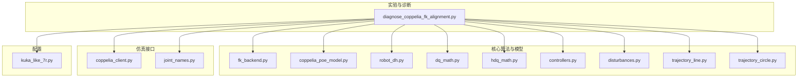
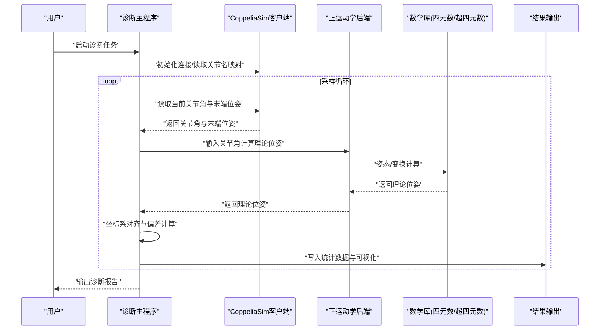
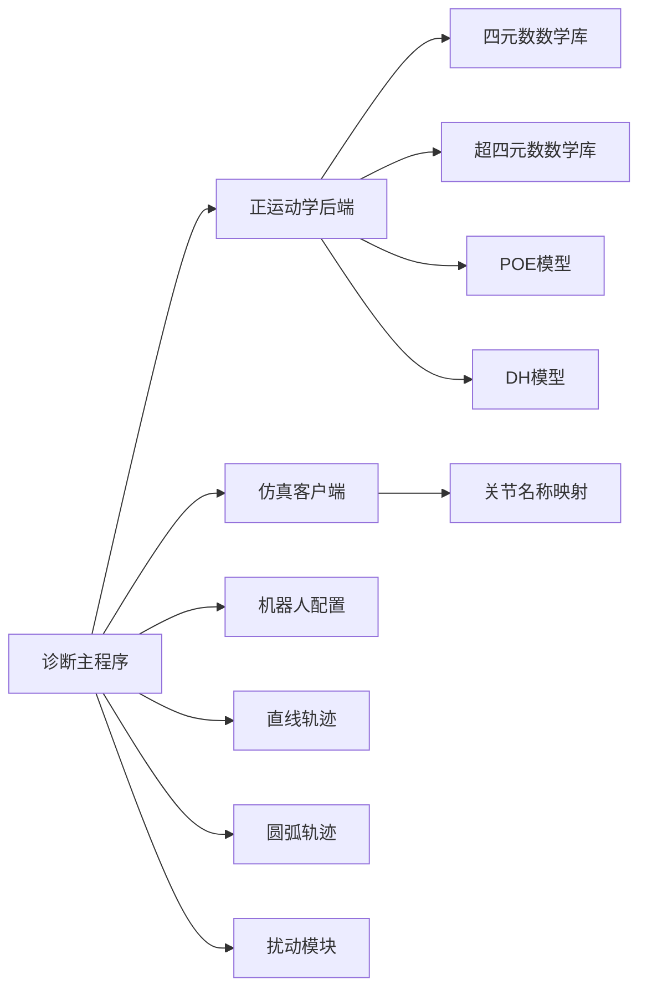
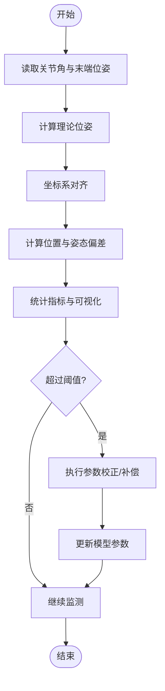

# 诊断工具

<cite>
**本文引用的文件**   
- [diagnose_coppelia_fk_alignment.py](file://experiments/diagnose_coppelia_fk_alignment.py)
- [fk_backend.py](file://core/fk_backend.py)
- [coppelia_poe_model.py](file://core/coppelia_poe_model.py)
- [robot_dh.py](file://core/robot_dh.py)
- [dq_math.py](file://core/dq_math.py)
- [hdq_math.py](file://core/hdq_math.py)
- [controllers.py](file://core/controllers.py)
- [disturbances.py](file://core/disturbances.py)
- [trajectory_circle.py](file://core/trajectory_circle.py)
- [trajectory_line.py](file://core/trajectory_line.py)
- [coppelia_client.py](file://sim/coppelia_client.py)
- [joint_names.py](file://sim/joint_names.py)
- [kuka_like_7r.py](file://configs/kuka_like_7r.py)
</cite>

## 目录
1. [简介](#简介)
2. [项目结构](#项目结构)
3. [核心组件](#核心组件)
4. [架构总览](#架构总览)
5. [详细组件分析](#详细组件分析)
6. [依赖关系分析](#依赖关系分析)
7. [性能考虑](#性能考虑)
8. [故障排除指南](#故障排除指南)
9. [结论](#结论)
10. [附录](#附录)

## 简介
本文件面向CoppeliaSim正运动学（FK）对齐的诊断与校准，提供一套完整的诊断方法、偏差检测与校正流程、参数配置说明、数据分析与结果解读，以及常见问题解决方案与调试技巧。文档重点围绕以下目标：
- 识别并量化FK对齐问题（坐标系不一致、DH参数误差、几何一致性不满足等）
- 建立从仿真端到模型端的闭环诊断流程，支持偏差可视化与统计评估
- 给出可操作的参数配置与阈值策略，便于系统集成与持续验证
- 提供坐标系转换、DH参数验证与几何一致性检查的方法论与实践建议

## 项目结构
本项目采用分层组织方式：
- experiments：运行脚本与诊断入口，包含CoppeliaSim FK对齐诊断主程序
- core：核心算法与模型实现，包括正运动学后端、POE模型、四元数与超四元数数学库、机器人DH参数、轨迹生成与控制器等
- sim：CoppeliaSim客户端封装与关节命名映射
- configs：机器人模型配置文件（如KUKA-like 7R）
- results：数据与绘图输出目录

图表来源
- [diagnose_coppelia_fk_alignment.py](file://experiments/diagnose_coppelia_fk_alignment.py)
- [fk_backend.py](file://core/fk_backend.py)
- [coppelia_poe_model.py](file://core/coppelia_poe_model.py)
- [robot_dh.py](file://core/robot_dh.py)
- [dq_math.py](file://core/dq_math.py)
- [hdq_math.py](file://core/hdq_math.py)
- [controllers.py](file://core/controllers.py)
- [disturbances.py](file://core/disturbances.py)
- [trajectory_circle.py](file://core/trajectory_circle.py)
- [trajectory_line.py](file://core/trajectory_line.py)
- [coppelia_client.py](file://sim/coppelia_client.py)
- [joint_names.py](file://sim/joint_names.py)
- [kuka_like_7r.py](file://configs/kuka_like_7r.py)

章节来源
- [diagnose_coppelia_fk_alignment.py](file://experiments/diagnose_coppelia_fk_alignment.py)
- [fk_backend.py](file://core/fk_backend.py)
- [coppelia_poe_model.py](file://core/coppelia_poe_model.py)
- [robot_dh.py](file://core/robot_dh.py)
- [dq_math.py](file://core/dq_math.py)
- [hdq_math.py](file://core/hdq_math.py)
- [controllers.py](file://core/controllers.py)
- [disturbances.py](file://core/disturbances.py)
- [trajectory_circle.py](file://core/trajectory_circle.py)
- [trajectory_line.py](file://core/trajectory_line.py)
- [coppelia_client.py](file://sim/coppelia_client.py)
- [joint_names.py](file://sim/joint_names.py)
- [kuka_like_7r.py](file://configs/kuka_like_7r.py)

## 核心组件
- CoppeliaSim FK对齐诊断主程序：负责连接仿真环境、采集关节状态、计算理论位姿、对比仿真测量位姿、统计偏差并输出报告与可视化结果。
- 正运动学后端：提供基于不同建模方法的FK计算能力（如POE、DH），用于生成理论位姿基准。
- 数学库：四元数与超四元数运算，支撑姿态表示与变换一致性校验。
- 仿真客户端：封装与CoppeliaSim的通信、读取末端位姿与关节角度。
- 配置与模型：定义机器人构型、DH参数或POE参数、关节名称映射等。

章节来源
- [diagnose_coppelia_fk_alignment.py](file://experiments/diagnose_coppelia_fk_alignment.py)
- [fk_backend.py](file://core/fk_backend.py)
- [coppelia_poe_model.py](file://core/coppelia_poe_model.py)
- [dq_math.py](file://core/dq_math.py)
- [hdq_math.py](file://core/hdq_math.py)
- [coppelia_client.py](file://sim/coppelia_client.py)
- [joint_names.py](file://sim/joint_names.py)
- [kuka_like_7r.py](file://configs/kuka_like_7r.py)

## 架构总览
诊断系统整体由“数据采集—理论计算—偏差评估—结果输出”构成闭环。仿真端通过客户端获取末端位姿与关节角；核心模块根据模型计算理论位姿；诊断模块进行坐标对齐、偏差统计与可视化；最终输出报告与图表供分析与决策。

图表来源
- [diagnose_coppelia_fk_alignment.py](file://experiments/diagnose_coppelia_fk_alignment.py)
- [fk_backend.py](file://core/fk_backend.py)
- [coppelia_poe_model.py](file://core/coppelia_poe_model.py)
- [dq_math.py](file://core/dq_math.py)
- [hdq_math.py](file://core/hdq_math.py)
- [coppelia_client.py](file://sim/coppelia_client.py)
- [joint_names.py](file://sim/joint_names.py)

## 详细组件分析

### 诊断主程序（CoppeliaSim FK对齐诊断）
职责与流程
- 初始化仿真连接与模型参数，加载关节名称映射与机器人配置
- 周期性采集关节角与末端位姿，调用正运动学后端计算理论位姿
- 执行坐标系对齐（可选最小二乘求解或已知标定矩阵），计算位置与姿态偏差
- 统计指标（均值、方差、最大偏差、分布直方图）、生成可视化图表与文本报告
- 支持异常处理与退出机制，保证长时间运行的稳定性

关键要点
- 对齐策略：支持全局刚体变换估计与逐段局部对齐，避免累积误差
- 偏差度量：位置误差使用欧氏距离，姿态误差使用四元数夹角或旋转轴角
- 数据质量：剔除异常点、平滑滤波、窗口统计，提高鲁棒性
- 输出格式：CSV/JSON结构化数据与PNG/PDF可视化图表

章节来源
- [diagnose_coppelia_fk_alignment.py](file://experiments/diagnose_coppelia_fk_alignment.py)

### 正运动学后端（多建模方法）
职责与能力
- 提供统一接口以多种建模方法计算末端位姿（如POE、DH）
- 支持参数化输入（关节角、连杆参数、初始位姿），输出齐次变换矩阵或四元数
- 与数学库解耦，便于替换与扩展

设计模式
- 工厂/策略模式：根据配置选择具体FK实现
- 适配器模式：将不同模型的参数格式适配到统一接口

章节来源
- [fk_backend.py](file://core/fk_backend.py)
- [coppelia_poe_model.py](file://core/coppelia_poe_model.py)
- [robot_dh.py](file://core/robot_dh.py)

### 数学库（四元数与超四元数）
职责与能力
- 四元数运算：乘法、共轭、归一化、夹角计算、旋转矩阵互转
- 超四元数运算：扩展代数结构，用于高阶误差传播与灵敏度分析
- 数值稳定：提供归一化与条件判断，避免奇异与溢出

章节来源
- [dq_math.py](file://core/dq_math.py)
- [hdq_math.py](file://core/hdq_math.py)

### 仿真客户端与关节映射
职责与能力
- 封装与CoppeliaSim的通信协议，读取关节角与末端位姿
- 维护关节名称映射，确保模型与仿真一致
- 错误重试与超时控制，提升连接稳定性

章节来源
- [coppelia_client.py](file://sim/coppelia_client.py)
- [joint_names.py](file://sim/joint_names.py)

### 配置与模型（KUKA-like 7R示例）
职责与能力
- 定义机器人构型、DH参数或POE参数、初始位姿与参考坐标系
- 提供默认参数与可调阈值，便于快速集成与复现实验

章节来源
- [kuka_like_7r.py](file://configs/kuka_like_7r.py)

### 轨迹与扰动（辅助功能）
职责与能力
- 直线与圆弧轨迹生成，为动态对齐与在线诊断提供激励信号
- 扰动注入与噪声模拟，用于评估诊断鲁棒性与阈值敏感性

章节来源
- [trajectory_line.py](file://core/trajectory_line.py)
- [trajectory_circle.py](file://core/trajectory_circle.py)
- [disturbances.py](file://core/disturbances.py)

### 控制器（可选集成）
职责与能力
- 在闭环场景下，结合诊断结果对控制器进行微调或补偿
- 支持离线标定后在线修正，减少系统级偏差

章节来源
- [controllers.py](file://core/controllers.py)

## 依赖关系分析
组件间依赖关系如下：
- 诊断主程序依赖正运动学后端、数学库、仿真客户端、配置与轨迹/扰动模块
- 正运动学后端依赖数学库与模型参数
- 仿真客户端依赖关节名称映射与机器人配置

图表来源
- [diagnose_coppelia_fk_alignment.py](file://experiments/diagnose_coppelia_fk_alignment.py)
- [fk_backend.py](file://core/fk_backend.py)
- [coppelia_poe_model.py](file://core/coppelia_poe_model.py)
- [robot_dh.py](file://core/robot_dh.py)
- [dq_math.py](file://core/dq_math.py)
- [hdq_math.py](file://core/hdq_math.py)
- [coppelia_client.py](file://sim/coppelia_client.py)
- [joint_names.py](file://sim/joint_names.py)
- [trajectory_line.py](file://core/trajectory_line.py)
- [trajectory_circle.py](file://core/trajectory_circle.py)
- [disturbances.py](file://core/disturbances.py)

章节来源
- [diagnose_coppelia_fk_alignment.py](file://experiments/diagnose_coppelia_fk_alignment.py)
- [fk_backend.py](file://core/fk_backend.py)
- [coppelia_poe_model.py](file://core/coppelia_poe_model.py)
- [robot_dh.py](file://core/robot_dh.py)
- [dq_math.py](file://core/dq_math.py)
- [hdq_math.py](file://core/hdq_math.py)
- [coppelia_client.py](file://sim/coppelia_client.py)
- [joint_names.py](file://sim/joint_names.py)
- [trajectory_line.py](file://core/trajectory_line.py)
- [trajectory_circle.py](file://core/trajectory_circle.py)
- [disturbances.py](file://core/disturbances.py)

## 性能考虑
- 采样频率与窗口大小：平衡实时性与统计稳定性，建议使用滑动窗口与指数加权平均
- 数值精度与归一化：四元数与超四元数运算需严格归一化，避免漂移
- I/O开销：批量写入与异步日志可降低磁盘压力
- 并行计算：若存在多末端或多机器人，可采用线程池或进程池并行处理
- 内存管理：及时释放中间变量与大数组，避免长时运行内存泄漏

[本节为通用指导，无需特定文件引用]

## 故障排除指南
常见问题与定位步骤
- 连接失败或超时
  - 检查CoppeliaSim服务是否启动、端口与权限
  - 确认关节名称映射与机器人配置一致
  - 增加重试次数与退避策略
- 关节角异常或跳变
  - 启用滤波与异常点剔除
  - 检查传感器噪声与编码器分辨率
- 姿态偏差过大
  - 验证坐标系定义与初始位姿
  - 检查四元数归一化与旋转轴角计算
- 轨迹激励不足导致不可观测
  - 使用直线与圆弧组合激励，覆盖全工作空间
  - 调整轨迹幅值与频率，避免共振与饱和
- 统计指标不稳定
  - 增大样本量与窗口长度
  - 使用稳健统计量（中位数、MAD）替代均值与方差

章节来源
- [diagnose_coppelia_fk_alignment.py](file://experiments/diagnose_coppelia_fk_alignment.py)
- [coppelia_client.py](file://sim/coppelia_client.py)
- [dq_math.py](file://core/dq_math.py)
- [hdq_math.py](file://core/hdq_math.py)
- [trajectory_line.py](file://core/trajectory_line.py)
- [trajectory_circle.py](file://core/trajectory_circle.py)
- [disturbances.py](file://core/disturbances.py)

## 结论
本诊断工具围绕CoppeliaSim正运动学对齐问题，构建了从数据采集、理论计算、偏差评估到结果输出的完整闭环。通过灵活的建模后端与稳定的数学库，结合合理的参数配置与阈值策略，可有效识别与校正FK对齐偏差，提升系统集成与问题排查的效率与可靠性。建议在工程实践中结合轨迹激励与扰动测试，持续优化诊断阈值与模型参数，确保长期稳定运行。

[本节为总结性内容，无需特定文件引用]

## 附录

### 参数配置清单与建议
- 采样频率：根据系统带宽与延迟设定，典型范围10–100 Hz
- 窗口长度：建议至少覆盖多个周期，确保统计显著性
- 对齐策略：优先全局刚体变换估计，必要时分段局部对齐
- 偏差阈值：位置误差与姿态误差分别设置上限，结合历史基线动态调整
- 输出路径：集中管理结果目录，按日期与任务ID归档

章节来源
- [diagnose_coppelia_fk_alignment.py](file://experiments/diagnose_coppelia_fk_alignment.py)
- [kuka_like_7r.py](file://configs/kuka_like_7r.py)

### 坐标系转换与DH参数验证方法
- 坐标系转换
  - 明确各连杆坐标系定义与参考系
  - 使用齐次变换矩阵串联或POE公式计算末端位姿
  - 通过四元数夹角与旋转轴角验证姿态一致性
- DH参数验证
  - 检查连杆长度、扭转角、偏置与关节角范围
  - 使用标准DH或改进DH保持一致性
  - 通过轨迹激励与最小二乘拟合优化参数
- 几何一致性检查
  - 闭合环约束与冗余自由度检查
  - 奇异点与可达域边界验证
  - 重复性与回程误差评估

章节来源
- [robot_dh.py](file://core/robot_dh.py)
- [coppelia_poe_model.py](file://core/coppelia_poe_model.py)
- [dq_math.py](file://core/dq_math.py)
- [hdq_math.py](file://core/hdq_math.py)

### 偏差检测与校正流程图

图表来源
- [diagnose_coppelia_fk_alignment.py](file://experiments/diagnose_coppelia_fk_alignment.py)
- [fk_backend.py](file://core/fk_backend.py)
- [dq_math.py](file://core/dq_math.py)
- [hdq_math.py](file://core/hdq_math.py)