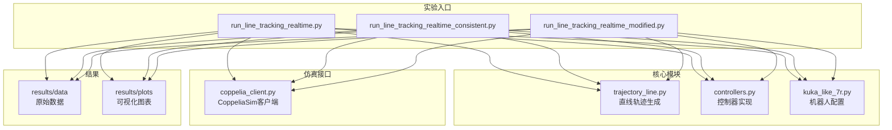
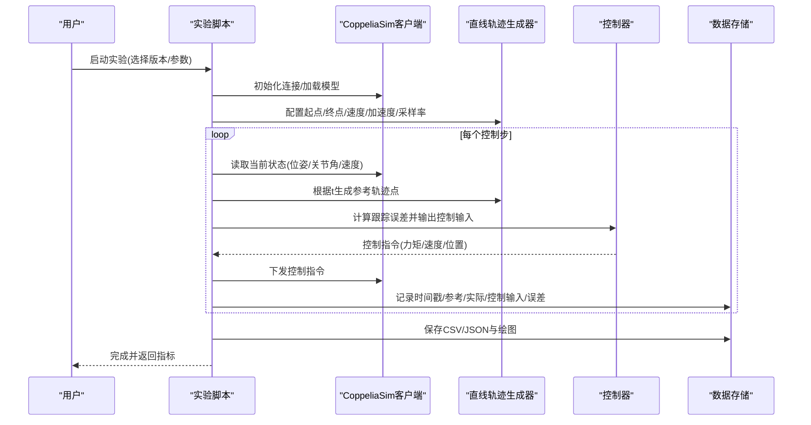
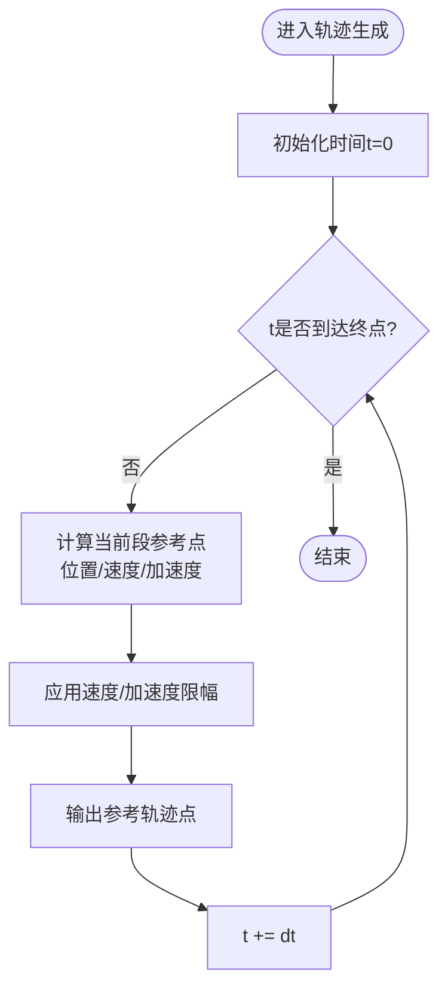
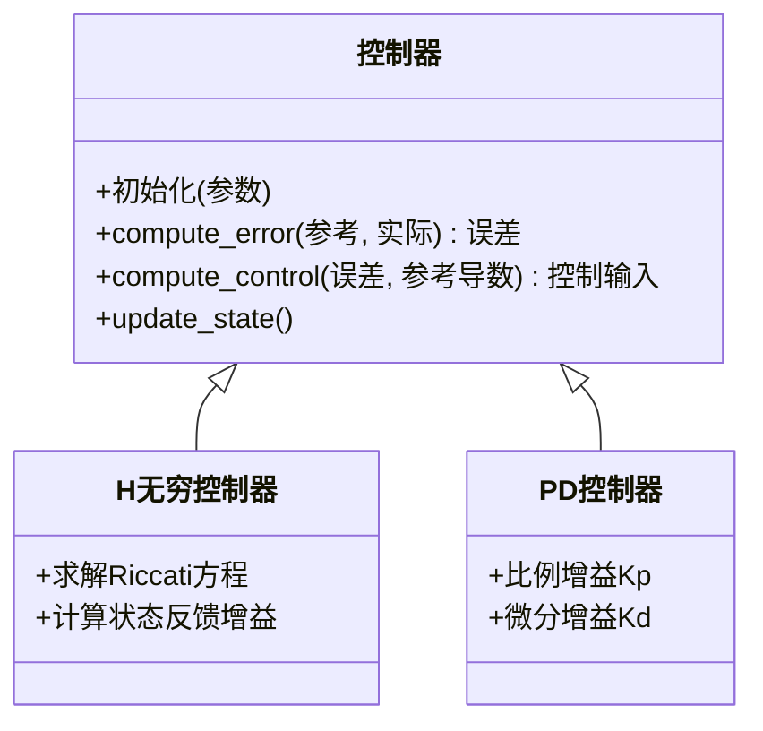
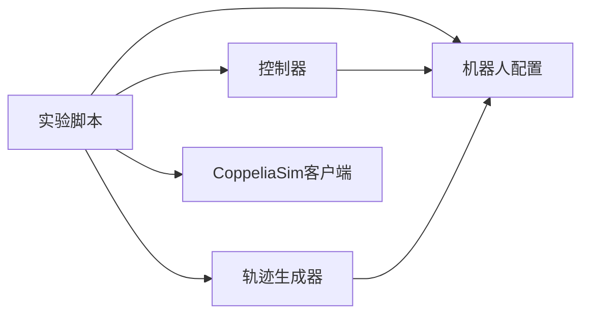

# 轨迹跟踪实验

<cite>
**本文引用的文件**   
- [experiments/run_line_tracking_realtime.py](file://experiments/run_line_tracking_realtime.py)
- [experiments/run_line_tracking_realtime_consistent.py](file://experiments/run_line_tracking_realtime_consistent.py)
- [experiments/run_line_tracking_realtime_modified.py](file://experiments/run_line_tracking_realtime_modified.py)
- [core/trajectory_line.py](file://core/trajectory_line.py)
- [core/controllers.py](file://core/controllers.py)
- [configs/kuka_like_7r.py](file://configs/kuka_like_7r.py)
- [sim/coppelia_client.py](file://sim/coppelia_client.py)
</cite>

## 目录
1. [简介](#简介)
2. [项目结构](#项目结构)
3. [核心组件](#核心组件)
4. [架构总览](#架构总览)
5. [详细组件分析](#详细组件分析)
6. [依赖关系分析](#依赖关系分析)
7. [性能考虑](#性能考虑)
8. [故障排查指南](#故障排查指南)
9. [结论](#结论)
10. [附录](#附录)

## 简介
本文件面向研究人员与工程师，提供一套标准化的直线轨迹跟踪实验流程与评估方法。文档覆盖：
- 直线参考轨迹生成算法与参数配置
- 控制器设计与参数调优方法
- 三种实验版本（realtime、consistent、modified）的差异与适用场景
- 完整的执行步骤、数据记录格式与结果分析方法
- 跟踪误差计算、控制输入分析与稳定性验证方法
- 为不同硬件/仿真环境建立可复现的性能基准

## 项目结构
本项目围绕“参考轨迹生成—控制器—执行器/仿真—数据采集与分析”的闭环展开。关键目录与职责如下：
- experiments：各版本的直线轨迹跟踪实验入口脚本
- core：轨迹生成、数学工具、控制器等核心实现
- configs：机器人模型与通用配置
- sim：CoppeliaSim客户端封装与关节名映射
- results：实验数据与绘图输出

图示来源
- [experiments/run_line_tracking_realtime.py](file://experiments/run_line_tracking_realtime.py)
- [experiments/run_line_tracking_realtime_consistent.py](file://experiments/run_line_tracking_realtime_consistent.py)
- [experiments/run_line_tracking_realtime_modified.py](file://experiments/run_line_tracking_realtime_modified.py)
- [core/trajectory_line.py](file://core/trajectory_line.py)
- [core/controllers.py](file://core/controllers.py)
- [configs/kuka_like_7r.py](file://configs/kuka_like_7r.py)
- [sim/coppelia_client.py](file://sim/coppelia_client.py)

章节来源
- [experiments/run_line_tracking_realtime.py](file://experiments/run_line_tracking_realtime.py)
- [experiments/run_line_tracking_realtime_consistent.py](file://experiments/run_line_tracking_realtime_consistent.py)
- [experiments/run_line_tracking_realtime_modified.py](file://experiments/run_line_tracking_realtime_modified.py)
- [core/trajectory_line.py](file://core/trajectory_line.py)
- [core/controllers.py](file://core/controllers.py)
- [configs/kuka_like_7r.py](file://configs/kuka_like_7r.py)
- [sim/coppelia_client.py](file://sim/coppelia_client.py)

## 核心组件
- 直线轨迹生成器：负责按时间序列生成目标位姿或关节角参考轨迹，支持速度/加速度约束与平滑过渡。
- 控制器：将跟踪误差转换为控制输入（如关节力矩/速度），包含H∞或其他鲁棒策略的实现。
- 机器人配置：定义DH参数、质量惯量、传感器/执行器限制等。
- CoppeliaSim客户端：封装与仿真的通信、状态读取与控制写入。
- 实验脚本：编排仿真初始化、轨迹生成、控制循环、数据记录与结果保存。

章节来源
- [core/trajectory_line.py](file://core/trajectory_line.py)
- [core/controllers.py](file://core/controllers.py)
- [configs/kuka_like_7r.py](file://configs/kuka_like_7r.py)
- [sim/coppelia_client.py](file://sim/coppelia_client.py)

## 架构总览
下图展示一次完整直线轨迹跟踪实验的控制流与数据流。

图示来源
- [experiments/run_line_tracking_realtime.py](file://experiments/run_line_tracking_realtime.py)
- [experiments/run_line_tracking_realtime_consistent.py](file://experiments/run_line_tracking_realtime_consistent.py)
- [experiments/run_line_tracking_realtime_modified.py](file://experiments/run_line_tracking_realtime_modified.py)
- [core/trajectory_line.py](file://core/trajectory_line.py)
- [core/controllers.py](file://core/controllers.py)
- [sim/coppelia_client.py](file://sim/coppelia_client.py)

## 详细组件分析

### 直线轨迹生成器
- 功能要点
  - 输入：起点/终点（位姿或关节空间）、最大速度/加速度、采样周期、起始时间
  - 输出：随时间变化的参考轨迹点（含位置/速度/可选加速度）
  - 特性：分段线性+S曲线平滑、边界约束、数值稳定
- 复杂度
  - 每步O(1)，适合实时控制循环
- 优化建议
  - 预计算关键点减少分支判断
  - 使用向量化批量生成离线参考轨迹用于一致性对比

图示来源
- [core/trajectory_line.py](file://core/trajectory_line.py)

章节来源
- [core/trajectory_line.py](file://core/trajectory_line.py)

### 控制器
- 设计思路
  - 以跟踪误差e(t)=x_ref(t)-x_act(t)为输入，输出控制输入u(t)
  - 可能包含前馈补偿（参考加速度/速度）与反馈增益（H∞/PID/PD等）
- 参数调优
  - 先整定前馈项使稳态误差接近零
  - 再调整反馈增益抑制扰动与模型不确定性
  - 通过频域裕度与时域超调/调节时间折中
- 稳定性验证
  - 小信号线性化后检查闭环极点/频域裕度
  - 时域上观察阶跃/斜坡响应与抗扰能力

图示来源
- [core/controllers.py](file://core/controllers.py)

章节来源
- [core/controllers.py](file://core/controllers.py)

### 机器人配置
- 内容
  - DH参数、连杆质量/惯量、关节限位、传感器噪声模型
  - 坐标系约定与末端执行器偏移
- 作用
  - 为轨迹生成、动力学模型、控制器设计提供统一基础

章节来源
- [configs/kuka_like_7r.py](file://configs/kuka_like_7r.py)

### CoppeliaSim客户端
- 功能
  - 连接/断开仿真、读取关节角/末端位姿、写入控制指令
  - 同步时钟与步长管理
- 注意事项
  - 网络延迟与丢包处理
  - 线程安全与锁机制避免竞态

章节来源
- [sim/coppelia_client.py](file://sim/coppelia_client.py)

### 实验脚本（三个版本）
- 共同点
  - 均调用轨迹生成器与控制器，驱动仿真并记录数据
  - 输出统一的CSV/JSON与可视化图表
- 差异点
  - realtime：强调低延迟与实时性，采用最小开销的数据路径与紧耦合控制循环
  - consistent：强调可重复性与跨平台一致，固定随机种子、严格时间步对齐、禁用异步I/O
  - modified：在realtime基础上引入改进策略（如观测器/自适应/抗饱和），便于对比研究
- 适用场景
  - realtime：硬件在环/真实设备测试
  - consistent：论文复现实验与基准对比
  - modified：算法迭代与消融实验

章节来源
- [experiments/run_line_tracking_realtime.py](file://experiments/run_line_tracking_realtime.py)
- [experiments/run_line_tracking_realtime_consistent.py](file://experiments/run_line_tracking_realtime_consistent.py)
- [experiments/run_line_tracking_realtime_modified.py](file://experiments/run_line_tracking_realtime_modified.py)

## 依赖关系分析
- 模块耦合
  - 实验脚本依赖轨迹生成器、控制器、机器人配置与仿真客户端
  - 控制器依赖误差计算与系统模型（来自配置）
- 外部依赖
  - CoppeliaSim服务端口与协议
  - 数值库（矩阵运算、优化求解器等）

图示来源
- [experiments/run_line_tracking_realtime.py](file://experiments/run_line_tracking_realtime.py)
- [experiments/run_line_tracking_realtime_consistent.py](file://experiments/run_line_tracking_realtime_consistent.py)
- [experiments/run_line_tracking_realtime_modified.py](file://experiments/run_line_tracking_realtime_modified.py)
- [core/trajectory_line.py](file://core/trajectory_line.py)
- [core/controllers.py](file://core/controllers.py)
- [configs/kuka_like_7r.py](file://configs/kuka_like_7r.py)
- [sim/coppelia_client.py](file://sim/coppelia_client.py)

章节来源
- [experiments/run_line_tracking_realtime.py](file://experiments/run_line_tracking_realtime.py)
- [experiments/run_line_tracking_realtime_consistent.py](file://experiments/run_line_tracking_realtime_consistent.py)
- [experiments/run_line_tracking_realtime_modified.py](file://experiments/run_line_tracking_realtime_modified.py)
- [core/trajectory_line.py](file://core/trajectory_line.py)
- [core/controllers.py](file://core/controllers.py)
- [configs/kuka_like_7r.py](file://configs/kuka_like_7r.py)
- [sim/coppelia_client.py](file://sim/coppelia_client.py)

## 性能考虑
- 实时性
  - 控制循环周期dt需小于系统主导动态时间常数
  - 减少Python层循环开销，必要时使用C扩展或NumPy向量化
- 数值稳定性
  - 轨迹生成中的速度/加速度限幅避免积分发散
  - 控制器增益范围合理，防止控制输入饱和
- I/O与存储
  - 批量写入而非逐行写入，降低磁盘压力
  - 对高频数据做降采样或压缩存储

[本节为通用指导，不直接分析具体文件]

## 故障排查指南
- 常见问题
  - 无法连接CoppeliaSim：检查端口、防火墙与服务进程
  - 轨迹异常抖动：检查采样频率与控制器带宽匹配
  - 控制输入饱和：检查执行器限幅与控制器增益
  - 结果不可复现：确认随机种子、时间步与I/O顺序
- 定位手段
  - 打印关键中间变量（误差、控制输入、参考导数）
  - 绘制时域曲线与频谱图辅助诊断
  - 逐步关闭改进模块进行消融验证

章节来源
- [experiments/run_line_tracking_realtime.py](file://experiments/run_line_tracking_realtime.py)
- [experiments/run_line_tracking_realtime_consistent.py](file://experiments/run_line_tracking_realtime_consistent.py)
- [experiments/run_line_tracking_realtime_modified.py](file://experiments/run_line_tracking_realtime_modified.py)
- [sim/coppelia_client.py](file://sim/coppelia_client.py)

## 结论
通过统一的直线轨迹跟踪实验框架，可在不同版本间公平比较算法性能。建议优先在consistent版本下建立基准，再迁移至realtime与modified版本进行工程化与改进验证。

[本节为总结性内容，不直接分析具体文件]

## 附录

### 实验执行步骤（标准化流程）
- 准备
  - 安装依赖，启动CoppeliaSim服务
  - 确认机器人配置与坐标约定
- 运行
  - 选择实验版本与参数（起点/终点/速度/加速度/采样率）
  - 启动实验脚本，等待完成
- 记录
  - 自动保存CSV/JSON与图表到results目录
- 分析
  - 计算误差指标、绘制时域/频域曲线、对比不同版本

章节来源
- [experiments/run_line_tracking_realtime.py](file://experiments/run_line_tracking_realtime.py)
- [experiments/run_line_tracking_realtime_consistent.py](file://experiments/run_line_tracking_realtime_consistent.py)
- [experiments/run_line_tracking_realtime_modified.py](file://experiments/run_line_tracking_realtime_modified.py)

### 数据记录格式（建议字段）
- 时间戳 t
- 参考轨迹 x_ref（位置/角度）
- 实际轨迹 x_act
- 控制输入 u
- 跟踪误差 e = x_ref - x_act
- 可选：参考导数、估计状态、诊断标志

章节来源
- [experiments/run_line_tracking_realtime.py](file://experiments/run_line_tracking_realtime.py)
- [experiments/run_line_tracking_realtime_consistent.py](file://experiments/run_line_tracking_realtime_consistent.py)
- [experiments/run_line_tracking_realtime_modified.py](file://experiments/run_line_tracking_realtime_modified.py)

### 跟踪误差与性能指标
- 误差定义
  - 瞬时误差 e(t) = x_ref(t) - x_act(t)
  - RMS误差、峰值误差、上升时间、调节时间、超调量
- 控制输入分析
  - 幅度/变化率限幅、饱和检测、能量消耗近似
- 稳定性验证
  - 时域收敛性、频域裕度、扰动抑制比

章节来源
- [core/controllers.py](file://core/controllers.py)
- [core/trajectory_line.py](file://core/trajectory_line.py)

### 控制器参数调优方法
- 步骤
  - 设定合理的参考轨迹速度与加速度
  - 先整定前馈项，再调整反馈增益
  - 通过阶跃/斜坡响应与抗扰试验验证
- 工具
  - 频域分析（Bode/Nichols）
  - 时域指标（ITAE/ISE/IAE）

章节来源
- [core/controllers.py](file://core/controllers.py)

### 版本差异与适用场景
- realtime
  - 特点：低延迟、最小开销、贴近真实时序
  - 适用：硬件在环、真实设备
- consistent
  - 特点：强可重复、严格同步、禁用异步
  - 适用：论文复现、基准对比
- modified
  - 特点：在realtime基础上加入改进策略
  - 适用：算法迭代、消融实验

章节来源
- [experiments/run_line_tracking_realtime.py](file://experiments/run_line_tracking_realtime.py)
- [experiments/run_line_tracking_realtime_consistent.py](file://experiments/run_line_tracking_realtime_consistent.py)
- [experiments/run_line_tracking_realtime_modified.py](file://experiments/run_line_tracking_realtime_modified.py)