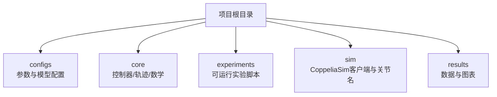
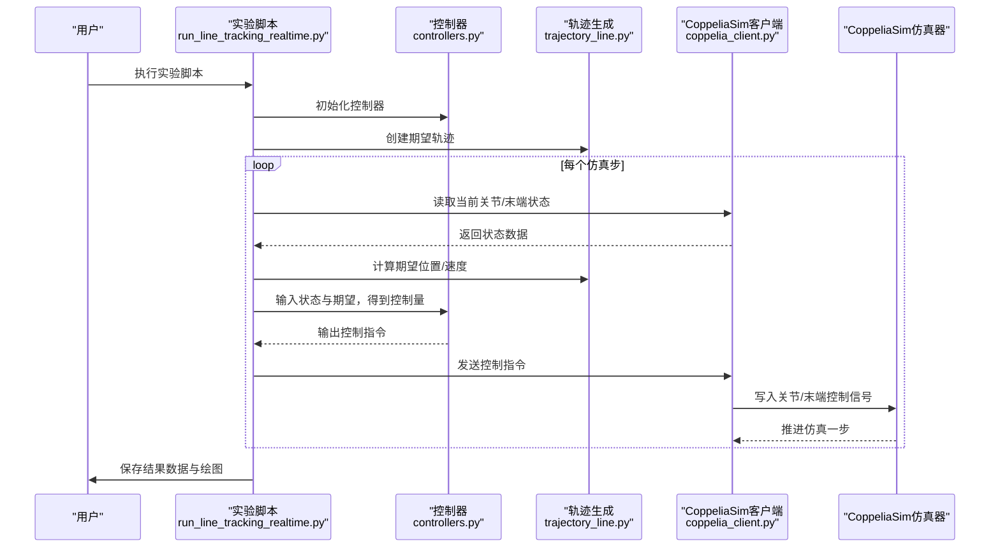
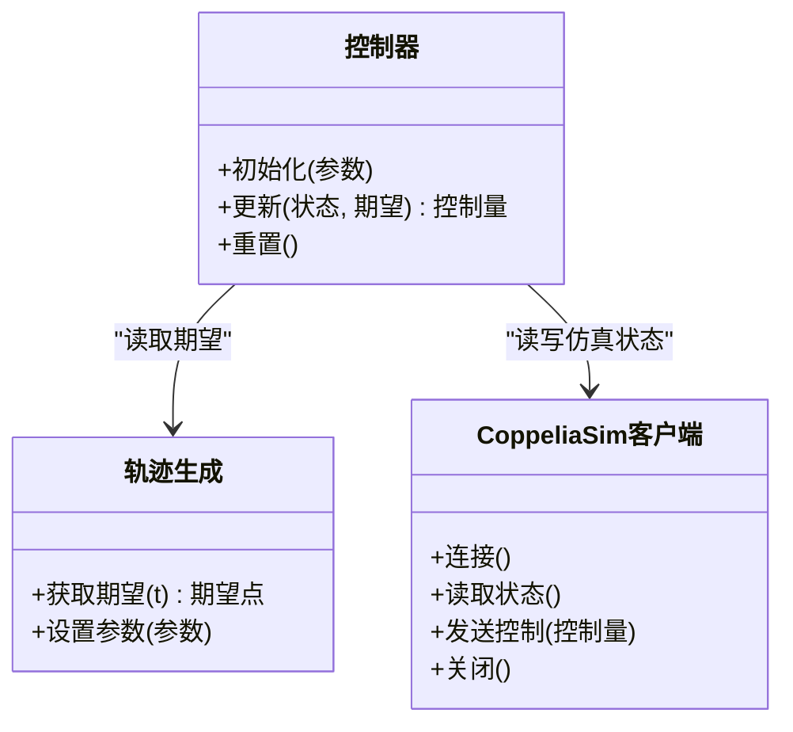
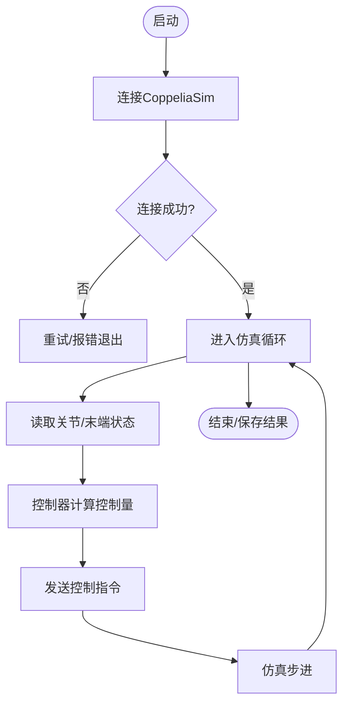
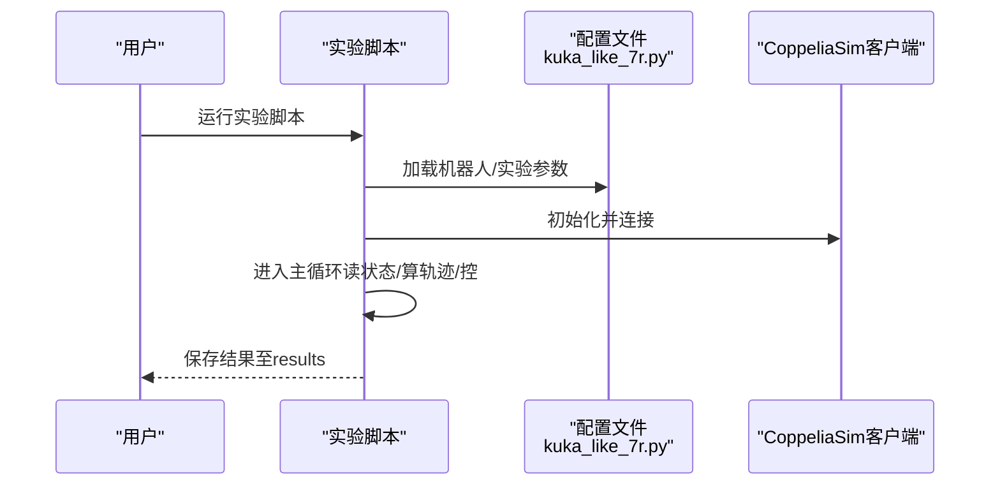
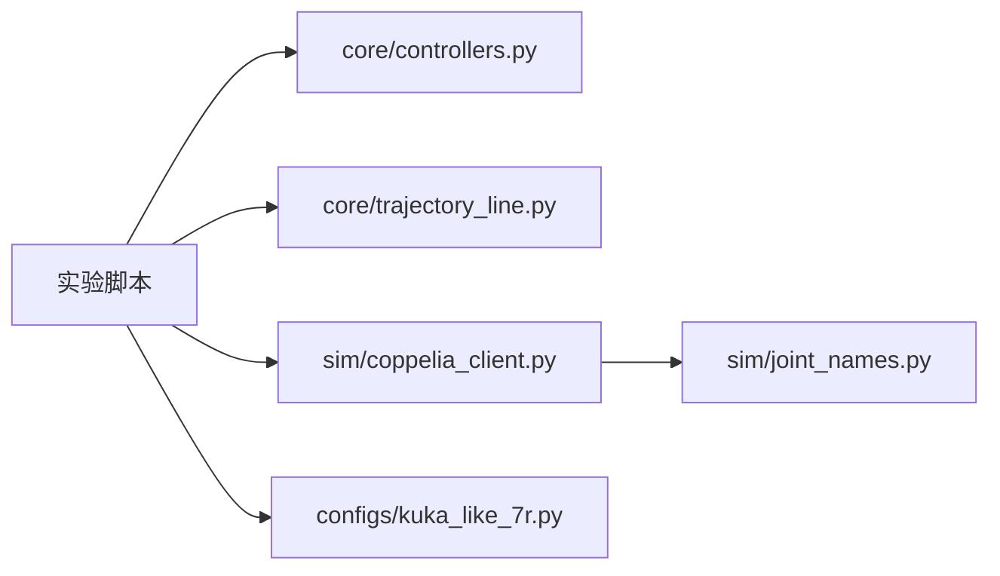

# 快速开始

<cite>
**本文引用的文件**   
- [configs/kuka_like_7r.py](file://configs/kuka_like_7r.py)
- [experiments/run_line_tracking_realtime_hdq_chain.py](file://experiments/run_line_tracking_realtime_hdq_chain.py)
- [experiments/run_line_tracking_realtime.py](file://experiments/run_line_tracking_realtime.py)
- [core/controllers.py](file://core/controllers.py)
- [core/trajectory_line.py](file://core/trajectory_line.py)
- [sim/coppelia_client.py](file://sim/coppelia_client.py)
- [sim/joint_names.py](file://sim/joint_names.py)
</cite>

## 目录
1. [简介](#简介)
2. [项目结构](#项目结构)
3. [核心组件](#核心组件)
4. [架构总览](#架构总览)
5. [详细组件分析](#详细组件分析)
6. [依赖关系分析](#依赖关系分析)
7. [性能注意事项](#性能注意事项)
8. [故障排除指南](#故障排除指南)
9. [结论](#结论)
10. [附录](#附录)

## 简介
本指南面向首次接触该项目的用户，目标是在30分钟内完成环境准备、CoppeliaSim配置与第一个轨迹跟踪仿真的运行。你将学会：
- 准备Python环境与依赖库
- 安装并配置CoppeliaSim仿真器
- 克隆仓库与理解目录结构
- 修改配置文件、启动实验脚本、查看结果数据
- 常见问题排查与解决

## 项目结构
仓库采用按功能分层组织的方式：
- configs：实验参数与机器人模型配置
- core：控制算法、轨迹生成、数学计算等核心逻辑
- experiments：可运行的实验脚本（含实时与非实时）
- sim：与CoppeliaSim通信的客户端封装与关节名映射
- results：仿真输出数据与可视化结果

[本节为概念性说明，无需来源标注]

## 核心组件
- 控制器模块：实现轨迹跟踪控制策略，接收期望轨迹与当前状态，输出控制指令
- 轨迹生成模块：提供直线/圆弧等基础轨迹，供控制器使用
- CoppeliaSim客户端：封装与仿真器的通信接口，负责读取传感器/关节状态与发送控制命令
- 关节名称映射：统一仿真器内部关节命名与代码中的引用

这些组件在实验中通过“实验脚本 -> 控制器 -> 轨迹 -> 仿真客户端”的链路协同工作。

**章节来源**
- [core/controllers.py](file://core/controllers.py)
- [core/trajectory_line.py](file://core/trajectory_line.py)
- [sim/coppelia_client.py](file://sim/coppelia_client.py)
- [sim/joint_names.py](file://sim/joint_names.py)

## 架构总览
下图展示了从实验脚本到CoppeliaSim的整体交互流程。

**图示来源**
- [experiments/run_line_tracking_realtime.py](file://experiments/run_line_tracking_realtime.py)
- [core/controllers.py](file://core/controllers.py)
- [core/trajectory_line.py](file://core/trajectory_line.py)
- [sim/coppelia_client.py](file://sim/coppelia_client.py)

## 详细组件分析

### 组件A：轨迹跟踪闭环控制
- 职责：根据当前状态与期望轨迹计算控制指令，驱动机器人跟踪目标轨迹
- 关键输入：当前关节/末端状态、期望轨迹点
- 关键输出：关节力矩/速度/位置等控制量
- 典型用法：在实验主循环中每步调用一次

**图示来源**
- [core/controllers.py](file://core/controllers.py)
- [core/trajectory_line.py](file://core/trajectory_line.py)
- [sim/coppelia_client.py](file://sim/coppelia_client.py)

**章节来源**
- [core/controllers.py](file://core/controllers.py)
- [core/trajectory_line.py](file://core/trajectory_line.py)
- [sim/coppelia_client.py](file://sim/coppelia_client.py)

### 组件B：CoppeliaSim通信与关节映射
- 职责：封装与CoppeliaSim的通信细节，屏蔽底层API差异；维护关节名称映射，确保仿真器对象名与代码一致
- 关键点：连接建立、状态读取、控制写入、异常处理与重连策略

**图示来源**
- [sim/coppelia_client.py](file://sim/coppelia_client.py)
- [sim/joint_names.py](file://sim/joint_names.py)

**章节来源**
- [sim/coppelia_client.py](file://sim/coppelia_client.py)
- [sim/joint_names.py](file://sim/joint_names.py)

### 组件C：实验脚本与参数配置
- 职责：组装控制器、轨迹与仿真客户端，驱动仿真循环，记录数据与可视化
- 参数来源：configs下的机器人/实验配置（如kuka_like_7r.py）

**图示来源**
- [experiments/run_line_tracking_realtime.py](file://experiments/run_line_tracking_realtime.py)
- [configs/kuka_like_7r.py](file://configs/kuka_like_7r.py)

**章节来源**
- [experiments/run_line_tracking_realtime.py](file://experiments/run_line_tracking_realtime.py)
- [configs/kuka_like_7r.py](file://configs/kuka_like_7r.py)

## 依赖关系分析
- 外部依赖
  - Python解释器及包管理器（建议Python 3.8+）
  - CoppeliaSim仿真器（需安装并可在命令行或GUI启动）
  - 常用科学计算与可视化库（如numpy、matplotlib等，具体以实验脚本导入为准）
- 内部依赖
  - 实验脚本依赖core与sim模块
  - core模块之间相互解耦，通过函数/类接口协作
  - sim模块仅与CoppeliaSim交互，对上层透明

**图示来源**
- [experiments/run_line_tracking_realtime.py](file://experiments/run_line_tracking_realtime.py)
- [core/controllers.py](file://core/controllers.py)
- [core/trajectory_line.py](file://core/trajectory_line.py)
- [sim/coppelia_client.py](file://sim/coppelia_client.py)
- [sim/joint_names.py](file://sim/joint_names.py)
- [configs/kuka_like_7r.py](file://configs/kuka_like_7r.py)

**章节来源**
- [experiments/run_line_tracking_realtime.py](file://experiments/run_line_tracking_realtime.py)
- [configs/kuka_like_7r.py](file://configs/kuka_like_7r.py)

## 性能注意事项
- 仿真步长与通信开销：减少不必要的I/O与日志打印，必要时降低绘图频率
- 数值稳定性：合理设置控制器增益与轨迹平滑参数，避免过冲与振荡
- 资源占用：关闭无关进程，释放GPU/CPU资源给仿真与控制计算
- 并行与缓存：若扩展多机或多场景，考虑复用已计算的轨迹与中间变量

[本节为通用指导，无需来源标注]

## 故障排除指南
- 无法连接CoppeliaSim
  - 确认CoppeliaSim已启动且端口/地址正确
  - 检查防火墙与网络权限
  - 参考客户端的连接与错误处理逻辑进行定位
- 关节名不匹配导致读取失败
  - 核对sim/joint_names.py中的映射是否与仿真场景一致
  - 在仿真器中确认对象命名规范
- 轨迹跟踪效果不佳
  - 调整控制器参数（增益、滤波等）
  - 检查轨迹起点与初始位姿是否对齐
- 结果未保存或为空
  - 确认results目录存在且有写权限
  - 检查实验脚本的保存路径与触发条件

**章节来源**
- [sim/coppelia_client.py](file://sim/coppelia_client.py)
- [sim/joint_names.py](file://sim/joint_names.py)
- [experiments/run_line_tracking_realtime.py](file://experiments/run_line_tracking_realtime.py)

## 结论
通过本指南，你应能在30分钟内完成环境搭建、仿真器配置与第一个轨迹跟踪实验的运行。后续可根据需求修改configs中的参数、替换控制器或轨迹类型，逐步深入更复杂的控制与仿真任务。

[本节为总结性内容，无需来源标注]

## 附录

### 环境准备清单
- Python版本：建议3.8及以上
- CoppeliaSim：安装并可用（支持远程/本地通信）
- 依赖库：根据实验脚本导入情况安装（如numpy、matplotlib等）

[本节为通用指导，无需来源标注]

### 第一个轨迹跟踪实验：完整步骤
- 步骤一：准备环境
  - 安装Python与依赖库
  - 安装并启动CoppeliaSim
- 步骤二：克隆仓库
  - 将仓库克隆到本地，进入项目根目录
- 步骤三：检查与修改配置
  - 打开configs/kuka_like_7r.py，核对机器人参数与关节名
  - 如需调整轨迹或控制参数，请在对应模块或配置中修改
- 步骤四：运行实验
  - 执行experiments/run_line_tracking_realtime.py
  - 观察控制台输出与仿真器画面
- 步骤五：查看结果
  - 在results目录下查找生成的数据与图表

**章节来源**
- [configs/kuka_like_7r.py](file://configs/kuka_like_7r.py)
- [experiments/run_line_tracking_realtime.py](file://experiments/run_line_tracking_realtime.py)

### 常见变体与进阶
- 使用HDQ链式实现的轨迹跟踪：参考experiments/run_line_tracking_realtime_hdq_chain.py
- 其他轨迹与对比实验：参考experiments下其他同名或相似命名的脚本

**章节来源**
- [experiments/run_line_tracking_realtime_hdq_chain.py](file://experiments/run_line_tracking_realtime_hdq_chain.py)