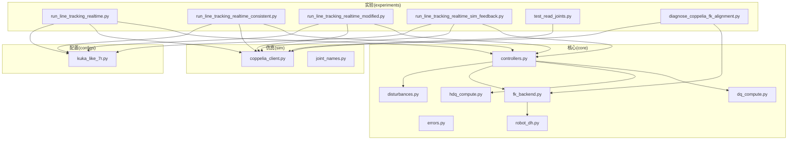
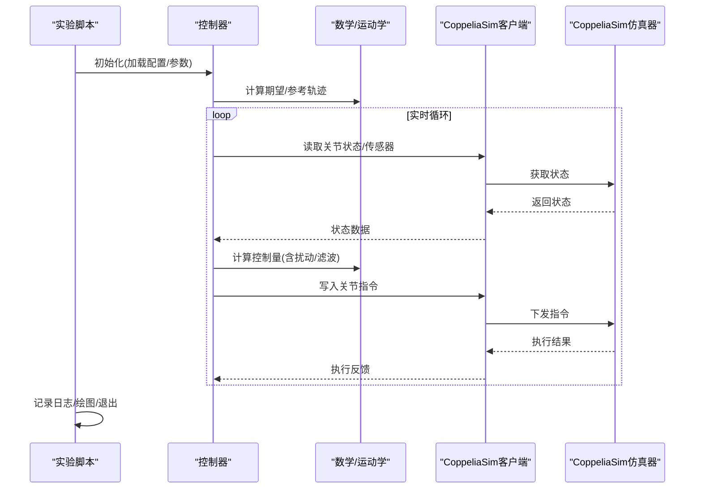
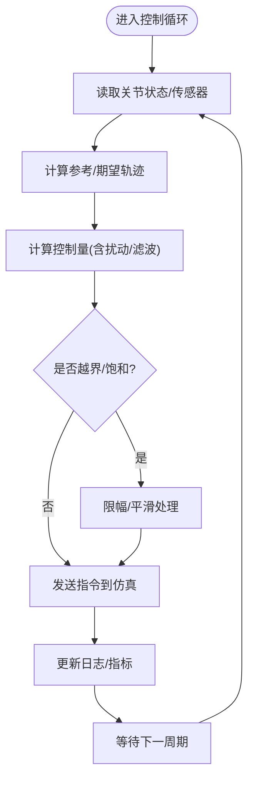
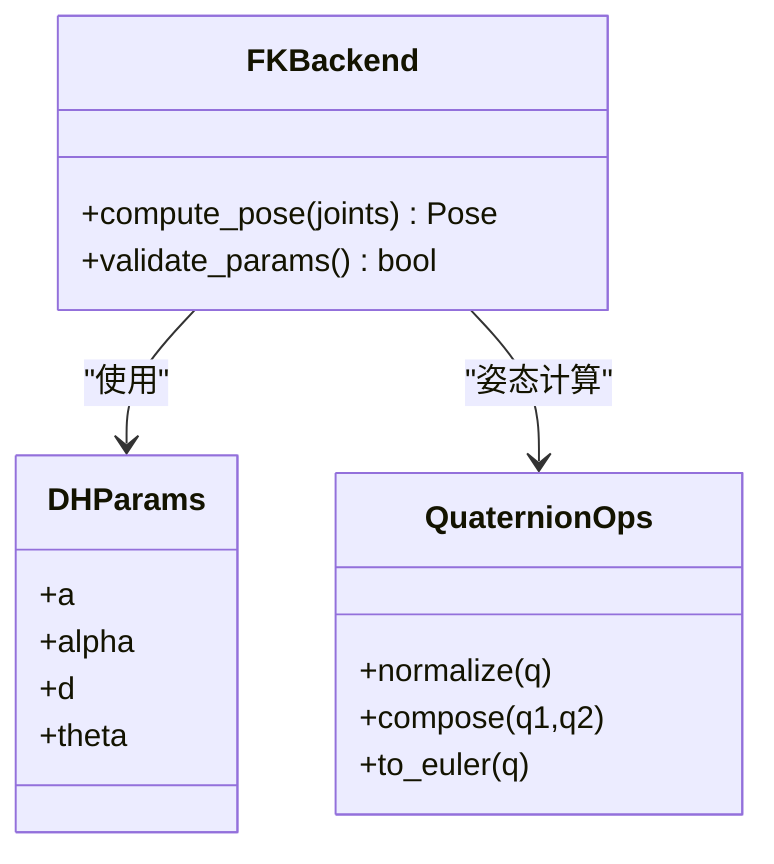
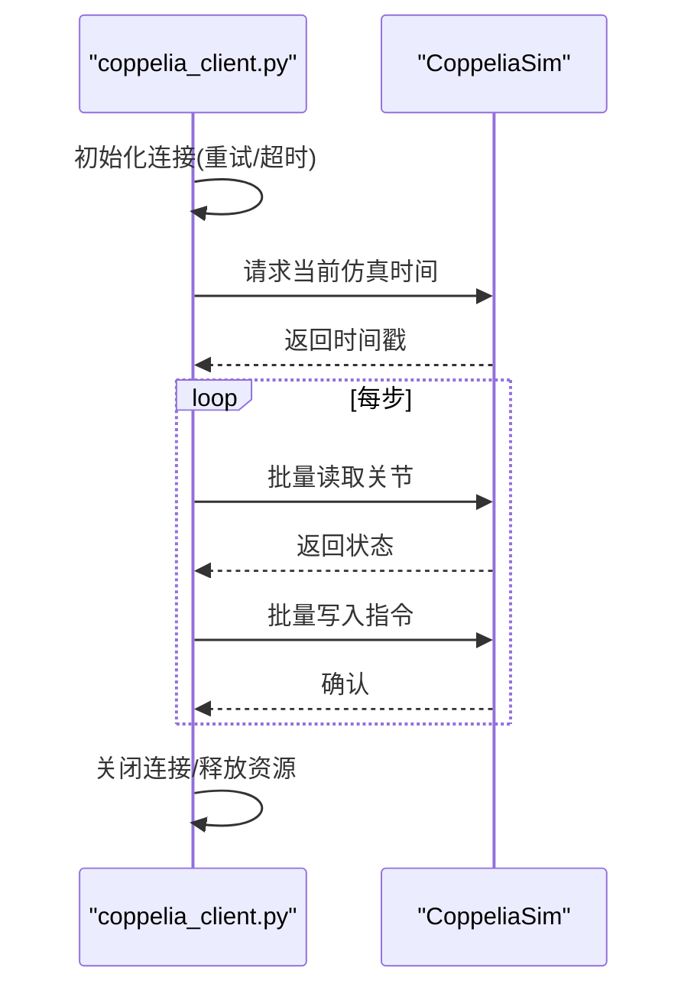
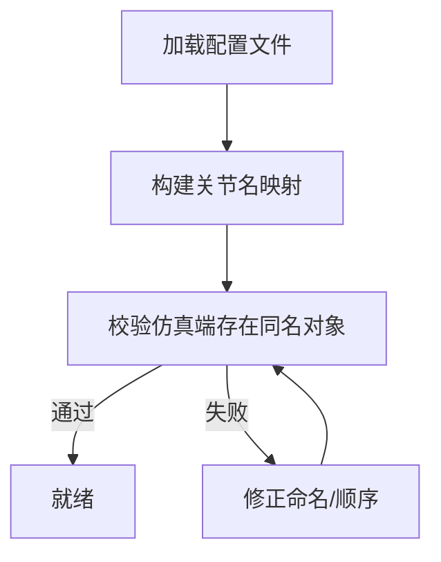
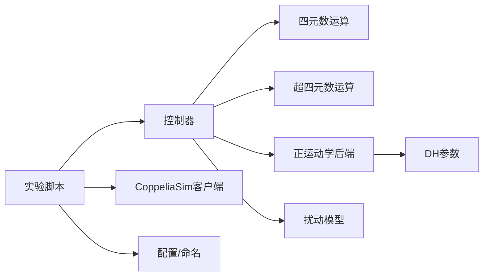

# 故障排除指南

<cite>
**本文引用的文件**   
- [core/controllers.py](file://core/controllers.py)
- [core/errors.py](file://core/errors.py)
- [core/dq_compute.py](file://core/dq_compute.py)
- [core/hdq_compute.py](file://core/hdq_compute.py)
- [core/fk_backend.py](file://core/fk_backend.py)
- [core/robot_dh.py](file://core/robot_dh.py)
- [core/disturbances.py](file://core/disturbances.py)
- [sim/coppelia_client.py](file://sim/coppelia_client.py)
- [sim/joint_names.py](file://sim/joint_names.py)
- [configs/kuka_like_7r.py](file://configs/kuka_like_7r.py)
- [experiments/run_line_tracking_realtime.py](file://experiments/run_line_tracking_realtime.py)
- [experiments/run_line_tracking_realtime_consistent.py](file://experiments/run_line_tracking_realtime_consistent.py)
- [experiments/run_line_tracking_realtime_modified.py](file://experiments/run_line_tracking_realtime_modified.py)
- [experiments/run_line_tracking_realtime_sim_feedback.py](file://experiments/run_line_tracking_realtime_sim_feedback.py)
- [experiments/test_read_joints.py](file://experiments/test_read_joints.py)
- [experiments/diagnose_coppelia_fk_alignment.py](file://experiments/diagnose_coppelia_fk_alignment.py)
</cite>

## 目录
1. [简介](#简介)
2. [项目结构](#项目结构)
3. [核心组件](#核心组件)
4. [架构总览](#架构总览)
5. [详细组件分析](#详细组件分析)
6. [依赖关系分析](#依赖关系分析)
7. [性能考虑](#性能考虑)
8. [故障排除指南](#故障排除指南)
9. [结论](#结论)
10. [附录](#附录)

## 简介
本指南面向使用 CoppeliaSim 进行机器人仿真与控制的工程人员，聚焦于环境配置、仿真连接失败、数值计算异常、控制不稳定等典型问题。文档提供系统化的错误诊断流程、日志分析方法、CoppeliaSim 集成常见陷阱（坐标系统不一致、时间同步、内存泄漏检测）及解决方案，并给出性能瓶颈识别与优化建议，以及调试工具与监控方法的使用说明，帮助用户快速定位和解决问题。

## 项目结构
本项目采用分层组织：
- core：核心算法与控制逻辑（四元数/超四元数运算、正运动学后端、扰动模型、控制器等）
- sim：CoppeliaSim 客户端封装与关节名称映射
- configs：机器人参数与场景配置
- experiments：实验脚本与诊断用例

图表来源
- [core/controllers.py](file://core/controllers.py)
- [core/fk_backend.py](file://core/fk_backend.py)
- [core/robot_dh.py](file://core/robot_dh.py)
- [core/dq_compute.py](file://core/dq_compute.py)
- [core/hdq_compute.py](file://core/hdq_compute.py)
- [core/disturbances.py](file://core/disturbances.py)
- [sim/coppelia_client.py](file://sim/coppelia_client.py)
- [sim/joint_names.py](file://sim/joint_names.py)
- [configs/kuka_like_7r.py](file://configs/kuka_like_7r.py)
- [experiments/run_line_tracking_realtime.py](file://experiments/run_line_tracking_realtime.py)
- [experiments/run_line_tracking_realtime_consistent.py](file://experiments/run_line_tracking_realtime_consistent.py)
- [experiments/run_line_tracking_realtime_modified.py](file://experiments/run_line_tracking_realtime_modified.py)
- [experiments/run_line_tracking_realtime_sim_feedback.py](file://experiments/run_line_tracking_realtime_sim_feedback.py)
- [experiments/test_read_joints.py](file://experiments/test_read_joints.py)
- [experiments/diagnose_coppelia_fk_alignment.py](file://experiments/diagnose_coppelia_fk_alignment.py)

章节来源
- [core/controllers.py](file://core/controllers.py)
- [sim/coppelia_client.py](file://sim/coppelia_client.py)
- [configs/kuka_like_7r.py](file://configs/kuka_like_7r.py)
- [experiments/run_line_tracking_realtime.py](file://experiments/run_line_tracking_realtime.py)

## 核心组件
- 控制器模块：实现轨迹跟踪与关节控制策略，负责读取状态、计算控制量、下发命令。
- 误差与异常定义：集中管理自定义异常类型与错误码，便于统一捕获与上报。
- 数学与运动学：四元数/超四元数运算、DH 参数与正运动学后端，用于姿态与位姿计算。
- 扰动模型：为控制稳定性分析与鲁棒性测试提供外部扰动注入。
- CoppeliaSim 客户端：封装连接、读写关节、时间同步与资源清理。
- 配置与命名：机器人参数与关节名映射，确保仿真端与代码端一致。

章节来源
- [core/controllers.py](file://core/controllers.py)
- [core/errors.py](file://core/errors.py)
- [core/dq_compute.py](file://core/dq_compute.py)
- [core/hdq_compute.py](file://core/hdq_compute.py)
- [core/fk_backend.py](file://core/fk_backend.py)
- [core/robot_dh.py](file://core/robot_dh.py)
- [core/disturbances.py](file://core/disturbances.py)
- [sim/coppelia_client.py](file://sim/coppelia_client.py)
- [sim/joint_names.py](file://sim/joint_names.py)
- [configs/kuka_like_7r.py](file://configs/kuka_like_7r.py)

## 架构总览
整体数据流从实验脚本驱动，经控制器调用数学与运动学模块，通过 CoppeliaSim 客户端与仿真器交互，形成“控制-仿真”闭环。

图表来源
- [experiments/run_line_tracking_realtime.py](file://experiments/run_line_tracking_realtime.py)
- [core/controllers.py](file://core/controllers.py)
- [core/fk_backend.py](file://core/fk_backend.py)
- [core/dq_compute.py](file://core/dq_compute.py)
- [core/hdq_compute.py](file://core/hdq_compute.py)
- [sim/coppelia_client.py](file://sim/coppelia_client.py)

## 详细组件分析

### 控制器与闭环控制
- 职责：读取仿真状态、计算控制律、下发指令、处理异常与日志。
- 关键点：采样周期一致性、状态滤波、指令限幅、饱和与死区处理、扰动注入。
- 常见问题：控制发散、振荡、稳态误差大、指令抖动。

图表来源
- [core/controllers.py](file://core/controllers.py)
- [core/disturbances.py](file://core/disturbances.py)

章节来源
- [core/controllers.py](file://core/controllers.py)
- [core/disturbances.py](file://core/disturbances.py)

### 正运动学与坐标系对齐
- 职责：基于 DH 参数或等效模型计算末端位姿，供轨迹规划与误差计算使用。
- 关键点：坐标系约定、旋转表示（欧拉角/四元数）、单位制（弧度/度）。
- 常见问题：坐标轴方向不一致、零位偏移、奇异点附近数值不稳定。

图表来源
- [core/fk_backend.py](file://core/fk_backend.py)
- [core/robot_dh.py](file://core/robot_dh.py)
- [core/dq_compute.py](file://core/dq_compute.py)

章节来源
- [core/fk_backend.py](file://core/fk_backend.py)
- [core/robot_dh.py](file://core/robot_dh.py)
- [core/dq_compute.py](file://core/dq_compute.py)

### CoppeliaSim 客户端与时间同步
- 职责：建立连接、读写关节、查询时间戳、资源释放。
- 关键点：连接重试、超时设置、时间戳对齐、批量读写减少开销。
- 常见问题：连接失败、丢包、时钟漂移、阻塞导致实时性下降。

图表来源
- [sim/coppelia_client.py](file://sim/coppelia_client.py)

章节来源
- [sim/coppelia_client.py](file://sim/coppelia_client.py)

### 配置与命名映射
- 职责：维护机器人参数、关节名映射、场景路径等。
- 关键点：仿真端与代码端关节顺序一致、命名完全匹配、单位统一。
- 常见问题：索引错位、名称不匹配导致读不到数据或写入无效。

图表来源
- [configs/kuka_like_7r.py](file://configs/kuka_like_7r.py)
- [sim/joint_names.py](file://sim/joint_names.py)

章节来源
- [configs/kuka_like_7r.py](file://configs/kuka_like_7r.py)
- [sim/joint_names.py](file://sim/joint_names.py)

## 依赖关系分析
- 控制器依赖数学与运动学模块完成控制律与位姿计算。
- 正运动学依赖 DH 参数与四元数运算。
- 实验脚本依赖控制器、客户端与配置。
- 客户端独立于业务逻辑，仅负责与仿真器通信。

图表来源
- [core/controllers.py](file://core/controllers.py)
- [core/dq_compute.py](file://core/dq_compute.py)
- [core/hdq_compute.py](file://core/hdq_compute.py)
- [core/fk_backend.py](file://core/fk_backend.py)
- [core/robot_dh.py](file://core/robot_dh.py)
- [core/disturbances.py](file://core/disturbances.py)
- [sim/coppelia_client.py](file://sim/coppelia_client.py)
- [configs/kuka_like_7r.py](file://configs/kuka_like_7r.py)
- [experiments/run_line_tracking_realtime.py](file://experiments/run_line_tracking_realtime.py)

章节来源
- [core/controllers.py](file://core/controllers.py)
- [sim/coppelia_client.py](file://sim/coppelia_client.py)
- [experiments/run_line_tracking_realtime.py](file://experiments/run_line_tracking_realtime.py)

## 性能考虑
- 计算效率
  - 避免在控制循环内重复构造大型对象；复用缓冲区与中间变量。
  - 将批量化读写关节与传感器数据，减少网络往返。
  - 对高频滤波与插值采用增量式更新。
- 内存使用
  - 及时释放不再使用的句柄与缓存；避免长生命周期的大数组累积。
  - 使用生成器或流式处理替代一次性加载全部数据。
- 实时性保证
  - 固定控制周期，使用高精度计时；必要时降低任务优先级或绑定 CPU 核。
  - 对非关键路径（绘图、日志落盘）异步化或降频。
- 监控与诊断
  - 记录关键指标：控制周期耗时、网络延迟、CPU/内存占用、指令幅度与频率。
  - 绘制误差收敛曲线与控制输入频谱，辅助识别振荡源。

[本节为通用指导，无需特定文件引用]

## 故障排除指南

### 环境与安装问题
- Python 版本与依赖缺失
  - 症状：导入失败、缺少模块报错。
  - 排查：检查解释器版本、虚拟环境激活、依赖清单安装。
  - 解决：重新创建环境并安装所需库；核对 pip 源与镜像。
- CoppeliaSim 未启动或端口不可达
  - 症状：连接超时、拒绝连接。
  - 排查：确认仿真器已运行、远程 API 服务开启、防火墙放行。
  - 解决：重启仿真器、检查端口号与地址、以管理员权限运行。

章节来源
- [sim/coppelia_client.py](file://sim/coppelia_client.py)

### 仿真连接失败
- 连接建立阶段
  - 现象：握手失败、认证错误、多次重连仍失败。
  - 诊断：查看客户端初始化日志、重试次数与超时阈值。
  - 修复：调整超时与重试策略；确认仿真端 Remote API 配置一致。
- 运行时断开
  - 现象：控制循环中偶发断线、状态读取为空。
  - 诊断：统计断线时间点与负载峰值；检查网络抖动与仿真器卡顿。
  - 修复：增加心跳检测、断线自动恢复、降级策略（保持上一指令或安全停机）。

章节来源
- [sim/coppelia_client.py](file://sim/coppelia_client.py)
- [experiments/test_read_joints.py](file://experiments/test_read_joints.py)

### 数值计算异常
- 四元数/超四元数溢出或归一化失败
  - 现象：姿态跳变、NaN/Inf 出现。
  - 诊断：检查输入范围、归一化前后范数、插值路径。
  - 修复：强制归一化、限制步长、引入抗抖滤波。
- 正运动学奇异点
  - 现象：末端速度放大、角度突变。
  - 诊断：监测雅可比条件数、关节接近极限位置。
  - 修复：轨迹避奇异、加入阻尼最小二乘、限制关节速率。

章节来源
- [core/dq_compute.py](file://core/dq_compute.py)
- [core/hdq_compute.py](file://core/hdq_compute.py)
- [core/fk_backend.py](file://core/fk_backend.py)
- [core/robot_dh.py](file://core/robot_dh.py)

### 控制不稳定
- 发散与振荡
  - 现象：误差增大、控制量饱和、高频抖动。
  - 诊断：观察 Bode/Nyquist 近似、阶跃响应、控制输入频谱。
  - 修复：降低增益、增加相位裕度、加入低通滤波、抗积分饱和。
- 稳态误差
  - 现象：跟踪偏差长期存在。
  - 诊断：检查参考信号与传感器零点、扰动补偿项。
  - 修复：引入积分项、前馈补偿、在线辨识扰动均值。

章节来源
- [core/controllers.py](file://core/controllers.py)
- [core/disturbances.py](file://core/disturbances.py)

### CoppeliaSim 集成常见陷阱
- 坐标系统不一致
  - 症状：末端位姿与预期不符、轨迹偏转。
  - 诊断：对比仿真端坐标系与代码端 DH 参数约定；检查旋转表示转换。
  - 修复：统一右手系/左手系、明确 Z/X/Y 轴方向、校准零位。
- 时间同步问题
  - 症状：控制滞后、周期性抖动。
  - 诊断：比较仿真时间与系统时间、测量端到端延迟分布。
  - 修复：使用仿真时间戳作为控制基准、固定周期调度、补偿平均延迟。
- 内存泄漏检测
  - 症状：长时间运行后内存持续增长、仿真卡顿。
  - 诊断：监控进程内存、定位未释放的句柄与大对象。
  - 修复：显式关闭连接、清空缓存、避免闭包持有大对象引用。

章节来源
- [core/fk_backend.py](file://core/fk_backend.py)
- [sim/coppelia_client.py](file://sim/coppelia_client.py)
- [experiments/diagnose_coppelia_fk_alignment.py](file://experiments/diagnose_coppelia_fk_alignment.py)

### 日志分析与诊断流程
- 日志采集要点
  - 记录控制周期耗时、网络往返时延、指令幅度与频率、误差指标、异常堆栈。
  - 区分信息/警告/错误级别，按时间戳排序，保留上下文参数。
- 定位步骤
  - 复现问题并收集完整日志；筛选错误区间；关联仿真端事件。
  - 绘制时序图与频谱图；对比不同参数下的表现。
  - 逐步隔离模块（只读状态、只写指令、离线计算）验证假设。
- 常用技巧
  - 使用最小可复现实验脚本；固定随机种子；禁用非必要 I/O。
  - 对关键函数打点计时，输出热点路径。

章节来源
- [core/errors.py](file://core/errors.py)
- [experiments/run_line_tracking_realtime.py](file://experiments/run_line_tracking_realtime.py)
- [experiments/run_line_tracking_realtime_consistent.py](file://experiments/run_line_tracking_realtime_consistent.py)
- [experiments/run_line_tracking_realtime_modified.py](file://experiments/run_line_tracking_realtime_modified.py)
- [experiments/run_line_tracking_realtime_sim_feedback.py](file://experiments/run_line_tracking_realtime_sim_feedback.py)

### 调试工具与监控方法
- 调试工具
  - 单元测试：覆盖数学模块与边界条件。
  - 仿真回放：保存状态序列，离线重放验证控制律。
  - 可视化：误差曲线、控制输入、关节轨迹、频谱分析。
- 监控方法
  - 系统级：CPU/内存/IO 监控；网络吞吐与时延。
  - 应用级：控制周期抖动、丢包率、异常计数。
  - 告警：阈值触发、自动快照、断点续跑。

章节来源
- [experiments/test_read_joints.py](file://experiments/test_read_joints.py)
- [experiments/diagnose_coppelia_fk_alignment.py](file://experiments/diagnose_coppelia_fk_alignment.py)

### 快速定位清单
- 连接类
  - 仿真器是否运行？Remote API 是否启用？端口/地址是否正确？
  - 客户端是否成功握手？是否有重试与超时配置？
- 数据类
  - 关节名映射是否一致？索引顺序是否匹配？单位是否统一？
  - 读取的数据是否为空或异常值？
- 计算类
  - 四元数是否归一化？DH 参数是否与仿真一致？是否存在奇异点？
- 控制类
  - 控制周期是否稳定？是否存在饱和与积分饱和？扰动补偿是否生效？
- 性能类
  - 控制循环耗时是否超标？网络往返是否抖动？是否存在频繁 GC？

章节来源
- [sim/coppelia_client.py](file://sim/coppelia_client.py)
- [sim/joint_names.py](file://sim/joint_names.py)
- [core/fk_backend.py](file://core/fk_backend.py)
- [core/dq_compute.py](file://core/dq_compute.py)
- [core/controllers.py](file://core/controllers.py)

## 结论
通过系统化地梳理环境配置、仿真连接、数值计算、控制稳定性与性能优化等关键环节，并结合日志分析与调试工具，能够显著提升问题定位效率与系统可靠性。建议在开发初期即建立完善的监控与日志体系，并在每次迭代中回归验证关键路径，从而持续降低风险、提升质量。

## 附录
- 相关实验脚本用途
  - 实时轨迹跟踪：主循环与闭环控制验证。
  - 一致性/修改版：对比不同控制策略与参数。
  - 仿真反馈：强化状态回路与容错机制。
  - 关节读取测试：基础连通性与数据正确性验证。
  - FK 对齐诊断：坐标系与零位校准辅助。

章节来源
- [experiments/run_line_tracking_realtime.py](file://experiments/run_line_tracking_realtime.py)
- [experiments/run_line_tracking_realtime_consistent.py](file://experiments/run_line_tracking_realtime_consistent.py)
- [experiments/run_line_tracking_realtime_modified.py](file://experiments/run_line_tracking_realtime_modified.py)
- [experiments/run_line_tracking_realtime_sim_feedback.py](file://experiments/run_line_tracking_realtime_sim_feedback.py)
- [experiments/test_read_joints.py](file://experiments/test_read_joints.py)
- [experiments/diagnose_coppelia_fk_alignment.py](file://experiments/diagnose_coppelia_fk_alignment.py)