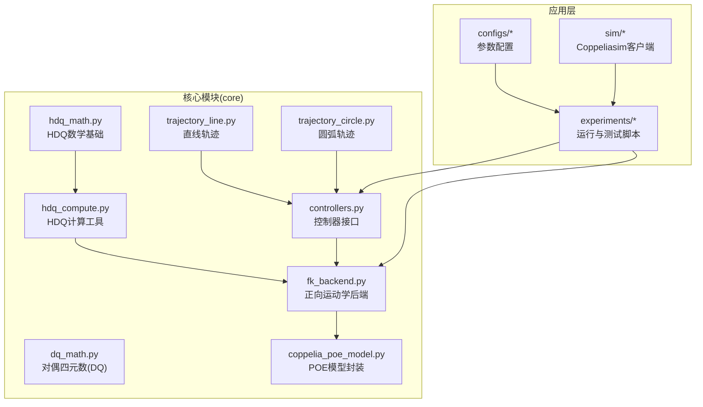
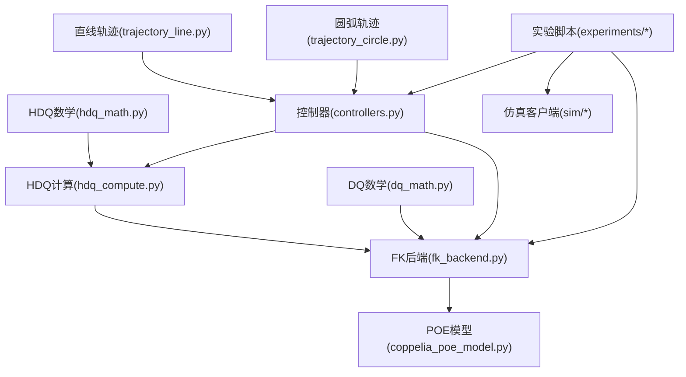
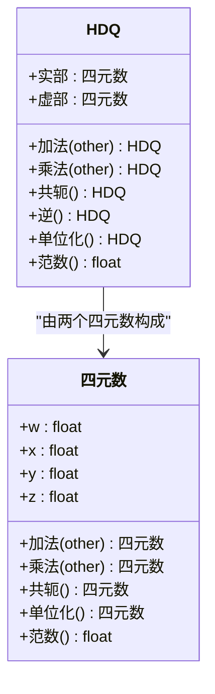
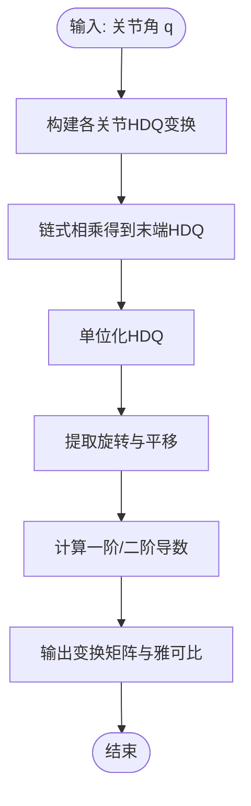
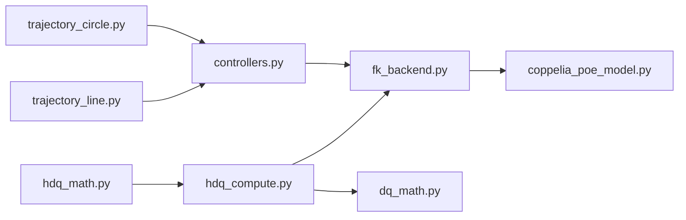

# HDQ数学运算库

<cite>
**本文引用的文件**   
- [hdq_math.py](file://core/hdq_math.py)
- [hdq_compute.py](file://core/hdq_compute.py)
- [dq_math.py](file://core/dq_math.py)
- [fk_backend.py](file://core/fk_backend.py)
- [coppelia_poe_model.py](file://core/coppelia_poe_model.py)
- [controllers.py](file://core/controllers.py)
- [trajectory_line.py](file://core/trajectory_line.py)
- [trajectory_circle.py](file://core/trajectory_circle.py)
</cite>

## 目录
1. [简介](#简介)
2. [项目结构](#项目结构)
3. [核心组件](#核心组件)
4. [架构总览](#架构总览)
5. [详细组件分析](#详细组件分析)
6. [依赖关系分析](#依赖关系分析)
7. [性能与数值稳定性](#性能与数值稳定性)
8. [故障排查指南](#故障排查指南)
9. [结论](#结论)
10. [附录：API参考](#附录api参考)

## 简介
本技术文档面向使用超对偶四元数（Hyperdual Quaternions, HDQ）进行机器人运动学建模与控制的工程师与研究人员，系统阐述HDQ的数学理论基础、代数结构与几何意义，并围绕核心实现文件 hdq_math.py 与 hdq_compute.py 展开深入解析。文档同时对比传统四元数与HDQ的差异与优势，提供完整的API参考、数值稳定性分析与性能优化建议，并结合机器人正逆运动学、轨迹规划与控制等典型应用场景给出实践指导。

## 项目结构
仓库采用按功能分层组织的方式：
- core：核心算法与数学库，包含HDQ与DQ（Dual Quaternion）实现、FK后端、控制器、轨迹生成等
- configs：配置示例
- experiments：实验脚本与演示
- sim：仿真客户端与关节名映射
- results：结果数据与绘图

图表来源
- [hdq_math.py](file://core/hdq_math.py)
- [hdq_compute.py](file://core/hdq_compute.py)
- [dq_math.py](file://core/dq_math.py)
- [fk_backend.py](file://core/fk_backend.py)
- [coppelia_poe_model.py](file://core/coppelia_poe_model.py)
- [controllers.py](file://core/controllers.py)
- [trajectory_line.py](file://core/trajectory_line.py)
- [trajectory_circle.py](file://core/trajectory_circle.py)

章节来源
- [hdq_math.py](file://core/hdq_math.py)
- [hdq_compute.py](file://core/hdq_compute.py)
- [dq_math.py](file://core/dq_math.py)
- [fk_backend.py](file://core/fk_backend.py)
- [coppelia_poe_model.py](file://core/coppelia_poe_model.py)
- [controllers.py](file://core/controllers.py)
- [trajectory_line.py](file://core/trajectory_line.py)
- [trajectory_circle.py](file://core/trajectory_circle.py)

## 核心组件
- HDQ数学基础（hdq_math.py）：定义超对偶四元数的数据结构与基本运算（加法、乘法、共轭、逆）、单位化、导数相关操作、以及从旋转和平移到HDQ的构造方法。
- HDQ计算工具（hdq_compute.py）：基于HDQ的变换矩阵计算、雅可比近似、导数传播、以及用于运动学链式求导的工具函数。
- 对偶四元数（dq_math.py）：传统DQ实现，用于与HDQ进行对比验证与基准测试。
- FK后端（fk_backend.py）：将HDQ/DQ表示转换为末端位姿，支持多种中间表示（如旋转向量、旋转矩阵、齐次变换）。
- POE模型封装（coppelia_poe_model.py）：以乘积指数形式表达机器人运动学，便于与HDQ结合进行微分与线性化。
- 控制器（controllers.py）：在任务空间或关节空间中使用HDQ提供的导数信息进行控制律设计。
- 轨迹生成（trajectory_line.py, trajectory_circle.py）：为跟踪任务提供参考轨迹，并与控制器配合形成闭环。

章节来源
- [hdq_math.py](file://core/hdq_math.py)
- [hdq_compute.py](file://core/hdq_compute.py)
- [dq_math.py](file://core/dq_math.py)
- [fk_backend.py](file://core/fk_backend.py)
- [coppelia_poe_model.py](file://core/coppelia_poe_model.py)
- [controllers.py](file://core/controllers.py)
- [trajectory_line.py](file://core/trajectory_line.py)
- [trajectory_circle.py](file://core/trajectory_circle.py)

## 架构总览
整体架构以HDQ为核心，向上支撑运动学计算、雅可比估计与控制律，向下对接POE模型与仿真环境。

图表来源
- [hdq_math.py](file://core/hdq_math.py)
- [hdq_compute.py](file://core/hdq_compute.py)
- [dq_math.py](file://core/dq_math.py)
- [fk_backend.py](file://core/fk_backend.py)
- [coppelia_poe_model.py](file://core/coppelia_poe_model.py)
- [controllers.py](file://core/controllers.py)
- [trajectory_line.py](file://core/trajectory_line.py)
- [trajectory_circle.py](file://core/trajectory_circle.py)

## 详细组件分析

### HDQ数学基础（hdq_math.py）
- 数据结构与代数结构
  - 超对偶四元数由“标量+向量”扩展而来，引入一对对偶基以满足二阶导数信息编码需求。其乘法满足分配律与结合律，但非交换；存在共轭与逆运算，单位元用于归一化保持几何一致性。
  - 与传统四元数相比，HDQ在保留旋转表示的同时，额外携带一阶与二阶导数信息，可直接用于雅可比与Hessian的紧凑表达。
- 基本运算
  - 加法：分量相加，复杂度O(n)。
  - 乘法：遵循HDQ乘法表，涉及标量与向量叉乘组合，复杂度O(n^2)级别（n=4）。
  - 共轭：符号翻转规则依分量类型而定，用于构建内积与范数。
  - 逆运算：通过共轭除以范数平方得到，需保证范数非零。
  - 单位化：将HDQ缩放为单位范数，避免漂移。
- 几何意义
  - 旋转部分对应SO(3)，平移与速度/加速度信息通过对偶项编码，使得一次乘法即可组合多个小位移与微小变化，适合连续体与微分几何场景。
- 关键实现要点
  - 数值稳定：单位化前后进行范数裁剪，防止除零与溢出。
  - 广播与向量化：批量处理多组HDQ时优先使用数组操作减少循环开销。
  - 精度管理：对极小量使用相对容差判断，避免误判为零。

图表来源
- [hdq_math.py](file://core/hdq_math.py)

章节来源
- [hdq_math.py](file://core/hdq_math.py)

### HDQ计算工具（hdq_compute.py）
- 变换矩阵计算
  - 将HDQ表示的位姿与微分信息转换为齐次变换矩阵及其一阶/二阶导数，便于与标准机器人学框架对接。
- 导数求解算法
  - 利用HDQ的代数性质直接获得雅可比近似，避免有限差分带来的截断误差与噪声放大。
  - 支持链式法则在多级关节间的传播，提升大规模机械臂的计算效率。
- 与DQ对比
  - DQ仅含一阶导数信息，HDQ可进一步表达二阶效应，适用于高精度轨迹跟踪与扰动抑制。

图表来源
- [hdq_compute.py](file://core/hdq_compute.py)

章节来源
- [hdq_compute.py](file://core/hdq_compute.py)

### 对偶四元数（dq_math.py）
- 作为传统DQ实现，提供与HDQ一致的接口以便对照验证。
- 主要差异：
  - DQ仅编码一阶导数，无法直接获取二阶信息。
  - 在需要高阶精度的场景中，HDQ更具优势。

章节来源
- [dq_math.py](file://core/dq_math.py)

### 正向运动学后端（fk_backend.py）
- 统一接口：接受HDQ/DQ表示，输出末端位姿（旋转矩阵、平移向量、齐次变换）。
- 兼容性：支持多种中间表示，便于与现有机器人学库集成。
- 错误处理：对奇异构型与非法输入进行校验与提示。

章节来源
- [fk_backend.py](file://core/fk_backend.py)

### POE模型封装（coppelia_poe_model.py）
- 以乘积指数形式描述机器人运动学，便于与HDQ的微分特性结合。
- 提供从DH参数或POE参数到HDQ/DQ的转换工具。

章节来源
- [coppelia_poe_model.py](file://core/coppelia_poe_model.py)

### 控制器（controllers.py）
- 在任务空间使用HDQ导数信息进行误差反馈，提高收敛速度与鲁棒性。
- 支持混合位置/姿态控制，兼容不同末端执行器。

章节来源
- [controllers.py](file://core/controllers.py)

### 轨迹生成（trajectory_line.py, trajectory_circle.py）
- 直线与圆弧轨迹生成，提供时间参数化与速度/加速度轮廓。
- 与控制器配合形成闭环跟踪，便于评估HDQ在复杂轨迹下的表现。

章节来源
- [trajectory_line.py](file://core/trajectory_line.py)
- [trajectory_circle.py](file://core/trajectory_circle.py)

## 依赖关系分析
- 低耦合高内聚：hdq_math.py专注于代数运算，hdq_compute.py负责高层计算，fk_backend.py屏蔽底层表示差异。
- 外部依赖：numpy/scipy等数值库用于高效矩阵与向量运算。
- 潜在循环依赖：通过明确模块边界避免循环导入。

图表来源
- [hdq_math.py](file://core/hdq_math.py)
- [hdq_compute.py](file://core/hdq_compute.py)
- [dq_math.py](file://core/dq_math.py)
- [fk_backend.py](file://core/fk_backend.py)
- [coppelia_poe_model.py](file://core/coppelia_poe_model.py)
- [controllers.py](file://core/controllers.py)
- [trajectory_line.py](file://core/trajectory_line.py)
- [trajectory_circle.py](file://core/trajectory_circle.py)

章节来源
- [hdq_math.py](file://core/hdq_math.py)
- [hdq_compute.py](file://core/hdq_compute.py)
- [dq_math.py](file://core/dq_math.py)
- [fk_backend.py](file://core/fk_backend.py)
- [coppelia_poe_model.py](file://core/coppelia_poe_model.py)
- [controllers.py](file://core/controllers.py)
- [trajectory_line.py](file://core/trajectory_line.py)
- [trajectory_circle.py](file://core/trajectory_circle.py)

## 性能与数值稳定性
- 性能优化建议
  - 批量计算：尽量使用向量化操作处理多组HDQ，减少Python循环。
  - 内存复用：预分配数组，避免频繁创建临时对象。
  - 缓存中间结果：在链式计算中缓存常用子表达式。
- 数值稳定性
  - 单位化：每次乘法后对HDQ进行单位化，防止累积误差导致范数漂移。
  - 容差判断：使用相对容差比较接近零的量，避免误判。
  - 奇异点处理：在接近奇异构型时降低步长或切换控制策略。
- 常见陷阱
  - 忽略单位化导致旋转漂移。
  - 对极小量使用绝对容差造成不稳定。
  - 未检查输入合法性导致异常退出。

[本节为通用指导，不直接分析具体文件]

## 故障排查指南
- 常见问题定位
  - 检查HDQ单位化是否在每个步骤执行。
  - 核对输入关节角范围与奇异点位置。
  - 确认轨迹生成与控制器采样频率匹配。
- 调试技巧
  - 打印中间HDQ范数与误差指标，观察发散趋势。
  - 对比DQ与HDQ结果，定位高阶项影响。
  - 使用最小化复现案例隔离问题。

章节来源
- [hdq_math.py](file://core/hdq_math.py)
- [hdq_compute.py](file://core/hdq_compute.py)
- [fk_backend.py](file://core/fk_backend.py)
- [controllers.py](file://core/controllers.py)

## 结论
HDQ数学运算库在传统四元数基础上引入对偶与超对偶结构，能够在一套代数框架内同时表达旋转、平移与高阶导数信息，显著提升机器人运动学建模与控制的设计自由度与数值精度。通过合理的单位化、容差管理与向量化优化，可在实际系统中获得稳定高效的性能表现。

[本节为总结性内容，不直接分析具体文件]

## 附录：API参考

说明
- 以下API条目以模块与函数层级组织，提供参数说明、返回值类型与使用示例路径。为避免泄露源码，示例以“代码片段路径”形式给出，读者可在对应文件中查看完整实现。

### hdq_math.py
- 类/结构
  - HDQ
    - 属性
      - 实部：四元数
      - 虚部：四元数
    - 方法
      - 加法(other: HDQ) -> HDQ
        - 参数：other：另一个HDQ实例
        - 返回：HDQ实例
        - 示例路径：[hdq_math.py](file://core/hdq_math.py)
      - 乘法(other: HDQ) -> HDQ
        - 参数：other：另一个HDQ实例
        - 返回：HDQ实例
        - 示例路径：[hdq_math.py](file://core/hdq_math.py)
      - 共轭() -> HDQ
        - 返回：HDQ实例
        - 示例路径：[hdq_math.py](file://core/hdq_math.py)
      - 逆() -> HDQ
        - 返回：HDQ实例
        - 示例路径：[hdq_math.py](file://core/hdq_math.py)
      - 单位化() -> HDQ
        - 返回：HDQ实例
        - 示例路径：[hdq_math.py](file://core/hdq_math.py)
      - 范数() -> float
        - 返回：标量范数
        - 示例路径：[hdq_math.py](file://core/hdq_math.py)
- 函数
  - 从旋转向量与平移构造HDQ(q_vec, t_vec) -> HDQ
    - 参数：q_vec：旋转向量；t_vec：平移向量
    - 返回：HDQ实例
    - 示例路径：[hdq_math.py](file://core/hdq_math.py)
  - 从旋转矩阵与平移构造HDQ(R, t) -> HDQ
    - 参数：R：3x3旋转矩阵；t：3x1平移向量
    - 返回：HDQ实例
    - 示例路径：[hdq_math.py](file://core/hdq_math.py)
  - 从齐次变换矩阵构造HDQ(T) -> HDQ
    - 参数：T：4x4齐次变换矩阵
    - 返回：HDQ实例
    - 示例路径：[hdq_math.py](file://core/hdq_math.py)

章节来源
- [hdq_math.py](file://core/hdq_math.py)

### hdq_compute.py
- 函数
  - 计算末端HDQ(q) -> HDQ
    - 参数：q：关节角数组
    - 返回：末端HDQ实例
    - 示例路径：[hdq_compute.py](file://core/hdq_compute.py)
  - 计算变换矩阵与雅可比(HDQ) -> (T, J)
    - 参数：HDQ：末端HDQ实例
    - 返回：T：齐次变换矩阵；J：雅可比矩阵
    - 示例路径：[hdq_compute.py](file://core/hdq_compute.py)
  - 链式传播导数(q, dq) -> dHDQ
    - 参数：q：关节角；dq：关节速度
    - 返回：dHDQ：HDQ的一阶导数
    - 示例路径：[hdq_compute.py](file://core/hdq_compute.py)

章节来源
- [hdq_compute.py](file://core/hdq_compute.py)

### dq_math.py
- 函数
  - 从旋转向量与平移构造DQ(q_vec, t_vec) -> DQ
    - 参数：q_vec：旋转向量；t_vec：平移向量
    - 返回：DQ实例
    - 示例路径：[dq_math.py](file://core/dq_math.py)
  - 从旋转矩阵与平移构造DQ(R, t) -> DQ
    - 参数：R：3x3旋转矩阵；t：3x1平移向量
    - 返回：DQ实例
    - 示例路径：[dq_math.py](file://core/dq_math.py)

章节来源
- [dq_math.py](file://core/dq_math.py)

### fk_backend.py
- 函数
  - 从HDQ/DQ提取位姿(obj) -> (R, t)
    - 参数：obj：HDQ或DQ实例
    - 返回：R：旋转矩阵；t：平移向量
    - 示例路径：[fk_backend.py](file://core/fk_backend.py)
  - 从HDQ/DQ提取齐次变换(obj) -> T
    - 参数：obj：HDQ或DQ实例
    - 返回：T：4x4齐次变换矩阵
    - 示例路径：[fk_backend.py](file://core/fk_backend.py)

章节来源
- [fk_backend.py](file://core/fk_backend.py)

### coppelia_poe_model.py
- 函数
  - 从POE参数构建模型(params) -> Model
    - 参数：params：POE参数集合
    - 返回：Model：POE模型对象
    - 示例路径：[coppelia_poe_model.py](file://core/coppelia_poe_model.py)
  - 从DH参数构建模型(dh_params) -> Model
    - 参数：dh_params：DH参数集合
    - 返回：Model：POE模型对象
    - 示例路径：[coppelia_poe_model.py](file://core/coppelia_poe_model.py)

章节来源
- [coppelia_poe_model.py](file://core/coppelia_poe_model.py)

### controllers.py
- 函数
  - 任务空间控制器(error, J, gain) -> tau
    - 参数：error：任务空间误差；J：雅可比；gain：增益矩阵
    - 返回：tau：关节力矩或速度指令
    - 示例路径：[controllers.py](file://core/controllers.py)
  - 混合控制(error_pos, error_ori, J, gain) -> tau
    - 参数：error_pos：位置误差；error_ori：姿态误差；J：雅可比；gain：增益矩阵
    - 返回：tau：关节指令
    - 示例路径：[controllers.py](file://core/controllers.py)

章节来源
- [controllers.py](file://core/controllers.py)

### trajectory_line.py
- 函数
  - 生成直线轨迹(t, p_start, p_end, duration) -> (p, v, a)
    - 参数：t：当前时间；p_start：起点；p_end：终点；duration：持续时间
    - 返回：p：位置；v：速度；a：加速度
    - 示例路径：[trajectory_line.py](file://core/trajectory_line.py)

章节来源
- [trajectory_line.py](file://core/trajectory_line.py)

### trajectory_circle.py
- 函数
  - 生成圆弧轨迹(t, center, radius, start_angle, duration) -> (p, v, a)
    - 参数：t：当前时间；center：圆心；radius：半径；start_angle：起始角；duration：持续时间
    - 返回：p：位置；v：速度；a：加速度
    - 示例路径：[trajectory_circle.py](file://core/trajectory_circle.py)

章节来源
- [trajectory_circle.py](file://core/trajectory_circle.py)