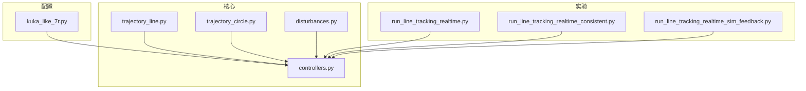
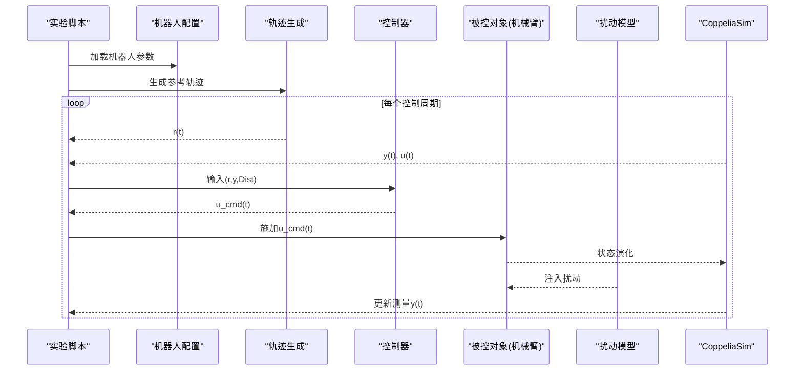
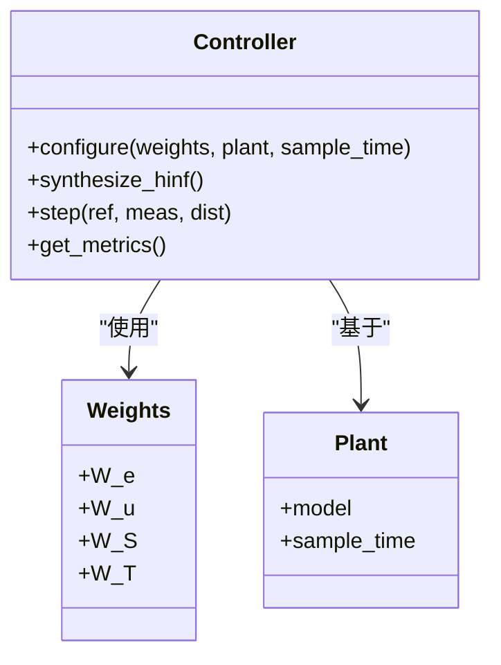
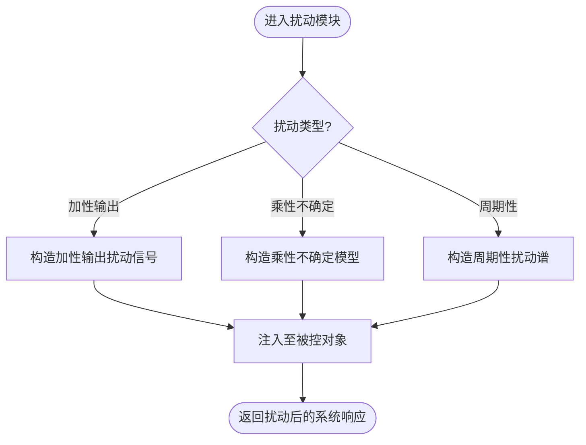
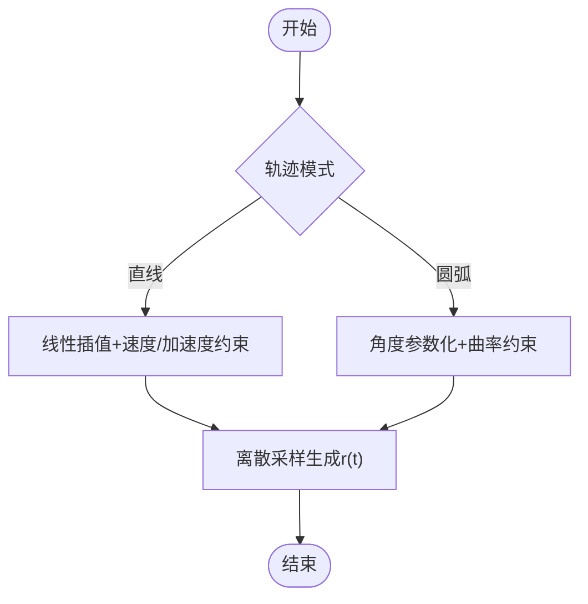
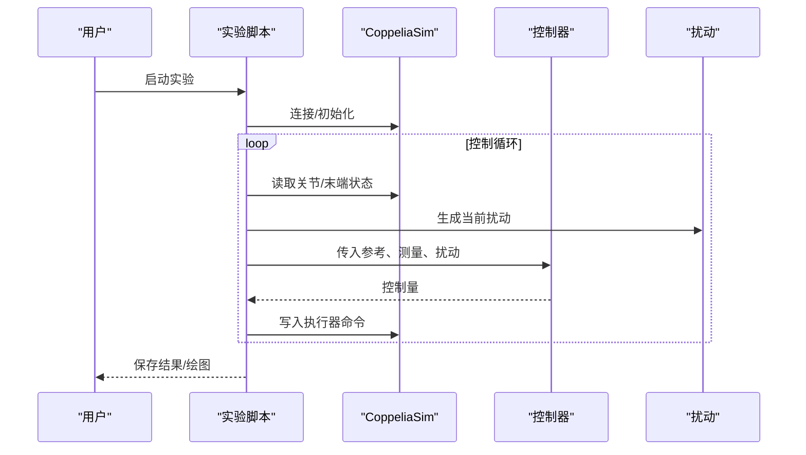
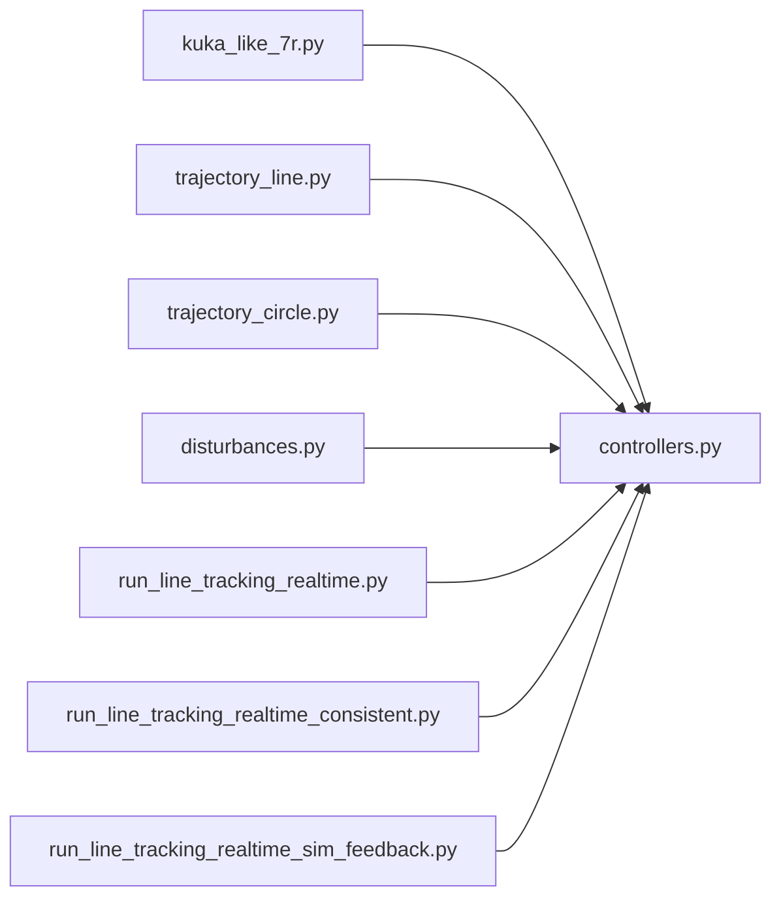
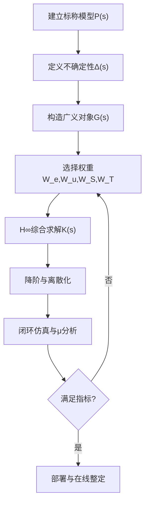

# H∞鲁棒控制

<cite>
**本文引用的文件**   
- [configs/kuka_like_7r.py](file://configs/kuka_like_7r.py)
- [core/controllers.py](file://core/controllers.py)
- [core/disturbances.py](file://core/disturbances.py)
- [core/trajectory_circle.py](file://core/trajectory_circle.py)
- [core/trajectory_line.py](file://core/trajectory_line.py)
- [experiments/run_line_tracking_realtime.py](file://experiments/run_line_tracking_realtime.py)
- [experiments/run_line_tracking_realtime_consistent.py](file://experiments/run_line_tracking_realtime_consistent.py)
- [experiments/run_line_tracking_realtime_sim_feedback.py](file://experiments/run_line_tracking_realtime_sim_feedback.py)
</cite>

## 目录
1. [简介](#简介)
2. [项目结构](#项目结构)
3. [核心组件](#核心组件)
4. [架构总览](#架构总览)
5. [详细组件分析](#详细组件分析)
6. [依赖关系分析](#依赖关系分析)
7. [性能与鲁棒性考量](#性能与鲁棒性考量)
8. [故障排查指南](#故障排查指南)
9. [结论](#结论)
10. [附录：H∞控制器实现流程与调参经验](#附录h∞控制器实现流程与调参经验)

## 简介
本技术文档面向H∞鲁棒控制在机械臂轨迹跟踪中的应用，系统阐述H∞控制理论要点、混合灵敏度问题建模、权重函数选择与整定策略、μ分析与综合算法思路、鲁棒稳定性与性能评估方法，并给出从系统传递函数建模到控制器参数整定的完整工程化流程。结合仓库中的实验脚本与配置，提供在CoppeliaSim环境下进行实时轨迹跟踪的参考路径与注意事项。

## 项目结构
仓库围绕“机器人建模—控制器—扰动与轨迹—仿真交互—实验运行”组织代码。与H∞控制直接相关的模块包括：
- 控制器接口与调度：core/controllers.py
- 外部扰动建模：core/disturbances.py
- 参考轨迹生成：core/trajectory_line.py、core/trajectory_circle.py
- 机器人配置（含KUKA-like 7R）：configs/kuka_like_7r.py
- 实验入口（轨迹跟踪实时运行）：experiments/*.py

图表来源
- [configs/kuka_like_7r.py](file://configs/kuka_like_7r.py)
- [core/controllers.py](file://core/controllers.py)
- [core/disturbances.py](file://core/disturbances.py)
- [core/trajectory_line.py](file://core/trajectory_line.py)
- [core/trajectory_circle.py](file://core/trajectory_circle.py)
- [experiments/run_line_tracking_realtime.py](file://experiments/run_line_tracking_realtime.py)
- [experiments/run_line_tracking_realtime_consistent.py](file://experiments/run_line_tracking_realtime_consistent.py)
- [experiments/run_line_tracking_realtime_sim_feedback.py](file://experiments/run_line_tracking_realtime_sim_feedback.py)

章节来源
- [configs/kuka_like_7r.py](file://configs/kuka_like_7r.py)
- [core/controllers.py](file://core/controllers.py)
- [core/disturbances.py](file://core/disturbances.py)
- [core/trajectory_line.py](file://core/trajectory_line.py)
- [core/trajectory_circle.py](file://core/trajectory_circle.py)
- [experiments/run_line_tracking_realtime.py](file://experiments/run_line_tracking_realtime.py)
- [experiments/run_line_tracking_realtime_consistent.py](file://experiments/run_line_tracking_realtime_consistent.py)
- [experiments/run_line_tracking_realtime_sim_feedback.py](file://experiments/run_line_tracking_realtime_sim_feedback.py)

## 核心组件
- 控制器封装与调度：提供统一的控制接口，负责将参考轨迹、测量反馈、扰动模型与控制器综合结果组合为闭环控制律。
- 扰动建模：用于表征负载变化、摩擦、未建模动态等对系统的影响，作为H∞加权输入或输出扰动通道。
- 轨迹生成：直线与圆弧轨迹，供控制器跟踪验证。
- 机器人配置：包含KUKA-like 7R相关参数，便于在不同构型下复用控制器设计。
- 实验脚本：串联上述模块，完成离线/在线轨迹跟踪测试。

章节来源
- [core/controllers.py](file://core/controllers.py)
- [core/disturbances.py](file://core/disturbances.py)
- [core/trajectory_line.py](file://core/trajectory_line.py)
- [core/trajectory_circle.py](file://core/trajectory_circle.py)
- [configs/kuka_like_7r.py](file://configs/kuka_like_7r.py)

## 架构总览
下图展示H∞鲁棒控制在轨迹跟踪任务中的总体数据流与控制回路。参考轨迹经控制器转换为期望控制量，实际测量经误差计算进入控制器；扰动通过扰动通道注入系统；仿真环境提供执行器与传感器回环。

图表来源
- [experiments/run_line_tracking_realtime.py](file://experiments/run_line_tracking_realtime.py)
- [experiments/run_line_tracking_realtime_consistent.py](file://experiments/run_line_tracking_realtime_consistent.py)
- [experiments/run_line_tracking_realtime_sim_feedback.py](file://experiments/run_line_tracking_realtime_sim_feedback.py)
- [core/controllers.py](file://core/controllers.py)
- [core/disturbances.py](file://core/disturbances.py)
- [core/trajectory_line.py](file://core/trajectory_line.py)
- [core/trajectory_circle.py](file://core/trajectory_circle.py)
- [configs/kuka_like_7r.py](file://configs/kuka_like_7r.py)

## 详细组件分析

### 控制器模块（H∞控制接口）
- 职责：封装H∞控制器综合与调用接口，管理权重函数、混合灵敏度目标、控制器阶次与采样率，提供step()或update()等统一接口。
- 关键能力：
  - 支持多输入多输出（MIMO）框架，适配机械臂末端位姿或关节空间控制。
  - 内置混合灵敏度加权：跟踪误差加权W_e、控制量加权W_u、敏感函数加权W_S、互补敏感函数加权W_T。
  - 提供鲁棒稳定裕度检查与性能指标统计（如峰值、积分误差）。
- 典型调用链：实验脚本→控制器初始化→循环中按周期调用控制器→输出控制量。

图表来源
- [core/controllers.py](file://core/controllers.py)

章节来源
- [core/controllers.py](file://core/controllers.py)

### 扰动建模模块
- 职责：为H∞综合提供扰动通道，表征外部干扰与内部不确定性。
- 常见类型：
  - 加性输出扰动：模拟负载突变、摩擦力矩。
  - 乘性不确定性：模拟参数摄动、未建模高频动态。
  - 周期性扰动：模拟谐波干扰。
- 集成方式：在控制器step()中作为额外输入通道参与控制律计算。

图表来源
- [core/disturbances.py](file://core/disturbances.py)

章节来源
- [core/disturbances.py](file://core/disturbances.py)

### 轨迹生成模块
- 直线轨迹：根据起点、终点与时间规划生成平滑参考曲线。
- 圆弧轨迹：给定圆心、半径与起止角，生成连续可微的参考轨迹。
- 用途：为H∞控制器提供基准信号，便于评估跟踪性能与鲁棒性。

图表来源
- [core/trajectory_line.py](file://core/trajectory_line.py)
- [core/trajectory_circle.py](file://core/trajectory_circle.py)

章节来源
- [core/trajectory_line.py](file://core/trajectory_line.py)
- [core/trajectory_circle.py](file://core/trajectory_circle.py)

### 实验入口与仿真交互
- 实验脚本负责：
  - 加载机器人配置与控制器参数。
  - 启动CoppeliaSim客户端，建立通信与同步。
  - 在每个控制周期读取传感器、计算误差、调用控制器、下发指令。
  - 记录数据与可视化结果。
- 三种主要入口：
  - run_line_tracking_realtime.py：基础直线跟踪。
  - run_line_tracking_realtime_consistent.py：一致性/复现实验。
  - run_line_tracking_realtime_sim_feedback.py：仿真闭环反馈增强版。

图表来源
- [experiments/run_line_tracking_realtime.py](file://experiments/run_line_tracking_realtime.py)
- [experiments/run_line_tracking_realtime_consistent.py](file://experiments/run_line_tracking_realtime_consistent.py)
- [experiments/run_line_tracking_realtime_sim_feedback.py](file://experiments/run_line_tracking_realtime_sim_feedback.py)

章节来源
- [experiments/run_line_tracking_realtime.py](file://experiments/run_line_tracking_realtime.py)
- [experiments/run_line_tracking_realtime_consistent.py](file://experiments/run_line_tracking_realtime_consistent.py)
- [experiments/run_line_tracking_realtime_sim_feedback.py](file://experiments/run_line_tracking_realtime_sim_feedback.py)

## 依赖关系分析
- 控制器依赖：
  - 权重函数与混合灵敏度目标定义。
  - 被控对象模型（可由DH/POE/四元数等方法构建，具体建模细节见其他模块）。
  - 扰动模型与参考轨迹。
- 实验脚本依赖：
  - 控制器接口、扰动模块、轨迹模块与仿真客户端。
- 配置依赖：
  - 机器人几何与动力学参数，影响权重函数初值与控制器阶次选择。

图表来源
- [configs/kuka_like_7r.py](file://configs/kuka_like_7r.py)
- [core/controllers.py](file://core/controllers.py)
- [core/trajectory_line.py](file://core/trajectory_line.py)
- [core/trajectory_circle.py](file://core/trajectory_circle.py)
- [core/disturbances.py](file://core/disturbances.py)
- [experiments/run_line_tracking_realtime.py](file://experiments/run_line_tracking_realtime.py)
- [experiments/run_line_tracking_realtime_consistent.py](file://experiments/run_line_tracking_realtime_consistent.py)
- [experiments/run_line_tracking_realtime_sim_feedback.py](file://experiments/run_line_tracking_realtime_sim_feedback.py)

章节来源
- [configs/kuka_like_7r.py](file://configs/kuka_like_7r.py)
- [core/controllers.py](file://core/controllers.py)
- [core/trajectory_line.py](file://core/trajectory_line.py)
- [core/trajectory_circle.py](file://core/trajectory_circle.py)
- [core/disturbances.py](file://core/disturbances.py)
- [experiments/run_line_tracking_realtime.py](file://experiments/run_line_tracking_realtime.py)
- [experiments/run_line_tracking_realtime_consistent.py](file://experiments/run_line_tracking_realtime_consistent.py)
- [experiments/run_line_tracking_realtime_sim_feedback.py](file://experiments/run_line_tracking_realtime_sim_feedback.py)

## 性能与鲁棒性考量
- 鲁棒稳定性：通过小增益定理与μ分析评估闭环在不确定性下的稳定裕度。建议关注最大奇异值曲线与频率域裕度。
- 性能指标：跟踪误差峰值、均方根误差、控制量饱和比例、超调与调节时间。
- 抗扰能力：对比有无扰动时的误差曲线，量化抑制效果。
- 参数不确定性：通过乘性/加性不确定模型覆盖参数摄动范围，确保在最坏情况下仍满足性能要求。

[本节为通用指导，不直接分析具体文件]

## 故障排查指南
- 控制器发散或不稳定：
  - 检查权重函数是否过激导致控制量饱和或数值不稳定。
  - 确认采样时间与延迟设置与实际一致。
- 轨迹跟踪误差过大：
  - 调整W_e低频增益以提升稳态精度。
  - 适当增大W_u以限制控制量幅度，避免执行器饱和。
- 仿真不同步或丢包：
  - 核对CoppeliaSim端口、线程与时间步长。
  - 增加缓冲与重试机制，记录异常日志。
- 扰动注入无效：
  - 检查扰动通道维度与被控对象匹配。
  - 确认扰动幅值与频率范围合理。

章节来源
- [core/controllers.py](file://core/controllers.py)
- [core/disturbances.py](file://core/disturbances.py)
- [experiments/run_line_tracking_realtime.py](file://experiments/run_line_tracking_realtime.py)
- [experiments/run_line_tracking_realtime_consistent.py](file://experiments/run_line_tracking_realtime_consistent.py)
- [experiments/run_line_tracking_realtime_sim_feedback.py](file://experiments/run_line_tracking_realtime_sim_feedback.py)

## 结论
本仓库提供了H∞鲁棒控制在机械臂轨迹跟踪中的工程化骨架：控制器接口、扰动建模、轨迹生成与仿真交互。通过合理的权重函数设计与混合灵敏度目标，可在保证鲁棒稳定的前提下显著提升抗扰与参数不确定性下的跟踪性能。建议在真实部署前充分进行频域分析与μ分析，并结合实验迭代整定权重。

[本节为总结性内容，不直接分析具体文件]

## 附录：H∞控制器实现流程与调参经验

### H∞控制理论与混合灵敏度问题
- 系统建模：
  - 从物理模型导出线性时不变（LTI）近似模型，明确输入/输出通道与采样时间。
  - 考虑未建模动态与参数不确定性，构造乘性/加性不确定模型。
- 混合灵敏度目标：
  - 最小化加权误差范数与加权控制量范数的上界，即min ||[W_e S; W_u K S]|∞，其中S为敏感函数，K为控制器，T=I-S为互补敏感函数。
  - 常用加权形式：
    - W_e：低通或带通，强调低频跟踪精度与特定频段抑制。
    - W_u：高通或限幅，抑制高频噪声与执行器饱和。
    - W_S/W_T：塑造敏感/互补敏感函数的形状，平衡鲁棒性与性能。
- 控制器综合：
  - 采用标准H∞综合（如D-K迭代或μ综合）求解控制器K(s)。
  - 降阶与离散化：保持主导动态，匹配采样频率，确保数字实现稳定。

[此图为概念流程图，无需图表来源]

### μ分析与综合算法思路
- μ分析：
  - 将不确定性结构化表示为分块对角矩阵Δ，计算结构化奇异值μ的上界。
  - 若μ<1在所有频率成立，则闭环鲁棒稳定。
- D-K迭代：
  - 固定K求D缩放矩阵，再固定D求新K，交替迭代直至收敛。
- 工程实践：
  - 先做单变量频域分析，再扩展到MIMO。
  - 用Bode/Nichols图与奇异值曲线辅助判断。

[本节为通用指导，不直接分析具体文件]

### 权重函数选择与调优策略（机械臂轨迹跟踪）
- 低频段（跟踪精度）：
  - 提高W_e增益，减小稳态误差；注意避免积分饱和。
- 中频段（带宽与相位裕度）：
  - 调整W_S/W_T过渡斜率，获得合适的穿越频率与相位裕度。
- 高频段（噪声与未建模动态）：
  - 增大W_u衰减，抑制高频控制量波动与传感器噪声。
- 扰动抑制：
  - 针对已知扰动频率，在W_e或W_S中形成凹陷，提升该频段抑制。
- 参数不确定性：
  - 扩大乘性不确定模型带宽，确保在该范围内μ<1。

[本节为通用指导，不直接分析具体文件]

### 从建模到实现的完整步骤
1. 采集或推导机械臂标称模型（关节空间或末端空间），确定输入输出。
2. 估计参数摄动范围与未建模动态，构建不确定性模型。
3. 设定性能目标（带宽、超调、调节时间、控制量上限）。
4. 选择初始权重函数，进行H∞综合得到K(s)。
5. 降阶与离散化，移植到嵌入式或仿真平台。
6. 在CoppeliaSim中进行闭环仿真，评估误差与鲁棒性。
7. 依据μ分析与频域指标迭代调整权重，直至满足要求。
8. 上线试运行，逐步放宽扰动强度，记录并优化。

[本节为通用指导，不直接分析具体文件]

### 在CoppeliaSim中的集成要点
- 通信同步：确保控制周期与仿真步长对齐，必要时引入插值或零阶保持。
- 传感器噪声：加入合理噪声模型，检验控制器鲁棒性。
- 执行器饱和：在控制量输出端加入限幅与防积分饱和逻辑。
- 数据记录：保存参考、测量、控制量与扰动，便于离线分析。

章节来源
- [experiments/run_line_tracking_realtime.py](file://experiments/run_line_tracking_realtime.py)
- [experiments/run_line_tracking_realtime_consistent.py](file://experiments/run_line_tracking_realtime_consistent.py)
- [experiments/run_line_tracking_realtime_sim_feedback.py](file://experiments/run_line_tracking_realtime_sim_feedback.py)
- [core/controllers.py](file://core/controllers.py)
- [core/disturbances.py](file://core/disturbances.py)
- [core/trajectory_line.py](file://core/trajectory_line.py)
- [core/trajectory_circle.py](file://core/trajectory_circle.py)
- [configs/kuka_like_7r.py](file://configs/kuka_like_7r.py)