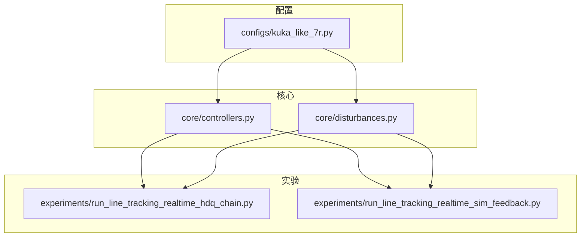
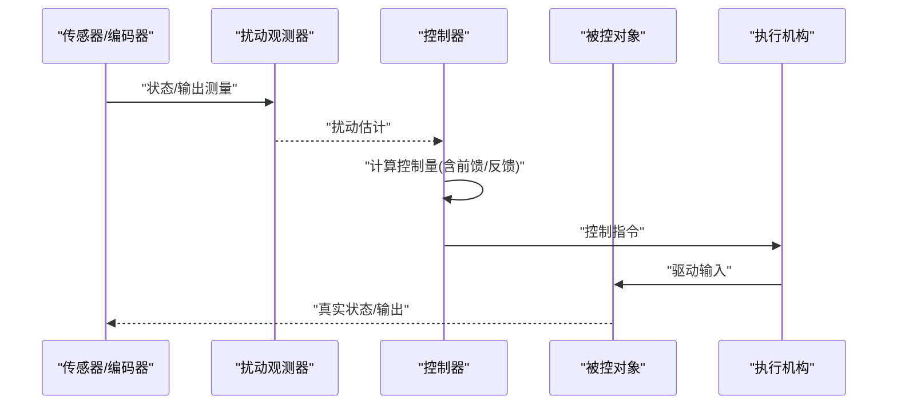
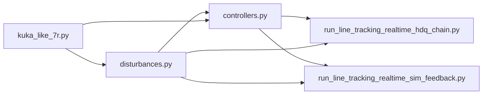

# 扰动观测器

<cite>
**本文引用的文件**   
- [core/disturbances.py](file://core/disturbances.py)
- [core/controllers.py](file://core/controllers.py)
- [configs/kuka_like_7r.py](file://configs/kuka_like_7r.py)
- [experiments/run_line_tracking_realtime_hdq_chain.py](file://experiments/run_line_tracking_realtime_hdq_chain.py)
- [experiments/run_line_tracking_realtime_sim_feedback.py](file://experiments/run_line_tracking_realtime_sim_feedback.py)
</cite>

## 目录
1. [引言](#引言)
2. [项目结构](#项目结构)
3. [核心组件](#核心组件)
4. [架构总览](#架构总览)
5. [详细组件分析](#详细组件分析)
6. [依赖关系分析](#依赖关系分析)
7. [性能考虑](#性能考虑)
8. [故障排查指南](#故障排查指南)
9. [结论](#结论)
10. [附录](#附录)

## 引言
本技术文档围绕“扰动观测器”模块，系统阐述其设计原理、实现方法与工程实践。内容覆盖：
- 扰动估计理论、观测器动态特性与稳定性分析
- 滑模扰动观测器（SMDO）、扩张状态观测器（ESO）与自适应扰动观测器的实现思路
- 前馈/后馈扰动补偿策略
- 从扰动建模到参数整定的完整设计流程
- 外部扰动、参数不确定性与测量噪声的分离与估计
- 在控制系统中提升鲁棒性与抗扰能力的实际效果

## 项目结构
本项目采用分层组织方式：配置、核心算法与控制、实验脚本与仿真接口等。与扰动观测器直接相关的代码主要位于 core 与 configs 目录，并在 experiments 中的部分脚本进行集成验证。

图表来源
- [configs/kuka_like_7r.py](file://configs/kuka_like_7r.py)
- [core/disturbances.py](file://core/disturbances.py)
- [core/controllers.py](file://core/controllers.py)
- [experiments/run_line_tracking_realtime_hdq_chain.py](file://experiments/run_line_tracking_realtime_hdq_chain.py)
- [experiments/run_line_tracking_realtime_sim_feedback.py](file://experiments/run_line_tracking_realtime_sim_feedback.py)

章节来源
- [configs/kuka_like_7r.py](file://configs/kuka_like_7r.py)
- [core/disturbances.py](file://core/disturbances.py)
- [core/controllers.py](file://core/controllers.py)
- [experiments/run_line_tracking_realtime_hdq_chain.py](file://experiments/run_line_tracking_realtime_hdq_chain.py)
- [experiments/run_line_tracking_realtime_sim_feedback.py](file://experiments/run_line_tracking_realtime_sim_feedback.py)

## 核心组件
- 扰动观测器实现与接口：提供统一的扰动估计接口与多种观测器类型（如滑模、扩张状态、自适应），并暴露估计值、收敛性指标与可调参数。
- 控制器集成：将扰动估计用于控制律的前馈补偿或误差反馈增强，形成复合控制结构。
- 配置管理：集中定义观测器带宽、增益、饱和限幅、滤波器等关键参数，便于在不同机器人构型下复用。
- 实验验证：在轨迹跟踪任务中对比有无扰动补偿的性能差异，评估鲁棒性与抗扰能力。

章节来源
- [core/disturbances.py](file://core/disturbances.py)
- [core/controllers.py](file://core/controllers.py)
- [configs/kuka_like_7r.py](file://configs/kuka_like_7r.py)
- [experiments/run_line_tracking_realtime_hdq_chain.py](file://experiments/run_line_tracking_realtime_hdq_chain.py)
- [experiments/run_line_tracking_realtime_sim_feedback.py](file://experiments/run_line_tracking_realtime_sim_feedback.py)

## 架构总览
下图展示了扰动观测器在闭环系统中的位置与数据流：传感器测量进入观测器得到扰动估计，控制器结合模型与前馈补偿输出控制量，执行机构作用于被控对象，形成闭环。

图表来源
- [core/disturbances.py](file://core/disturbances.py)
- [core/controllers.py](file://core/controllers.py)

## 详细组件分析

### 扰动观测器设计与理论
- 扰动建模
  - 将未建模动态、外部干扰与参数不确定性统一为“广义扰动”，作为扩展状态的一部分进行估计。
  - 针对周期性扰动可引入参考信号生成环节，提高估计精度。
- 观测器动态特性
  - 通过合理选择观测器带宽与增益，使扰动估计误差快速收敛至有界邻域。
  - 对高频测量噪声敏感时，可在观测器内部或前端加入低通滤波以抑制噪声放大。
- 稳定性分析
  - 基于李雅普诺夫方法或频域判据，给出观测器稳定条件与参数范围。
  - 对于非线性项或强耦合场景，可采用小增益定理或输入-状态稳定（ISS）框架进行分析。

章节来源
- [core/disturbances.py](file://core/disturbances.py)
- [core/controllers.py](file://core/controllers.py)

### 滑模扰动观测器（SMDO）
- 设计要点
  - 利用不连续切换项构造等效扰动估计，具备对匹配扰动的强鲁棒性。
  - 需处理抖振问题，可通过边界层平滑、高阶滑模或自适应切换增益降低高频振荡。
- 适用场景
  - 外部扰动变化较快且幅度较大，要求快速估计与较强鲁棒性的场合。
- 参数整定
  - 切换增益与边界层宽度需权衡估计速度与抖振程度；观测器带宽应与控制器带宽协调。

章节来源
- [core/disturbances.py](file://core/disturbances.py)

### 扩张状态观测器（ESO）
- 设计要点
  - 将扰动作为额外状态，构建线性或非线性的扩张状态方程，使用高增益或极点配置方法进行估计。
  - 典型形式包含带宽参数化设计，便于工程整定。
- 适用场景
  - 需要统一处理模型不确定性与外部扰动的通用平台，易于在多变量系统中推广。
- 参数整定
  - 以观测器带宽为核心参数，结合滤波器时间常数与采样周期进行调优。

章节来源
- [core/disturbances.py](file://core/disturbances.py)

### 自适应扰动观测器
- 设计要点
  - 在线辨识扰动上界或相关参数，依据估计误差自适应调整观测器增益，提升对不同工况的适应性。
  - 常与投影算子或死区函数配合，保证参数有界与数值稳定。
- 适用场景
  - 扰动统计特性未知或随时间缓慢变化的复杂环境。
- 参数整定
  - 自适应速率、投影阈值与初始增益是关键；需避免过激更新导致发散。

章节来源
- [core/disturbances.py](file://core/disturbances.py)

### 扰动补偿机制
- 前馈补偿
  - 将扰动估计直接注入控制量，抵消其对输出的影响，适用于匹配扰动。
  - 优点为响应快、静态误差小；需注意估计延迟与饱和限制。
- 后馈补偿
  - 将扰动估计作为反馈通道的一部分，增强误差回路的鲁棒性，适用于非匹配扰动或强耦合场景。
  - 可与传统PID或现代控制律叠加，形成复合控制。
- 混合策略
  - 前馈+后馈组合，兼顾快速性与鲁棒性；需进行稳定性与性能的综合权衡。

章节来源
- [core/controllers.py](file://core/controllers.py)

### 设计流程与参数整定
- 步骤概览
  - 建立标称模型与扰动模型，确定匹配与非匹配扰动分布。
  - 选择观测器类型（SMDO/ESO/自适应），推导动态方程与估计误差模型。
  - 初设观测器带宽与增益，进行开环估计性能评估。
  - 闭环联调，逐步提升带宽直至满足稳态误差与动态响应要求。
  - 加入滤波与饱和限幅，验证对测量噪声与执行器限制的鲁棒性。
- 关键参数
  - 观测器带宽、切换增益/边界层、自适应速率、滤波器截止频率、饱和限幅阈值。
- 验证手段
  - 阶跃/正弦扰动注入、蒙特卡洛参数摄动、不同负载与摩擦条件下的对比试验。

章节来源
- [configs/kuka_like_7r.py](file://configs/kuka_like_7r.py)
- [core/disturbances.py](file://core/disturbances.py)
- [core/controllers.py](file://core/controllers.py)

### 不同类型扰动的处理
- 外部扰动
  - 通常表现为加性力矩或力，适合前馈补偿；若存在非匹配路径，建议辅以后馈增强。
- 参数不确定性
  - 通过自适应机制在线修正观测器增益或扰动上界，提高估计一致性。
- 测量噪声
  - 在观测器前端或内部引入低通滤波，避免高频噪声被放大；必要时采用滑动平均或卡尔曼滤波预处理。

章节来源
- [core/disturbances.py](file://core/disturbances.py)
- [core/controllers.py](file://core/controllers.py)

### 实际应用效果
- 轨迹跟踪任务中，启用扰动观测器与补偿后，可显著降低跟踪误差与超调，提升对负载变化与外部冲击的鲁棒性。
- 在实时实验中，观测器估计值可用于诊断与可视化，辅助调试与性能评估。

章节来源
- [experiments/run_line_tracking_realtime_hdq_chain.py](file://experiments/run_line_tracking_realtime_hdq_chain.py)
- [experiments/run_line_tracking_realtime_sim_feedback.py](file://experiments/run_line_tracking_realtime_sim_feedback.py)

## 依赖关系分析
- 模块内聚与耦合
  - disturbances.py 提供观测器核心逻辑，controllers.py 负责控制律与补偿策略，二者通过清晰接口交互。
  - configs 集中管理参数，降低硬编码带来的耦合度。
- 外部依赖
  - 仿真与硬件接口由 sim 与 experiments 层调用，核心模块保持与具体平台的解耦。

图表来源
- [core/disturbances.py](file://core/disturbances.py)
- [core/controllers.py](file://core/controllers.py)
- [configs/kuka_like_7r.py](file://configs/kuka_like_7r.py)
- [experiments/run_line_tracking_realtime_hdq_chain.py](file://experiments/run_line_tracking_realtime_hdq_chain.py)
- [experiments/run_line_tracking_realtime_sim_feedback.py](file://experiments/run_line_tracking_realtime_sim_feedback.py)

章节来源
- [core/disturbances.py](file://core/disturbances.py)
- [core/controllers.py](file://core/controllers.py)
- [configs/kuka_like_7r.py](file://configs/kuka_like_7r.py)
- [experiments/run_line_tracking_realtime_hdq_chain.py](file://experiments/run_line_tracking_realtime_hdq_chain.py)
- [experiments/run_line_tracking_realtime_sim_feedback.py](file://experiments/run_line_tracking_realtime_sim_feedback.py)

## 性能考虑
- 带宽与稳定性
  - 观测器带宽过高会放大噪声并可能引发不稳定；过低则估计滞后明显。建议与控制器带宽按经验比例整定并进行闭环验证。
- 计算开销
  - 在高维或多轴系统中，ESO与自适应观测器会增加计算负担；应优化数据结构与循环，确保实时性。
- 饱和与限幅
  - 控制量与扰动估计需设置合理限幅，防止执行器饱和与数值溢出。
- 滤波与平滑
  - 对高频噪声敏感的观测器需加入滤波环节；注意滤波引入的相位滞后对稳定性的影响。

[本节为通用指导，无需特定文件引用]

## 故障排查指南
- 估计发散或震荡
  - 检查观测器带宽是否过大、切换增益是否过高；适当降低带宽或增大边界层。
- 跟踪误差增大
  - 确认前馈补偿符号与尺度是否正确；核对扰动估计与控制器输入的连接关系。
- 噪声敏感
  - 增加前端滤波或观测器内部低通滤波；检查采样率与滤波器截止频率匹配情况。
- 实时性不足
  - 简化观测器结构或降阶；优化循环与内存分配；减少不必要的日志输出。

章节来源
- [core/disturbances.py](file://core/disturbances.py)
- [core/controllers.py](file://core/controllers.py)

## 结论
扰动观测器通过将未建模动态与外部干扰纳入估计，显著提升控制系统的鲁棒性与抗扰能力。通过合理选择观测器类型、严谨的参数整定与有效的补偿策略，可在多类扰动环境下获得稳定的高性能控制表现。建议在工程中优先采用模块化与参数化的设计，便于在不同平台与任务间快速迁移与复用。

[本节为总结性内容，无需特定文件引用]

## 附录
- 术语表
  - 广义扰动：包含外部干扰、未建模动态与参数不确定性的统一表示。
  - 匹配扰动：作用通道与控制输入一致，可直接前馈补偿的扰动。
  - 非匹配扰动：作用通道与控制输入不一致，需借助反馈增强处理的扰动。
- 推荐实践
  - 先离线整定观测器参数，再进行闭环微调。
  - 记录扰动估计与误差曲线，辅助分析与迭代改进。
  - 在安全范围内逐步提升观测器带宽，避免突变导致的失稳。

[本节为补充信息，无需特定文件引用]