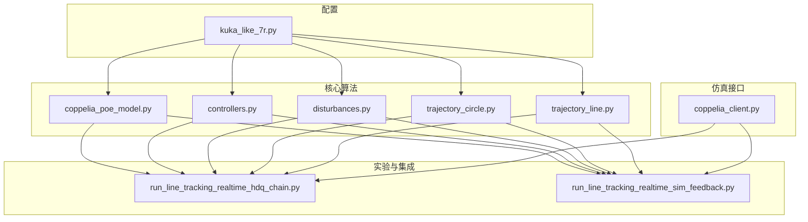
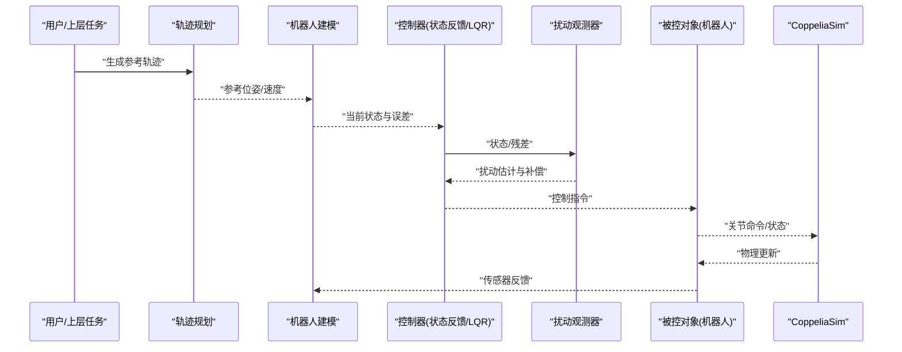
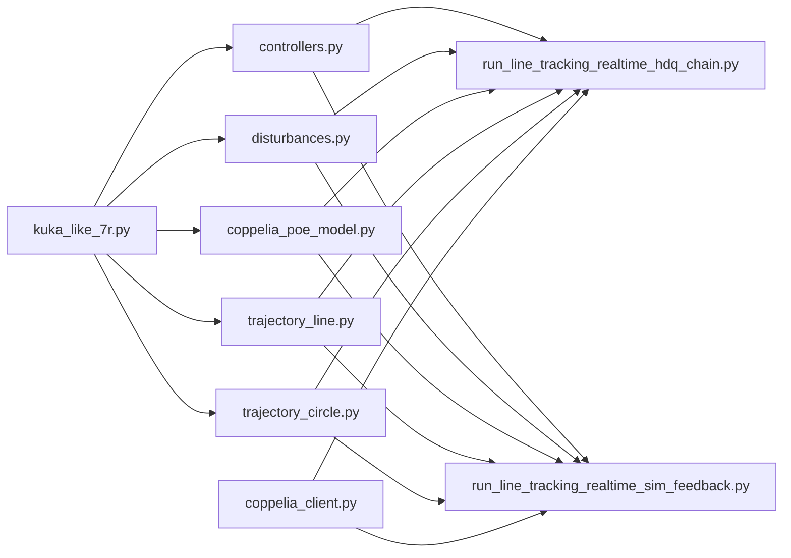
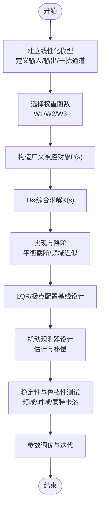

# 控制系统设计

<cite>
**本文引用的文件**   
- [configs/kuka_like_7r.py](file://configs/kuka_like_7r.py)
- [core/controllers.py](file://core/controllers.py)
- [core/disturbances.py](file://core/disturbances.py)
- [core/coppelia_poe_model.py](file://core/coppelia_poe_model.py)
- [core/trajectory_circle.py](file://core/trajectory_circle.py)
- [core/trajectory_line.py](file://core/trajectory_line.py)
- [experiments/run_line_tracking_realtime_hdq_chain.py](file://experiments/run_line_tracking_realtime_hdq_chain.py)
- [experiments/run_line_tracking_realtime_sim_feedback.py](file://experiments/run_line_tracking_realtime_sim_feedback.py)
- [sim/coppelia_client.py](file://sim/coppelia_client.py)
</cite>

## 目录
1. [引言](#引言)
2. [项目结构](#项目结构)
3. [核心组件](#核心组件)
4. [架构总览](#架构总览)
5. [详细组件分析](#详细组件分析)
6. [依赖关系分析](#依赖关系分析)
7. [性能与鲁棒性考量](#性能与鲁棒性考量)
8. [故障排查指南](#故障排查指南)
9. [结论](#结论)
10. [附录：H∞与状态反馈设计流程](#附录h∞与状态反馈设计流程)

## 引言
本技术文档面向控制系统设计模块，围绕H∞鲁棒控制、状态反馈控制器（极点配置、LQR）以及扰动观测器展开，结合仓库中的机器人建模、轨迹生成与仿真接口，给出从系统建模到控制器实现的完整流程。文档同时提供稳定性与鲁棒性分析方法、性能评估指标，以及在CoppeliaSim环境下的参数调优经验与最佳实践，帮助读者快速落地并优化实际场景的控制系统。

## 项目结构
本项目采用分层组织方式：
- 配置层：机器人模型与实验参数集中管理
- 核心算法层：控制器、扰动模型、运动学/动力学建模、轨迹规划
- 实验与集成层：实时跟踪、仿真交互、数据记录与可视化
- 仿真接口层：与CoppeliaSim通信与关节命名映射

图表来源
- [configs/kuka_like_7r.py](file://configs/kuka_like_7r.py)
- [core/controllers.py](file://core/controllers.py)
- [core/disturbances.py](file://core/disturbances.py)
- [core/coppelia_poe_model.py](file://core/coppelia_poe_model.py)
- [core/trajectory_circle.py](file://core/trajectory_circle.py)
- [core/trajectory_line.py](file://core/trajectory_line.py)
- [experiments/run_line_tracking_realtime_hdq_chain.py](file://experiments/run_line_tracking_realtime_hdq_chain.py)
- [experiments/run_line_tracking_realtime_sim_feedback.py](file://experiments/run_line_tracking_realtime_sim_feedback.py)
- [sim/coppelia_client.py](file://sim/coppelia_client.py)

章节来源
- [configs/kuka_like_7r.py](file://configs/kuka_like_7r.py)
- [core/controllers.py](file://core/controllers.py)
- [core/disturbances.py](file://core/disturbances.py)
- [core/coppelia_poe_model.py](file://core/coppelia_poe_model.py)
- [core/trajectory_circle.py](file://core/trajectory_circle.py)
- [core/trajectory_line.py](file://core/trajectory_line.py)
- [experiments/run_line_tracking_realtime_hdq_chain.py](file://experiments/run_line_tracking_realtime_hdq_chain.py)
- [experiments/run_line_tracking_realtime_sim_feedback.py](file://experiments/run_line_tracking_realtime_sim_feedback.py)
- [sim/coppelia_client.py](file://sim/coppelia_client.py)

## 核心组件
- 控制器模块：实现状态反馈控制策略，包括极点配置与LQR最优控制，支持多输入多输出线性化模型的闭环控制。
- 扰动模块：提供外部扰动、参数不确定性及测量噪声等扰动模型，便于在设计与验证阶段进行鲁棒性评估。
- 机器人建模：基于POE（Product of Exponential）的运动学建模，为控制器提供精确的参考轨迹与误差计算。
- 轨迹规划：直线与圆弧轨迹生成，用于位置/姿态跟踪任务。
- 仿真接口：与CoppeliaSim通信，读取关节状态并发送控制指令，支撑半实物或全仿真验证。

章节来源
- [core/controllers.py](file://core/controllers.py)
- [core/disturbances.py](file://core/disturbances.py)
- [core/coppelia_poe_model.py](file://core/coppelia_poe_model.py)
- [core/trajectory_circle.py](file://core/trajectory_circle.py)
- [core/trajectory_line.py](file://core/trajectory_line.py)
- [sim/coppelia_client.py](file://sim/coppelia_client.py)

## 架构总览
整体控制回路包含“参考轨迹—误差计算—控制器—执行器—被控对象—传感器”的闭环路径，并在设计中引入扰动观测器以估计并补偿未知扰动与模型失配。

图表来源
- [core/trajectory_line.py](file://core/trajectory_line.py)
- [core/trajectory_circle.py](file://core/trajectory_circle.py)
- [core/coppelia_poe_model.py](file://core/coppelia_poe_model.py)
- [core/controllers.py](file://core/controllers.py)
- [core/disturbances.py](file://core/disturbances.py)
- [sim/coppelia_client.py](file://sim/coppelia_client.py)

## 详细组件分析

### H∞鲁棒控制设计与权重函数选择
- 设计目标：在存在外部扰动与模型不确定性的情况下，保证闭环系统的稳定性与性能指标（如灵敏度与补灵敏度的加权范数有界）。
- 建模步骤：
  - 建立线性化被控对象模型，明确输入、输出与干扰通道。
  - 定义性能输出（跟踪误差、控制量）与干扰输入（外部扰动、参数摄动、测量噪声）。
  - 选择合适的权重函数W1、W2、W3，分别对低频跟踪误差、高频控制平滑性与鲁棒稳定性进行约束。
- 综合过程：
  - 构造广义被控对象P(s)，将权重函数嵌入标准H∞框架。
  - 求解Riccati方程或LMI得到稳定且满足性能指标的K(s)。
  - 降阶与实现：必要时进行平衡截断或频域近似，确保可实时实现。
- 权重函数选择要点：
  - W1强调低频增益以提升跟踪精度；W2抑制高频增益以降低控制能量与传感器噪声放大；W3针对未建模动态与不确定性边界。
  - 通过Bode图与奇异值曲线校验各通道的幅频特性，避免过度保守或不足。

章节来源
- [core/controllers.py](file://core/controllers.py)
- [core/disturbances.py](file://core/disturbances.py)

### 状态反馈控制器：极点配置与LQR
- 极点配置：
  - 基于线性化模型A、B，选择期望极点集合，求解K使(A-BK)的特征值位于期望区域。
  - 适用于单输入或低维MIMO系统，需关注可控性与模态耦合。
- LQR最优控制：
  - 定义代价函数J=∫(x^TQx+u^TRu)dt，求解代数Riccati方程得到K=R^{-1}B^TP。
  - Q、R矩阵调节体现对状态误差与控制能量的权衡；可通过对角加权或按通道缩放简化调参。
- 实现建议：
  - 在线求解仅用于离线设计，运行时使用固定增益K。
  - 若存在积分项需求，可扩展状态向量加入误差积分，形成LQI。

章节来源
- [core/controllers.py](file://core/controllers.py)

### 扰动观测器设计：估计、补偿与稳定性
- 设计原理：
  - 利用模型预测与实际输出的残差，构建低通滤波器形式的扰动估计器，分离慢变扰动与快变未建模动态。
  - 估计值用于前馈补偿，提升抗扰能力与鲁棒性。
- 关键步骤：
  - 选择观测器带宽与滤波时间常数，使其覆盖主要扰动频段但不放大高频噪声。
  - 在状态空间形式下推导估计误差动态，确保估计误差收敛。
- 稳定性分析：
  - 将扰动观测器与主控制器串联，分析复合系统的Nyquist或Bode裕度。
  - 通过小增益定理检查环路乘积的幅值上界，确保闭环稳定。

章节来源
- [core/disturbances.py](file://core/disturbances.py)
- [core/controllers.py](file://core/controllers.py)

### 扰动模型：外部扰动、参数不确定性与测量噪声
- 外部扰动：
  - 模拟负载变化、风载或摩擦突变等，常用阶跃、正弦或随机序列叠加。
- 参数不确定性：
  - 对质量、惯量、阻尼等参数施加±百分比摄动，评估最坏情况下的性能退化。
- 测量噪声：
  - 在高斯白噪声基础上增加偏置或色噪声，检验观测器与滤波器的鲁棒性。
- 测试方法：
  - 蒙特卡洛仿真统计性能指标分布；频域扫描评估敏感函数峰值。

章节来源
- [core/disturbances.py](file://core/disturbances.py)

### 轨迹规划与误差计算
- 直线轨迹：
  - 根据起点与终点插值生成位置/速度/加速度曲线，保证连续性与可微性。
- 圆弧轨迹：
  - 基于圆心、半径与起止角生成平滑路径，注意切向速度与法向加速度的匹配。
- 误差计算：
  - 将参考轨迹与当前状态映射到同一坐标系，计算位置与姿态误差，供控制器使用。

章节来源
- [core/trajectory_line.py](file://core/trajectory_line.py)
- [core/trajectory_circle.py](file://core/trajectory_circle.py)
- [core/coppelia_poe_model.py](file://core/coppelia_poe_model.py)

### 仿真与系统集成
- CoppeliaSim接口：
  - 通过客户端连接仿真环境，读取关节角度与速度，发送控制指令。
  - 同步时钟与采样周期，确保控制循环稳定运行。
- 实验脚本：
  - 集成轨迹、控制器与扰动模块，完成端到端跟踪与鲁棒性测试。

章节来源
- [sim/coppelia_client.py](file://sim/coppelia_client.py)
- [experiments/run_line_tracking_realtime_hdq_chain.py](file://experiments/run_line_tracking_realtime_hdq_chain.py)
- [experiments/run_line_tracking_realtime_sim_feedback.py](file://experiments/run_line_tracking_realtime_sim_feedback.py)

## 依赖关系分析

图表来源
- [configs/kuka_like_7r.py](file://configs/kuka_like_7r.py)
- [core/controllers.py](file://core/controllers.py)
- [core/disturbances.py](file://core/disturbances.py)
- [core/coppelia_poe_model.py](file://core/coppelia_poe_model.py)
- [core/trajectory_circle.py](file://core/trajectory_circle.py)
- [core/trajectory_line.py](file://core/trajectory_line.py)
- [experiments/run_line_tracking_realtime_hdq_chain.py](file://experiments/run_line_tracking_realtime_hdq_chain.py)
- [experiments/run_line_tracking_realtime_sim_feedback.py](file://experiments/run_line_tracking_realtime_sim_feedback.py)
- [sim/coppelia_client.py](file://sim/coppelia_client.py)

章节来源
- [configs/kuka_like_7r.py](file://configs/kuka_like_7r.py)
- [core/controllers.py](file://core/controllers.py)
- [core/disturbances.py](file://core/disturbances.py)
- [core/coppelia_poe_model.py](file://core/coppelia_poe_model.py)
- [core/trajectory_circle.py](file://core/trajectory_circle.py)
- [core/trajectory_line.py](file://core/trajectory_line.py)
- [experiments/run_line_tracking_realtime_hdq_chain.py](file://experiments/run_line_tracking_realtime_hdq_chain.py)
- [experiments/run_line_tracking_realtime_sim_feedback.py](file://experiments/run_line_tracking_realtime_sim_feedback.py)
- [sim/coppelia_client.py](file://sim/coppelia_client.py)

## 性能与鲁棒性考量
- 稳定性分析：
  - 时域：阶跃响应超调、调节时间与稳态误差。
  - 频域：相位裕度、增益裕度与敏感函数峰值。
- 鲁棒性测试：
  - 参数摄动范围扫描，观察最坏情况下的性能退化。
  - 扰动强度递增，评估抗扰能力与饱和限制。
- 性能评估：
  - IAE、ISE、ITAE等积分指标对比不同权重与控制器参数。
  - 控制能量与执行器利用率监控，避免过度驱动。

[本节为通用指导，不直接分析具体文件]

## 故障排查指南
- 仿真通信异常：
  - 检查CoppeliaSim端口、权限与网络连通性，确认客户端初始化成功。
- 轨迹与误差异常：
  - 核对坐标系变换与参考点定义，确认误差计算一致。
- 控制器不稳定：
  - 降低观测器带宽或减小LQR Q权重，逐步恢复稳定后再提升性能。
- 扰动估计发散：
  - 调整低通滤波器截止频率，避免噪声放大；检查残差信号是否合理。

章节来源
- [sim/coppelia_client.py](file://sim/coppelia_client.py)
- [core/controllers.py](file://core/controllers.py)
- [core/disturbances.py](file://core/disturbances.py)

## 结论
本控制系统设计模块以H∞鲁棒控制为核心，结合状态反馈与扰动观测器，构建了从建模、轨迹规划到仿真集成的完整闭环。通过合理的权重函数选择与扰动模型设置，可在不确定性与外部扰动环境下获得稳定的跟踪性能。建议在工程实践中先以LQR与极点配置奠定基线，再引入H∞与扰动观测器提升鲁棒性，并通过频域与时域联合评估迭代优化。

[本节为总结性内容，不直接分析具体文件]

## 附录：H∞与状态反馈设计流程

[本图为概念流程图，不直接映射具体源文件]