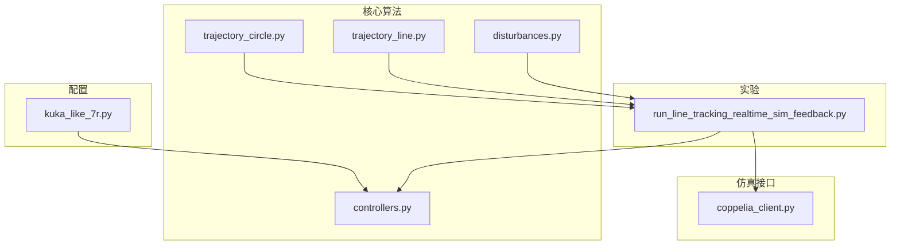
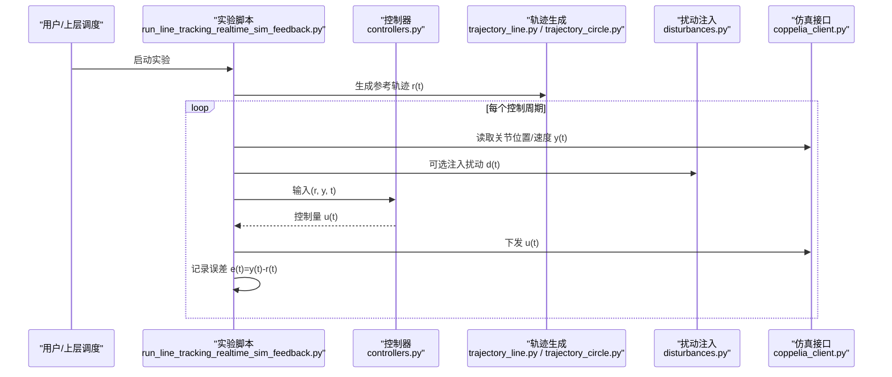
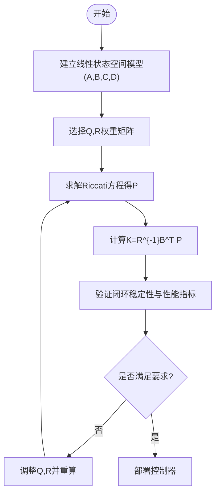
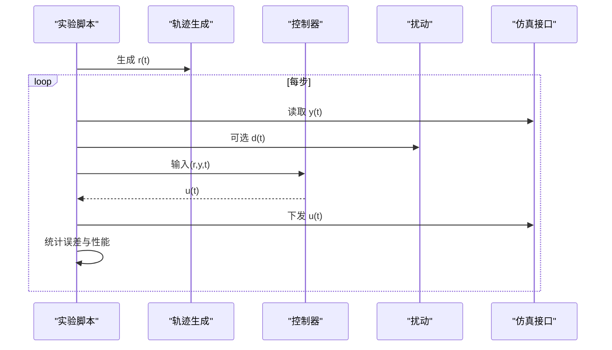
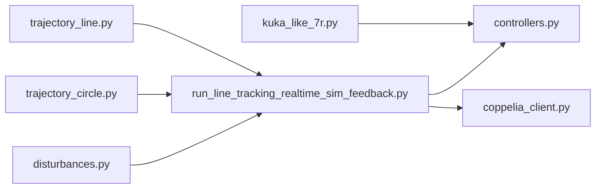

# 状态反馈控制

<cite>
**本文引用的文件**   
- [core/controllers.py](file://core/controllers.py)
- [configs/kuka_like_7r.py](file://configs/kuka_like_7r.py)
- [experiments/run_line_tracking_realtime_sim_feedback.py](file://experiments/run_line_tracking_realtime_sim_feedback.py)
- [core/trajectory_circle.py](file://core/trajectory_circle.py)
- [core/trajectory_line.py](file://core/trajectory_line.py)
- [core/disturbances.py](file://core/disturbances.py)
- [sim/coppelia_client.py](file://sim/coppelia_client.py)
</cite>

## 目录
1. [简介](#简介)
2. [项目结构](#项目结构)
3. [核心组件](#核心组件)
4. [架构总览](#架构总览)
5. [详细组件分析](#详细组件分析)
6. [依赖关系分析](#依赖关系分析)
7. [性能考虑](#性能考虑)
8. [故障排查指南](#故障排查指南)
9. [结论](#结论)
10. [附录](#附录)

## 简介
本技术文档围绕“状态反馈控制”主题，面向机械臂系统的轨迹跟踪与扰动抑制应用，系统阐述：
- 状态空间建模方法与极点配置技术（含可观测性分析与状态估计器设计）
- LQR（线性二次调节器）控制器设计与实现（Riccati方程求解、最优控制律推导）
- 状态反馈增益矩阵计算与稳定性分析
- 从系统建模到控制器参数优化的完整流程
- 机械臂系统中状态变量选择与反馈增益整定经验
- 在轨迹跟踪与扰动抑制中的效果展示与评估方法

## 项目结构
仓库采用分层组织：配置、核心算法、实验脚本与仿真接口。与状态反馈控制直接相关的代码主要位于 core 与 experiments 目录中，配合 configs 提供机器人模型与参数，通过 sim 与 CoppeliaSim 交互。

图表来源
- [core/controllers.py](file://core/controllers.py)
- [configs/kuka_like_7r.py](file://configs/kuka_like_7r.py)
- [experiments/run_line_tracking_realtime_sim_feedback.py](file://experiments/run_line_tracking_realtime_sim_feedback.py)
- [core/trajectory_circle.py](file://core/trajectory_circle.py)
- [core/trajectory_line.py](file://core/trajectory_line.py)
- [core/disturbances.py](file://core/disturbances.py)
- [sim/coppelia_client.py](file://sim/coppelia_client.py)

章节来源
- [core/controllers.py](file://core/controllers.py)
- [configs/kuka_like_7r.py](file://configs/kuka_like_7r.py)
- [experiments/run_line_tracking_realtime_sim_feedback.py](file://experiments/run_line_tracking_realtime_sim_feedback.py)
- [core/trajectory_circle.py](file://core/trajectory_circle.py)
- [core/trajectory_line.py](file://core/trajectory_line.py)
- [core/disturbances.py](file://core/disturbances.py)
- [sim/coppelia_client.py](file://sim/coppelia_client.py)

## 核心组件
- 控制器模块：封装状态反馈与LQR相关功能，包括增益计算、闭环控制律调用等。
- 轨迹生成：直线与圆弧轨迹，用于验证跟踪性能。
- 扰动模块：注入外部扰动以评估鲁棒性与抗扰能力。
- 仿真接口：与 CoppeliaSim 通信，读取关节状态并下发指令。
- 配置：KUKA型7自由度机器人模型参数，供控制器与仿真使用。

章节来源
- [core/controllers.py](file://core/controllers.py)
- [core/trajectory_circle.py](file://core/trajectory_circle.py)
- [core/trajectory_line.py](file://core/trajectory_line.py)
- [core/disturbances.py](file://core/disturbances.py)
- [sim/coppelia_client.py](file://sim/coppelia_client.py)
- [configs/kuka_like_7r.py](file://configs/kuka_like_7r.py)

## 架构总览
下图展示了状态反馈控制在仿真环境中的整体数据流与控制回路：控制器依据参考轨迹与当前状态计算控制量，经仿真接口作用于被控对象；同时采集输出进行误差评估与可视化。

图表来源
- [experiments/run_line_tracking_realtime_sim_feedback.py](file://experiments/run_line_tracking_realtime_sim_feedback.py)
- [core/controllers.py](file://core/controllers.py)
- [core/trajectory_line.py](file://core/trajectory_line.py)
- [core/trajectory_circle.py](file://core/trajectory_circle.py)
- [core/disturbances.py](file://core/disturbances.py)
- [sim/coppelia_client.py](file://sim/coppelia_client.py)

## 详细组件分析

### 状态空间建模与极点配置
- 建模要点
  - 针对机械臂小扰动线性化或局部线性近似，建立连续/离散状态空间模型 (A,B,C,D)。
  - 状态向量通常包含关节位置与速度（必要时扩展为笛卡尔位姿误差及其导数）。
  - 输出向量通常为可测的关节位置/速度或末端位姿。
- 可观测性分析
  - 构造可观性矩阵 O = [C; CA; CA^2; ...]，检查其秩是否等于状态维数。
  - 若不可观，需调整输出定义或引入额外传感器。
- 极点配置
  - 基于可控对 (A,B)，选择期望闭环极点集合 {p_i}。
  - 使用 Ackermann 公式或数值方法求解状态反馈增益 K，使 A-BK 的特征值等于期望极点。
  - 对于多输入系统，可采用最小二乘或优化方法分配极点。
- 状态估计器（观测器）设计
  - 设计全阶或降阶观测器，估计不可测状态。
  - 观测器增益 L 由对偶问题 (A^T, C^T) 的极点配置得到，使 A-LC 稳定且收敛快于控制器动态。
  - 分离原理：控制器与观测器可独立设计，闭环稳定性由两者共同保证。

章节来源
- [core/controllers.py](file://core/controllers.py)
- [configs/kuka_like_7r.py](file://configs/kuka_like_7r.py)

### LQR 控制器设计与实现
- 问题设定
  - 代价函数 J = ∫(x^T Q x + u^T R u) dt，Q≥0，R>0。
  - 目标是最小化状态偏差与控制能耗，获得最优状态反馈增益 K。
- Riccati 方程求解
  - 求解代数 Riccati 方程（ARE），得到正定解 P。
  - 最优增益 K = R^{-1} B^T P。
- 离散时间情形
  - 若使用离散模型，求解离散 ARE，得到离散最优增益。
- 权重矩阵整定经验
  - Q 对角占优时，优先惩罚关键状态（如关节角度误差、速度过大）。
  - R 对角占优时，限制控制幅度，避免饱和。
  - 可通过迭代调参或自动搜索（网格/贝叶斯优化）平衡响应速度与能耗。
- 稳定性与鲁棒性
  - LQR 具有无穷大相位裕度与至少60°相位裕度的经典性质（单输入）。
  - 多输入下仍具备良好鲁棒性，但需结合观测器与抗饱和策略。

图表来源
- [core/controllers.py](file://core/controllers.py)

章节来源
- [core/controllers.py](file://core/controllers.py)

### 状态反馈增益矩阵计算与稳定性分析
- 计算方法
  - 极点配置：根据期望极点集求 K，确保 A-BK 特征值位于左半平面（连续）或单位圆内（离散）。
  - LQR：按上述流程求解 ARE 得到 K。
- 稳定性分析
  - 李雅普诺夫判据：存在 P>0 使得 (A-BK)^T P + P(A-BK) < 0（连续）。
  - 频域指标：幅值裕度、相位裕度、带宽与谐振峰值。
  - 时域指标：超调、上升时间、调节时间、稳态误差。
- 数值注意事项
  - 条件数与数值精度：对病态矩阵进行缩放或正则化。
  - 采样频率与离散化误差：合理选择 T_s，避免高频噪声放大。

章节来源
- [core/controllers.py](file://core/controllers.py)

### 状态估计器（观测器）设计与实现
- 全阶观测器
  - 形式：\hat{x}_{k+1} = A\hat{x}_k + B u_k + L(y_k - C\hat{x}_k)
  - 增益 L 通过对偶极点配置或 LQE（线性二次估计器）设计。
- 降阶观测器
  - 当部分状态可直接测量时，降低观测器阶数以减少计算量。
- 分离原理与闭环稳定性
  - 控制器与观测器独立设计，闭环系统稳定性由 A-BK 与 A-LC 共同决定。
- 噪声与鲁棒性
  - 观测器对测量噪声敏感，需权衡收敛速度与滤波特性。
  - 可结合低通滤波或卡尔曼滤波思想提升鲁棒性。

章节来源
- [core/controllers.py](file://core/controllers.py)

### 轨迹跟踪与扰动抑制应用
- 轨迹跟踪
  - 参考轨迹由直线或圆弧生成器提供，控制器驱动机械臂跟踪。
  - 评价指标：均方根误差（RMSE）、最大绝对误差、积分绝对误差（IAE）。
- 扰动抑制
  - 通过 disturbances 模块注入周期性或随机扰动，评估闭环鲁棒性。
  - 比较开环与闭环、不同权重下的抗扰表现。
- 仿真集成
  - 实验脚本协调轨迹、控制器与仿真接口，形成实时闭环。

图表来源
- [experiments/run_line_tracking_realtime_sim_feedback.py](file://experiments/run_line_tracking_realtime_sim_feedback.py)
- [core/trajectory_line.py](file://core/trajectory_line.py)
- [core/trajectory_circle.py](file://core/trajectory_circle.py)
- [core/disturbances.py](file://core/disturbances.py)
- [sim/coppelia_client.py](file://sim/coppelia_client.py)

章节来源
- [experiments/run_line_tracking_realtime_sim_feedback.py](file://experiments/run_line_tracking_realtime_sim_feedback.py)
- [core/trajectory_line.py](file://core/trajectory_line.py)
- [core/trajectory_circle.py](file://core/trajectory_circle.py)
- [core/disturbances.py](file://core/disturbances.py)
- [sim/coppelia_client.py](file://sim/coppelia_client.py)

### 机械臂系统状态变量选择与增益整定经验
- 状态变量选择
  - 关节空间：q（位置）、\dot{q}（速度）作为基本状态。
  - 任务空间：必要时将末端位姿误差及其导数纳入状态，便于轨迹跟踪。
- 反馈增益整定经验
  - 先以极点配置快速获得稳定增益，再用 LQR 精细调参。
  - Q 侧重关键轴与速度项，R 限制执行器饱和。
  - 逐步增加 Q/R 比例，观察响应速度与能耗折衷。
  - 引入观测器后，适当提高观测器带宽，确保状态估计快于控制动态。

章节来源
- [configs/kuka_like_7r.py](file://configs/kuka_like_7r.py)
- [core/controllers.py](file://core/controllers.py)

## 依赖关系分析
- 控制器依赖轨迹生成与扰动模块，实验脚本负责编排与数据采集。
- 仿真接口提供底层通信，控制器与轨迹/扰动模块不直接耦合仿真细节。
- 配置模块集中管理机器人参数，便于在不同机型间切换。

图表来源
- [configs/kuka_like_7r.py](file://configs/kuka_like_7r.py)
- [core/controllers.py](file://core/controllers.py)
- [core/trajectory_line.py](file://core/trajectory_line.py)
- [core/trajectory_circle.py](file://core/trajectory_circle.py)
- [core/disturbances.py](file://core/disturbances.py)
- [experiments/run_line_tracking_realtime_sim_feedback.py](file://experiments/run_line_tracking_realtime_sim_feedback.py)
- [sim/coppelia_client.py](file://sim/coppelia_client.py)

章节来源
- [core/controllers.py](file://core/controllers.py)
- [experiments/run_line_tracking_realtime_sim_feedback.py](file://experiments/run_line_tracking_realtime_sim_feedback.py)
- [core/trajectory_line.py](file://core/trajectory_line.py)
- [core/trajectory_circle.py](file://core/trajectory_circle.py)
- [core/disturbances.py](file://core/disturbances.py)
- [sim/coppelia_client.py](file://sim/coppelia_client.py)
- [configs/kuka_like_7r.py](file://configs/kuka_like_7r.py)

## 性能考虑
- 数值稳定性
  - 对 A,B,C,D 进行合理缩放，避免病态矩阵导致 Riccati 求解不稳定。
  - 选择合适的采样频率，兼顾实时性与离散化误差。
- 计算复杂度
  - 在线计算应仅包含矩阵乘法与查表；离线完成 ARE 求解与增益预计算。
- 执行器约束
  - 加入抗饱和与限幅逻辑，防止指令超出物理限制。
- 观测器与滤波器
  - 观测器带宽与噪声滤波需折衷，避免放大高频噪声。

[本节为通用指导，无需特定文件引用]

## 故障排查指南
- 常见问题
  - 轨迹发散：检查模型线性化点、采样频率与数值精度。
  - 控制饱和：减小 Q 或增大 R，增加限幅与抗饱和。
  - 观测器不稳定：重新设计 L，确保 A-LC 特征值足够靠左。
  - 通信延迟：降低控制频率或补偿延迟，避免相位滞后。
- 诊断步骤
  - 分模块验证：先开环验证轨迹与仿真接口，再闭环验证控制器。
  - 记录关键信号：状态、控制量、误差、扰动，绘制时域曲线定位问题。
  - 敏感性分析：逐一改变 Q、R、L 与采样频率，观察影响。

章节来源
- [experiments/run_line_tracking_realtime_sim_feedback.py](file://experiments/run_line_tracking_realtime_sim_feedback.py)
- [core/controllers.py](file://core/controllers.py)
- [sim/coppelia_client.py](file://sim/coppelia_client.py)

## 结论
状态反馈控制通过合理的状态空间建模、极点配置与 LQR 设计，能够在机械臂系统中实现稳定的轨迹跟踪与良好的扰动抑制。结合观测器可实现不可测状态估计，分离原理简化了设计流程。工程实践中，权重矩阵整定与数值稳定性是关键，建议离线预计算增益并在运行时仅执行高效控制律。

[本节为总结性内容，无需特定文件引用]

## 附录
- 术语
  - 状态空间模型：用一阶微分/差分方程描述系统动态。
  - 极点配置：通过反馈将闭环系统极点置于期望位置。
  - LQR：最小化二次代价的最优状态反馈控制。
  - 观测器：估计系统内部状态的辅助动态系统。
- 参考实现路径
  - 控制器核心：[core/controllers.py](file://core/controllers.py)
  - 轨迹生成：[core/trajectory_line.py](file://core/trajectory_line.py)、[core/trajectory_circle.py](file://core/trajectory_circle.py)
  - 扰动注入：[core/disturbances.py](file://core/disturbances.py)
  - 仿真接口：[sim/coppelia_client.py](file://sim/coppelia_client.py)
  - 机器人配置：[configs/kuka_like_7r.py](file://configs/kuka_like_7r.py)
  - 实验编排：[experiments/run_line_tracking_realtime_sim_feedback.py](file://experiments/run_line_tracking_realtime_sim_feedback.py)