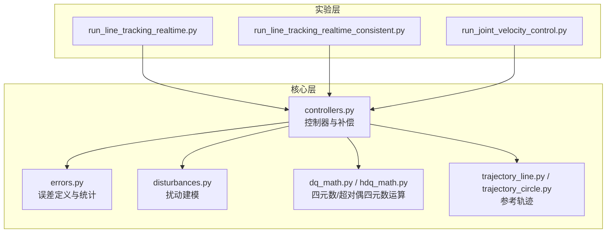
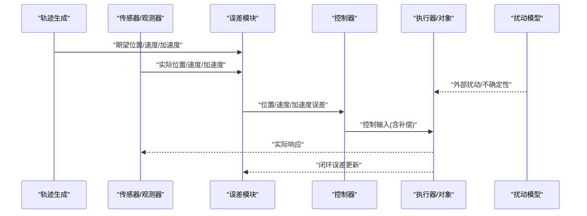
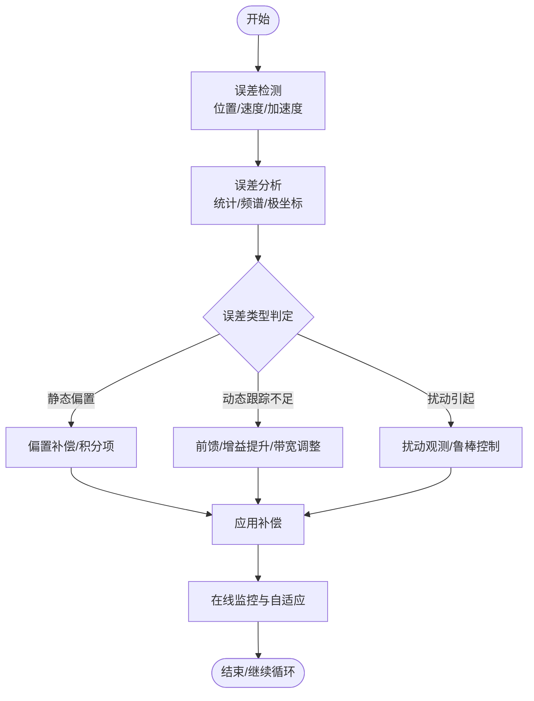
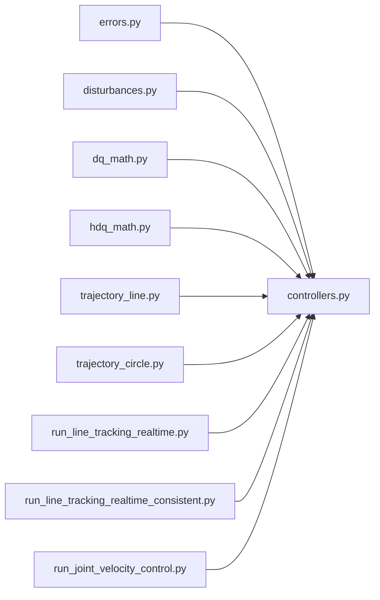

# 误差分析与处理

<cite>
**本文引用的文件**   
- [core/errors.py](file://core/errors.py)
- [core/controllers.py](file://core/controllers.py)
- [core/disturbances.py](file://core/disturbances.py)
- [core/dq_math.py](file://core/dq_math.py)
- [core/hdq_math.py](file://core/hdq_math.py)
- [core/trajectory_line.py](file://core/trajectory_line.py)
- [core/trajectory_circle.py](file://core/trajectory_circle.py)
- [experiments/run_line_tracking_realtime.py](file://experiments/run_line_tracking_realtime.py)
- [experiments/run_line_tracking_realtime_consistent.py](file://experiments/run_line_tracking_realtime_consistent.py)
- [experiments/run_joint_velocity_control.py](file://experiments/run_joint_velocity_control.py)
</cite>

## 目录
1. [引言](#引言)
2. [项目结构](#项目结构)
3. [核心组件](#核心组件)
4. [架构总览](#架构总览)
5. [详细组件分析](#详细组件分析)
6. [依赖关系分析](#依赖关系分析)
7. [性能考虑](#性能考虑)
8. [故障排查指南](#故障排查指南)
9. [结论](#结论)
10. [附录](#附录)

## 引言
本技术文档围绕“误差分析与处理”模块，系统阐述控制系统中的误差定义与分类、计算方法、传播与稳定性判据、收敛性与性能指标评估，以及从误差检测、分析到补偿的完整流程。结合仓库中实际代码实现，给出位置、速度、加速度误差的计算路径，误差传播与稳定性的理论框架（Lyapunov与BIBO），并讨论传感器噪声、量化误差与计算延迟等实际误差来源及其处理方法。最后提供调试与优化实践建议。

## 项目结构
本项目采用按功能分层组织：
- core：核心算法与模型（控制器、误差、扰动、四元数与超对偶四元数数学库、轨迹生成）
- experiments：实验脚本（轨迹跟踪、关节控制、实时运行）
- configs：配置项（如机器人参数）
- sim：仿真客户端与关节名映射
- results：结果数据与绘图

图表来源
- [core/errors.py](file://core/errors.py)
- [core/controllers.py](file://core/controllers.py)
- [core/disturbances.py](file://core/disturbances.py)
- [core/dq_math.py](file://core/dq_math.py)
- [core/hdq_math.py](file://core/hdq_math.py)
- [core/trajectory_line.py](file://core/trajectory_line.py)
- [core/trajectory_circle.py](file://core/trajectory_circle.py)
- [experiments/run_line_tracking_realtime.py](file://experiments/run_line_tracking_realtime.py)
- [experiments/run_line_tracking_realtime_consistent.py](file://experiments/run_line_tracking_realtime_consistent.py)
- [experiments/run_joint_velocity_control.py](file://experiments/run_joint_velocity_control.py)

章节来源
- [core/errors.py](file://core/errors.py)
- [core/controllers.py](file://core/controllers.py)
- [core/disturbances.py](file://core/disturbances.py)
- [core/dq_math.py](file://core/dq_math.py)
- [core/hdq_math.py](file://core/hdq_math.py)
- [core/trajectory_line.py](file://core/trajectory_line.py)
- [core/trajectory_circle.py](file://core/trajectory_circle.py)
- [experiments/run_line_tracking_realtime.py](file://experiments/run_line_tracking_realtime.py)
- [experiments/run_line_tracking_realtime_consistent.py](file://experiments/run_line_tracking_realtime_consistent.py)
- [experiments/run_joint_velocity_control.py](file://experiments/run_joint_velocity_control.py)

## 核心组件
- 误差定义与统计：集中管理位置、速度、加速度误差的定义、计算与统计量（均值、方差、峰值、RMS等）。
- 控制器与补偿：基于误差信号进行控制律合成与补偿（前馈、反馈、抗扰）。
- 扰动建模：外部扰动与内部不确定性建模，用于误差传播与鲁棒性分析。
- 四元数/超对偶四元数数学库：姿态与位姿表示及微分运算，支撑误差在旋转空间上的正确表达。
- 参考轨迹：直线与圆弧轨迹生成，为误差计算提供期望信号。

章节来源
- [core/errors.py](file://core/errors.py)
- [core/controllers.py](file://core/controllers.py)
- [core/disturbances.py](file://core/disturbances.py)
- [core/dq_math.py](file://core/dq_math.py)
- [core/hdq_math.py](file://core/hdq_math.py)
- [core/trajectory_line.py](file://core/trajectory_line.py)
- [core/trajectory_circle.py](file://core/trajectory_circle.py)

## 架构总览
下图展示误差分析在控制回路中的位置与数据流：参考轨迹经轨迹生成器输出期望状态；传感器测量得到实际状态；误差模块计算位置、速度、加速度误差；控制器依据误差与扰动模型合成控制量；执行器驱动被控对象；闭环形成误差传播路径。

图表来源
- [core/trajectory_line.py](file://core/trajectory_line.py)
- [core/trajectory_circle.py](file://core/trajectory_circle.py)
- [core/errors.py](file://core/errors.py)
- [core/controllers.py](file://core/controllers.py)
- [core/disturbances.py](file://core/disturbances.py)

## 详细组件分析

### 误差定义与分类
- 位置误差：期望位置与实际位置的差值，需在合适的坐标系下表达（笛卡尔或旋量空间）。对于旋转部分，建议使用四元数或轴角表示以避免奇异。
- 速度误差：期望速度与实测速度的差值，注意滤波与数值微分带来的影响。
- 加速度误差：期望加速度与实测加速度的差值，通常由速度误差的微分或直接测量获得，需考虑噪声放大问题。

误差统计与指标：
- 稳态误差：长时间运行后的平均误差或极限误差。
- 瞬态响应：上升时间、调节时间、峰值时间等。
- 超调量：最大偏差相对于目标值的百分比。
- RMS与峰值：用于评估误差能量与极端情况。

章节来源
- [core/errors.py](file://core/errors.py)

### 误差传播与稳定性判据
- Lyapunov稳定性：构造正定Lyapunov函数V(e)，若其导数负半定或负定，则误差系统稳定或渐近稳定。可结合控制器设计保证闭环误差收敛。
- BIBO稳定性：有界输入产生有界输出。对线性化模型，可通过传递函数极点或频域增益裕度/相位裕度判断。
- 误差传播链：传感器噪声→观测误差→控制输入误差→执行器饱和→非线性效应→再次进入闭环。

章节来源
- [core/controllers.py](file://core/controllers.py)
- [core/disturbances.py](file://core/disturbances.py)

### 误差收敛性与性能指标评估
- 收敛性：通过Lyapunov或频域方法证明误差趋于零或一致最终有界。
- 性能指标：
  - 稳态误差：阶跃/斜坡/抛物线输入的终值误差。
  - 瞬态响应：上升时间、调节时间、峰值时间。
  - 超调量：最大过冲比例。
  - 能耗与控制平滑度：控制量变化率与幅值限制。

章节来源
- [core/errors.py](file://core/errors.py)
- [core/controllers.py](file://core/controllers.py)

### 误差处理流程（检测—分析—补偿）

图表来源
- [core/errors.py](file://core/errors.py)
- [core/controllers.py](file://core/controllers.py)
- [core/disturbances.py](file://core/disturbances.py)

### 实际控制系统中的误差来源识别与处理
- 传感器噪声：低通滤波、卡尔曼滤波、滑动平均；避免过度滤波导致相位滞后。
- 量化误差：提高分辨率、抖动注入、合理舍入策略；在数字控制中考虑量化噪声谱。
- 计算延迟：预测控制、Smith预估器、时延补偿；减少控制周期与通信延迟。
- 执行器饱和：抗饱和积分、指令限幅、软启动。
- 模型失配：自适应增益、鲁棒控制、在线辨识。

章节来源
- [core/disturbances.py](file://core/disturbances.py)
- [core/controllers.py](file://core/controllers.py)

### 姿态与位姿误差的正确表达
- 使用四元数/超对偶四元数表示位姿，避免欧拉角奇异。
- 误差在SO(3)上应使用测地距离或最小旋转表示，确保误差度量的一致性与连续性。

章节来源
- [core/dq_math.py](file://core/dq_math.py)
- [core/hdq_math.py](file://core/hdq_math.py)

### 参考轨迹与误差基准
- 直线轨迹：匀速/加减速段组合，便于评估稳态与瞬态性能。
- 圆弧轨迹：恒定曲率运动，适合检验旋转误差与耦合特性。

章节来源
- [core/trajectory_line.py](file://core/trajectory_line.py)
- [core/trajectory_circle.py](file://core/trajectory_circle.py)

### 实验与调试实践
- 直线跟踪实时实验：验证位置/速度误差收敛与超调量。
- 一致性跟踪实验：对比不同控制器参数下的误差分布。
- 关节速度控制：评估速度误差与扰动抑制能力。

章节来源
- [experiments/run_line_tracking_realtime.py](file://experiments/run_line_tracking_realtime.py)
- [experiments/run_line_tracking_realtime_consistent.py](file://experiments/run_line_tracking_realtime_consistent.py)
- [experiments/run_joint_velocity_control.py](file://experiments/run_joint_velocity_control.py)

## 依赖关系分析

图表来源
- [core/errors.py](file://core/errors.py)
- [core/controllers.py](file://core/controllers.py)
- [core/disturbances.py](file://core/disturbances.py)
- [core/dq_math.py](file://core/dq_math.py)
- [core/hdq_math.py](file://core/hdq_math.py)
- [core/trajectory_line.py](file://core/trajectory_line.py)
- [core/trajectory_circle.py](file://core/trajectory_circle.py)
- [experiments/run_line_tracking_realtime.py](file://experiments/run_line_tracking_realtime.py)
- [experiments/run_line_tracking_realtime_consistent.py](file://experiments/run_line_tracking_realtime_consistent.py)
- [experiments/run_joint_velocity_control.py](file://experiments/run_joint_velocity_control.py)

章节来源
- [core/controllers.py](file://core/controllers.py)
- [core/errors.py](file://core/errors.py)
- [core/disturbances.py](file://core/disturbances.py)
- [core/dq_math.py](file://core/dq_math.py)
- [core/hdq_math.py](file://core/hdq_math.py)
- [core/trajectory_line.py](file://core/trajectory_line.py)
- [core/trajectory_circle.py](file://core/trajectory_circle.py)
- [experiments/run_line_tracking_realtime.py](file://experiments/run_line_tracking_realtime.py)
- [experiments/run_line_tracking_realtime_consistent.py](file://experiments/run_line_tracking_realtime_consistent.py)
- [experiments/run_joint_velocity_control.py](file://experiments/run_joint_velocity_control.py)

## 性能考虑
- 采样频率与延迟：提高采样率可降低离散化误差，但需权衡计算负载与延迟。
- 滤波器带宽：低通滤波降低噪声，但引入相位滞后；需折中选择。
- 控制带宽：提升带宽改善跟踪，但易激发高频未建模动态与执行器饱和。
- 数值精度：四元数归一化与超对偶四元数运算需注意数值稳定性。
- 资源占用：在线估计与自适应算法增加CPU与内存开销。

[本节为通用指导，不直接分析具体文件]

## 故障排查指南
- 误差发散：检查Lyapunov条件是否满足、控制器增益是否过大、是否存在未建模延迟。
- 振荡与超调：降低增益、增加阻尼、调整滤波器带宽。
- 稳态误差：引入积分项或前馈补偿，校准传感器偏置。
- 噪声敏感：增强滤波或采用观测器（如卡尔曼），检查量化步长。
- 扰动抑制不足：增强扰动观测与鲁棒控制项，必要时加入自适应机制。

章节来源
- [core/controllers.py](file://core/controllers.py)
- [core/disturbances.py](file://core/disturbances.py)
- [core/errors.py](file://core/errors.py)

## 结论
本模块以统一的误差定义与统计为基础，结合Lyapunov与BIBO稳定性理论，构建了从误差检测到补偿的完整流程。通过四元数/超对偶四元数数学库保障姿态误差的正确表达，并在实验中验证了直线与圆弧轨迹的跟踪性能。针对传感器噪声、量化误差与计算延迟等实际因素，提供了相应的处理策略与调试建议，有助于在实际系统中实现高精度、高鲁棒的误差控制。

[本节为总结性内容，不直接分析具体文件]

## 附录
- 术语表：
  - 稳态误差：系统在稳定状态下的残余误差。
  - 瞬态响应：系统从初始状态到达稳态过程中的动态行为。
  - 超调量：响应超过目标值的最大相对量。
  - BIBO稳定性：有界输入产生有界输出的稳定性。
  - Lyapunov稳定性：通过Lyapunov函数判定的稳定性。
- 常用指标计算公式（概念性说明）：
  - 稳态误差：e_ss = lim_{t→∞} e(t)
  - 超调量：σ% = (y_max - y_ref)/y_ref × 100%
  - RMS误差：e_rms = sqrt(mean(e^2))

[本节为概念性补充，不直接分析具体文件]