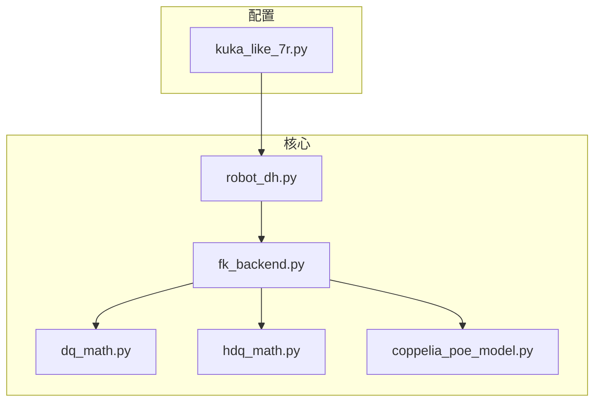
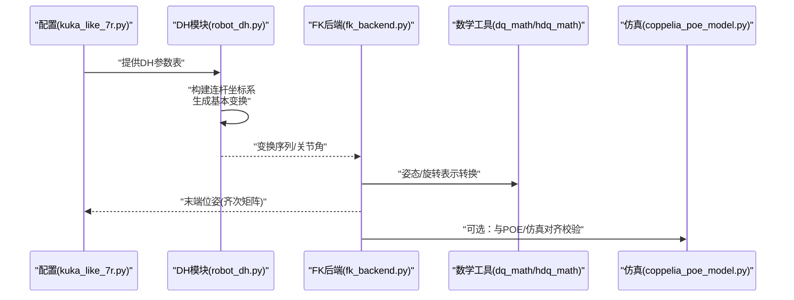
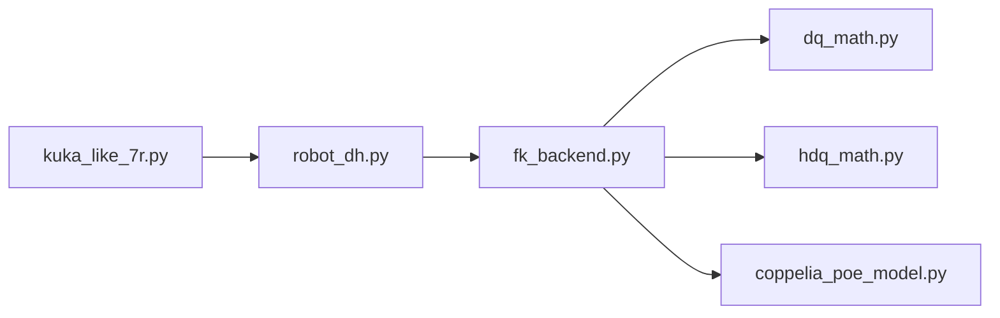

# DH参数处理

<cite>
**本文引用的文件**   
- [robot_dh.py](file://core/robot_dh.py)
- [kuka_like_7r.py](file://configs/kuka_like_7r.py)
- [fk_backend.py](file://core/fk_backend.py)
- [dq_math.py](file://core/dq_math.py)
- [hdq_math.py](file://core/hdq_math.py)
- [coppelia_poe_model.py](file://core/coppelia_poe_model.py)
</cite>

## 目录
1. [简介](#简介)
2. [项目结构](#项目结构)
3. [核心组件](#核心组件)
4. [架构总览](#架构总览)
5. [详细组件分析](#详细组件分析)
6. [依赖关系分析](#依赖关系分析)
7. [性能考虑](#性能考虑)
8. [故障排查指南](#故障排查指南)
9. [结论](#结论)
10. [附录](#附录)

## 简介
本技术文档围绕DH参数处理模块，系统阐述标准DH与修正DH参数的数学原理、几何意义与建模流程，给出从坐标系建立到齐次变换矩阵推导的完整过程，并提供串联与并联机器人构型的建模方法与验证流程。文档还包含参数误差与灵敏度分析、标定方法建议，并以KUKA型7自由度机械臂为例展示参数配置与调试技巧。

## 项目结构
本项目采用分层组织：配置层提供不同机器人的DH参数表；核心层实现DH/POE等运动学计算与后端接口；仿真层对接CoppeliaSim；实验层用于轨迹跟踪与实时控制。与DH参数处理直接相关的核心文件包括：
- 核心DH与FK后端：robot_dh.py、fk_backend.py
- 数学工具：dq_math.py、hdq_math.py
- 模型与仿真：coppelia_poe_model.py
- 示例配置：kuka_like_7r.py

图表来源
- [robot_dh.py](file://core/robot_dh.py)
- [fk_backend.py](file://core/fk_backend.py)
- [dq_math.py](file://core/dq_math.py)
- [hdq_math.py](file://core/hdq_math.py)
- [coppelia_poe_model.py](file://core/coppelia_poe_model.py)
- [kuka_like_7r.py](file://configs/kuka_like_7r.py)

章节来源
- [robot_dh.py](file://core/robot_dh.py)
- [fk_backend.py](file://core/fk_backend.py)
- [kuka_like_7r.py](file://configs/kuka_like_7r.py)

## 核心组件
- DH参数表与构建器：负责存储与解析标准/修正DH参数，生成连杆坐标系与变换序列。
- FK后端：基于DH或POE进行正解计算，输出末端位姿。
- 数学工具：四元数与超四元数运算，辅助姿态表示与插值。
- 仿真接口：将模型映射至CoppeliaSim场景，便于可视化与对比验证。

章节来源
- [robot_dh.py](file://core/robot_dh.py)
- [fk_backend.py](file://core/fk_backend.py)
- [dq_math.py](file://core/dq_math.py)
- [hdq_math.py](file://core/hdq_math.py)
- [coppelia_poe_model.py](file://core/coppelia_poe_model.py)

## 架构总览
下图展示了从配置到求解的整体数据流：配置中的DH参数表被加载后，由DH模块构建各关节坐标系及基本变换；FK后端按顺序合成得到末端齐次变换；必要时通过POE模型进行一致性校验或与仿真环境对齐。

图表来源
- [kuka_like_7r.py](file://configs/kuka_like_7r.py)
- [robot_dh.py](file://core/robot_dh.py)
- [fk_backend.py](file://core/fk_backend.py)
- [dq_math.py](file://core/dq_math.py)
- [hdq_math.py](file://core/hdq_math.py)
- [coppelia_poe_model.py](file://core/coppelia_poe_model.py)

## 详细组件分析

### 标准DH与修正DH参数：数学原理与几何意义
- 标准DH（Craig）
  - 定义：沿z轴旋转θ_i，沿z轴平移d_i，沿x轴平移a_i，绕x轴旋转α_i。
  - 几何意义：a_i为两相邻z轴的公垂线长度（连杆长度），α_i为z轴间的扭转角，d_i为沿z轴的关节偏移，θ_i为绕z轴的关节角。
  - 适用性：适合大多数串联关节，尤其当相邻关节轴线相交或平行时简化明显。
- 修正DH（Modified DH, Denavit–Hartenberg Modified）
  - 定义：沿x轴平移a_i，绕x轴旋转α_i，沿z轴平移d_{i+1}，绕z轴旋转θ_{i+1}。
  - 几何意义：与标准DH相比，坐标系的附着方式不同，通常使变换链更直观，减少奇异时的歧义。
  - 适用性：在复杂构型中常能避免零长度连杆带来的退化。

要点
- 连杆长度a_i与扭转角α_i描述相邻连杆的空间相对关系；关节偏移d_i与关节角θ_i描述关节自身的相对位移。
- 选择标准或修正DH取决于机构几何与数值稳定性需求。

章节来源
- [robot_dh.py](file://core/robot_dh.py)

### 坐标系建立规则与参数测量步骤
- 坐标系建立规则
  - 原点：取相邻z轴公垂线与z轴的交点，或关节回转中心。
  - z轴：沿关节回转轴方向。
  - x轴：沿公垂线指向下一连杆，或按右手定则确定。
  - y轴：由x×z确定。
- 参数测量步骤
  - 先标定z轴方向与原点位置，再测量公垂线长度a_i与扭转角α_i。
  - 对每个关节记录d_i与θ_i的零点与范围，确保与传感器零点一致。
  - 使用激光跟踪仪或视觉标定提高精度，并记录不确定度。

章节来源
- [robot_dh.py](file://core/robot_dh.py)

### DH变换矩阵推导：从基本旋转到齐次变换
- 基本变换
  - 绕z轴旋转θ：R_z(θ)
  - 沿z轴平移d：T_z(d)
  - 沿x轴平移a：T_x(a)
  - 绕x轴旋转α：R_x(α)
- 标准DH复合变换
  - T_{i-1}^{i} = R_z(θ_i)·T_z(d_i)·T_x(a_i)·R_x(α_i)
- 修正DH复合变换
  - T_{i}^{i+1} = T_x(a_i)·R_x(α_i)·T_z(d_{i+1})·R_z(θ_{i+1})
- 末端位姿
  - T_0^n = Π T_{i-1}^{i}（或修正DH对应序列）
- 注意事项
  - 注意乘法顺序与坐标系层级，避免左右乘混淆。
  - 对于奇异构型（如α≈0且a≈0），需检查数值稳定性。

章节来源
- [robot_dh.py](file://core/robot_dh.py)
- [fk_backend.py](file://core/fk_backend.py)

### DH参数表的构建方法
- 数据结构
  - 以列表/字典形式存储每连杆的{a, α, d, θ}，支持标准与修正两种约定。
- 构建流程
  - 依据机构图逐连杆标注坐标系，读取几何尺寸与关节零点。
  - 统一单位（米、弧度），并设置默认零点与限位。
  - 导出为配置对象供FK后端加载。
- 校验
  - 用已知关节角计算末端位姿，与CAD或实测对比。

章节来源
- [kuka_like_7r.py](file://configs/kuka_like_7r.py)
- [robot_dh.py](file://core/robot_dh.py)

### 不同构型机器人的DH建模与验证流程
- 串联机器人
  - 自基座至末端依次建立坐标系，按DH规则写出变换链。
  - 验证：对比CAD装配体、激光跟踪实测、或仿真结果。
- 并联机器人
  - 对每条支链独立建立DH模型，末端位姿由各支链约束共同决定。
  - 验证：闭合环方程残差应接近零；可用最小二乘优化支链参数。

章节来源
- [fk_backend.py](file://core/fk_backend.py)

### 参数误差分析与灵敏度分析
- 误差传播
  - 末端位姿对DH参数的偏导构成雅可比，可用于估计误差上界。
- 灵敏度指标
  - 条件数、最大主灵敏度、蒙特卡洛扰动统计。
- 实践建议
  - 优先标定对末端影响最大的参数（通常为a与α）。
  - 结合观测数据做加权最小二乘，降低噪声影响。

章节来源
- [fk_backend.py](file://core/fk_backend.py)

### 标定方法
- 静态标定
  - 多组关节角下采集末端位姿，构建线性化方程求解DH修正量。
- 动态/在线标定
  - 利用轨迹跟踪残差与IMU/编码器融合，迭代更新参数。
- 评估
  - 交叉验证、留一法、重定位误差分布。

章节来源
- [fk_backend.py](file://core/fk_backend.py)

### KUKA型7自由度机械臂：DH参数配置实例与调试技巧
- 配置要点
  - 明确使用标准或修正DH约定，保持全链路一致。
  - 合理设置零点偏移，匹配控制器与传感器零点。
- 调试技巧
  - 分步验证：单关节旋转观察末端轨迹是否符合预期。
  - 对比POE/仿真：若偏差较大，检查坐标系朝向与符号约定。
  - 逐步放宽约束：先固定部分参数，再释放其余参数进行局部优化。

章节来源
- [kuka_like_7r.py](file://configs/kuka_like_7r.py)
- [fk_backend.py](file://core/fk_backend.py)
- [coppelia_poe_model.py](file://core/coppelia_poe_model.py)

## 依赖关系分析
- 耦合关系
  - fk_backend依赖robot_dh提供的变换序列与参数表。
  - fk_backend调用dq_math/hdq_math进行姿态表示与插值。
  - coppelia_poe_model作为对照模型，用于一致性校验。
- 外部依赖
  - CoppeliaSim客户端用于可视化与数据采集（位于sim目录）。

图表来源
- [kuka_like_7r.py](file://configs/kuka_like_7r.py)
- [robot_dh.py](file://core/robot_dh.py)
- [fk_backend.py](file://core/fk_backend.py)
- [dq_math.py](file://core/dq_math.py)
- [hdq_math.py](file://core/hdq_math.py)
- [coppelia_poe_model.py](file://core/coppelia_poe_model.py)

章节来源
- [fk_backend.py](file://core/fk_backend.py)
- [robot_dh.py](file://core/robot_dh.py)

## 性能考虑
- 计算复杂度
  - 标准/修正DH的正解为O(n)，n为关节数；7自由度规模极小，实时性良好。
- 数值稳定性
  - 避免极端奇异构型下的除零与浮点溢出；必要时引入正则化或小扰动。
- 缓存与复用
  - 对频繁使用的中间变换可缓存，减少重复计算。
- 并行与向量化
  - 批量轨迹点可采用向量化加速。

[本节为通用指导，不直接分析具体文件]

## 故障排查指南
- 常见问题
  - 坐标系方向不一致导致符号错误。
  - 标准/修正DH混用造成变换链错位。
  - 零点偏移未正确设置导致整体位姿偏移。
- 诊断步骤
  - 单关节步进测试，观察末端轨迹是否平滑且符合预期。
  - 对比POE模型与DH模型结果，定位差异来源。
  - 检查单位与角度制式（弧度/度）的一致性。
- 恢复策略
  - 回退到上一稳定版本配置，逐步增量修改并验证。
  - 使用仿真环境快速复现实验现象。

章节来源
- [fk_backend.py](file://core/fk_backend.py)
- [coppelia_poe_model.py](file://core/coppelia_poe_model.py)

## 结论
DH参数是机器人运动学建模的基础。通过规范化的坐标系建立、严格的变换推导与系统的标定流程，可在串联与并联构型中获得高精度、高鲁棒性的正向运动学模型。配合仿真与POE对照，可有效提升建模质量与调试效率。

[本节为总结性内容，不直接分析具体文件]

## 附录
- 术语
  - 标准DH：Craig约定；修正DH：Modified Denavit–Hartenberg约定。
  - 齐次变换矩阵：描述刚体位姿的4×4矩阵。
- 参考路径
  - DH参数表与构建：[robot_dh.py](file://core/robot_dh.py)
  - 正解后端与流程：[fk_backend.py](file://core/fk_backend.py)
  - 姿态数学工具：[dq_math.py](file://core/dq_math.py)、[hdq_math.py](file://core/hdq_math.py)
  - 仿真与POE对照：[coppelia_poe_model.py](file://core/coppelia_poe_model.py)
  - KUKA 7R配置示例：[kuka_like_7r.py](file://configs/kuka_like_7r.py)