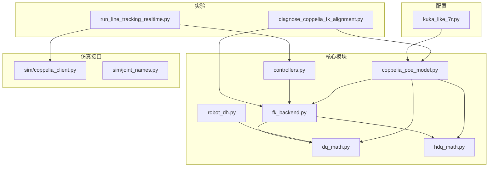
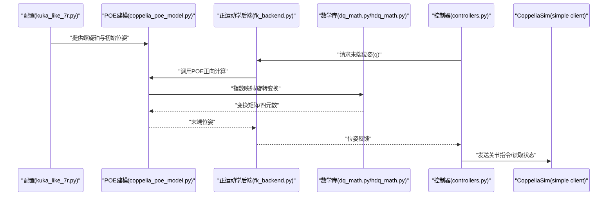
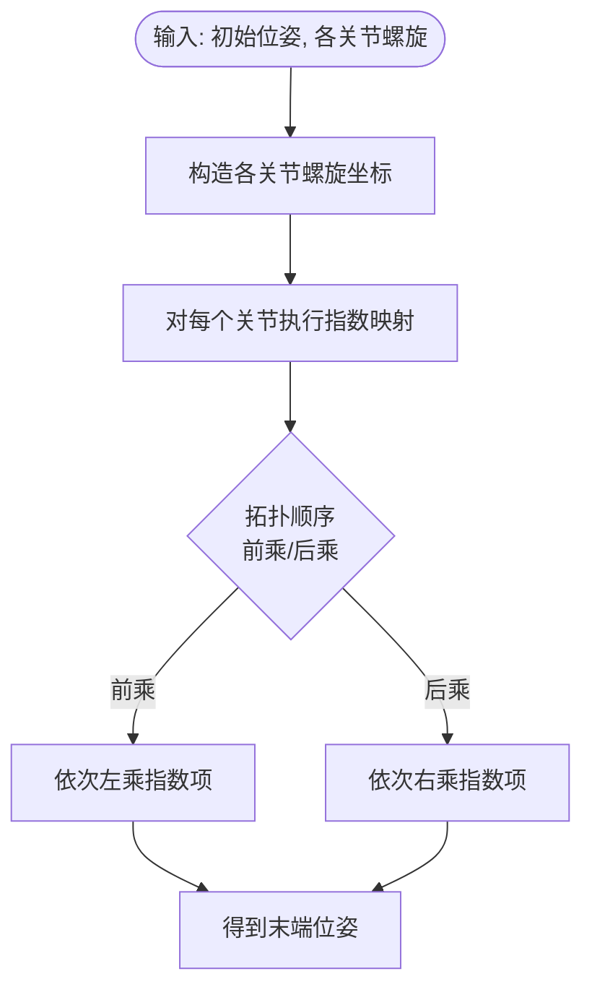
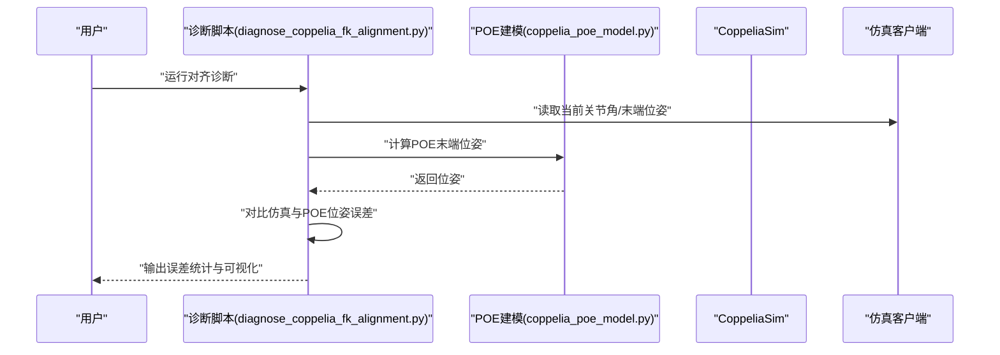
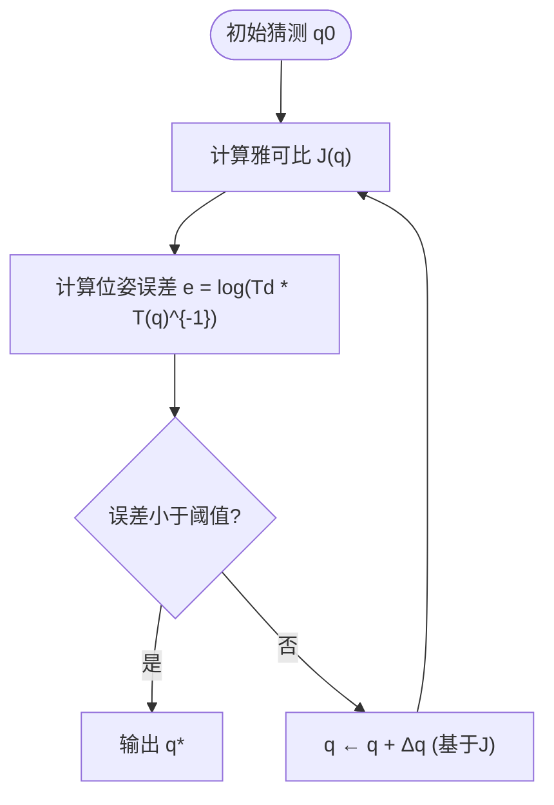
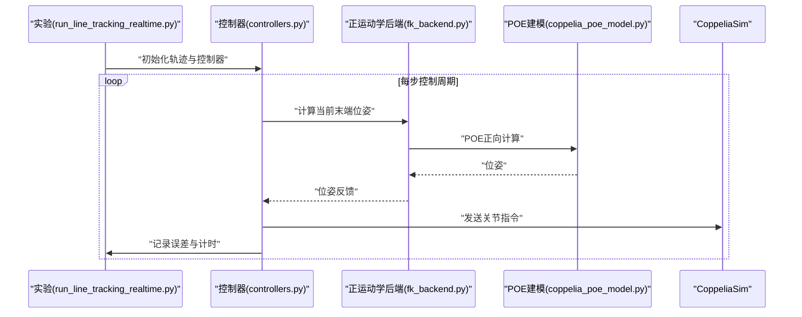
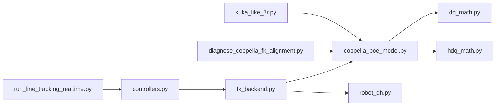

# POE模型与螺旋理论

<cite>
**本文引用的文件**   
- [coppelia_poe_model.py](file://core/coppelia_poe_model.py)
- [robot_dh.py](file://core/robot_dh.py)
- [dq_math.py](file://core/dq_math.py)
- [hdq_math.py](file://core/hdq_math.py)
- [fk_backend.py](file://core/fk_backend.py)
- [controllers.py](file://core/controllers.py)
- [kuka_like_7r.py](file://configs/kuka_like_7r.py)
- [diagnose_coppelia_fk_alignment.py](file://experiments/diagnose_coppelia_fk_alignment.py)
- [run_line_tracking_realtime.py](file://experiments/run_line_tracking_realtime.py)
</cite>

## 目录
1. [引言](#引言)
2. [项目结构](#项目结构)
3. [核心组件](#核心组件)
4. [架构总览](#架构总览)
5. [详细组件分析](#详细组件分析)
6. [依赖关系分析](#依赖关系分析)
7. [性能考虑](#性能考虑)
8. [故障排查指南](#故障排查指南)
9. [结论](#结论)
10. [附录](#附录)

## 引言
本技术文档围绕“POE（Product of Exponentials）模型与螺旋理论”在机器人建模与控制中的应用展开，结合仓库中的实现与实验脚本，系统阐述：
- 螺旋理论的数学基础：螺旋轴、螺距、螺旋坐标及其物理意义；
- POE公式的理论推导：初始位姿、关节轴螺旋与指数映射的数学关系；
- POE相比传统DH方法的优越性：参数辨识简便性与数值稳定性；
- CoppeliaSim环境下的POE建模流程：螺旋轴确定与模型验证；
- 不同拓扑结构机器人的POE建模方法与参数获取技巧；
- POE模型的逆运动学求解、雅可比矩阵计算与运动学分析应用；
- 实际系统集成案例与性能评估。

## 项目结构
本项目采用分层组织方式：
- core：核心算法与后端实现，包含POE建模、四元数与超复数数学库、正运动学后端、控制器等；
- configs：机器人配置（如KUKA-like 7R）；
- experiments：仿真与实时跟踪实验脚本；
- sim：CoppeliaSim客户端与关节名定义；
- results：结果数据与绘图输出。

图表来源
- [coppelia_poe_model.py](file://core/coppelia_poe_model.py)
- [robot_dh.py](file://core/robot_dh.py)
- [dq_math.py](file://core/dq_math.py)
- [hdq_math.py](file://core/hdq_math.py)
- [fk_backend.py](file://core/fk_backend.py)
- [controllers.py](file://core/controllers.py)
- [kuka_like_7r.py](file://configs/kuka_like_7r.py)
- [diagnose_coppelia_fk_alignment.py](file://experiments/diagnose_coppelia_fk_alignment.py)
- [run_line_tracking_realtime.py](file://experiments/run_line_tracking_realtime.py)

章节来源
- [coppelia_poe_model.py](file://core/coppelia_poe_model.py)
- [robot_dH.py](file://core/robot_dh.py)
- [fk_backend.py](file://core/fk_backend.py)
- [kuka_like_7r.py](file://configs/kuka_like_7r.py)
- [diagnose_coppelia_fk_alignment.py](file://experiments/diagnose_coppelia_fk_alignment.py)
- [run_line_tracking_realtime.py](file://experiments/run_line_tracking_realtime.py)

## 核心组件
- POE建模与CoppeliaSim集成：提供基于螺旋轴的POE正运动学实现，支持从CoppeliaSim读取/设置状态并与仿真同步。
- DH建模对比：提供传统Denavit-Hartenberg参数化方法，便于与POE进行对照与误差分析。
- 四元数与超复数数学库：封装旋转、变换与指数映射相关运算，支撑POE与HDQ链式计算。
- 正运动学后端：统一封装FK计算入口，内部可切换POE或DH路径。
- 控制器：在轨迹跟踪任务中调用运动学后端，形成闭环控制。
- 实验与诊断：包括CoppeliaSim FK对齐诊断与实时直线跟踪实验。

章节来源
- [coppelia_poe_model.py](file://core/coppelia_poe_model.py)
- [robot_dh.py](file://core/robot_dh.py)
- [dq_math.py](file://core/dq_math.py)
- [hdq_math.py](file://core/hdq_math.py)
- [fk_backend.py](file://core/fk_backend.py)
- [controllers.py](file://core/controllers.py)

## 架构总览
下图展示了POE建模在系统中的位置与数据流：配置驱动POE参数，正运动学后端根据当前关节角计算末端位姿，控制器依据轨迹误差生成指令，CoppeliaSim作为执行与观测平台。

图表来源
- [kuka_like_7r.py](file://configs/kuka_like_7r.py)
- [coppelia_poe_model.py](file://core/coppelia_poe_model.py)
- [fk_backend.py](file://core/fk_backend.py)
- [dq_math.py](file://core/dq_math.py)
- [hdq_math.py](file://core/hdq_math.py)
- [controllers.py](file://core/controllers.py)

## 详细组件分析

### 螺旋理论与POE数学基础
- 螺旋轴与螺距：描述刚体沿一条空间直线的平移与绕该直线的旋转耦合，由单位方向向量、参考点与螺距共同表征。
- 螺旋坐标（ twists ）：将螺旋轴与关节速度映射为6维向量，用于指数映射到SE(3)。
- 指数映射：将李代数元素映射至李群SE(3)，得到关节位移对应的变换矩阵。
- POE公式：末端位姿等于初始位姿与各关节指数项的乘积，顺序取决于机器人拓扑（前乘或后乘）。

图表来源
- [coppelia_poe_model.py](file://core/coppelia_poe_model.py)
- [dq_math.py](file://core/dq_math.py)
- [hdq_math.py](file://core/hdq_math.py)

章节来源
- [coppelia_poe_model.py](file://core/coppelia_poe_model.py)
- [dq_math.py](file://core/dq_math.py)
- [hdq_math.py](file://core/hdq_math.py)

### POE vs DH：优势与适用场景
- 参数辨识简便性：POE以世界坐标系或基座标系为参考，无需逐连杆局部坐标系，减少中间变量与符号复杂度。
- 数值稳定性：避免奇异构型附近的DH参数病态问题，指数映射在局部具有良好性质。
- 工程易用性：与CAD/仿真软件坐标系对齐更直观，便于从模型直接提取螺旋轴。

章节来源
- [robot_dh.py](file://core/robot_dh.py)
- [coppelia_poe_model.py](file://core/coppelia_poe_model.py)

### CoppeliaSim环境下的POE建模与验证
- 螺旋轴确定：在CoppeliaSim中建立机器人模型，导出各关节轴的单位方向向量与参考点，结合零位初始位姿构建螺旋坐标。
- 模型验证流程：通过FK对齐诊断脚本对比POE与仿真端FK，评估一致性并迭代修正参数。
- 数据交互：使用仿真客户端读写关节角度与末端位姿，形成闭环验证。

图表来源
- [diagnose_coppelia_fk_alignment.py](file://experiments/diagnose_coppelia_fk_alignment.py)
- [coppelia_poe_model.py](file://core/coppelia_poe_model.py)

章节来源
- [diagnose_coppelia_fk_alignment.py](file://experiments/diagnose_coppelia_fk_alignment.py)
- [coppelia_poe_model.py](file://core/coppelia_poe_model.py)

### 不同拓扑结构的POE建模方法与参数获取技巧
- 串联开链：按关节序依次构造螺旋坐标，选择前乘或后乘形式与拓扑一致。
- 并联机构：可将各支链末端相对基座的变换分解为若干子链POE乘积，再引入约束方程求解。
- 参数获取技巧：
  - 从CAD/仿真导出关节轴方向与参考点；
  - 利用零位标定测量初始位姿；
  - 使用最小二乘或优化方法拟合螺旋参数以提升精度。

章节来源
- [kuka_like_7r.py](file://configs/kuka_like_7r.py)
- [coppelia_poe_model.py](file://core/coppelia_poe_model.py)

### 逆运动学求解、雅可比矩阵与运动学分析
- 逆运动学：基于POE的Jacobian可通过指数映射导数或数值差分获得，配合迭代优化求解目标位姿对应的关节角。
- 雅可比矩阵：反映关节速度与末端速度的线性映射，可用于轨迹规划与力控。
- 运动学分析：通过雅可比条件数、奇异值分布评估工作空间与可控性。

图表来源
- [fk_backend.py](file://core/fk_backend.py)
- [dq_math.py](file://core/dq_math.py)
- [hdq_math.py](file://core/hdq_math.py)

章节来源
- [fk_backend.py](file://core/fk_backend.py)
- [dq_math.py](file://core/dq_math.py)
- [hdq_math.py](file://core/hdq_math.py)

### 系统集成案例与性能评估
- 直线跟踪实验：控制器基于POE提供的正运动学与雅可比信息，驱动机器人在CoppeliaSim中跟踪直线轨迹，记录跟踪误差与计算耗时。
- 性能指标：稳态误差、收敛时间、CPU占用率、数值稳定性（条件数、奇异值）。

图表来源
- [run_line_tracking_realtime.py](file://experiments/run_line_tracking_realtime.py)
- [controllers.py](file://core/controllers.py)
- [fk_backend.py](file://core/fk_backend.py)
- [coppelia_poe_model.py](file://core/coppelia_poe_model.py)

章节来源
- [run_line_tracking_realtime.py](file://experiments/run_line_tracking_realtime.py)
- [controllers.py](file://core/controllers.py)
- [fk_backend.py](file://core/fk_backend.py)
- [coppelia_poe_model.py](file://core/coppelia_poe_model.py)

## 依赖关系分析
- 模块内聚与耦合：
  - coppelia_poe_model.py 依赖 dq_math.py/hdq_math.py 完成指数映射与旋转变换；
  - fk_backend.py 统一封装POE/DH两种路径，降低上层调用复杂度；
  - controllers.py 依赖 fk_backend.py 提供实时位姿反馈；
  - 实验脚本依赖配置与仿真客户端，形成端到端验证链路。
- 外部依赖：
  - CoppeliaSim 作为执行与观测平台；
  - 数学库提供稳定高效的几何与代数运算。

图表来源
- [coppelia_poe_model.py](file://core/coppelia_poe_model.py)
- [robot_dh.py](file://core/robot_dh.py)
- [dq_math.py](file://core/dq_math.py)
- [hdq_math.py](file://core/hdq_math.py)
- [fk_backend.py](file://core/fk_backend.py)
- [controllers.py](file://core/controllers.py)
- [diagnose_coppelia_fk_alignment.py](file://experiments/diagnose_coppelia_fk_alignment.py)
- [run_line_tracking_realtime.py](file://experiments/run_line_tracking_realtime.py)
- [kuka_like_7r.py](file://configs/kuka_like_7r.py)

章节来源
- [fk_backend.py](file://core/fk_backend.py)
- [coppelia_poe_model.py](file://core/coppelia_poe_model.py)
- [controllers.py](file://core/controllers.py)

## 性能考虑
- 数值稳定性：指数映射在小角度下近似线性，在大角度时仍保持良好性质；建议对旋转部分进行归一化处理以避免漂移。
- 计算效率：批量计算多关节指数项时可复用中间结果；雅可比计算优先解析形式，必要时采用中心差分。
- 实时性：在高频控制循环中，减少不必要的对象创建与内存分配，确保确定性延迟。

[本节为通用指导，不直接分析具体文件]

## 故障排查指南
- 螺旋轴方向错误：检查单位方向向量与参考点是否来自同一坐标系，确认零位初始位姿正确。
- 前后乘顺序不一致：确保POE乘积顺序与机器人拓扑一致（前乘对应固定坐标系，后乘对应动坐标系）。
- 雅可比奇异：检查当前构型是否接近奇异位形，调整轨迹或引入阻尼最小二乘。
- CoppeliaSim对齐误差：使用诊断脚本定位误差来源，逐步校验各关节螺旋参数与初始位姿。

章节来源
- [diagnose_coppelia_fk_alignment.py](file://experiments/diagnose_coppelia_fk_alignment.py)
- [coppelia_poe_model.py](file://core/coppelia_poe_model.py)

## 结论
POE模型以螺旋理论为基础，提供了简洁且数值稳定的机器人运动学建模方案。相较于传统DH方法，POE在参数辨识与工程落地方面更具优势。结合CoppeliaSim的仿真与实验脚本，可实现从建模、验证到控制的完整闭环。未来可在复杂拓扑与在线辨识方面进一步扩展。

[本节为总结性内容，不直接分析具体文件]

## 附录
- 术语表：
  - 螺旋轴：描述刚体运动的轴线；
  - 螺距：沿轴线平移与绕轴旋转的比例；
  - 螺旋坐标：6维向量，表示螺旋轴与速度；
  - 指数映射：从李代数到李群的映射；
  - 前乘/后乘：POE乘积顺序与坐标系选择相关。
- 参考实现路径：
  - POE建模与CoppeliaSim集成：[coppelia_poe_model.py](file://core/coppelia_poe_model.py)
  - DH建模对比：[robot_dh.py](file://core/robot_dh.py)
  - 数学库：[dq_math.py](file://core/dq_math.py)、[hdq_math.py](file://core/hdq_math.py)
  - 正运动学后端：[fk_backend.py](file://core/fk_backend.py)
  - 控制器：[controllers.py](file://core/controllers.py)
  - 配置示例：[kuka_like_7r.py](file://configs/kuka_like_7r.py)
  - 诊断与实验：[diagnose_coppelia_fk_alignment.py](file://experiments/diagnose_coppelia_fk_alignment.py)、[run_line_tracking_realtime.py](file://experiments/run_line_tracking_realtime.py)