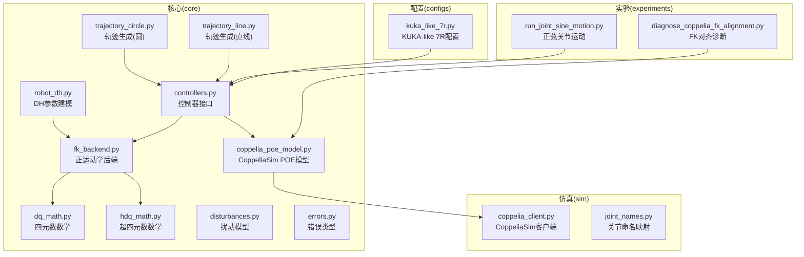
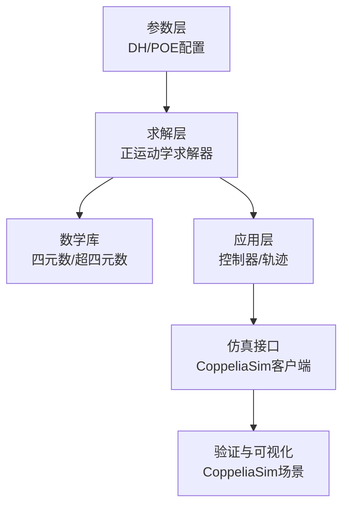
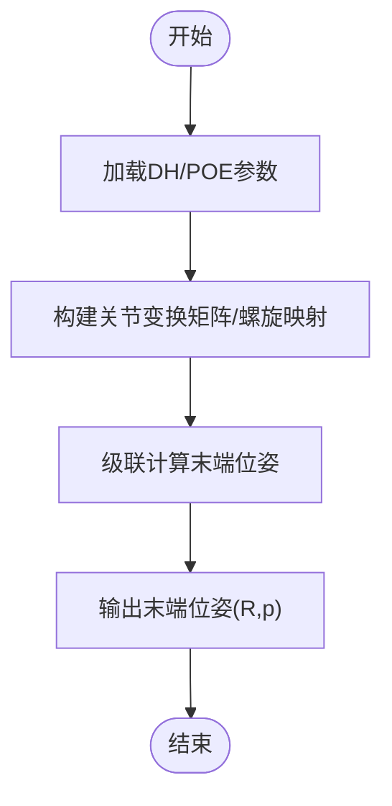
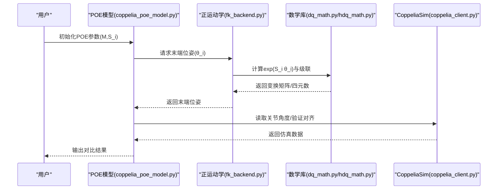
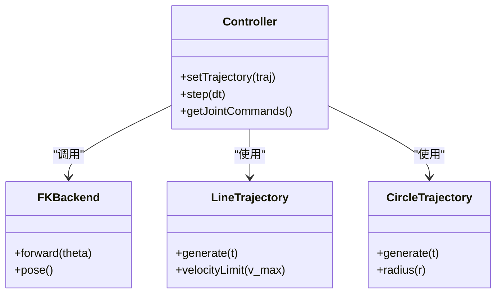
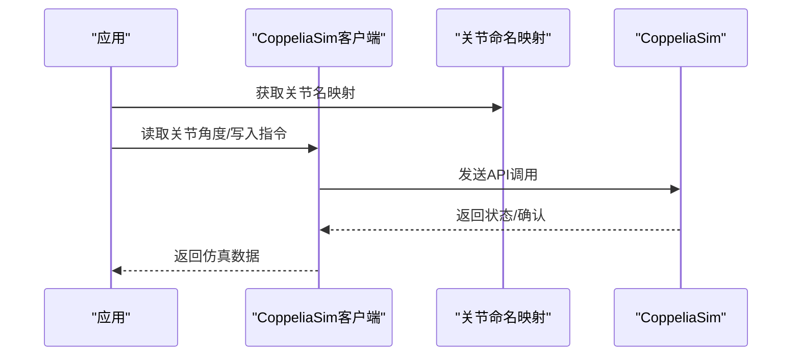
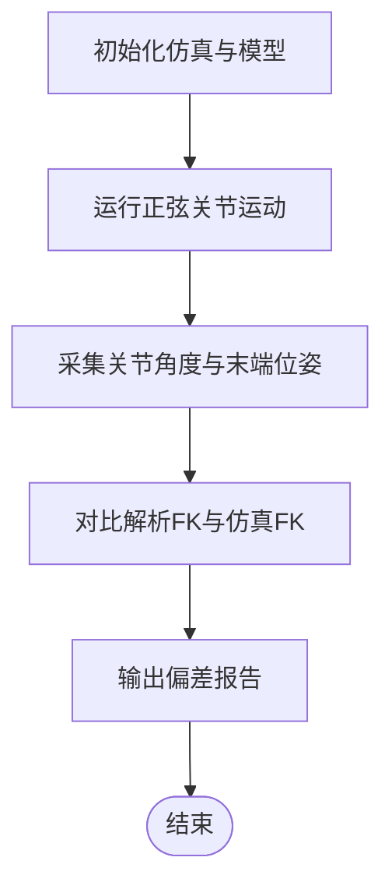
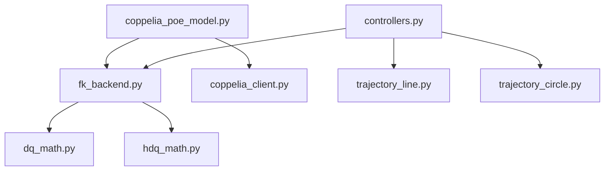

# 机器人运动学模块

<cite>
**本文引用的文件**   
- [robot_dh.py](file://core/robot_dh.py)
- [fk_backend.py](file://core/fk_backend.py)
- [coppelia_poe_model.py](file://core/coppelia_poe_model.py)
- [dq_math.py](file://core/dq_math.py)
- [hdq_math.py](file://core/hdq_math.py)
- [controllers.py](file://core/controllers.py)
- [disturbances.py](file://core/disturbances.py)
- [trajectory_circle.py](file://core/trajectory_circle.py)
- [trajectory_line.py](file://core/trajectory_line.py)
- [errors.py](file://core/errors.py)
- [kuka_like_7r.py](file://configs/kuka_like_7r.py)
- [coppelia_client.py](file://sim/coppelia_client.py)
- [joint_names.py](file://sim/joint_names.py)
- [run_joint_sine_motion.py](file://experiments/run_joint_sine_motion.py)
- [diagnose_coppelia_fk_alignment.py](file://experiments/diagnose_coppelia_fk_alignment.py)
</cite>

## 目录
1. [简介](#简介)
2. [项目结构](#项目结构)
3. [核心组件](#核心组件)
4. [架构总览](#架构总览)
5. [详细组件分析](#详细组件分析)
6. [依赖关系分析](#依赖关系分析)
7. [性能考虑](#性能考虑)
8. [故障排查指南](#故障排查指南)
9. [结论](#结论)
10. [附录](#附录)

## 简介
本技术文档围绕机器人运动学模块，系统阐述以下主题：
- DH参数法实现原理：标准DH与修正DH的区别、适用场景与建模要点。
- 正运动学求解器：变换矩阵级联计算与位姿表示方法。
- POE公式与螺旋理论：在机器人建模中的优势与工程落地方式。
- CoppeliaSim环境下的POE模型定义与验证流程。
- 完整运动学求解流程：从参数配置到结果输出。
- 逆运动学数值解法、奇异点检测与关节限位处理。
- 不同构型机器人的建模方法与验证实验示例。

## 项目结构
仓库采用分层组织：核心算法位于 core，仿真接口位于 sim，实验脚本位于 experiments，配置文件位于 configs。核心运动学相关代码集中在 core 目录下，包含DH建模、正运动学后端、CoppeliaSim的POE模型封装以及四元数/超四元数数学库等。

图表来源
- [robot_dh.py:1-200](file://core/robot_dh.py#L1-L200)
- [fk_backend.py:1-200](file://core/fk_backend.py#L1-L200)
- [coppelia_poe_model.py:1-200](file://core/coppelia_poe_model.py#L1-L200)
- [dq_math.py:1-200](file://core/dq_math.py#L1-L200)
- [hdq_math.py:1-200](file://core/hdq_math.py#L1-L200)
- [controllers.py:1-200](file://core/controllers.py#L1-L200)
- [disturbances.py:1-200](file://core/disturbances.py#L1-L200)
- [trajectory_circle.py:1-200](file://core/trajectory_circle.py#L1-L200)
- [trajectory_line.py:1-200](file://core/trajectory_line.py#L1-L200)
- [errors.py:1-200](file://core/errors.py#L1-L200)
- [kuka_like_7r.py:1-200](file://configs/kuka_like_7r.py#L1-L200)
- [coppelia_client.py:1-200](file://sim/coppelia_client.py#L1-L200)
- [joint_names.py:1-200](file://sim/joint_names.py#L1-L200)
- [run_joint_sine_motion.py:1-200](file://experiments/run_joint_sine_motion.py#L1-L200)
- [diagnose_coppelia_fk_alignment.py:1-200](file://experiments/diagnose_coppelia_fk_alignment.py#L1-L200)

章节来源
- [robot_dh.py:1-200](file://core/robot_dh.py#L1-L200)
- [fk_backend.py:1-200](file://core/fk_backend.py#L1-L200)
- [coppelia_poe_model.py:1-200](file://core/coppelia_poe_model.py#L1-L200)
- [dq_math.py:1-200](file://core/dq_math.py#L1-L200)
- [hdq_math.py:1-200](file://core/hdq_math.py#L1-L200)
- [controllers.py:1-200](file://core/controllers.py#L1-L200)
- [disturbances.py:1-200](file://core/disturbances.py#L1-L200)
- [trajectory_circle.py:1-200](file://core/trajectory_circle.py#L1-L200)
- [trajectory_line.py:1-200](file://core/trajectory_line.py#L1-L200)
- [errors.py:1-200](file://core/errors.py#L1-L200)
- [kuka_like_7r.py:1-200](file://configs/kuka_like_7r.py#L1-L200)
- [coppelia_client.py:1-200](file://sim/coppelia_client.py#L1-L200)
- [joint_names.py:1-200](file://sim/joint_names.py#L1-L200)
- [run_joint_sine_motion.py:1-200](file://experiments/run_joint_sine_motion.py#L1-L200)
- [diagnose_coppelia_fk_alignment.py:1-200](file://experiments/diagnose_coppelia_fk_alignment.py#L1-L200)

## 核心组件
- DH参数建模（robot_dh.py）：提供标准DH与修正DH两种参数化方式，支持连杆长度、扭转角、偏移与关节角配置，并生成各关节间的齐次变换矩阵序列。
- 正运动学后端（fk_backend.py）：基于DH或POE输入，计算末端执行器位姿；内部使用四元数/超四元数进行旋转表达与插值，提升数值稳定性。
- CoppeliaSim POE模型（coppelia_poe_model.py）：将POE参数与CoppeliaSim场景中的链式刚体对应，提供模型加载、校验与可视化对齐工具。
- 数学库（dq_math.py, hdq_math.py）：四元数与超四元数的基本运算、指数映射与对数映射、旋量与变换矩阵互转等。
- 控制器与轨迹（controllers.py, trajectory_line.py, trajectory_circle.py）：为运动学提供轨迹规划与闭环控制接口，便于端到端验证。
- 仿真接口（coppelia_client.py, joint_names.py）：与CoppeliaSim通信，读取关节状态、写入指令，并提供关节名映射。
- 实验与诊断（run_joint_sine_motion.py, diagnose_coppelia_fk_alignment.py）：用于验证正向运动学与模型一致性。

章节来源
- [robot_dh.py:1-200](file://core/robot_dh.py#L1-L200)
- [fk_backend.py:1-200](file://core/fk_backend.py#L1-L200)
- [coppelia_poe_model.py:1-200](file://core/coppelia_poe_model.py#L1-L200)
- [dq_math.py:1-200](file://core/dq_math.py#L1-L200)
- [hdq_math.py:1-200](file://core/hdq_math.py#L1-L200)
- [controllers.py:1-200](file://core/controllers.py#L1-L200)
- [trajectory_line.py:1-200](file://core/trajectory_line.py#L1-L200)
- [trajectory_circle.py:1-200](file://core/trajectory_circle.py#L1-L200)
- [coppelia_client.py:1-200](file://sim/coppelia_client.py#L1-L200)
- [joint_names.py:1-200](file://sim/joint_names.py#L1-L200)
- [run_joint_sine_motion.py:1-200](file://experiments/run_joint_sine_motion.py#L1-L200)
- [diagnose_coppelia_fk_alignment.py:1-200](file://experiments/diagnose_coppelia_fk_alignment.py#L1-L200)

## 架构总览
整体架构分为三层：
- 参数层：DH参数或POE参数集中管理，供上层调用。
- 求解层：正运动学求解器根据参数计算末端位姿；必要时结合四元数/超四元数进行稳定计算。
- 应用层：控制器与轨迹生成驱动求解器，并通过仿真接口与CoppeliaSim交互，完成闭环验证。

图表来源
- [robot_dh.py:1-200](file://core/robot_dh.py#L1-L200)
- [fk_backend.py:1-200](file://core/fk_backend.py#L1-L200)
- [dq_math.py:1-200](file://core/dq_math.py#L1-L200)
- [hdq_math.py:1-200](file://core/hdq_math.py#L1-L200)
- [controllers.py:1-200](file://core/controllers.py#L1-L200)
- [coppelia_client.py:1-200](file://sim/coppelia_client.py#L1-L200)

## 详细组件分析

### DH参数法与正运动学求解器
- 标准DH与修正DH的差异
  - 标准DH：z轴沿关节轴线，x轴沿公垂线指向下一关节，参数包括连杆长度a、扭转角α、偏移d、关节角θ。适用于传统串联臂，易于手工推导。
  - 修正DH：x轴沿当前关节轴线，z轴沿公垂线指向下一关节，参数顺序与物理意义更贴近装配过程，常用于现代CAD装配与自动建模。
- 变换矩阵级联与位姿表示
  - 通过逐关节齐次变换矩阵相乘得到末端位姿T_end = T_0^1 * T_1^2 * ... * T_{n-1}^n。
  - 位姿由旋转部分R与平移部分p组成；旋转可用旋转矩阵或四元数表示，后者在插值与数值稳定性上更具优势。
- 求解流程
  - 输入：DH参数表或POE参数集。
  - 步骤：构建各关节变换矩阵或螺旋映射 -> 级联计算 -> 输出末端位姿。
  - 输出：末端位置与姿态（四元数或旋转矩阵）。

图表来源
- [robot_dh.py:1-200](file://core/robot_dh.py#L1-L200)
- [fk_backend.py:1-200](file://core/fk_backend.py#L1-L200)
- [dq_math.py:1-200](file://core/dq_math.py#L1-L200)

章节来源
- [robot_dh.py:1-200](file://core/robot_dh.py#L1-L200)
- [fk_backend.py:1-200](file://core/fk_backend.py#L1-L200)
- [dq_math.py:1-200](file://core/dq_math.py#L1-L200)

### POE公式与螺旋理论
- 螺旋理论优势
  - 统一描述旋转与平移，避免奇异性问题；适合多分支与并联机构建模。
  - 便于全局坐标系下直接表达末端位姿，减少中间坐标系的累积误差。
- POE建模步骤
  - 定义零位形M（末端相对于基座的变换）。
  - 定义各关节螺旋S_i（旋量），包含旋转轴与参考点。
  - 通过指数映射exp(S_i θ_i)级联得到T = exp(S_1 θ_1) * exp(S_2 θ_2) * ... * M。
- 与CoppeliaSim集成
  - 将POE参数映射到场景中的刚体链，确保零位形与螺旋轴方向一致。
  - 通过仿真读取关节角度，对比解析POE结果以验证一致性。

图表来源
- [coppelia_poe_model.py:1-200](file://core/coppelia_poe_model.py#L1-L200)
- [fk_backend.py:1-200](file://core/fk_backend.py#L1-L200)
- [dq_math.py:1-200](file://core/dq_math.py#L1-L200)
- [hdq_math.py:1-200](file://core/hdq_math.py#L1-L200)
- [coppelia_client.py:1-200](file://sim/coppelia_client.py#L1-L200)

章节来源
- [coppelia_poe_model.py:1-200](file://core/coppelia_poe_model.py#L1-L200)
- [fk_backend.py:1-200](file://core/fk_backend.py#L1-L200)
- [dq_math.py:1-200](file://core/dq_math.py#L1-L200)
- [hdq_math.py:1-200](file://core/hdq_math.py#L1-L200)
- [coppelia_client.py:1-200](file://sim/coppelia_client.py#L1-L200)

### 控制器与轨迹生成
- 控制器接口（controllers.py）
  - 提供统一的控制入口，接收期望轨迹与当前状态，调用运动学求解器计算所需关节指令。
- 轨迹生成（trajectory_line.py, trajectory_circle.py）
  - 直线与圆形轨迹生成，支持时间参数化与速度限制，便于测试正运动学与闭环控制。

图表来源
- [controllers.py:1-200](file://core/controllers.py#L1-L200)
- [trajectory_line.py:1-200](file://core/trajectory_line.py#L1-L200)
- [trajectory_circle.py:1-200](file://core/trajectory_circle.py#L1-L200)
- [fk_backend.py:1-200](file://core/fk_backend.py#L1-L200)

章节来源
- [controllers.py:1-200](file://core/controllers.py#L1-L200)
- [trajectory_line.py:1-200](file://core/trajectory_line.py#L1-L200)
- [trajectory_circle.py:1-200](file://core/trajectory_circle.py#L1-L200)
- [fk_backend.py:1-200](file://core/fk_backend.py#L1-L200)

### 仿真接口与关节命名
- CoppeliaSim客户端（coppelia_client.py）
  - 负责连接仿真环境、读取关节角度、写入控制指令。
- 关节命名映射（joint_names.py）
  - 提供Python侧关节名与仿真场景内对象名的映射，确保数据读写正确。

图表来源
- [coppelia_client.py:1-200](file://sim/coppelia_client.py#L1-L200)
- [joint_names.py:1-200](file://sim/joint_names.py#L1-L200)

章节来源
- [coppelia_client.py:1-200](file://sim/coppelia_client.py#L1-L200)
- [joint_names.py:1-200](file://sim/joint_names.py#L1-L200)

### 实验与验证
- 正弦关节运动（run_joint_sine_motion.py）
  - 对各关节施加正弦激励，观察末端轨迹与响应，验证正运动学一致性。
- FK对齐诊断（diagnose_coppelia_fk_alignment.py）
  - 对比解析FK与仿真FK，输出偏差统计与可视化，辅助定位参数误差。

图表来源
- [run_joint_sine_motion.py:1-200](file://experiments/run_joint_sine_motion.py#L1-L200)
- [diagnose_coppelia_fk_alignment.py:1-200](file://experiments/diagnose_coppelia_fk_alignment.py#L1-L200)
- [fk_backend.py:1-200](file://core/fk_backend.py#L1-L200)

章节来源
- [run_joint_sine_motion.py:1-200](file://experiments/run_joint_sine_motion.py#L1-L200)
- [diagnose_coppelia_fk_alignment.py:1-200](file://experiments/diagnose_coppelia_fk_alignment.py#L1-L200)
- [fk_backend.py:1-200](file://core/fk_backend.py#L1-L200)

### 配置示例：KUKA-like 7R
- 配置（kuka_like_7r.py）
  - 提供典型7自由度机械臂的DH或POE参数模板，便于快速搭建与验证。
- 使用建议
  - 根据实际CAD装配选择标准DH或修正DH；若存在共面或特殊几何，修正DH更易维护。
  - 在POE模式下，确保零位形与螺旋轴方向与仿真一致。

章节来源
- [kuka_like_7r.py:1-200](file://configs/kuka_like_7r.py#L1-L200)

## 依赖关系分析
- 模块耦合
  - fk_backend.py依赖dq_math.py与hdq_math.py进行旋转与变换计算。
  - coppelia_poe_model.py依赖fk_backend.py与coppelia_client.py完成模型与仿真对接。
  - controllers.py组合轨迹生成与FK后端，形成闭环控制流。
- 外部依赖
  - CoppeliaSim作为外部仿真平台，通过coppelia_client.py进行通信。

图表来源
- [fk_backend.py:1-200](file://core/fk_backend.py#L1-L200)
- [dq_math.py:1-200](file://core/dq_math.py#L1-L200)
- [hdq_math.py:1-200](file://core/hdq_math.py#L1-L200)
- [coppelia_poe_model.py:1-200](file://core/coppelia_poe_model.py#L1-L200)
- [coppelia_client.py:1-200](file://sim/coppelia_client.py#L1-L200)
- [controllers.py:1-200](file://core/controllers.py#L1-L200)
- [trajectory_line.py:1-200](file://core/trajectory_line.py#L1-L200)
- [trajectory_circle.py:1-200](file://core/trajectory_circle.py#L1-L200)

章节来源
- [fk_backend.py:1-200](file://core/fk_backend.py#L1-L200)
- [dq_math.py:1-200](file://core/dq_math.py#L1-L200)
- [hdq_math.py:1-200](file://core/hdq_math.py#L1-L200)
- [coppelia_poe_model.py:1-200](file://core/coppelia_poe_model.py#L1-L200)
- [coppelia_client.py:1-200](file://sim/coppelia_client.py#L1-L200)
- [controllers.py:1-200](file://core/controllers.py#L1-L200)
- [trajectory_line.py:1-200](file://core/trajectory_line.py#L1-L200)
- [trajectory_circle.py:1-200](file://core/trajectory_circle.py#L1-L200)

## 性能考虑
- 四元数/超四元数运算
  - 相比欧拉角，避免万向节锁；相比旋转矩阵，节省存储与计算开销。
- 级联计算优化
  - 预计算常量子链变换，减少重复乘法。
- 数值稳定性
  - 在接近奇异点时，采用阻尼最小二乘或正则化策略，提高逆解收敛性。
- 实时性
  - 将高频计算放入独立线程或进程，降低主循环延迟。

[本节为通用指导，不直接分析具体文件]

## 故障排查指南
- 常见错误类型（errors.py）
  - 参数不一致、维度不匹配、奇异点警告等，建议在调用前进行参数校验。
- 扰动模型（disturbances.py）
  - 在仿真中注入噪声或扰动，帮助识别运动学模型的鲁棒性与误差来源。
- 调试建议
  - 使用diagnose_coppelia_fk_alignment.py进行FK对齐诊断，检查DH/POE参数与仿真模型的一致性。
  - 逐步缩小范围：先验证单关节变换，再级联至整链。

章节来源
- [errors.py:1-200](file://core/errors.py#L1-L200)
- [disturbances.py:1-200](file://core/disturbances.py#L1-L200)
- [diagnose_coppelia_fk_alignment.py:1-200](file://experiments/diagnose_coppelia_fk_alignment.py#L1-L200)

## 结论
本模块提供了完整的机器人运动学解决方案：
- 支持标准DH与修正DH两种参数化方式，适配不同建模习惯与装配流程。
- 正运动学求解器基于变换矩阵级联与四元数/超四元数数学库，保证精度与稳定性。
- POE公式与螺旋理论简化了全局建模与验证流程，并与CoppeliaSim无缝集成。
- 控制器与轨迹生成提供端到端验证路径，实验脚本与诊断工具保障模型可靠性。
- 针对逆运动学、奇异点与关节限位，建议引入数值解法与约束处理策略，以提升工程实用性。

[本节为总结性内容，不直接分析具体文件]

## 附录
- 术语说明
  - DH参数：Denavit-Hartenberg参数，用于描述连杆间相对位姿。
  - POE：Product of Exponentials，指数积公式，基于螺旋理论的正运动学表达。
  - 旋量：描述旋转轴与参考点的六维向量，用于螺旋映射。
- 推荐实践
  - 优先使用修正DH进行CAD装配驱动的建模。
  - 在复杂或多分支机构中使用POE，减少中间坐标系误差。
  - 利用四元数/超四元数进行插值与姿态表示，提升数值稳定性。

[本节为概念性内容，不直接分析具体文件]