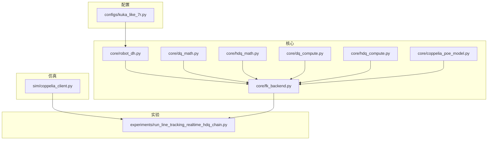
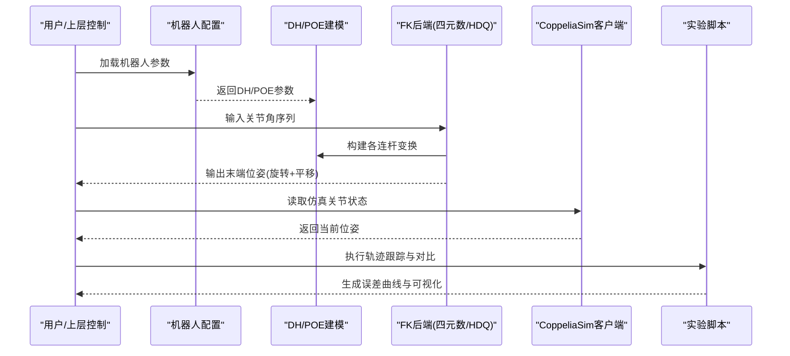
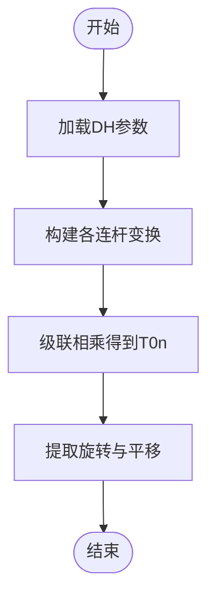
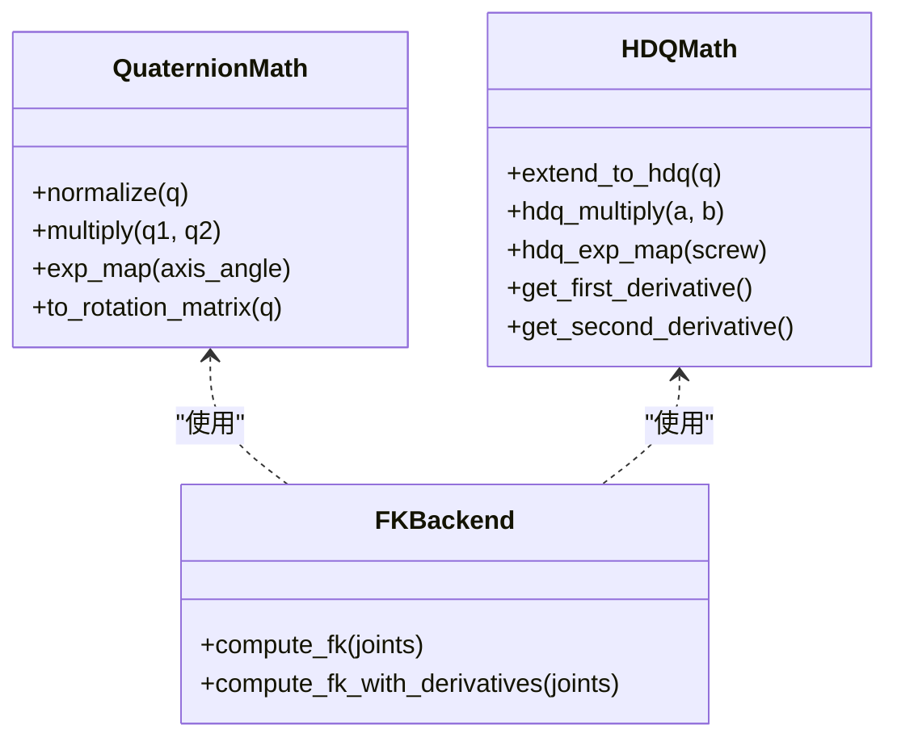
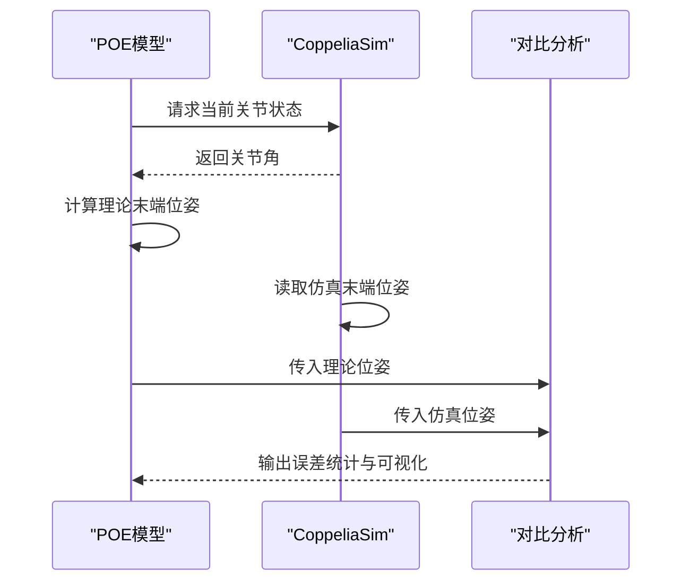
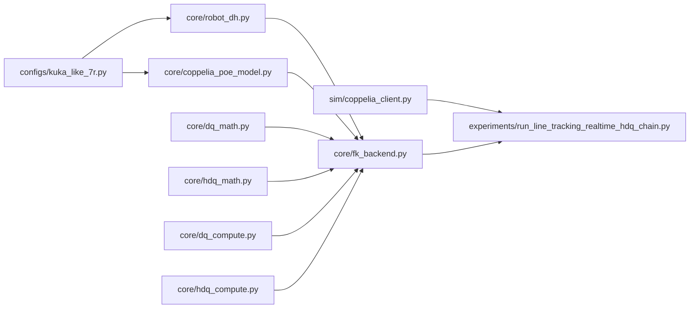

# 正运动学求解器

<cite>
**本文引用的文件**   
- [core/robot_dh.py](file://core/robot_dh.py)
- [core/fk_backend.py](file://core/fk_backend.py)
- [core/dq_math.py](file://core/dq_math.py)
- [core/hdq_math.py](file://core/hdq_math.py)
- [core/dq_compute.py](file://core/dq_compute.py)
- [core/hdq_compute.py](file://core/hdq_compute.py)
- [core/coppelia_poe_model.py](file://core/coppelia_poe_model.py)
- [configs/kuka_like_7r.py](file://configs/kuka_like_7r.py)
- [sim/coppelia_client.py](file://sim/coppelia_client.py)
- [experiments/run_line_tracking_realtime_hdq_chain.py](file://experiments/run_line_tracking_realtime_hdq_chain.py)
</cite>

## 目录
1. [简介](#简介)
2. [项目结构](#项目结构)
3. [核心组件](#核心组件)
4. [架构总览](#架构总览)
5. [详细组件分析](#详细组件分析)
6. [依赖关系分析](#依赖关系分析)
7. [性能与复杂度](#性能与复杂度)
8. [故障排查指南](#故障排查指南)
9. [结论](#结论)
10. [附录](#附录)

## 简介
本技术文档围绕“正运动学求解器”展开，系统阐述其数学理论基础、算法实现与工程验证方法。内容覆盖：
- 位姿表示（欧拉角、四元数、旋转矩阵）与坐标变换原理
- 基于DH参数的正运动学算法与变换矩阵级联计算
- 超对偶四元数在正运动学中的优势（高阶导数、精度提升）
- CoppeliaSim环境下的验证方法与仿真对比
- 多关节机器人求解流程与优化技巧
- 奇异点检测、数值稳定性与计算复杂度分析
- 实际机器人示例与可视化方法

## 项目结构
仓库采用分层组织：配置、核心算法、仿真接口与实验脚本。核心模块包括：
- DH参数建模与FK后端
- 四元数与超对偶四元数数学库与计算工具
- CoppeliaSim POE模型与客户端通信
- 面向KUKA类7R机器人的配置与实时追踪实验

图表来源
- [core/robot_dh.py](file://core/robot_dh.py)
- [core/fk_backend.py](file://core/fk_backend.py)
- [core/dq_math.py](file://core/dq_math.py)
- [core/hdq_math.py](file://core/hdq_math.py)
- [core/dq_compute.py](file://core/dq_compute.py)
- [core/hdq_compute.py](file://core/hdq_compute.py)
- [core/coppelia_poe_model.py](file://core/coppelia_poe_model.py)
- [configs/kuka_like_7r.py](file://configs/kuka_like_7r.py)
- [sim/coppelia_client.py](file://sim/coppelia_client.py)
- [experiments/run_line_tracking_realtime_hdq_chain.py](file://experiments/run_line_tracking_realtime_hdq_chain.py)

章节来源
- [core/robot_dh.py](file://core/robot_dh.py)
- [core/fk_backend.py](file://core/fk_backend.py)
- [core/dq_math.py](file://core/dq_math.py)
- [core/hdq_math.py](file://core/hdq_math.py)
- [core/dq_compute.py](file://core/dq_compute.py)
- [core/hdq_compute.py](file://core/hdq_compute.py)
- [core/coppelia_poe_model.py](file://core/coppelia_poe_model.py)
- [configs/kuka_like_7r.py](file://configs/kuka_like_7r.py)
- [sim/coppelia_client.py](file://sim/coppelia_client.py)
- [experiments/run_line_tracking_realtime_hdq_chain.py](file://experiments/run_line_tracking_realtime_hdq_chain.py)

## 核心组件
- DH参数建模与FK后端：提供基于标准或改进DH参数的连杆描述与末端位姿计算入口。
- 四元数与超对偶四元数数学库：封装基本运算、指数映射、对偶扩展与高阶导数支持。
- 四元数/超对偶四元数计算工具：将数学库用于链式变换、雅可比与速度/加速度传播。
- CoppeliaSim POE模型：以螺旋理论表达的运动学模型，便于与仿真对齐与校验。
- 仿真客户端：与CoppeliaSim进行数据交互，读取关节状态并驱动轨迹跟踪实验。
- 机器人配置：定义KUKA类7R的DH参数与命名约定，支撑可复现实验。

章节来源
- [core/robot_dh.py](file://core/robot_dh.py)
- [core/fk_backend.py](file://core/fk_backend.py)
- [core/dq_math.py](file://core/dq_math.py)
- [core/hdq_math.py](file://core/hdq_math.py)
- [core/dq_compute.py](file://core/dq_compute.py)
- [core/hdq_compute.py](file://core/hdq_compute.py)
- [core/coppelia_poe_model.py](file://core/coppelia_poe_model.py)
- [sim/coppelia_client.py](file://sim/coppelia_client.py)
- [configs/kuka_like_7r.py](file://configs/kuka_like_7r.py)

## 架构总览
整体架构由“配置—建模—求解—仿真—实验”五层构成。配置提供机器人几何；建模层负责DH/POE表达；求解层提供基于四元数与超对偶四元数的FK与导数；仿真层对接CoppeliaSim；实验层完成轨迹跟踪与结果对比。

图表来源
- [configs/kuka_like_7r.py](file://configs/kuka_like_7r.py)
- [core/robot_dh.py](file://core/robot_dh.py)
- [core/coppelia_poe_model.py](file://core/coppelia_poe_model.py)
- [core/fk_backend.py](file://core/fk_backend.py)
- [core/dq_math.py](file://core/dq_math.py)
- [core/hdq_math.py](file://core/hdq_math.py)
- [core/dq_compute.py](file://core/dq_compute.py)
- [core/hdq_compute.py](file://core/hdq_compute.py)
- [sim/coppelia_client.py](file://sim/coppelia_client.py)
- [experiments/run_line_tracking_realtime_hdq_chain.py](file://experiments/run_line_tracking_realtime_hdq_chain.py)

## 详细组件分析

### 数学基础：位姿表示与坐标变换
- 旋转矩阵：通过连续绕轴旋转组合得到，适合直观理解但存在奇异性与插值不便。
- 欧拉角：用三个角度描述姿态，易于人类阅读，但在奇异点附近数值不稳定。
- 四元数：单位四元数避免奇异性，适合插值与数值稳定传播，常用于姿态更新与组合。
- 坐标变换：从基坐标系到末端坐标系的齐次变换矩阵可由各连杆变换级联得到；四元数形式下可通过旋量/螺旋理论与指数映射高效组合。

章节来源
- [core/dq_math.py](file://core/dq_math.py)
- [core/hdq_math.py](file://core/hdq_math.py)
- [core/robot_dh.py](file://core/robot_dh.py)

### DH参数与FK算法：变换矩阵级联与优化
- 标准/改进DH参数定义各连杆的相对位姿，包含长度、扭角、偏移与关节角。
- 每个关节对应一个4x4齐次变换矩阵，末端位姿为所有连杆变换的乘积。
- 优化策略：
  - 预计算常量部分（如固定偏移），减少重复乘法
  - 使用四元数/旋量表示旋转，降低三角函数调用次数
  - 向量化批量计算，提高批处理效率
  - 利用对称性与稀疏性减少浮点运算

图表来源
- [core/robot_dh.py](file://core/robot_dh.py)
- [core/fk_backend.py](file://core/fk_backend.py)

章节来源
- [core/robot_dh.py](file://core/robot_dh.py)
- [core/fk_backend.py](file://core/fk_backend.py)

### 四元数与超对偶四元数：高阶导数与精度优势
- 四元数：
  - 优点：无奇异性、插值平滑、数值稳定
  - 应用：姿态组合、微分运动学（角速度与线速度传播）
- 超对偶四元数（HDQ）：
  - 在四元数基础上引入超对偶扩展，天然支持一阶与二阶导数
  - 优势：
    - 直接获得位置、速度、加速度的解析表达式，避免有限差分带来的噪声
    - 在高阶控制与轨迹规划中提升精度与鲁棒性
  - 适用场景：需要精确雅可比与Hessian信息的轨迹跟踪与优化

图表来源
- [core/dq_math.py](file://core/dq_math.py)
- [core/hdq_math.py](file://core/hdq_math.py)
- [core/fk_backend.py](file://core/fk_backend.py)

章节来源
- [core/dq_math.py](file://core/dq_math.py)
- [core/hdq_math.py](file://core/hdq_math.py)
- [core/dq_compute.py](file://core/dq_compute.py)
- [core/hdq_compute.py](file://core/hdq_compute.py)
- [core/fk_backend.py](file://core/fk_backend.py)

### CoppeliaSim POE模型与仿真验证
- POE（螺旋理论）模型：以螺旋轴与位移描述关节运动，便于与仿真一致地表达运动学。
- 验证方法：
  - 使用POE模型计算的理论位姿与CoppeliaSim输出的位姿进行对比
  - 统计误差指标（RMSE、最大偏差）并绘制时间序列图
  - 在不同构型（接近奇异点）下评估数值稳定性

图表来源
- [core/coppelia_poe_model.py](file://core/coppelia_poe_model.py)
- [sim/coppelia_client.py](file://sim/coppelia_client.py)

章节来源
- [core/coppelia_poe_model.py](file://core/coppelia_poe_model.py)
- [sim/coppelia_client.py](file://sim/coppelia_client.py)

### 多关节机器人求解流程与优化技巧
- 求解流程：
  - 初始化：加载DH/POE参数与命名约定
  - 输入：关节角序列或轨迹点
  - 计算：按顺序构建连杆变换并级联，得到末端位姿
  - 导出：转换为所需表示（旋转矩阵/欧拉角/四元数）
- 优化技巧：
  - 预计算常量子链，减少重复乘法
  - 使用四元数/旋量替代三角函数密集路径
  - 批处理与向量化，充分利用NumPy/BLAS
  - 缓存中间结果，避免重复求幂与归一化

章节来源
- [configs/kuka_like_7r.py](file://configs/kuka_like_7r.py)
- [core/robot_dh.py](file://core/robot_dh.py)
- [core/fk_backend.py](file://core/fk_backend.py)
- [core/dq_math.py](file://core/dq_math.py)
- [core/hdq_math.py](file://core/hdq_math.py)

### 奇异点检测、数值稳定性与复杂度
- 奇异点检测：
  - 基于雅可比矩阵的条件数或行列式阈值判断
  - 在接近奇异区域限制步长或切换参数化方式
- 数值稳定性：
  - 四元数归一化防止漂移
  - 使用高精度类型或缩放策略避免溢出/下溢
- 计算复杂度：
  - 纯矩阵乘法：O(n)次4x4矩阵乘法（n为关节数）
  - 四元数/旋量：常数因子更小，适合高频控制
  - HDQ：额外开销用于高阶导数，但仍保持线性复杂度

章节来源
- [core/dq_math.py](file://core/dq_math.py)
- [core/hdq_math.py](file://core/hdq_math.py)
- [core/fk_backend.py](file://core/fk_backend.py)

### 实际机器人示例与可视化
- 示例：KUKA类7R机器人轨迹跟踪
  - 使用配置中的DH参数与关节命名
  - 在CoppeliaSim中读取真实关节状态，驱动理论计算
  - 对比理论位姿与仿真位姿，生成误差曲线
- 可视化：
  - 末端轨迹三维图
  - 误差随时间变化曲线
  - 不同表示（旋转矩阵/四元数/欧拉角）的一致性检查

章节来源
- [configs/kuka_like_7r.py](file://configs/kuka_like_7r.py)
- [experiments/run_line_tracking_realtime_hdq_chain.py](file://experiments/run_line_tracking_realtime_hdq_chain.py)
- [sim/coppelia_client.py](file://sim/coppelia_client.py)

## 依赖关系分析
核心模块之间的依赖如下：
- 配置模块提供DH参数与命名，供建模与求解使用
- 建模模块（DH/POE）为求解模块提供几何信息
- 求解模块依赖四元数与HDQ数学库进行位姿组合与导数计算
- 仿真客户端为实验模块提供数据通道
- 实验模块串联配置、求解与仿真，完成端到端验证

图表来源
- [configs/kuka_like_7r.py](file://configs/kuka_like_7r.py)
- [core/robot_dh.py](file://core/robot_dh.py)
- [core/coppelia_poe_model.py](file://core/coppelia_poe_model.py)
- [core/fk_backend.py](file://core/fk_backend.py)
- [core/dq_math.py](file://core/dq_math.py)
- [core/hdq_math.py](file://core/hdq_math.py)
- [core/dq_compute.py](file://core/dq_compute.py)
- [core/hdq_compute.py](file://core/hdq_compute.py)
- [sim/coppelia_client.py](file://sim/coppelia_client.py)
- [experiments/run_line_tracking_realtime_hdq_chain.py](file://experiments/run_line_tracking_realtime_hdq_chain.py)

章节来源
- [configs/kuka_like_7r.py](file://configs/kuka_like_7r.py)
- [core/robot_dh.py](file://core/robot_dh.py)
- [core/coppelia_poe_model.py](file://core/coppelia_poe_model.py)
- [core/fk_backend.py](file://core/fk_backend.py)
- [core/dq_math.py](file://core/dq_math.py)
- [core/hdq_math.py](file://core/hdq_math.py)
- [core/dq_compute.py](file://core/dq_compute.py)
- [core/hdq_compute.py](file://core/hdq_compute.py)
- [sim/coppelia_client.py](file://sim/coppelia_client.py)
- [experiments/run_line_tracking_realtime_hdq_chain.py](file://experiments/run_line_tracking_realtime_hdq_chain.py)

## 性能与复杂度
- 时间复杂度：FK为O(n)，其中n为关节数；HDQ在相同数量级上增加常数因子以支持高阶导数
- 空间复杂度：主要存储中间变换与导数张量，线性增长
- 优化建议：
  - 预计算常量子链与常用旋量指数映射
  - 使用批处理与向量化操作
  - 在接近奇异点时启用条件数监控与自适应步长
  - 合理选择位姿表示（四元数优先于欧拉角）

[本节为通用指导，不直接分析具体文件]

## 故障排查指南
- 常见问题：
  - 位姿漂移：检查四元数归一化是否在每个步骤执行
  - 奇异点附近抖动：监测雅可比条件数，必要时限制关节速度或切换参数化
  - 仿真不一致：核对DH/POE参数与CoppeliaSim模型一致性，确认坐标系约定
  - 性能瓶颈：定位热点函数，考虑预计算与向量化
- 调试手段：
  - 打印中间变换矩阵与四元数范数
  - 对比不同表示（旋转矩阵/四元数/欧拉角）的一致性
  - 记录误差时序并绘制趋势图

章节来源
- [core/dq_math.py](file://core/dq_math.py)
- [core/hdq_math.py](file://core/hdq_math.py)
- [core/fk_backend.py](file://core/fk_backend.py)
- [core/coppelia_poe_model.py](file://core/coppelia_poe_model.py)

## 结论
本求解器以DH参数与POE模型为基础，结合四元数与超对偶四元数数学库，实现了高效、稳定的正运动学计算。通过CoppeliaSim仿真验证与轨迹跟踪实验，证明了其在多关节机器人上的实用性与可扩展性。未来可在奇异点自适应、并行批处理与更丰富的可视化方面继续优化。

[本节为总结性内容，不直接分析具体文件]

## 附录
- 术语表：
  - DH参数：描述连杆几何与关节关系的参数集
  - 四元数：单位四元数用于表示旋转，避免奇异性
  - 超对偶四元数：在四元数基础上扩展，支持高阶导数
  - POE：螺旋理论表达的运动学模型
- 参考实现路径：
  - DH建模与FK后端：[core/robot_dh.py](file://core/robot_dh.py)、[core/fk_backend.py](file://core/fk_backend.py)
  - 四元数与HDQ数学库：[core/dq_math.py](file://core/dq_math.py)、[core/hdq_math.py](file://core/hdq_math.py)
  - 计算工具：[core/dq_compute.py](file://core/dq_compute.py)、[core/hdq_compute.py](file://core/hdq_compute.py)
  - CoppeliaSim集成：[core/coppelia_poe_model.py](file://core/coppelia_poe_model.py)、[sim/coppelia_client.py](file://sim/coppelia_client.py)
  - 配置与实验：[configs/kuka_like_7r.py](file://configs/kuka_like_7r.py)、[experiments/run_line_tracking_realtime_hdq_chain.py](file://experiments/run_line_tracking_realtime_hdq_chain.py)