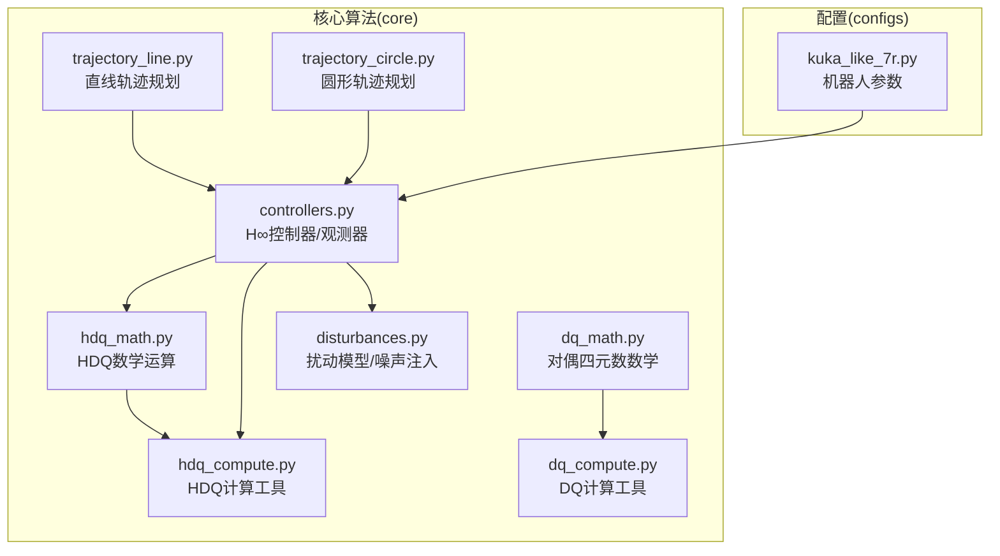
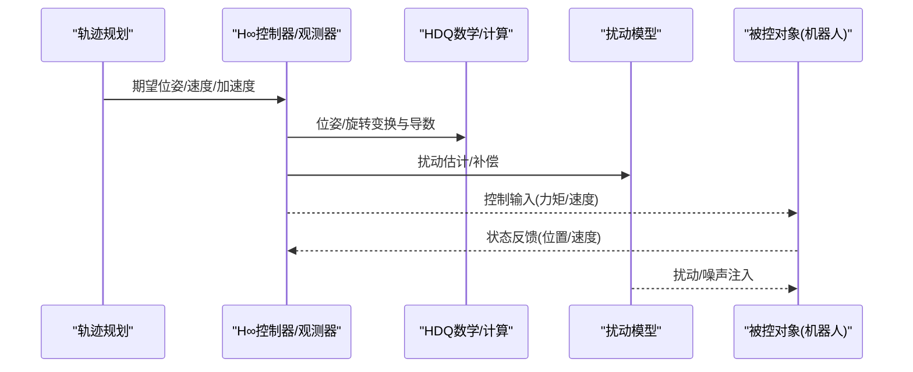
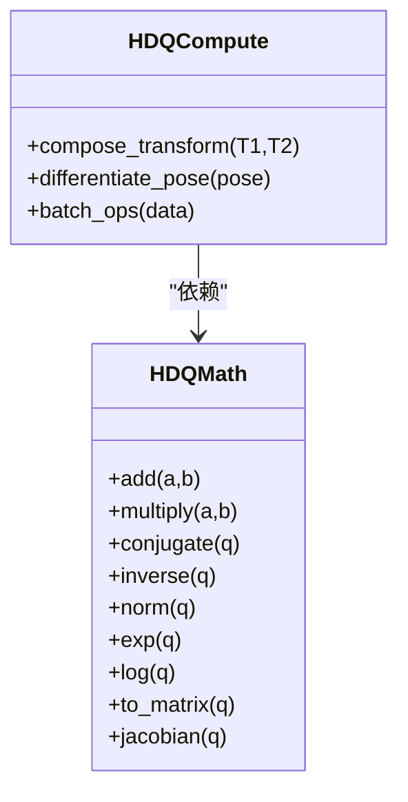
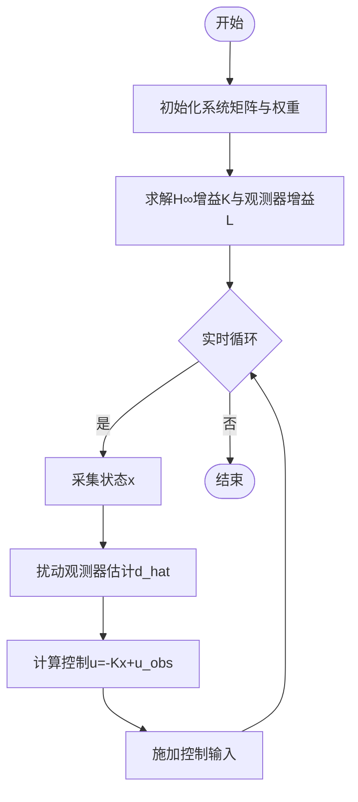
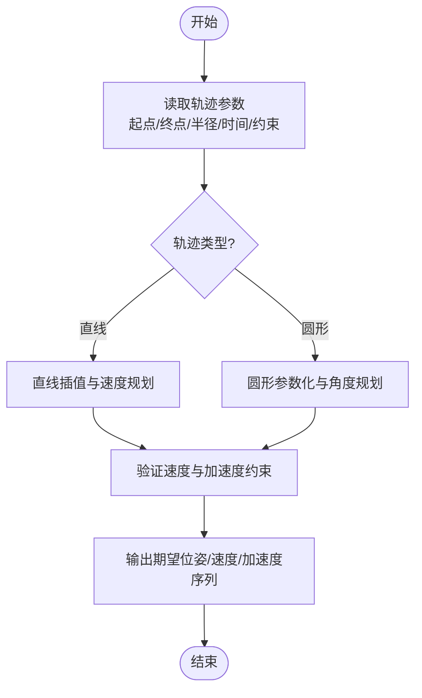
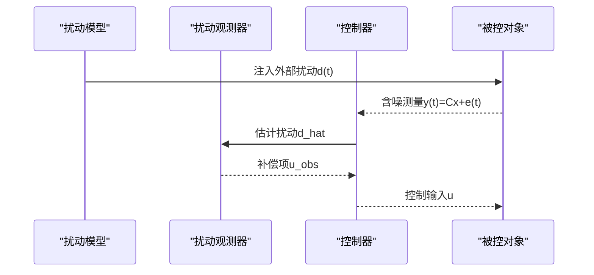
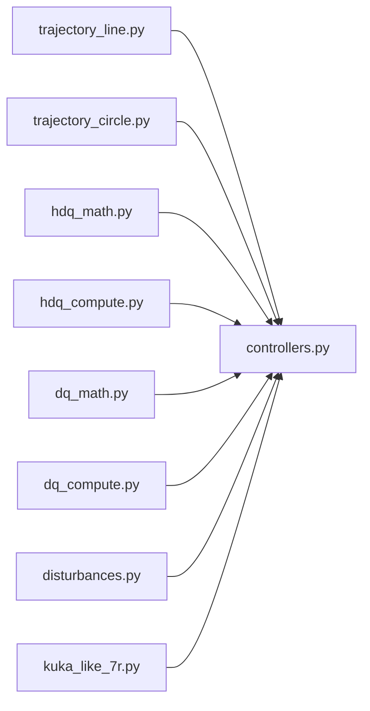

# 核心算法模块

<cite>
**本文引用的文件**   
- [core/hdq_math.py](file://core/hdq_math.py)
- [core/hdq_compute.py](file://core/hdq_compute.py)
- [core/dq_math.py](file://core/dq_math.py)
- [core/dq_compute.py](file://core/dq_compute.py)
- [core/controllers.py](file://core/controllers.py)
- [core/disturbances.py](file://core/disturbances.py)
- [core/trajectory_line.py](file://core/trajectory_line.py)
- [core/trajectory_circle.py](file://core/trajectory_circle.py)
- [configs/kuka_like_7r.py](file://configs/kuka_like_7r.py)
</cite>

## 目录
1. [简介](#简介)
2. [项目结构](#项目结构)
3. [核心组件](#核心组件)
4. [架构总览](#架构总览)
5. [详细组件分析](#详细组件分析)
6. [依赖关系分析](#依赖关系分析)
7. [性能考虑](#性能考虑)
8. [故障排查指南](#故障排查指南)
9. [结论](#结论)
10. [附录](#附录)

## 简介
本技术文档围绕超对偶四元数（Hyperdual Quaternions, HDQ）数学运算库与H∞控制器、轨迹规划及扰动模型等核心算法模块展开，旨在为开发者提供从数学原理到工程实现的全景式说明。内容涵盖：
- HDQ基本运算、变换矩阵计算与导数求解
- H∞控制器设计、状态反馈控制与扰动观测器
- 直线与圆形轨迹生成、速度规划与加速度约束处理
- 扰动模型设计与噪声注入机制
- 各算法的数学公式、伪代码流程与使用示例
- 性能分析与参数调优建议、扩展与自定义指导

## 项目结构
仓库采用按功能域划分的模块化组织方式：
- core：核心算法与数值实现（HDQ/DQ数学、控制器、轨迹、扰动、机器人运动学后端等）
- configs：机器人配置（如KUKA 7R）
- experiments：实验脚本与演示
- sim：CoppeliaSim客户端与关节名映射
- results：结果数据与绘图

图表来源
- [core/hdq_math.py](file://core/hdq_math.py)
- [core/hdq_compute.py](file://core/hdq_compute.py)
- [core/dq_math.py](file://core/dq_math.py)
- [core/dq_compute.py](file://core/dq_compute.py)
- [core/controllers.py](file://core/controllers.py)
- [core/disturbances.py](file://core/disturbances.py)
- [core/trajectory_line.py](file://core/trajectory_line.py)
- [core/trajectory_circle.py](file://core/trajectory_circle.py)
- [configs/kuka_like_7r.py](file://configs/kuka_like_7r.py)

章节来源
- [core/hdq_math.py](file://core/hdq_math.py)
- [core/hdq_compute.py](file://core/hdq_compute.py)
- [core/dq_math.py](file://core/dq_math.py)
- [core/dq_compute.py](file://core/dq_compute.py)
- [core/controllers.py](file://core/controllers.py)
- [core/disturbances.py](file://core/disturbances.py)
- [core/trajectory_line.py](file://core/trajectory_line.py)
- [core/trajectory_circle.py](file://core/trajectory_circle.py)
- [configs/kuka_like_7r.py](file://configs/kuka_like_7r.py)

## 核心组件
本节概述各核心模块的职责与交互关系，重点包括：
- HDQ数学与计算：提供超对偶四元数的代数运算、指数/对数、旋转与平移组合、雅可比与导数工具
- DQ数学与计算：对偶四元数基础运算与几何变换
- H∞控制器与扰动观测器：基于状态空间模型的鲁棒控制与扰动估计
- 轨迹规划：直线与圆形路径生成、速度曲线与加速度约束
- 扰动模型：外部扰动与传感器噪声建模与注入

章节来源
- [core/hdq_math.py](file://core/hdq_math.py)
- [core/hdq_compute.py](file://core/hdq_compute.py)
- [core/dq_math.py](file://core/dq_math.py)
- [core/dq_compute.py](file://core/dq_compute.py)
- [core/controllers.py](file://core/controllers.py)
- [core/disturbances.py](file://core/disturbances.py)
- [core/trajectory_line.py](file://core/trajectory_line.py)
- [core/trajectory_circle.py](file://core/trajectory_circle.py)

## 架构总览
系统以“轨迹规划—控制—扰动—仿真”为主线，HDQ/DQ作为底层数学支撑，控制器在状态反馈基础上引入H∞鲁棒性与扰动观测器补偿，轨迹规划输出期望位姿与速度/加速度约束，扰动模块向系统注入模型不确定性与噪声。

图表来源
- [core/trajectory_line.py](file://core/trajectory_line.py)
- [core/trajectory_circle.py](file://core/trajectory_circle.py)
- [core/controllers.py](file://core/controllers.py)
- [core/hdq_math.py](file://core/hdq_math.py)
- [core/hdq_compute.py](file://core/hdq_compute.py)
- [core/disturbances.py](file://core/disturbances.py)

## 详细组件分析

### HDQ数学与计算模块
职责与要点：
- 超对偶四元数定义与基本运算（加、乘、共轭、逆、范数）
- 指数/对数映射用于旋转与螺旋运动的紧凑表示
- 由HDQ导出变换矩阵与雅可比矩阵，支持导数求解
- 与DQ模块的互操作接口，便于兼容既有对偶四元数算法

关键数据结构与复杂度：
- HDQ元素通常包含标量与多个对偶部分，维度高于普通四元数；乘法与求逆的时间复杂度随维度线性增长，但常数因子较大
- 变换矩阵构造为O(1)，雅可比推导需链式法则与偏导累积，整体O(n)或O(n^2)取决于自由度n

优化机会：
- 批量运算与向量化加速
- 缓存中间结果避免重复计算
- 针对高频调用路径进行函数内联与内存复用

错误处理：
- 奇异点检测（如单位化失败、接近零范数）
- 数值稳定性保护（阈值裁剪、条件判断）

使用示例（步骤）：
- 初始化HDQ表示位姿
- 通过指数映射生成旋转/螺旋运动
- 计算变换矩阵与雅可比
- 将HDQ结果转换为DQ或直接用于控制器

章节来源
- [core/hdq_math.py](file://core/hdq_math.py)
- [core/hdq_compute.py](file://core/hdq_compute.py)

#### HDQ类与方法关系图

图表来源
- [core/hdq_math.py](file://core/hdq_math.py)
- [core/hdq_compute.py](file://core/hdq_compute.py)

### DQ数学与计算模块
职责与要点：
- 对偶四元数基本运算与几何变换
- 与HDQ模块的转换接口，便于统一处理旋转和平移
- 常用工具函数：归一化、插值、微分

复杂度与优化：
- 对偶四元数乘法为O(1)，但在大规模批处理时需考虑内存布局与缓存命中
- 插值与微分可结合预计算表提升性能

章节来源
- [core/dq_math.py](file://core/dq_math.py)
- [core/dq_compute.py](file://core/dq_compute.py)

### H∞控制器与扰动观测器
设计原理：
- 基于状态空间模型构建受控对象，考虑外部扰动与测量噪声
- 通过H∞优化最小化扰动对输出的影响，同时保证闭环稳定性
- 状态反馈增益由Riccati方程或LMI求解得到
- 扰动观测器估计并补偿未知扰动，提高鲁棒性

实现细节：
- 状态向量包含位置、速度等必要变量
- 控制律u = -Kx + u_obs，其中K为H∞状态反馈增益，u_obs为观测器补偿项
- 观测器动态与滤波器设计需兼顾带宽与噪声抑制

伪代码流程：
- 初始化系统矩阵(A,B,C,D)、权重与H∞指标
- 求解Riccati/LMI得到K与观测器增益L
- 实时循环：采样状态x→计算控制u→应用扰动补偿→执行控制输入

图表来源
- [core/controllers.py](file://core/controllers.py)

章节来源
- [core/controllers.py](file://core/controllers.py)

### 轨迹规划模块（直线与圆形）
目标与约束：
- 生成平滑的期望位姿序列，满足速度与加速度约束
- 直线轨迹：起点到终点的线性插值，时间参数化
- 圆形轨迹：平面或空间圆路径的参数化，角度匀速或S型速度曲线

速度规划与加速度约束：
- 采用梯形或S型速度曲线，确保最大速度与加速度限制
- 时间重参数化以保证轨迹连续可微

伪代码流程（直线）：
- 给定起点p0、终点p1、总时间T、最大速度v_max、最大加速度a_max
- 计算分段时间t1,t2,t3，使速度曲线满足约束
- 在每个时间段内计算位置、速度、加速度

伪代码流程（圆形）：
- 给定圆心c、半径r、起始角θ0、终止角θ1、时间T
- 角度按S型曲线变化，计算瞬时位置与切向速度

图表来源
- [core/trajectory_line.py](file://core/trajectory_line.py)
- [core/trajectory_circle.py](file://core/trajectory_circle.py)

章节来源
- [core/trajectory_line.py](file://core/trajectory_line.py)
- [core/trajectory_circle.py](file://core/trajectory_circle.py)

### 扰动模型与噪声注入
设计要点：
- 外部扰动：恒定力矩、正弦扰动、随机游走等
- 传感器噪声：高斯白噪声、有色噪声、量化误差
- 注入时机：在控制输入前叠加扰动，或在测量后叠加噪声

实现策略：
- 扰动生成器提供多种模式与参数可调
- 噪声注入模块支持时变方差与相关性建模
- 与控制器和观测器协同工作，评估鲁棒性与估计精度

图表来源
- [core/disturbances.py](file://core/disturbances.py)
- [core/controllers.py](file://core/controllers.py)

章节来源
- [core/disturbances.py](file://core/disturbances.py)
- [core/controllers.py](file://core/controllers.py)

### 机器人配置（KUKA 7R示例）
作用：
- 提供DH参数、连杆质量/惯量、关节限位等
- 供控制器与轨迹规划模块加载，形成具体应用场景

章节来源
- [configs/kuka_like_7r.py](file://configs/kuka_like_7r.py)

## 依赖关系分析
模块间依赖清晰，核心依赖方向如下：
- 控制器依赖HDQ/DQ数学与扰动模型
- 轨迹规划独立于控制器，但输出供控制器消费
- HDQ与DQ相互可通过接口转换

图表来源
- [core/trajectory_line.py](file://core/trajectory_line.py)
- [core/trajectory_circle.py](file://core/trajectory_circle.py)
- [core/controllers.py](file://core/controllers.py)
- [core/hdq_math.py](file://core/hdq_math.py)
- [core/hdq_compute.py](file://core/hdq_compute.py)
- [core/dq_math.py](file://core/dq_math.py)
- [core/dq_compute.py](file://core/dq_compute.py)
- [core/disturbances.py](file://core/disturbances.py)
- [configs/kuka_like_7r.py](file://configs/kuka_like_7r.py)

章节来源
- [core/trajectory_line.py](file://core/trajectory_line.py)
- [core/trajectory_circle.py](file://core/trajectory_circle.py)
- [core/controllers.py](file://core/controllers.py)
- [core/hdq_math.py](file://core/hdq_math.py)
- [core/hdq_compute.py](file://core/hdq_compute.py)
- [core/dq_math.py](file://core/dq_math.py)
- [core/dq_compute.py](file://core/dq_compute.py)
- [core/disturbances.py](file://core/disturbances.py)
- [configs/kuka_like_7r.py](file://configs/kuka_like_7r.py)

## 性能考虑
- 数值稳定性：HDQ/DQ运算中注意单位化与阈值裁剪，避免除零与溢出
- 计算效率：批量处理、向量化、缓存中间结果；对高频路径进行优化
- 控制带宽：H∞增益与观测器带宽需权衡响应速度与噪声抑制
- 轨迹平滑度：S型速度曲线减少冲击，降低执行器应力
- 内存管理：大数组与频繁分配场景下，尽量复用缓冲区

[本节为通用指导，不直接分析具体文件]

## 故障排查指南
常见问题与定位方法：
- 奇异点与数值不稳定：检查HDQ单位化、范数阈值、矩阵条件数
- 控制发散：调整H∞权重与增益，检查观测器带宽与噪声水平
- 轨迹越界：校验速度与加速度约束，确认时间参数化正确
- 仿真不一致：核对DH参数与坐标系约定，确认HDQ/DQ转换一致

章节来源
- [core/hdq_math.py](file://core/hdq_math.py)
- [core/controllers.py](file://core/controllers.py)
- [core/trajectory_line.py](file://core/trajectory_line.py)
- [core/trajectory_circle.py](file://core/trajectory_circle.py)
- [core/disturbances.py](file://core/disturbances.py)

## 结论
本仓库以HDQ/DQ数学为基础，构建了面向机器人控制的完整算法栈：H∞控制器与扰动观测器提供鲁棒性保障，轨迹规划模块确保期望轨迹的可实现性，扰动模型则贴近实际不确定性。通过合理的参数调优与工程实践，可在复杂工况下获得稳定且高性能的控制表现。

[本节为总结性内容，不直接分析具体文件]

## 附录

### 数学公式与伪代码参考
- HDQ指数/对数映射：用于紧凑表示旋转与螺旋运动
- H∞控制律：u = -Kx + u_obs，K由Riccati/LMI求解
- 轨迹速度规划：梯形/S型曲线，满足v_max与a_max约束
- 扰动模型：d(t) = d_const + d_sin + d_rw，噪声e(t) ~ N(0,Σ)

[本节为概念性说明，不直接分析具体文件]

### 使用示例（步骤级）
- 直线跟踪：
  - 加载机器人配置
  - 设置起点/终点与时间约束
  - 生成期望轨迹序列
  - 初始化H∞控制器与观测器
  - 实时循环：采样状态→计算控制→施加输入
- 圆形跟踪：
  - 设置圆心/半径/起止角
  - 角度按S型曲线规划
  - 其余流程同直线跟踪

[本节为概念性说明，不直接分析具体文件]

### 参数调优指南
- H∞权重：增大对扰动的抑制权重可提高鲁棒性，但可能牺牲响应速度
- 观测器带宽：提高带宽增强扰动估计能力，但放大噪声
- 轨迹约束：合理设置v_max与a_max，避免执行器饱和
- HDQ/DQ阈值：根据数值精度设定单位化与奇异点保护阈值

[本节为概念性说明，不直接分析具体文件]

### 扩展与自定义指导
- 新增扰动模式：在扰动模块中添加新函数，暴露参数接口
- 自定义轨迹：实现新的轨迹生成器，遵循统一的输入输出契约
- 替换数学后端：保持HDQ/DQ接口不变，替换内部实现以提升性能
- 集成新传感器：在观测器中增加测量通道与噪声模型

[本节为概念性说明，不直接分析具体文件]