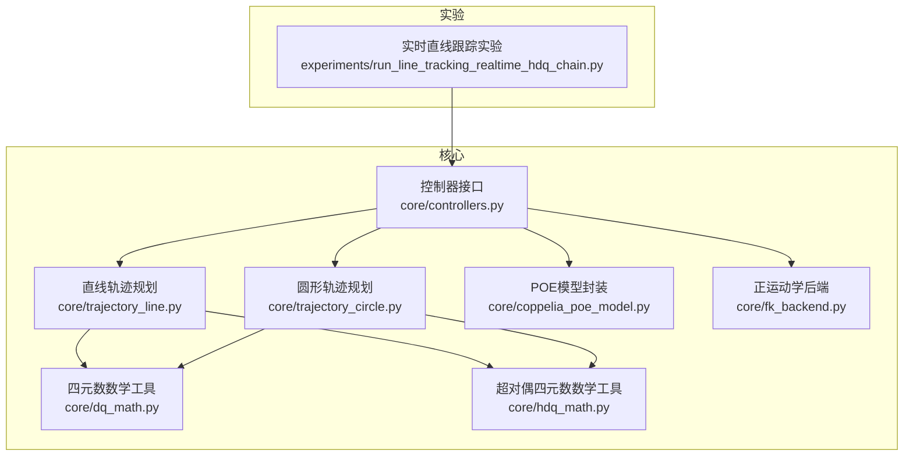
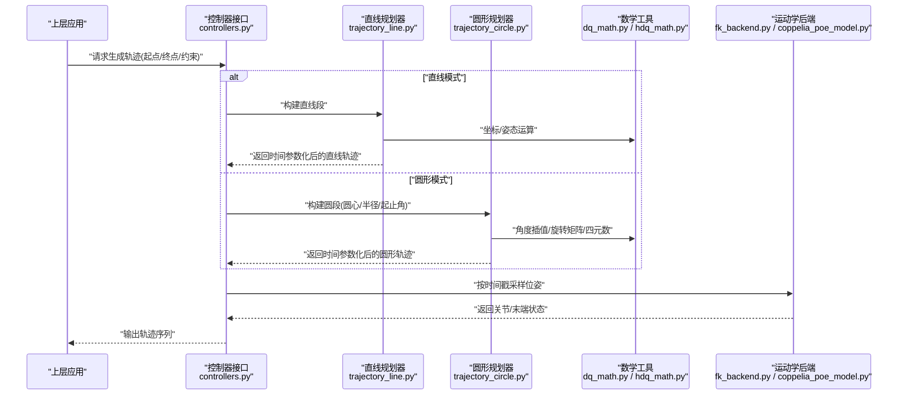
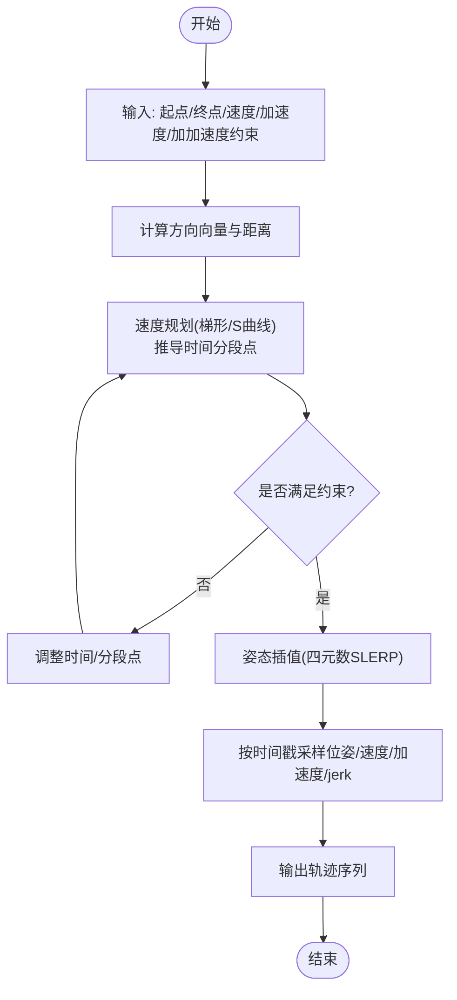
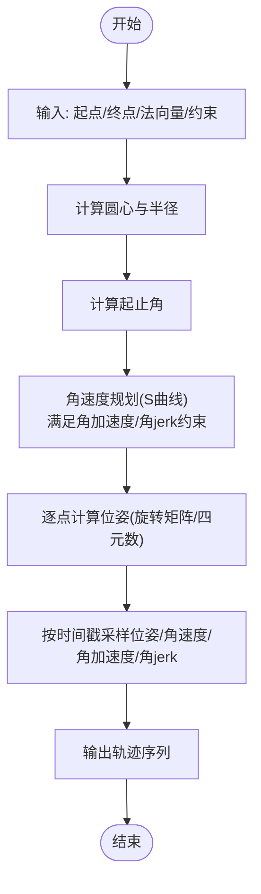
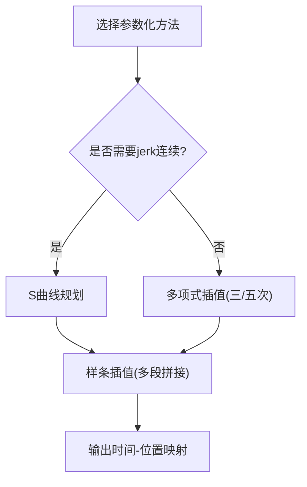
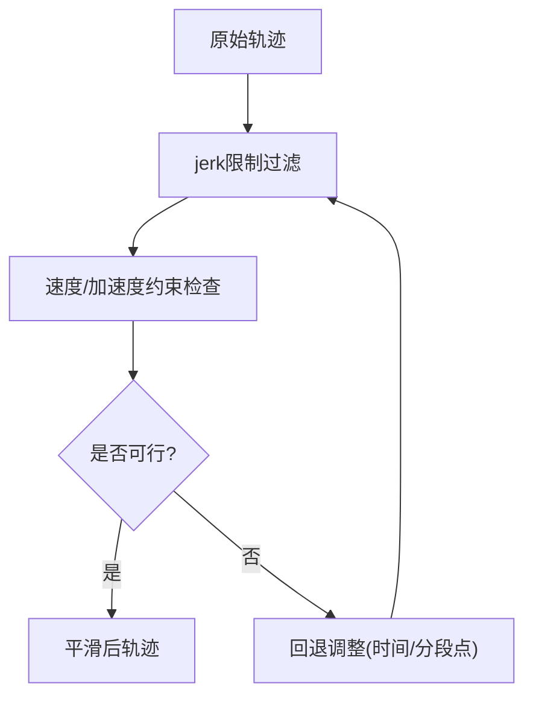
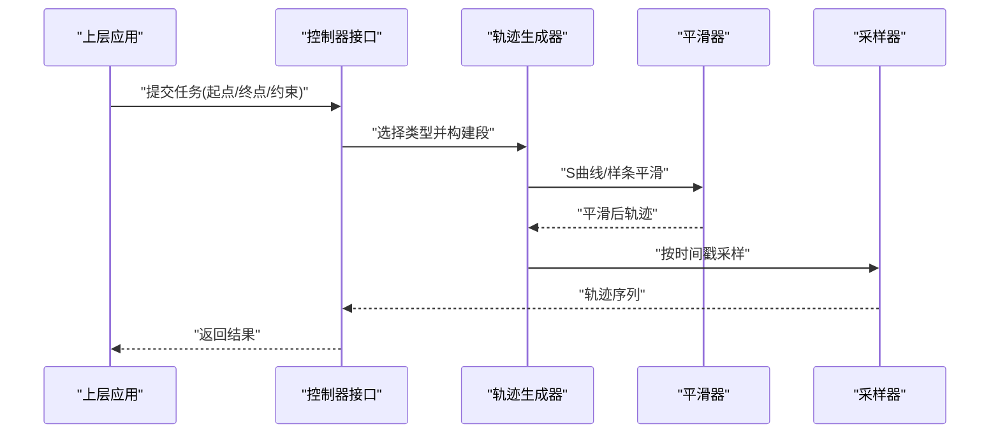
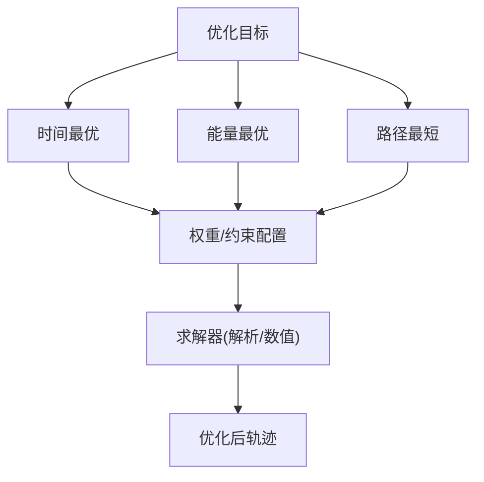
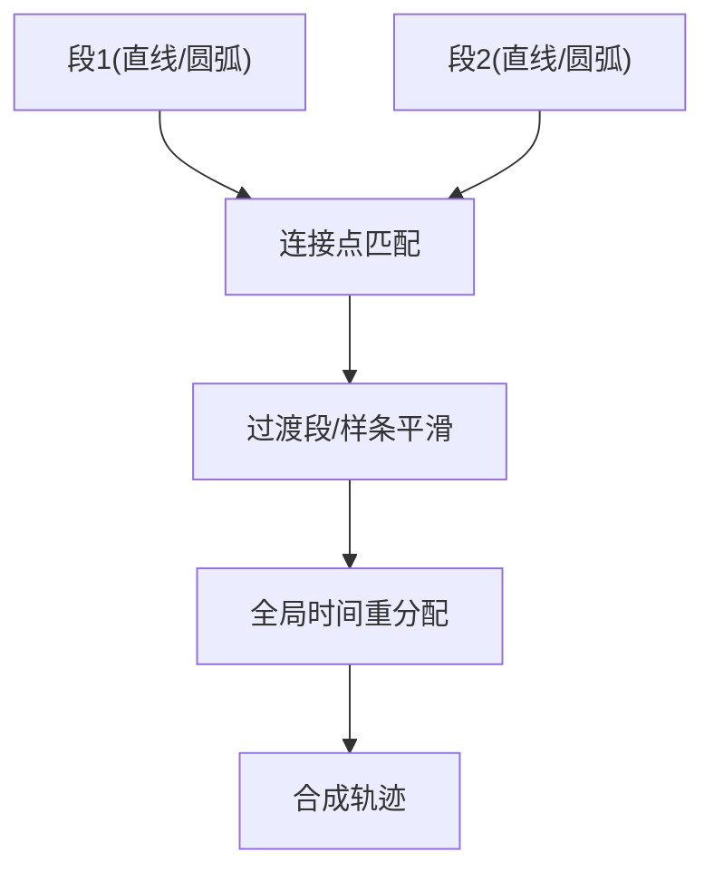
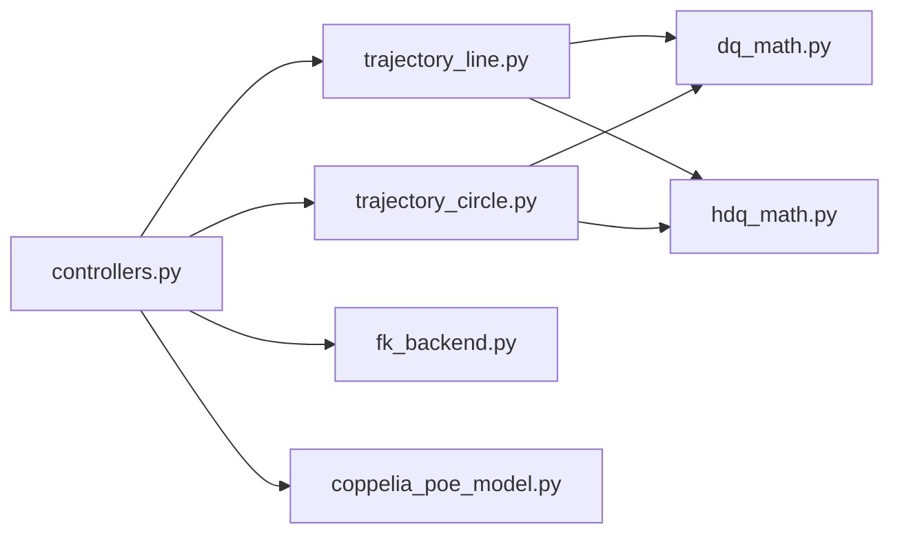

# 轨迹规划模块

<cite>
**本文引用的文件**   
- [trajectory_line.py](file://core/trajectory_line.py)
- [trajectory_circle.py](file://core/trajectory_circle.py)
- [dq_math.py](file://core/dq_math.py)
- [hdq_math.py](file://core/hdq_math.py)
- [controllers.py](file://core/controllers.py)
- [coppelia_poe_model.py](file://core/coppelia_poe_model.py)
- [fk_backend.py](file://core/fk_backend.py)
- [run_line_tracking_realtime_hdq_chain.py](file://experiments/run_line_tracking_realtime_hdq_chain.py)
</cite>

## 目录
1. [简介](#简介)
2. [项目结构](#项目结构)
3. [核心组件](#核心组件)
4. [架构总览](#架构总览)
5. [详细组件分析](#详细组件分析)
6. [依赖关系分析](#依赖关系分析)
7. [性能考虑](#性能考虑)
8. [故障排查指南](#故障排查指南)
9. [结论](#结论)
10. [附录](#附录)

## 简介
本技术文档聚焦于“轨迹规划模块”，围绕直线与圆形轨迹的数学原理、时间参数化方法、平滑处理与动态可行性检查，以及从起点终点定义到最终轨迹输出的完整流程进行系统化阐述。同时，结合代码仓库中的实现，给出优化目标（时间最优、能量最优、路径最短）的合成方法与多段轨迹连接策略，帮助读者快速理解并扩展该模块。

## 项目结构
轨迹规划相关代码主要位于 core 目录下，其中：
- trajectory_line.py：直线轨迹规划
- trajectory_circle.py：圆形轨迹规划
- dq_math.py / hdq_math.py：四元数与超对偶四元数数学工具
- controllers.py：控制器接口与调用入口
- coppelia_poe_model.py / fk_backend.py：运动学后端与模型封装
- experiments 下包含实时跟踪实验脚本，用于端到端验证

图表来源
- [trajectory_line.py](file://core/trajectory_line.py)
- [trajectory_circle.py](file://core/trajectory_circle.py)
- [dq_math.py](file://core/dq_math.py)
- [hdq_math.py](file://core/hdq_math.py)
- [controllers.py](file://core/controllers.py)
- [coppelia_poe_model.py](file://core/coppelia_poe_model.py)
- [fk_backend.py](file://core/fk_backend.py)
- [run_line_tracking_realtime_hdq_chain.py](file://experiments/run_line_tracking_realtime_hdq_chain.py)

章节来源
- [trajectory_line.py](file://core/trajectory_line.py)
- [trajectory_circle.py](file://core/trajectory_circle.py)
- [dq_math.py](file://core/dq_math.py)
- [hdq_math.py](file://core/hdq_math.py)
- [controllers.py](file://core/controllers.py)
- [coppelia_poe_model.py](file://core/coppelia_poe_model.py)
- [fk_backend.py](file://core/fk_backend.py)
- [run_line_tracking_realtime_hdq_chain.py](file://experiments/run_line_tracking_realtime_hdq_chain.py)

## 核心组件
- 直线轨迹规划器：提供基于线性插值的时间参数化、速度/加速度约束处理与平滑过渡。
- 圆形轨迹规划器：提供圆心确定、半径计算、角度插值与切向速度连续性保证。
- 数学工具库：四元数与超对 dual 四元数的基本运算，支撑姿态表示与变换。
- 控制器接口：统一调度轨迹生成、时间重参数化、平滑与执行。
- 运动学后端：通过正运动学与POE模型将笛卡尔空间轨迹映射至关节空间。

章节来源
- [trajectory_line.py](file://core/trajectory_line.py)
- [trajectory_circle.py](file://core/trajectory_circle.py)
- [dq_math.py](file://core/dq_math.py)
- [hdq_math.py](file://core/hdq_math.py)
- [controllers.py](file://core/controllers.py)
- [coppelia_poe_model.py](file://core/coppelia_poe_model.py)
- [fk_backend.py](file://core/fk_backend.py)

## 架构总览
整体数据流从“任务空间轨迹”出发，经时间参数化与平滑处理后，由控制器驱动运动学后端完成位姿求解，最终输出可执行的关节指令或末端位姿序列。

图表来源
- [controllers.py](file://core/controllers.py)
- [trajectory_line.py](file://core/trajectory_line.py)
- [trajectory_circle.py](file://core/trajectory_circle.py)
- [dq_math.py](file://core/dq_math.py)
- [hdq_math.py](file://core/hdq_math.py)
- [fk_backend.py](file://core/fk_backend.py)
- [coppelia_poe_model.py](file://core/coppelia_poe_model.py)

## 详细组件分析

### 直线轨迹规划
- 数学原理
  - 位置参数化：沿起点到终点的方向向量进行线性插值，引入时间变量 t∈[0,1] 作为归一化进度。
  - 速度规划：采用梯形或S型速度曲线，确保最大速度与加速度约束满足；S型曲线进一步限制加加速度(jerk)，提升平滑性。
  - 加速度约束：根据最大加速度与最大速度反推最小时间与分段点，保证全程不越界。
  - 姿态插值：使用四元数球面线性插值(SLERP)或轴角法，保证姿态连续且无奇异。
- 实现要点
  - 输入：起点位姿、终点位姿、最大速度、最大加速度、可选最大加加速度。
  - 输出：时间戳序列、对应位姿序列、速度/加速度/加加速度曲线。
  - 边界条件：起止速度为零、加速度连续、 jerk 受限。
- 复杂度
  - 时间复杂度 O(N)，N为采样点数；空间复杂度 O(N)。
- 优化目标
  - 时间最优：在速度/加速度约束下尽可能缩短周期时间。
  - 能量最优：在满足约束的前提下最小化积分能耗（近似以速度平方或加速度平方积分）。
  - 路径最短：直线本身即最短路径，无需额外优化。

图表来源
- [trajectory_line.py](file://core/trajectory_line.py)
- [dq_math.py](file://core/dq_math.py)
- [hdq_math.py](file://core/hdq_math.py)

章节来源
- [trajectory_line.py](file://core/trajectory_line.py)
- [dq_math.py](file://core/dq_math.py)
- [hdq_math.py](file://core/hdq_math.py)

### 圆形轨迹规划
- 数学原理
  - 圆心确定：给定起点、终点与平面法向量，利用几何关系求解圆心；若未指定法向量，可由起点、终点与参考方向推断。
  - 半径计算：由圆心到起点的欧氏距离得到半径。
  - 角度插值：计算起止角，按时间参数化进行角度插值；为保证切向速度连续，采用S型速度曲线对角度速率进行规划。
  - 姿态更新：在圆周上每一点计算局部切线与法线，构造旋转矩阵或四元数，保持姿态随路径变化连续。
- 实现要点
  - 输入：起点、终点、平面法向量、半径（或自动计算）、最大角速度/角加速度/角加加速度。
  - 输出：时间戳序列、圆周点位姿序列、角速度/角加速度/角加加速度曲线。
  - 边界条件：起止角速度为零、角加速度连续、角 jerk 受限。
- 复杂度
  - 时间复杂度 O(N)，空间复杂度 O(N)。
- 优化目标
  - 时间最优：在角速度/角加速度约束下最小化圆弧运行时间。
  - 能量最优：最小化角速度平方或角加速度平方的积分。
  - 路径最短：圆弧长度固定，通常不作为优化目标。

图表来源
- [trajectory_circle.py](file://core/trajectory_circle.py)
- [dq_math.py](file://core/dq_math.py)
- [hdq_math.py](file://core/hdq_math.py)

章节来源
- [trajectory_circle.py](file://core/trajectory_circle.py)
- [dq_math.py](file://core/dq_math.py)
- [hdq_math.py](file://core/hdq_math.py)

### 时间参数化方法
- 多项式插值
  - 三次/五次多项式用于位置-时间映射，保证起止速度与加速度连续。
  - 适用于简单场景，但 jerk 可能不连续。
- S曲线规划
  - 在梯形速度基础上增加 jerk 限制，形成S型速度曲线，显著提升平滑性与机械友好性。
  - 常用于直线与圆弧的速度/角速度规划。
- 样条插值
  - 使用B样条或Catmull-Rom样条在多段轨迹间提供高阶连续性(C1/C2/C3)。
  - 适合复杂路径拼接与全局平滑。

图表来源
- [trajectory_line.py](file://core/trajectory_line.py)
- [trajectory_circle.py](file://core/trajectory_circle.py)

章节来源
- [trajectory_line.py](file://core/trajectory_line.py)
- [trajectory_circle.py](file://core/trajectory_circle.py)

### 轨迹平滑与动态可行性
- 连续性保证
  - 位置C0、速度C1、加速度C2、加加速度C3连续性的逐级提升。
  - 通过S曲线与样条插值组合实现高阶连续。
- Jerk限制
  - 在速度规划阶段显式限制最大加加速度，避免冲击与振动。
- 动态可行性检查
  - 校验速度/加速度/加加速度是否超出执行器能力。
  - 必要时回退调整时间或分段点，重新规划。

图表来源
- [trajectory_line.py](file://core/trajectory_line.py)
- [trajectory_circle.py](file://core/trajectory_circle.py)

章节来源
- [trajectory_line.py](file://core/trajectory_line.py)
- [trajectory_circle.py](file://core/trajectory_circle.py)

### 完整轨迹生成流程
- 步骤概览
  - 定义起点与终点（含姿态）。
  - 选择轨迹类型（直线/圆弧/混合）。
  - 设定约束（最大速度、加速度、加加速度）。
  - 时间参数化（S曲线/多项式/样条）。
  - 平滑与可行性检查。
  - 采样输出轨迹序列。
- 合成与连接
  - 多段轨迹连接时，在连接点匹配速度与加速度，必要时插入过渡段。
  - 使用样条插值在全局范围内优化平滑度。

图表来源
- [controllers.py](file://core/controllers.py)
- [trajectory_line.py](file://core/trajectory_line.py)
- [trajectory_circle.py](file://core/trajectory_circle.py)

章节来源
- [controllers.py](file://core/controllers.py)
- [trajectory_line.py](file://core/trajectory_line.py)
- [trajectory_circle.py](file://core/trajectory_circle.py)

### 轨迹优化算法
- 时间最优
  - 在速度/加速度约束下，尽量压缩运行时间；常用方法是“bang-bang”控制思想与S曲线分段点优化。
- 能量最优
  - 以速度平方或加速度平方的积分为代价函数，结合约束进行数值优化（如梯度下降或二次规划）。
- 路径最短
  - 直线即为最短路径；对于圆弧，可通过选择更优的起止角或平面法向量减少弧长。
- 多目标权衡
  - 加权组合多个目标函数，或在主目标下设置次级约束。

图表来源
- [trajectory_line.py](file://core/trajectory_line.py)
- [trajectory_circle.py](file://core/trajectory_circle.py)

章节来源
- [trajectory_line.py](file://core/trajectory_line.py)
- [trajectory_circle.py](file://core/trajectory_circle.py)

### 复杂轨迹合成与多段连接
- 合成方法
  - 将多个直线/圆弧段组合成复合轨迹，连接点处进行速度与加速度匹配。
  - 使用样条插值在全局范围进行平滑，避免连接点突变。
- 连接处理
  - 在连接点插入过渡段，确保C2/C3连续。
  - 对全局时间进行再分配，保证各段约束一致。

图表来源
- [trajectory_line.py](file://core/trajectory_line.py)
- [trajectory_circle.py](file://core/trajectory_circle.py)

章节来源
- [trajectory_line.py](file://core/trajectory_line.py)
- [trajectory_circle.py](file://core/trajectory_circle.py)

## 依赖关系分析
- 内部依赖
  - 直线与圆形规划器依赖数学工具(dq_math/hdq_math)进行姿态与旋转变换。
  - 控制器接口统一调度规划器与运动学后端。
  - 运动学后端通过fk_backend与coppelia_poe_model完成位姿求解。
- 外部依赖
  - 仿真客户端与关节名称定义位于sim目录，供实验脚本使用。

图表来源
- [trajectory_line.py](file://core/trajectory_line.py)
- [trajectory_circle.py](file://core/trajectory_circle.py)
- [dq_math.py](file://core/dq_math.py)
- [hdq_math.py](file://core/hdq_math.py)
- [controllers.py](file://core/controllers.py)
- [fk_backend.py](file://core/fk_backend.py)
- [coppelia_poe_model.py](file://core/coppelia_poe_model.py)

章节来源
- [trajectory_line.py](file://core/trajectory_line.py)
- [trajectory_circle.py](file://core/trajectory_circle.py)
- [dq_math.py](file://core/dq_math.py)
- [hdq_math.py](file://core/hdq_math.py)
- [controllers.py](file://core/controllers.py)
- [fk_backend.py](file://core/fk_backend.py)
- [coppelia_poe_model.py](file://core/coppelia_poe_model.py)

## 性能考虑
- 采样密度
  - 采样点越多，轨迹精度越高，但计算与内存开销增大；需根据实时性要求折中。
- 数值稳定性
  - 四元数归一化与角度差计算需注意数值误差，避免抖动。
- 并行与缓存
  - 对重复计算的中间结果进行缓存；在大规模轨迹生成时可考虑批处理。
- 约束回退
  - 当约束不可行时，尽早回退调整时间或分段点，避免无效迭代。

## 故障排查指南
- 常见问题
  - 速度/加速度超限：检查约束设置与S曲线分段点计算。
  - 姿态跳变：确认四元数插值与归一化处理。
  - 连接点不连续：检查连接点速度与加速度匹配逻辑。
- 调试建议
  - 可视化速度/加速度/jerk曲线，定位异常峰值。
  - 降低采样密度，逐步提高以定位数值问题。
  - 使用最小示例复现问题，隔离外部依赖影响。

章节来源
- [trajectory_line.py](file://core/trajectory_line.py)
- [trajectory_circle.py](file://core/trajectory_circle.py)
- [controllers.py](file://core/controllers.py)

## 结论
本轨迹规划模块以直线与圆形轨迹为核心，结合S曲线与样条插值实现高阶连续与动态可行性，并通过控制器接口与运动学后端完成端到端执行。优化目标覆盖时间、能量与路径维度，支持多段轨迹合成与连接处理。建议在工程实践中优先采用S曲线与样条平滑，并在约束不可行时及时回退调整，以确保系统稳定与高效。

## 附录
- 术语表
  - 加加速度(jerk)：加速度的时间导数，反映加速度变化的快慢。
  - 四元数：用于表示三维旋转的代数结构，避免万向节锁。
  - 超对偶四元数：在四元数基础上引入对偶部分，便于刚体运动建模。
- 参考实现
  - 实时直线跟踪实验脚本可用于验证轨迹生成与执行链路。

章节来源
- [run_line_tracking_realtime_hdq_chain.py](file://experiments/run_line_tracking_realtime_hdq_chain.py)