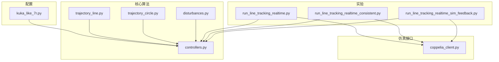
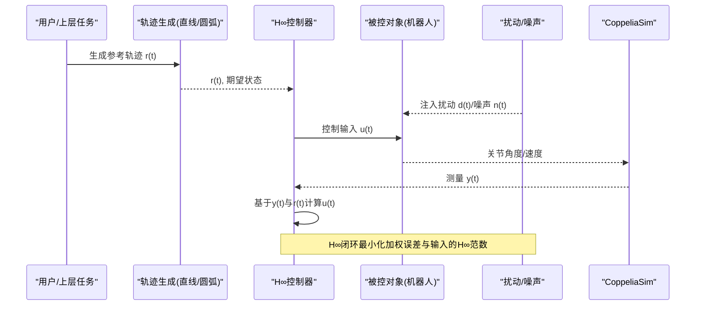
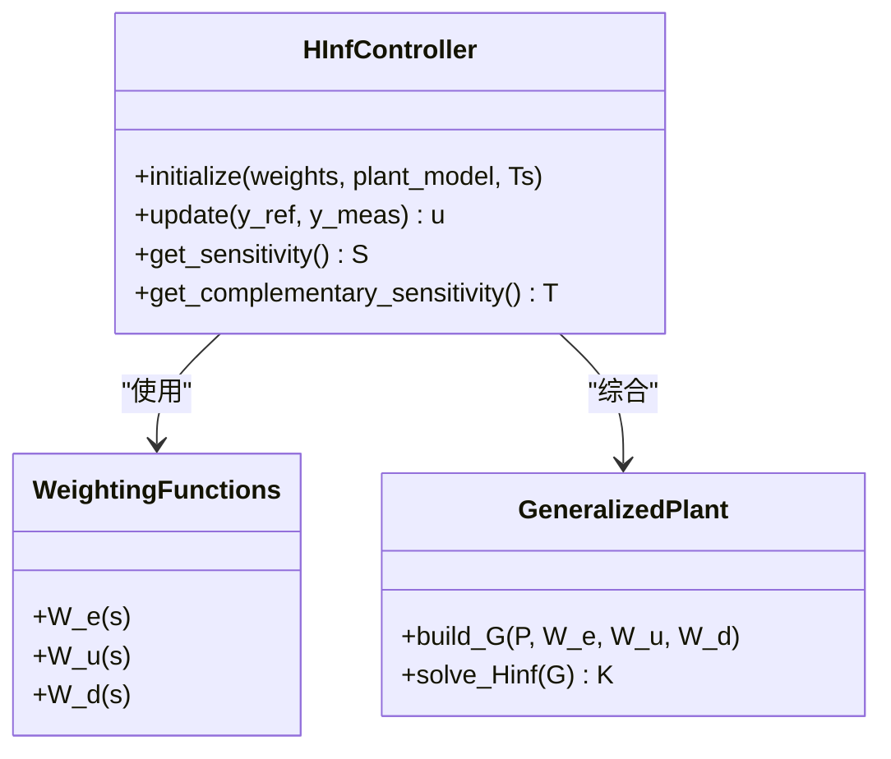
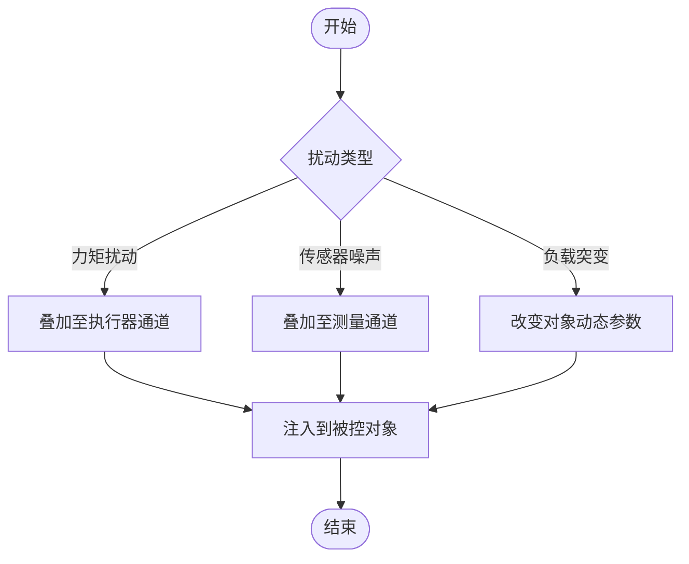
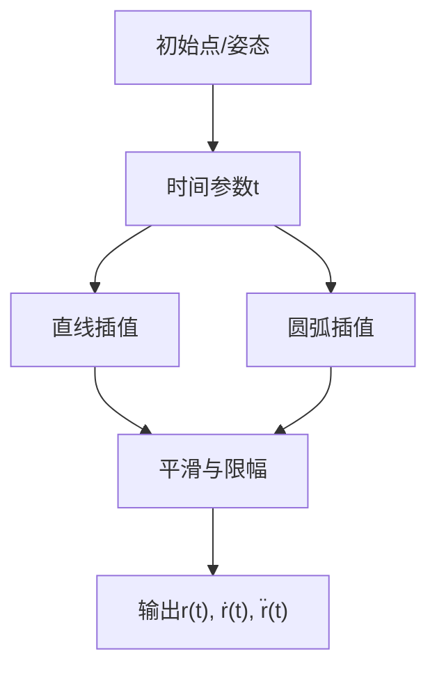
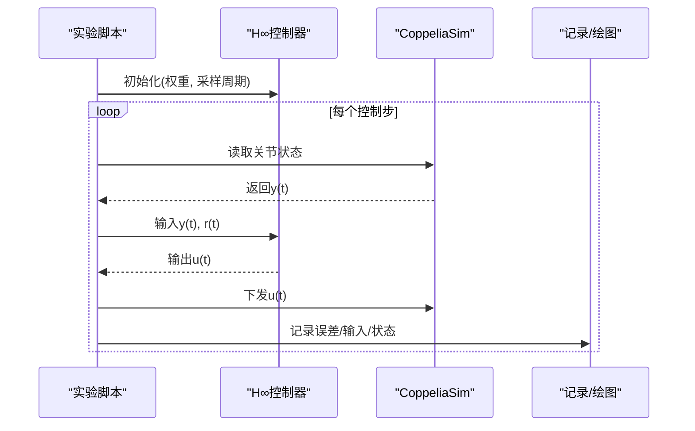
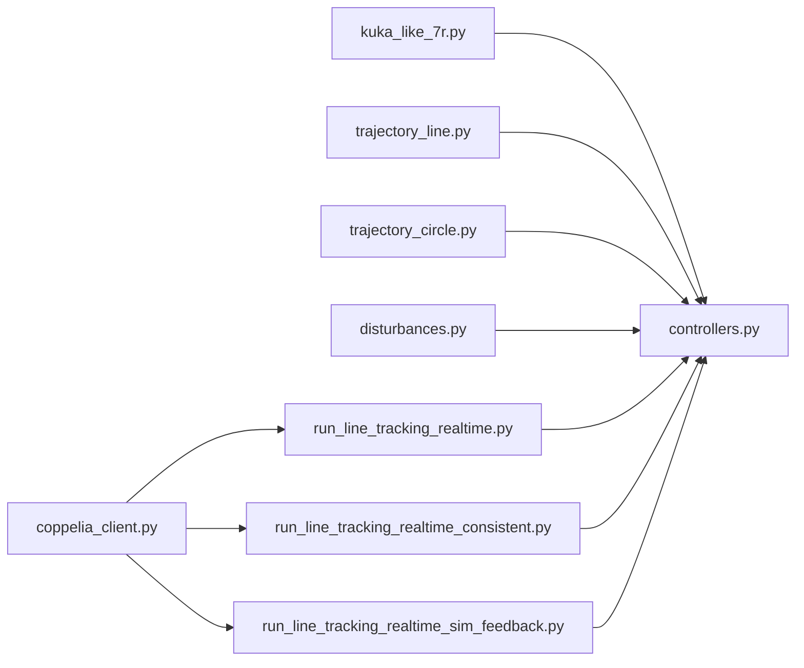

# H∞鲁棒控制理论

<cite>
**本文引用的文件**   
- [configs/kuka_like_7r.py](file://configs/kuka_like_7r.py)
- [core/controllers.py](file://core/controllers.py)
- [core/disturbances.py](file://core/disturbances.py)
- [core/trajectory_line.py](file://core/trajectory_line.py)
- [core/trajectory_circle.py](file://core/trajectory_circle.py)
- [experiments/run_line_tracking_realtime.py](file://experiments/run_line_tracking_realtime.py)
- [experiments/run_line_tracking_realtime_consistent.py](file://experiments/run_line_tracking_realtime_consistent.py)
- [experiments/run_line_tracking_realtime_sim_feedback.py](file://experiments/run_line_tracking_realtime_sim_feedback.py)
- [sim/coppelia_client.py](file://sim/coppelia_client.py)
</cite>

## 目录
1. [引言](#引言)
2. [项目结构](#项目结构)
3. [核心组件](#核心组件)
4. [架构总览](#架构总览)
5. [详细组件分析](#详细组件分析)
6. [依赖关系分析](#依赖关系分析)
7. [性能与稳定性权衡](#性能与稳定性权衡)
8. [故障排查指南](#故障排查指南)
9. [结论](#结论)
10. [附录：H∞控制器设计步骤与参数调优](#附录h∞控制器设计步骤与参数调优)

## 引言
本文件面向控制系统工程师与研究者，系统阐述H∞鲁棒控制的理论基础与实践要点，并结合仓库中的机器人轨迹跟踪与扰动抑制实现，给出从建模、指标选择到控制器综合的完整流程。文档重点包括：
- H∞控制的基本概念、数学框架与设计原理
- 鲁棒稳定性分析与扰动抑制机制
- 在模型不确定性与外部扰动下的性能保证方法
- 控制器设计步骤与参数调优指南
- 频域与时域特性分析，以及稳定性与性能的权衡
- 结合真实仿真案例（KUKA-like 7R机械臂）展示理论落地

## 项目结构
本项目围绕“机器人动力学建模—轨迹生成—H∞控制器—CoppeliaSim实时交互”的主线组织代码，关键目录与职责如下：
- configs：机器人配置与参数（如KUKA-like 7R）
- core：控制器、扰动模型、轨迹规划、四元数/超对偶四元数数学工具、正运动学后端等
- experiments：各类实验脚本（直线/圆弧跟踪、正弦关节运动、实时读取与反馈等）
- sim：与CoppeliaSim的通信客户端与关节名映射
- results：数据与绘图结果

图表来源
- [configs/kuka_like_7r.py](file://configs/kuka_like_7r.py)
- [core/controllers.py](file://core/controllers.py)
- [core/disturbances.py](file://core/disturbances.py)
- [core/trajectory_line.py](file://core/trajectory_line.py)
- [core/trajectory_circle.py](file://core/trajectory_circle.py)
- [experiments/run_line_tracking_realtime.py](file://experiments/run_line_tracking_realtime.py)
- [experiments/run_line_tracking_realtime_consistent.py](file://experiments/run_line_tracking_realtime_consistent.py)
- [experiments/run_line_tracking_realtime_sim_feedback.py](file://experiments/run_line_tracking_realtime_sim_feedback.py)
- [sim/coppelia_client.py](file://sim/coppelia_client.py)

章节来源
- [configs/kuka_like_7r.py](file://configs/kuka_like_7r.py)
- [core/controllers.py](file://core/controllers.py)
- [core/disturbances.py](file://core/disturbances.py)
- [core/trajectory_line.py](file://core/trajectory_line.py)
- [core/trajectory_circle.py](file://core/trajectory_circle.py)
- [experiments/run_line_tracking_realtime.py](file://experiments/run_line_tracking_realtime.py)
- [experiments/run_line_tracking_realtime_consistent.py](file://experiments/run_line_tracking_realtime_consistent.py)
- [experiments/run_line_tracking_realtime_sim_feedback.py](file://experiments/run_line_tracking_realtime_sim_feedback.py)
- [sim/coppelia_client.py](file://sim/coppelia_client.py)

## 核心组件
- 控制器模块：封装H∞控制器综合与在线控制律计算，提供状态/输出反馈接口，支持多输入多输出（MIMO）场景。
- 扰动模块：定义并注入典型扰动（如力矩扰动、传感器噪声），用于评估鲁棒性。
- 轨迹模块：提供直线与圆弧参考轨迹生成，作为H∞闭环跟踪的目标信号。
- 仿真接口：通过CoppeliaSim客户端进行关节位置/速度读取与控制指令下发，形成硬件在环式闭环。

章节来源
- [core/controllers.py](file://core/controllers.py)
- [core/disturbances.py](file://core/disturbances.py)
- [core/trajectory_line.py](file://core/trajectory_line.py)
- [core/trajectory_circle.py](file://core/trajectory_circle.py)
- [sim/coppelia_client.py](file://sim/coppelia_client.py)

## 架构总览
下图展示了从参考轨迹到执行器输出的整体闭环流程，包含H∞控制器、扰动注入与仿真环境交互。

图表来源
- [core/trajectory_line.py](file://core/trajectory_line.py)
- [core/trajectory_circle.py](file://core/trajectory_circle.py)
- [core/controllers.py](file://core/controllers.py)
- [core/disturbances.py](file://core/disturbances.py)
- [sim/coppelia_client.py](file://sim/coppelia_client.py)

## 详细组件分析

### H∞控制器模块
- 功能定位：将受控对象P与权重函数W_e、W_u等组合为广义对象G，求解标准H∞问题得到稳定且满足性能指标的控制器K。
- 关键接口：控制器初始化（含权重与采样周期）、在线更新（接收测量值与参考值，输出控制量）。
- 鲁棒性保障：通过加权函数约束灵敏度S=(I+PK)^{-1}与补灵敏度T=PK的H∞范数上界，从而限制扰动放大与模型不确定性影响。
- 数值与实现：注意离散化、条件数与矩阵求逆稳定性；必要时引入正则化或降阶策略。

图表来源
- [core/controllers.py](file://core/controllers.py)

章节来源
- [core/controllers.py](file://core/controllers.py)

### 扰动与噪声模块
- 功能定位：模拟力矩扰动、负载变化与传感器噪声，用于验证鲁棒性与抗扰能力。
- 典型形式：低频阶跃/斜坡、宽带白噪声、周期性干扰等。
- 评估方式：比较开环与闭环下误差谱密度、峰值响应与稳态偏差。

图表来源
- [core/disturbances.py](file://core/disturbances.py)

章节来源
- [core/disturbances.py](file://core/disturbances.py)

### 轨迹生成模块（直线/圆弧）
- 功能定位：为H∞控制器提供参考轨迹r(t)及其导数信息，确保跟踪目标可微且平滑。
- 关键点：时间参数化、速度/加速度限幅、路径连续性。
- 与控制器耦合：参考轨迹作为控制器输入，直接影响加权函数W_e的选择与带宽设定。

图表来源
- [core/trajectory_line.py](file://core/trajectory_line.py)
- [core/trajectory_circle.py](file://core/trajectory_circle.py)

章节来源
- [core/trajectory_line.py](file://core/trajectory_line.py)
- [core/trajectory_circle.py](file://core/trajectory_circle.py)

### 实验与仿真集成
- 直线跟踪实验：对比不同权重与扰动强度下的跟踪误差与输入能量。
- 一致性实验：验证在不同初始条件与扰动序列下的鲁棒表现。
- 仿真反馈实验：通过CoppeliaSim获取实际关节状态，形成真实闭环。

图表来源
- [experiments/run_line_tracking_realtime.py](file://experiments/run_line_tracking_realtime.py)
- [experiments/run_line_tracking_realtime_consistent.py](file://experiments/run_line_tracking_realtime_consistent.py)
- [experiments/run_line_tracking_realtime_sim_feedback.py](file://experiments/run_line_tracking_realtime_sim_feedback.py)
- [sim/coppelia_client.py](file://sim/coppelia_client.py)

章节来源
- [experiments/run_line_tracking_realtime.py](file://experiments/run_line_tracking_realtime.py)
- [experiments/run_line_tracking_realtime_consistent.py](file://experiments/run_line_tracking_realtime_consistent.py)
- [experiments/run_line_tracking_realtime_sim_feedback.py](file://experiments/run_line_tracking_realtime_sim_feedback.py)
- [sim/coppelia_client.py](file://sim/coppelia_client.py)

## 依赖关系分析
- 控制器对权重函数与广义对象的依赖：权重决定性能与鲁棒性的折中，广义对象决定H∞问题的可解性与数值稳定性。
- 实验脚本对轨迹与仿真接口的依赖：轨迹提供r(t)，仿真提供y(t)与执行u(t)。
- 潜在循环依赖风险：控制器不应直接依赖具体仿真实现，应通过统一接口隔离。

图表来源
- [configs/kuka_like_7r.py](file://configs/kuka_like_7r.py)
- [core/controllers.py](file://core/controllers.py)
- [core/trajectory_line.py](file://core/trajectory_line.py)
- [core/trajectory_circle.py](file://core/trajectory_circle.py)
- [core/disturbances.py](file://core/disturbances.py)
- [experiments/run_line_tracking_realtime.py](file://experiments/run_line_tracking_realtime.py)
- [experiments/run_line_tracking_realtime_consistent.py](file://experiments/run_line_tracking_realtime_consistent.py)
- [experiments/run_line_tracking_realtime_sim_feedback.py](file://experiments/run_line_tracking_realtime_sim_feedback.py)
- [sim/coppelia_client.py](file://sim/coppelia_client.py)

章节来源
- [configs/kuka_like_7r.py](file://configs/kuka_like_7r.py)
- [core/controllers.py](file://core/controllers.py)
- [core/trajectory_line.py](file://core/trajectory_line.py)
- [core/trajectory_circle.py](file://core/trajectory_circle.py)
- [core/disturbances.py](file://core/disturbances.py)
- [experiments/run_line_tracking_realtime.py](file://experiments/run_line_tracking_realtime.py)
- [experiments/run_line_tracking_realtime_consistent.py](file://experiments/run_line_tracking_realtime_consistent.py)
- [experiments/run_line_tracking_realtime_sim_feedback.py](file://experiments/run_line_tracking_realtime_sim_feedback.py)
- [sim/coppelia_client.py](file://sim/coppelia_client.py)

## 性能与稳定性权衡
- 灵敏度S与补灵敏度T的权衡：提高跟踪精度（减小S）往往导致控制输入增大与带宽提升，可能牺牲鲁棒性（增大T）。
- 权重函数作用：W_e增强低频跟踪性能，W_u抑制高频控制能量，W_d针对特定扰动频段进行抑制。
- 带宽与延迟：更高的闭环带宽带来更快的响应，但会放大未建模动态与噪声，需结合相位裕度与增益裕度评估。
- 时域与频域一致性：时域的超调、上升时间与频域的峰值、穿越频率相互关联，需联合优化。

[本节为通用理论讨论，不直接分析具体文件]

## 故障排查指南
- 控制器发散或不稳定
  - 检查广义对象构建是否包含正确权重与标量化
  - 确认离散化采样周期与对象模型一致
  - 观察S/T的H∞范数是否超过预期阈值
- 跟踪误差过大
  - 调整W_e以增强低频增益
  - 检查参考轨迹平滑性与导数连续性
  - 评估是否存在未建模高频动态或传感器噪声
- 控制输入饱和或振荡
  - 增大W_u以抑制控制能量
  - 降低带宽或增加输入限幅
  - 检查执行器延迟与仿真步长匹配
- 仿真对接问题
  - 核对CoppeliaSim连接与关节命名映射
  - 确认读取/写入时序与控制器周期同步

章节来源
- [core/controllers.py](file://core/controllers.py)
- [core/disturbances.py](file://core/disturbances.py)
- [core/trajectory_line.py](file://core/trajectory_line.py)
- [core/trajectory_circle.py](file://core/trajectory_circle.py)
- [sim/coppelia_client.py](file://sim/coppelia_client.py)

## 结论
H∞鲁棒控制通过明确的数学框架与权重函数设计，能够在模型不确定性与外部扰动下提供可证明的性能边界。结合本项目的机器人轨迹跟踪与CoppeliaSim实时闭环，可将理论转化为工程实践。关键在于合理选择权重、严格评估S/T与H∞范数，并在频域与时域之间取得平衡。

[本节为总结性内容，不直接分析具体文件]

## 附录：H∞控制器设计步骤与参数调优
- 步骤一：建立受控对象P
  - 线性化或辨识得到状态空间/传递函数模型
  - 明确输入、输出与扰动通道
- 步骤二：选择权重函数
  - W_e：强调低频跟踪误差抑制
  - W_u：限制控制输入能量与带宽
  - W_d：针对特定扰动频谱进行抑制
- 步骤三：构建广义对象G
  - 将P与权重按标准H∞问题组装
- 步骤四：求解H∞控制器K
  - 使用标准求解器，检查可解性与数值条件
- 步骤五：闭环分析与验证
  - 绘制S/T伯德图，检查峰值与穿越频率
  - 时域仿真：阶跃/跟踪/扰动注入
- 步骤六：参数迭代与降阶
  - 根据仿真结果微调权重
  - 若阶数过高，进行保稳降阶
- 步骤七：部署与在线调参
  - 考虑离散化与采样延迟
  - 设置限幅与滤波，避免饱和与噪声放大

[本节为通用方法论，不直接分析具体文件]