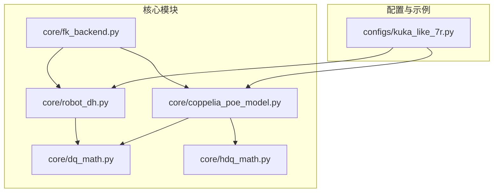
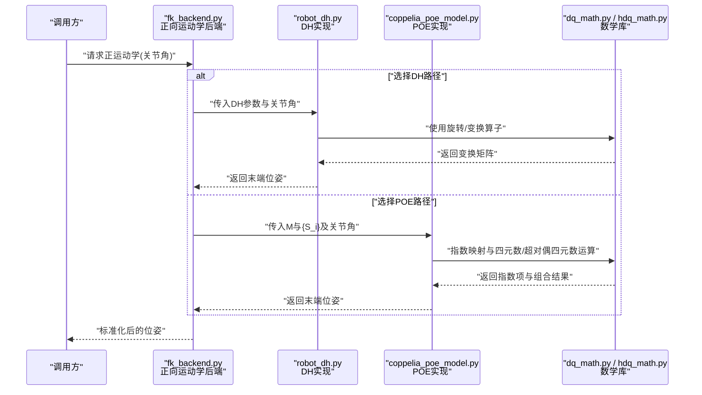
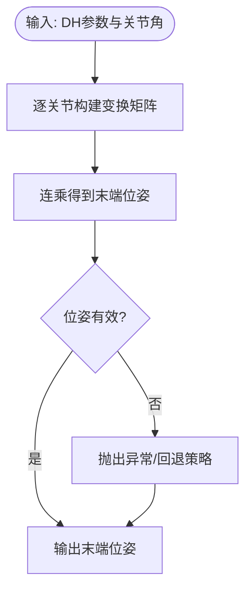
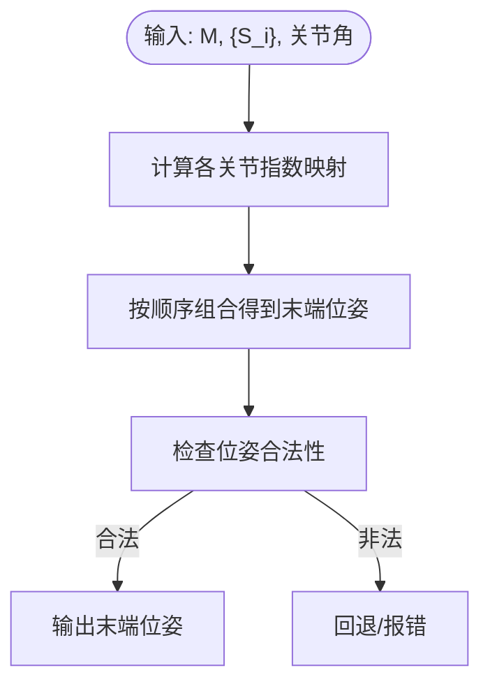
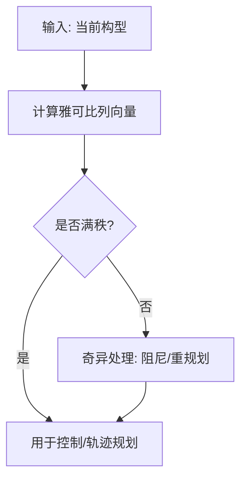
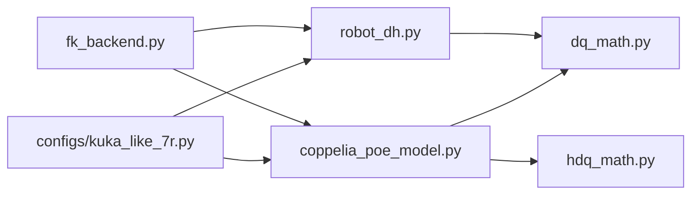

# 机器人运动学理论

<cite>
**本文引用的文件**   
- [core/robot_dh.py](file://core/robot_dh.py)
- [core/coppelia_poe_model.py](file://core/coppelia_poe_model.py)
- [core/fk_backend.py](file://core/fk_backend.py)
- [core/dq_math.py](file://core/dq_math.py)
- [core/hdq_math.py](file://core/hdq_math.py)
- [configs/kuka_like_7r.py](file://configs/kuka_like_7r.py)
</cite>

## 目录
1. [引言](#引言)
2. [项目结构](#项目结构)
3. [核心组件](#核心组件)
4. [架构总览](#架构总览)
5. [详细组件分析](#详细组件分析)
6. [依赖关系分析](#依赖关系分析)
7. [性能与数值特性](#性能与数值特性)
8. [故障排查指南](#故障排查指南)
9. [结论](#结论)
10. [附录：建模与控制实践流程](#附录建模与控制实践流程)

## 引言
本文件面向机器人运动学建模与控制算法开发，系统阐述以下理论基础与实践要点：
- DH参数法的数学原理、坐标系建立规则与变换矩阵推导
- POE（Product of Exponentials）公式与传统DH方法的对比、适用场景与计算效率
- 正运动学的数学基础与逆运动学的解析法与数值法
- 雅可比矩阵的计算方法与奇异点分析
- 工作空间与可达性讨论
- 结合具体机器人模型展示从参数识别到误差补偿的完整建模流程

## 项目结构
本项目围绕“传统DH”和“POE”两条运动学实现路径组织代码，并提供四元数与超对偶四元数等数学工具，以及示例机器人配置。关键目录与职责如下：
- core/robot_dh.py：基于DH参数的正运动学实现与相关工具
- core/coppelia_poe_model.py：基于POE的运动学模型封装
- core/fk_backend.py：正向运动学后端接口与统一调用入口
- core/dq_math.py / core/hdq_math.py：旋转与超对偶四元数运算库
- configs/kuka_like_7r.py：类KUKA七轴机器人的DH/POE参数配置示例

图表来源
- [core/robot_dh.py](file://core/robot_dh.py)
- [core/coppelia_poe_model.py](file://core/coppelia_poe_model.py)
- [core/fk_backend.py](file://core/fk_backend.py)
- [core/dq_math.py](file://core/dq_math.py)
- [core/hdq_math.py](file://core/hdq_math.py)
- [configs/kuka_like_7r.py](file://configs/kuka_like_7r.py)

章节来源
- [core/robot_dh.py](file://core/robot_dh.py)
- [core/coppelia_poe_model.py](file://core/coppelia_poe_model.py)
- [core/fk_backend.py](file://core/fk_backend.py)
- [core/dq_math.py](file://core/dq_math.py)
- [core/hdq_math.py](file://core/hdq_math.py)
- [configs/kuka_like_7r.py](file://configs/kuka_like_7r.py)

## 核心组件
- DH参数法实现（core/robot_dh.py）
  - 提供基于标准或改进DH的参数化描述与齐次变换链式相乘的正运动学求解
  - 支持关节变量输入并输出末端位姿
- POE模型封装（core/coppelia_poe_model.py）
  - 以初始位形M与旋量S_i表达指数映射，直接得到末端位姿
  - 便于与仿真环境（如CoppeliaSim）对接
- 正向运动学后端（core/fk_backend.py）
  - 统一对外接口，内部可切换DH或POE实现
  - 负责参数校验、单位转换与结果格式标准化
- 四元数与超对 dual 四元数数学库（core/dq_math.py, core/hdq_math.py）
  - 提供旋转表示、复合与微分相关的算子，支撑POE与雅可比计算
- 机器人配置（configs/kuka_like_7r.py）
  - 给出某类七轴机械臂的DH/POE参数样例，用于快速验证与演示

章节来源
- [core/robot_dh.py](file://core/robot_dh.py)
- [core/coppelia_poe_model.py](file://core/coppelia_poe_model.py)
- [core/fk_backend.py](file://core/fk_backend.py)
- [core/dq_math.py](file://core/dq_math.py)
- [core/hdq_math.py](file://core/hdq_math.py)
- [configs/kuka_like_7r.py](file://configs/kuka_like_7r.py)

## 架构总览
下图展示了两种主流运动学建模方法在本项目中的落地方式与数据流向：

图表来源
- [core/fk_backend.py](file://core/fk_backend.py)
- [core/robot_dh.py](file://core/robot_dh.py)
- [core/coppelia_poe_model.py](file://core/coppelia_poe_model.py)
- [core/dq_math.py](file://core/dq_math.py)
- [core/hdq_math.py](file://core/hdq_math.py)

## 详细组件分析

### DH参数法：数学原理与实现要点
- 坐标系建立规则
  - 沿关节轴线定义z轴，相邻z轴的公垂线方向为x轴，原点位于两轴交点或公垂线与z轴交点
  - 标准DH与改进DH在连杆长度与扭转角的定义上存在差异，需保持前后一致
- 变换矩阵推导
  - 单关节变换由绕z轴的旋转、沿x轴的平移、沿z轴的平移与绕x轴的扭转组成
  - 多关节通过齐次变换矩阵连乘得到末端相对于基坐标系的位姿
- 复杂度与数值特性
  - 时间复杂度O(n)，空间复杂度O(1)（不计中间矩阵缓存）
  - 在接近奇异构型时，三角函数条件数增大，需注意数值稳定性

图表来源
- [core/robot_dh.py](file://core/robot_dh.py)

章节来源
- [core/robot_dh.py](file://core/robot_dh.py)

### POE公式：数学原理与实现要点
- 数学基础
  - 以初始位形M与每个关节的旋量S_i描述，末端位姿为各指数项的乘积
  - 旋量包含转轴方向与参考点位置，指数映射将关节角映射到SE(3)
- 实现要点
  - 需要稳定的指数映射实现（四元数/李群代数）
  - 适合与仿真器或测量标定流程集成，便于批量参数辨识
- 复杂度与数值特性
  - 同样O(n)，但在大角度或高动态下，指数映射通常比连续三角函数更稳定

图表来源
- [core/coppelia_poe_model.py](file://core/coppelia_poe_model.py)
- [core/dq_math.py](file://core/dq_math.py)
- [core/hdq_math.py](file://core/hdq_math.py)

章节来源
- [core/coppelia_poe_model.py](file://core/coppelia_poe_model.py)
- [core/dq_math.py](file://core/dq_math.py)
- [core/hdq_math.py](file://core/hdq_math.py)

### 正运动学求解：数学基础
- 目标：给定关节变量，求末端执行器在基坐标系下的位姿
- 方法
  - DH链式乘法：T = T1·T2·…·Tn
  - POE：T = M·exp([S1]θ1)·exp([S2]θ2)·…·exp([Sn]θn)
- 数值实现
  - 使用四元数/超对偶四元数避免万向锁与奇异性问题
  - 注意浮点精度与归一化步骤

章节来源
- [core/fk_backend.py](file://core/fk_backend.py)
- [core/robot_dh.py](file://core/robot_dh.py)
- [core/coppelia_poe_model.py](file://core/coppelia_poe_model.py)
- [core/dq_math.py](file://core/dq_math.py)
- [core/hdq_math.py](file://core/hdq_math.py)

### 逆运动学求解：解析法与数值法
- 解析法
  - 适用于特定拓扑（如球腕、平面关节），通过几何分解获得闭式解
  - 优点：速度快、可枚举多解；缺点：仅适用于特定结构
- 数值法
  - 常用迭代优化（如牛顿-拉夫森、阻尼最小二乘）
  - 优点：通用性强；缺点：可能收敛慢、陷入局部最优
- 工程建议
  - 优先尝试解析解，失败则回退到数值法
  - 设置合理的初值与终止准则，处理奇异区域

[本节为概念性说明，不直接分析具体文件，故无章节来源]

### 雅可比矩阵与奇异点分析
- 计算方法
  - 列向量形式：j_i = z_{i-1} × (p_end - p_{i-1}) 对于转动副；j_i = z_{i-1} 对于移动副
  - 也可通过对正运动学表达式关于关节角求偏导得到
- 奇异点
  - 当雅可比秩亏时出现奇异，表现为某些方向不可控或速度放大
  - 可通过阻尼最小二乘或轨迹规划避开奇异区
- 数值实现
  - 建议使用四元数/李代数框架提升数值稳定性

[本节为概念性说明，不直接分析具体文件，故无章节来源]

### 工作空间与可达性
- 工作空间：所有可达位形的集合，受连杆长度、关节限位与奇异影响
- 可达性：是否存在至少一组关节角使末端到达指定位姿
- 评估方法
  - 蒙特卡洛采样：随机生成关节角，统计可达点云
  - 边界扫描：沿关节极限面扫描，估计包络体

[本节为概念性说明，不直接分析具体文件，故无章节来源]

### 结合实际机器人模型的建模流程（含参数识别与误差补偿）
- 步骤概览
  - 选择建模方法：DH或POE
  - 初始化参数：根据CAD或手册设定初始DH/POE参数
  - 数据采集：记录关节角与高精度外部测量（视觉/激光跟踪仪）
  - 参数辨识：最小二乘/非线性优化，最小化位姿残差
  - 误差补偿：将辨识得到的修正参数写入模型，在线更新
  - 验证与闭环：离线/在线验证，必要时二次辨识
- 本仓库对应实现
  - DH路径：参见DH实现与配置
  - POE路径：参见POE模型与四元数/超对偶四元数工具
  - 统一接口：通过正向运动学后端进行切换与验证

章节来源
- [core/robot_dh.py](file://core/robot_dh.py)
- [core/coppelia_poe_model.py](file://core/coppelia_poe_model.py)
- [core/fk_backend.py](file://core/fk_backend.py)
- [configs/kuka_like_7r.py](file://configs/kuka_like_7r.py)

## 依赖关系分析
- 耦合与内聚
  - fk_backend作为统一入口，降低上层调用对底层实现的耦合
  - dq_math/hdq_math被DH与POE共享，提高复用性与一致性
- 外部依赖
  - 仿真环境（如CoppeliaSim）通过POE模型接入
  - 配置模块集中管理机器人参数，便于版本管理与迁移

图表来源
- [core/fk_backend.py](file://core/fk_backend.py)
- [core/robot_dh.py](file://core/robot_dh.py)
- [core/coppelia_poe_model.py](file://core/coppelia_poe_model.py)
- [core/dq_math.py](file://core/dq_math.py)
- [core/hdq_math.py](file://core/hdq_math.py)
- [configs/kuka_like_7r.py](file://configs/kuka_like_7r.py)

章节来源
- [core/fk_backend.py](file://core/fk_backend.py)
- [core/robot_dh.py](file://core/robot_dh.py)
- [core/coppelia_poe_model.py](file://core/coppelia_poe_model.py)
- [core/dq_math.py](file://core/dq_math.py)
- [core/hdq_math.py](file://core/hdq_math.py)
- [configs/kuka_like_7r.py](file://configs/kuka_like_7r.py)

## 性能与数值特性
- 计算效率
  - DH与POE均为O(n)，实际耗时取决于矩阵/四元数实现与缓存策略
  - 在高频控制回路中，建议预计算常量部分，减少重复开销
- 数值稳定性
  - 四元数/超对偶四元数有助于避免欧拉角奇异性
  - 指数映射在大角度下更稳健，但需保证归一化与舍入误差控制
- 内存占用
  - 避免不必要的中间对象创建，尽量原地更新或复用缓冲区

[本节为通用指导，不直接分析具体文件，故无章节来源]

## 故障排查指南
- 常见问题
  - 参数不一致：DH/POE参数与物理装配不符导致位姿偏差
  - 奇异点附近发散：雅可比秩亏导致数值不稳定
  - 单位与符号错误：角度/长度单位或坐标系手性不一致
- 定位方法
  - 分段验证：分别测试每段变换或指数项
  - 可视化对比：将DH与POE结果对齐比较，定位差异来源
  - 日志与断点：在fk_backend处打印中间结果，确认数据流
- 修复建议
  - 重新标定参数，采用最小二乘/非线性优化
  - 引入阻尼项或约束，规避奇异区域
  - 统一单位与坐标系约定，增加输入校验

章节来源
- [core/fk_backend.py](file://core/fk_backend.py)
- [core/robot_dh.py](file://core/robot_dh.py)
- [core/coppelia_poe_model.py](file://core/coppelia_poe_model.py)

## 结论
- DH与POE各有优势：DH直观易理解，POE便于标定与仿真集成
- 正运动学应优先采用稳定的四元数/李代数实现
- 逆运动学建议“解析优先、数值兜底”，并结合奇异分析与轨迹规划
- 通过参数辨识与误差补偿，可将模型精度提升至工程可用水平

[本节为总结性内容，不直接分析具体文件，故无章节来源]

## 附录：建模与控制实践流程
- 推荐流程
  - 明确需求：精度、实时性、可维护性
  - 选择方法：DH用于教学与简单结构；POE用于复杂结构与标定
  - 实施步骤：建模→采集→辨识→补偿→验证→部署
  - 持续改进：在线自适应与定期再标定
- 本仓库使用建议
  - 使用configs中的示例参数快速搭建模型
  - 通过fk_backend统一调用，便于在DH与POE之间切换对比
  - 借助dq_math/hdq_math确保数值稳定与一致性

章节来源
- [configs/kuka_like_7r.py](file://configs/kuka_like_7r.py)
- [core/fk_backend.py](file://core/fk_backend.py)
- [core/robot_dh.py](file://core/robot_dh.py)
- [core/coppelia_poe_model.py](file://core/coppelia_poe_model.py)
- [core/dq_math.py](file://core/dq_math.py)
- [core/hdq_math.py](file://core/hdq_math.py)