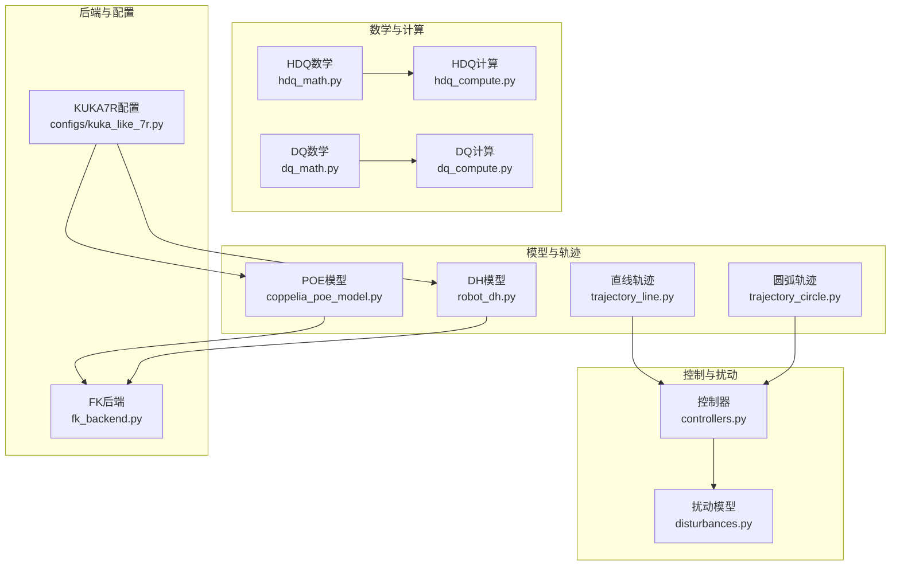
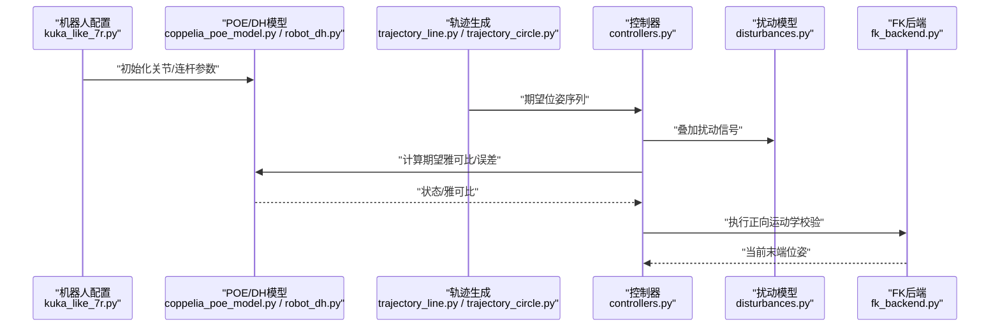
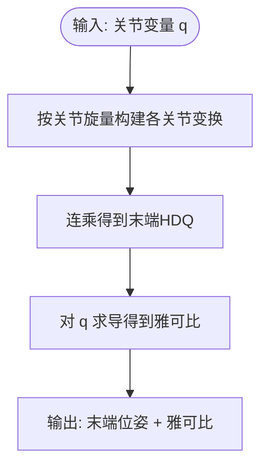
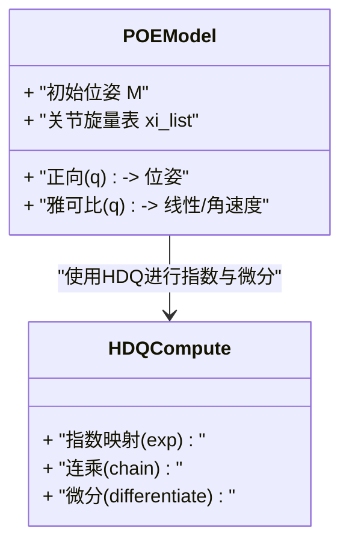
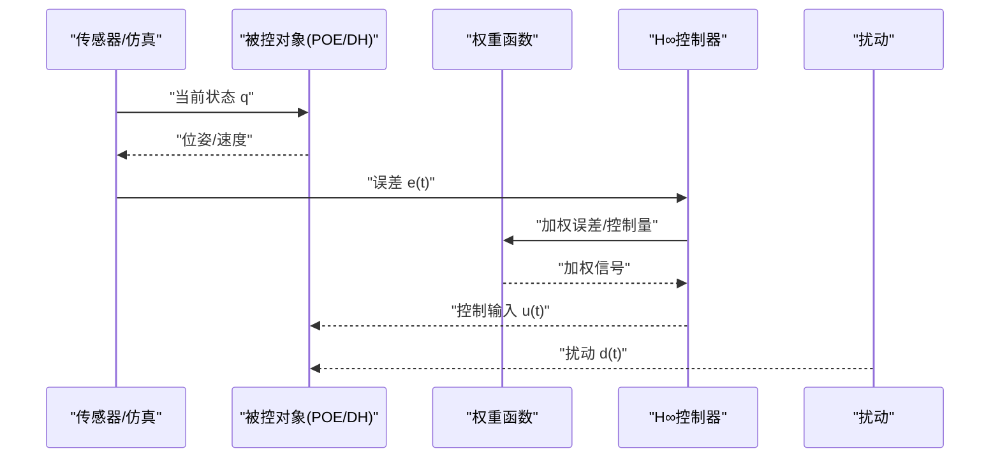
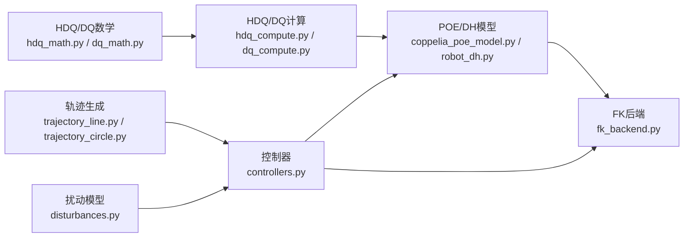

# 理论基础

<cite>
**本文引用的文件**   
- [hdq_math.py](file://core/hdq_math.py)
- [hdq_compute.py](file://core/hdq_compute.py)
- [dq_math.py](file://core/dq_math.py)
- [dq_compute.py](file://core/dq_compute.py)
- [coppelia_poe_model.py](file://core/coppelia_poe_model.py)
- [robot_dh.py](file://core/robot_dh.py)
- [controllers.py](file://core/controllers.py)
- [disturbances.py](file://core/disturbances.py)
- [fk_backend.py](file://core/fk_backend.py)
- [trajectory_line.py](file://core/trajectory_line.py)
- [trajectory_circle.py](file://core/trajectory_circle.py)
- [kuka_like_7r.py](file://configs/kuka_like_7r.py)
</cite>

## 目录
1. [引言](#引言)
2. [项目结构](#项目结构)
3. [核心组件](#核心组件)
4. [架构总览](#架构总览)
5. [详细组件分析](#详细组件分析)
6. [依赖关系分析](#依赖关系分析)
7. [性能考虑](#性能考虑)
8. [故障排查指南](#故障排查指南)
9. [结论](#结论)
10. [附录：符号表与推导要点](#附录符号表与推导要点)

## 引言
本文件面向研究人员与高级用户，系统阐述超对偶四元数（Hyperdual Quaternions, HDQ）在机器人建模中的理论基础与实践路径。内容涵盖：
- HDQ的数学定义、代数运算规则及其几何意义
- 与传统DH参数法及POE公式的对比与优势
- H∞鲁棒控制理论的基本概念、设计方法与稳定性分析
- 机器人运动学建模的理论基础：正逆运动学求解、雅可比矩阵计算与奇异点处理
- 必要的数学符号表与关键推导步骤
- 结合代码实现展示从理论到实践的转换过程

## 项目结构
本项目围绕“HDQ运动学+H∞控制+CoppeliaSim仿真”的主线组织，核心模块包括：
- 数学与计算：HDQ/DQ代数与运算、HDQ/DQ运动学与雅可比计算
- 模型与轨迹：基于POE的运动学模型、传统DH模型、直线/圆弧轨迹生成
- 控制与扰动：控制器实现、外部扰动建模
- 后端与配置：正向运动学后端封装、KUKA型7R机器人配置

图表来源
- [hdq_math.py](file://core/hdq_math.py)
- [hdq_compute.py](file://core/hdq_compute.py)
- [dq_math.py](file://core/dq_math.py)
- [dq_compute.py](file://core/dq_compute.py)
- [coppelia_poe_model.py](file://core/coppelia_poe_model.py)
- [robot_dh.py](file://core/robot_dh.py)
- [trajectory_line.py](file://core/trajectory_line.py)
- [trajectory_circle.py](file://core/trajectory_circle.py)
- [controllers.py](file://core/controllers.py)
- [disturbances.py](file://core/disturbances.py)
- [fk_backend.py](file://core/fk_backend.py)
- [kuka_like_7r.py](file://configs/kuka_like_7r.py)

章节来源
- [hdq_math.py](file://core/hdq_math.py)
- [hdq_compute.py](file://core/hdq_compute.py)
- [dq_math.py](file://core/dq_math.py)
- [dq_compute.py](file://core/dq_compute.py)
- [coppelia_poe_model.py](file://core/coppelia_poe_model.py)
- [robot_dh.py](file://core/robot_dh.py)
- [trajectory_line.py](file://core/trajectory_line.py)
- [trajectory_circle.py](file://core/trajectory_circle.py)
- [controllers.py](file://core/controllers.py)
- [disturbances.py](file://core/disturbances.py)
- [fk_backend.py](file://core/fk_backend.py)
- [kuka_like_7r.py](file://configs/kuka_like_7r.py)

## 核心组件
- HDQ数学与计算：提供超对偶四元数的构造、基本运算、指数映射与微分工具，用于统一表示位姿并直接获得雅可比。
- DQ数学与计算：提供对偶四元数相关运算，作为HDQ的特例或对照实现。
- POE与DH模型：分别以指数积（Product of Exponentials）和Denavit-Hartenberg参数描述机器人运动学，便于对比不同建模方式。
- 轨迹生成：直线与圆弧轨迹，为控制器提供期望位姿序列。
- 控制器与扰动：H∞控制器框架与外部扰动建模，支撑鲁棒性分析与仿真验证。
- FK后端：封装正向运动学接口，供上层调用。

章节来源
- [hdq_math.py](file://core/hdq_math.py)
- [hdq_compute.py](file://core/hdq_compute.py)
- [dq_math.py](file://core/dq_math.py)
- [dq_compute.py](file://core/dq_compute.py)
- [coppelia_poe_model.py](file://core/coppelia_poe_model.py)
- [robot_dh.py](file://core/robot_dh.py)
- [trajectory_line.py](file://core/trajectory_line.py)
- [trajectory_circle.py](file://core/trajectory_circle.py)
- [controllers.py](file://core/controllers.py)
- [disturbances.py](file://core/disturbances.py)
- [fk_backend.py](file://core/fk_backend.py)

## 架构总览
下图展示了从“配置→模型→轨迹→控制→扰动→仿真”的数据与控制流。

图表来源
- [kuka_like_7r.py](file://configs/kuka_like_7r.py)
- [coppelia_poe_model.py](file://core/coppelia_poe_model.py)
- [robot_dh.py](file://core/robot_dh.py)
- [trajectory_line.py](file://core/trajectory_line.py)
- [trajectory_circle.py](file://core/trajectory_circle.py)
- [controllers.py](file://core/controllers.py)
- [disturbances.py](file://core/disturbances.py)
- [fk_backend.py](file://core/fk_backend.py)

## 详细组件分析

### HDQ数学与计算（hdq_math.py, hdq_compute.py）
- 数学定义与运算
  - 超对偶四元数由标量、向量、对偶部分与超对偶部分组成，可紧凑表达旋转与平移及其一阶导数信息。
  - 基本运算包括加法、乘法、共轭、范数、归一化；乘法满足非交换性但保持代数封闭性。
  - 指数映射将旋量（含角速度与线速度）映射为HDQ，便于串联变换与微分。
- 几何意义
  - 单位HDQ对应刚体位姿；其微分项携带雅可比信息，可直接用于速度级控制。
- 计算流程
  - 给定关节变量与旋量轴，通过指数映射构建各关节变换，连乘得到末端HDQ。
  - 对关节变量求导得到雅可比，避免重复数值差分，提高精度与效率。

图表来源
- [hdq_math.py](file://core/hdq_math.py)
- [hdq_compute.py](file://core/hdq_compute.py)

章节来源
- [hdq_math.py](file://core/hdq_math.py)
- [hdq_compute.py](file://core/hdq_compute.py)

### DQ数学与计算（dq_math.py, dq_compute.py）
- 对偶四元数是HDQ的对偶部分特例，常用于纯位姿表示与简单微分。
- 在本项目中作为对照实现，便于比较HDQ与DQ在精度、稳定性与计算开销上的差异。

章节来源
- [dq_math.py](file://core/dq_math.py)
- [dq_compute.py](file://core/dq_compute.py)

### POE模型（coppelia_poe_model.py）
- 基于指数积的正向运动学：M·exp(ξ₁θ₁)·exp(ξ₂θ₂)·…·exp(ξₙθₙ)，其中ξᵢ为关节旋量，θᵢ为关节变量。
- 优点：无需逐连杆建立局部坐标系，参数更少且易于标定；天然支持空间矢量与雅可比解析式。
- 与HDQ的关系：POE的指数映射与HDQ的指数形式一致，便于用HDQ统一表示与微分。

图表来源
- [coppelia_poe_model.py](file://core/coppelia_poe_model.py)
- [hdq_compute.py](file://core/hdq_compute.py)

章节来源
- [coppelia_poe_model.py](file://core/coppelia_poe_model.py)

### DH模型（robot_dh.py）
- 传统DH参数法通过四个参数(a, α, d, θ)描述相邻连杆关系，依次左乘得到末端位姿。
- 与POE对比：
  - DH需要严格的连杆坐标系约定，易出现奇异与歧义；POE更直观且便于全局标定。
  - HDQ在两种框架下均可使用，但在POE中更易获得一致的雅可比表达式。

章节来源
- [robot_dh.py](file://core/robot_dh.py)

### 轨迹生成（trajectory_line.py, trajectory_circle.py）
- 直线轨迹：在笛卡尔空间内插值目标位姿，保证速度/加速度连续。
- 圆弧轨迹：在指定平面内生成圆弧路径，适用于姿态变化与曲线跟踪测试。
- 输出为时间戳对应的期望位姿序列，供控制器采样使用。

章节来源
- [trajectory_line.py](file://core/trajectory_line.py)
- [trajectory_circle.py](file://core/trajectory_circle.py)

### 控制器与扰动（controllers.py, disturbances.py）
- H∞鲁棒控制
  - 目标：在存在模型不确定性与外部扰动的情况下，最小化受控输出对扰动的传递函数H∞范数。
  - 设计步骤：建立广义被控对象P(s)、选择权重函数W₁/W₂/W₃、求解Riccati方程或LMI得到K(s)。
  - 稳定性：闭环系统内部稳定且满足||T_{zw}||∞ < γ。
- 扰动模型
  - 典型包含常数偏置、正弦干扰与宽带噪声，用于评估控制器鲁棒性。
- 控制流程
  - 测量当前位姿与误差 → 计算期望雅可比 → 合成控制律 → 叠加扰动 → 驱动关节。

图表来源
- [controllers.py](file://core/controllers.py)
- [disturbances.py](file://core/disturbances.py)
- [coppelia_poe_model.py](file://core/coppelia_poe_model.py)
- [robot_dh.py](file://core/robot_dh.py)

章节来源
- [controllers.py](file://core/controllers.py)
- [disturbances.py](file://core/disturbances.py)

### 正向运动学后端（fk_backend.py）
- 封装统一的FK接口，屏蔽底层POE/DH与HDQ/DQ的差异，便于上层切换与对比。
- 输入关节变量，返回末端位姿；可选返回雅可比。

章节来源
- [fk_backend.py](file://core/fk_backend.py)

### 机器人配置（kuka_like_7r.py）
- 提供KUKA型7R机器人的几何与惯性参数，作为POE旋量与DH参数的来源。
- 支持快速替换不同构型，便于算法泛化验证。

章节来源
- [kuka_like_7r.py](file://configs/kuka_like_7r.py)

## 依赖关系分析
- 低层数学库（HDQ/DQ）被高层计算（运动学、雅可比）复用。
- 模型层（POE/DH）依赖数学库完成指数映射与微分。
- 控制层依赖模型层获取状态与雅可比，同时依赖扰动模型注入不确定性。
- 轨迹层为控制层提供参考信号。

图表来源
- [hdq_math.py](file://core/hdq_math.py)
- [dq_math.py](file://core/dq_math.py)
- [hdq_compute.py](file://core/hdq_compute.py)
- [dq_compute.py](file://core/dq_compute.py)
- [coppelia_poe_model.py](file://core/coppelia_poe_model.py)
- [robot_dh.py](file://core/robot_dh.py)
- [fk_backend.py](file://core/fk_backend.py)
- [trajectory_line.py](file://core/trajectory_line.py)
- [trajectory_circle.py](file://core/trajectory_circle.py)
- [controllers.py](file://core/controllers.py)
- [disturbances.py](file://core/disturbances.py)

## 性能考虑
- HDQ相比传统方法的优势
  - 一次计算同时给出位姿与雅可比，减少数值差分带来的误差与额外开销。
  - 指数映射与连乘结构清晰，适合并行化与向量化实现。
- 数值稳定性
  - 对单位四元数/HDQ需定期归一化，防止漂移。
  - 小角度近似与奇异点附近需引入正则化或阻尼。
- 计算复杂度
  - 正解O(n)，雅可比O(n²)（n为自由度），可通过增量更新与稀疏性优化。

[本节为通用指导，不直接分析具体文件]

## 故障排查指南
- 位姿发散或抖动
  - 检查HDQ归一化是否在每个步长执行。
  - 确认旋量轴与初始位姿标定一致性。
- 雅可比奇异
  - 检测条件数，必要时引入阻尼最小二乘或重规划轨迹避开奇异区。
- 控制不稳定
  - 调整H∞权重函数，确保高频增益不过大、低频跟踪足够。
  - 检查扰动幅值与带宽是否与控制器设计假设匹配。

章节来源
- [hdq_math.py](file://core/hdq_math.py)
- [hdq_compute.py](file://core/hdq_compute.py)
- [controllers.py](file://core/controllers.py)
- [disturbances.py](file://core/disturbances.py)

## 结论
HDQ为机器人建模提供了统一而高效的数学框架，既能简洁表达位姿，又能直接导出雅可比，显著简化了速度级控制与鲁棒控制的设计流程。与DH参数法相比，POE+HDQ在参数化与标定方面更具优势；与DQ相比，HDQ在微分与高阶分析上更为完备。结合H∞鲁棒控制与扰动建模，可在不确定环境下实现高可靠跟踪。

[本节为总结性内容，不直接分析具体文件]

## 附录：符号表与推导要点

### 符号表
- q ∈ ℝⁿ：关节变量向量
- ξᵢ ∈ se(3)：第i个关节旋量（角速度+线速度）
- θᵢ：第i个关节角位移（或位移）
- exp(·)：se(3)到SE(3)的指数映射
- M：末端初始位姿
- J(q)：空间雅可比，v = J(q)·q̇
- HDQ：超对偶四元数，记作 q̂ ∈ HDQ
- ⊗：HDQ乘法
- ∇_q：关于q的梯度/雅可比算子
- W₁, W₂, W₃：H∞设计中常用权重函数
- T_{zw}(s)：从扰动z到受控输出w的闭环传递函数
- γ：H∞性能指标上界

### 关键推导要点
- 指数映射与位姿链
  - 末端位姿：F(q) = M · ∏ exp(ξᵢ θᵢ)
  - 利用HDQ的指数形式，可将每个关节变换表示为HDQ，连乘得末端HDQ。
- 雅可比计算
  - 对q求导：J(q) = ∂F/∂q，HDQ的微分项直接给出线性与角速度分量。
  - 避免数值差分，提升精度与实时性。
- H∞设计步骤
  - 建立广义对象P(s)，选择权重W₁/W₂/W₃反映跟踪、控制努力与鲁棒性需求。
  - 求解K(s)使||T_{zw}||∞ < γ，并进行时域/频域验证。
- 奇异点处理
  - 检测条件数κ(J)，当κ过大时采用阻尼最小二乘：Δq = (JᵀJ + λI)⁻¹JᵀΔx。
  - 轨迹规划阶段避开已知奇异区域。

[本节为理论补充，不直接分析具体文件]