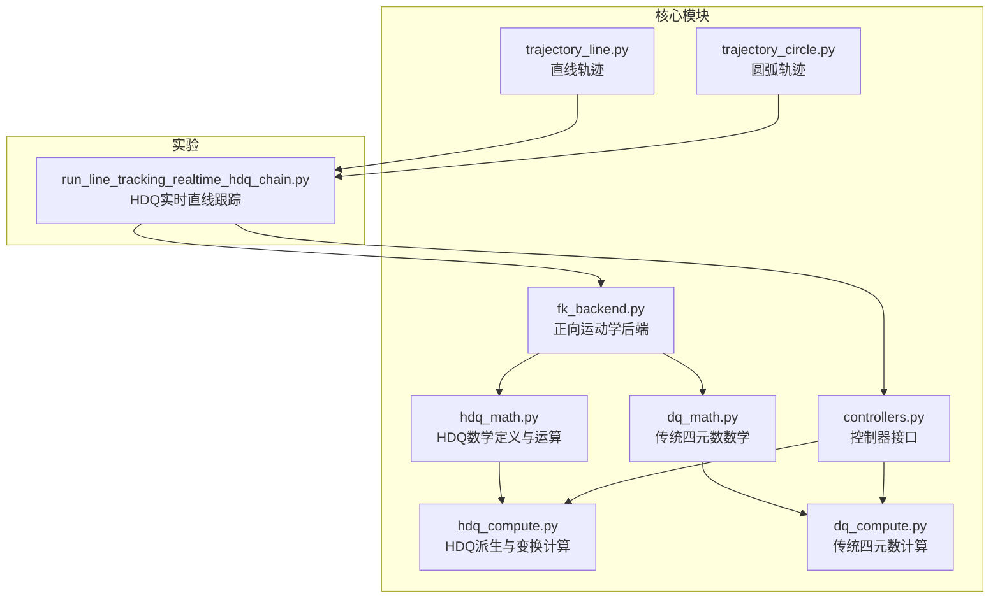
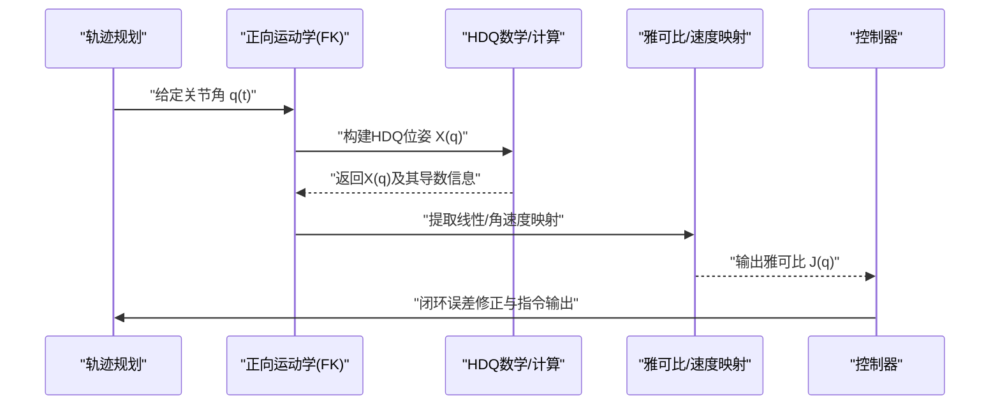
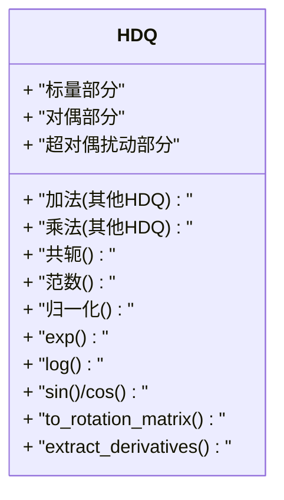
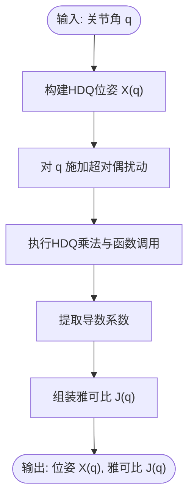
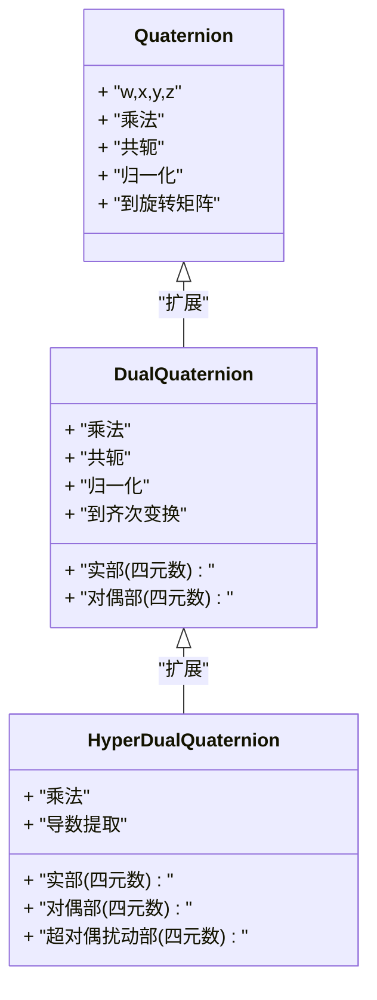
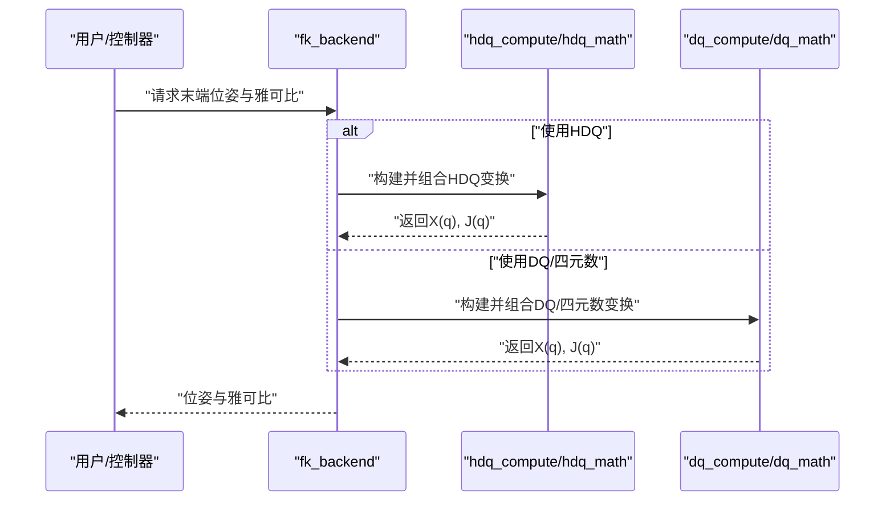
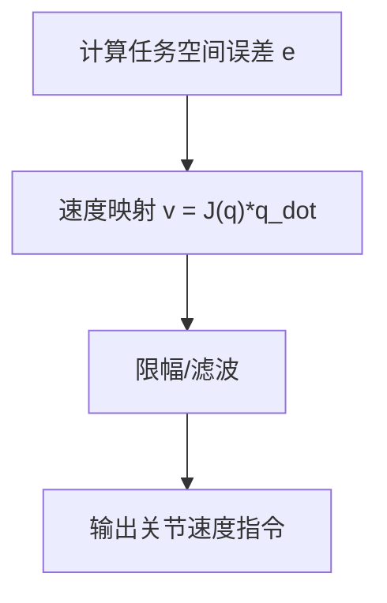
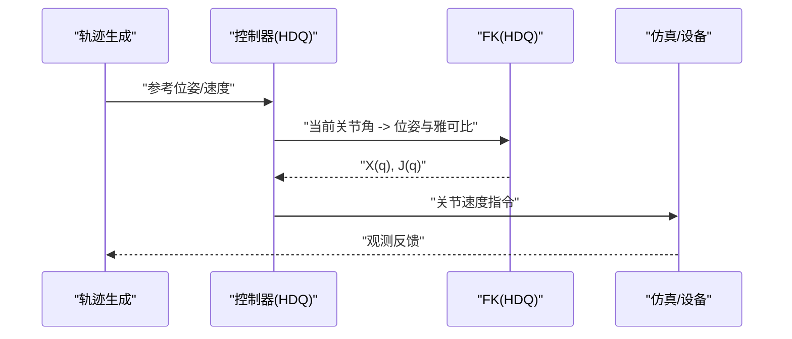
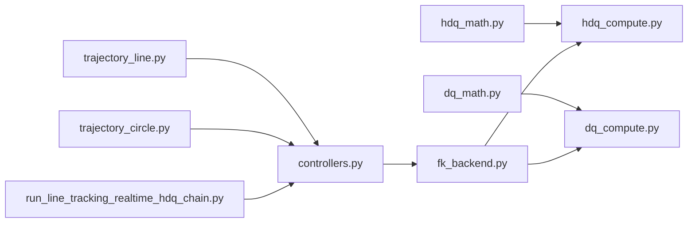

# 超对偶四元数理论

<cite>
**本文引用的文件**   
- [hdq_math.py](file://core/hdq_math.py)
- [hdq_compute.py](file://core/hdq_compute.py)
- [dq_math.py](file://core/dq_math.py)
- [dq_compute.py](file://core/dq_compute.py)
- [fk_backend.py](file://core/fk_backend.py)
- [controllers.py](file://core/controllers.py)
- [coppelia_poe_model.py](file://core/coppelia_poe_model.py)
- [trajectory_line.py](file://core/trajectory_line.py)
- [trajectory_circle.py](file://core/trajectory_circle.py)
- [run_line_tracking_realtime_hdq_chain.py](file://experiments/run_line_tracking_realtime_hdq_chain.py)
</cite>

## 目录
1. [引言](#引言)
2. [项目结构](#项目结构)
3. [核心组件](#核心组件)
4. [架构总览](#架构总览)
5. [详细组件分析](#详细组件分析)
6. [依赖关系分析](#依赖关系分析)
7. [性能与数值特性](#性能与数值特性)
8. [故障排查指南](#故障排查指南)
9. [结论](#结论)
10. [附录：数学推导与转换表](#附录数学推导与转换表)

## 引言
本文件面向研究人员与工程师，系统阐述超对偶四元数（Hyperdual Quaternions, HDQ）的数学基础及其在机器人运动学建模中的应用。内容涵盖：
- HDQ的代数定义、基本运算与导数性质
- 与传统四元数、双四元数的对比及优势
- 位姿表示、速度映射与雅可比矩阵计算
- 与旋转矩阵、欧拉角的转换关系与完整推导思路
- 结合代码实现路径，提供可复现的工程指导

HDQ通过引入“超对偶”扩展，能够在一次求值中同时获得函数值与一阶、二阶导数信息，从而为机器人正逆运动学、速度映射与雅可比计算提供统一且高效的数学工具。

## 项目结构
仓库采用分层组织：
- core：核心算法与数学库（HDQ/DQ 数学与计算、动力学/控制接口、轨迹生成、FK后端等）
- experiments：实验脚本（含基于HDQ的实时直线跟踪示例）
- configs：配置项（如KUKA-like 7R模型参数）
- sim：CoppeliaSim客户端与关节名映射

图表来源
- [hdq_math.py](file://core/hdq_math.py)
- [hdq_compute.py](file://core/hdq_compute.py)
- [dq_math.py](file://core/dq_math.py)
- [dq_compute.py](file://core/dq_compute.py)
- [fk_backend.py](file://core/fk_backend.py)
- [controllers.py](file://core/controllers.py)
- [trajectory_line.py](file://core/trajectory_line.py)
- [trajectory_circle.py](file://core/trajectory_circle.py)
- [run_line_tracking_realtime_hdq_chain.py](file://experiments/run_line_tracking_realtime_hdq_chain.py)

章节来源
- [hdq_math.py](file://core/hdq_math.py)
- [hdq_compute.py](file://core/hdq_compute.py)
- [dq_math.py](file://core/dq_math.py)
- [dq_compute.py](file://core/dq_compute.py)
- [fk_backend.py](file://core/fk_backend.py)
- [controllers.py](file://core/controllers.py)
- [trajectory_line.py](file://core/trajectory_line.py)
- [trajectory_circle.py](file://core/trajectory_circle.py)
- [run_line_tracking_realtime_hdq_chain.py](file://experiments/run_line_tracking_realtime_hdq_chain.py)

## 核心组件
- HDQ数学库（hdq_math.py）：定义HDQ类型、加法、乘法、共轭、范数、归一化、指数/对数、三角函数与向量算子，以及用于导数提取的超对偶扰动策略。
- HDQ计算库（hdq_compute.py）：基于HDQ进行变换组合、旋转向量到HDQ变换、微分与雅可比构造、速度与位姿映射。
- 传统四元数库（dq_math.py / dq_compute.py）：提供标准四元数运算与DQ（双四元数）相关工具，便于对比与互操作。
- FK后端（fk_backend.py）：封装DH/POE等运动学链的正向求解，支持以HDQ或DQ作为内部表示。
- 控制器（controllers.py）：将HDQ/DQ表示与任务空间控制律对接，完成速度映射与雅可比更新。
- 轨迹生成（trajectory_line.py / trajectory_circle.py）：生成任务空间参考轨迹，供HDQ链路跟踪使用。
- 实验脚本（run_line_tracking_realtime_hdq_chain.py）：端到端演示HDQ在实时直线跟踪中的集成方式。

章节来源
- [hdq_math.py](file://core/hdq_math.py)
- [hdq_compute.py](file://core/hdq_compute.py)
- [dq_math.py](file://core/dq_math.py)
- [dq_compute.py](file://core/dq_compute.py)
- [fk_backend.py](file://core/fk_backend.py)
- [controllers.py](file://core/controllers.py)
- [trajectory_line.py](file://core/trajectory_line.py)
- [trajectory_circle.py](file://core/trajectory_circle.py)

## 架构总览
下图展示了HDQ在机器人运动学与控制链路中的位置：从关节角到末端位姿（HDQ表示），再到速度映射与雅可比计算，最终进入控制器与轨迹规划模块。

图表来源
- [fk_backend.py](file://core/fk_backend.py)
- [hdq_compute.py](file://core/hdq_compute.py)
- [hdq_math.py](file://core/hdq_math.py)
- [controllers.py](file://core/controllers.py)

## 详细组件分析

### HDQ数学定义与运算（hdq_math.py）
- 代数结构
  - HDQ由标量部分、对偶部分与超对偶扰动部分组成，可在一次求值中携带函数值与一阶、二阶导数信息。
  - 典型形式包含基元素满足特定乘法规则，使得对变量施加超对偶扰动后，结果展开系数即为所需导数。
- 基本运算
  - 加法：分量相加，保持超对偶结构不变。
  - 乘法：按HDQ乘法规则展开，自动累积各阶导数项。
  - 共轭：对虚部取负，保留标量与超对偶结构。
  - 范数与归一化：用于保证单位HDQ表示刚体运动学位姿。
- 分析与变换
  - 指数/对数映射：用于旋转到HDQ变换的连续参数化。
  - 三角函数与向量算子：用于角度/轴角与HDQ之间的转换。
- 导数提取
  - 通过对输入变量施加超对偶扰动，利用HDQ乘法展开的系数直接读取一阶与二阶导数，避免符号或数值差分带来的误差与开销。

图表来源
- [hdq_math.py](file://core/hdq_math.py)

章节来源
- [hdq_math.py](file://core/hdq_math.py)

### HDQ计算与变换（hdq_compute.py）
- 变换组合：将多个HDQ变换相乘得到复合位姿，自动传播导数信息。
- 旋转向量到HDQ：将轴角或旋转向量转换为HDQ表示，并附带导数关于参数的表达式。
- 微分与雅可比：基于HDQ导数提取，直接得到末端线速度与角速度对关节速度的映射矩阵（雅可比）。
- 速度映射：将关节速度映射至任务空间速度，用于控制与轨迹跟踪。

图表来源
- [hdq_compute.py](file://core/hdq_compute.py)
- [hdq_math.py](file://core/hdq_math.py)

章节来源
- [hdq_compute.py](file://core/hdq_compute.py)
- [hdq_math.py](file://core/hdq_math.py)

### 传统四元数与双四元数（dq_math.py / dq_compute.py）
- 传统四元数：用于表示纯旋转，具备无奇点、插值平滑等优势；但无法直接表达平移。
- 双四元数（DQ）：在传统四元数基础上引入对偶数，可同时表示旋转与平移，适合刚体位姿建模。
- 与HDQ对比：
  - DQ能一次性给出函数值与一阶导数（对偶部分），而HDQ进一步引入超对偶扰动，能在一次求值中获得一阶与二阶导数信息。
  - 在需要高阶敏感性分析、鲁棒控制或自适应辨识的场景中，HDQ更具优势。

图表来源
- [dq_math.py](file://core/dq_math.py)
- [dq_compute.py](file://core/dq_compute.py)
- [hdq_math.py](file://core/hdq_math.py)

章节来源
- [dq_math.py](file://core/dq_math.py)
- [dq_compute.py](file://core/dq_compute.py)
- [hdq_math.py](file://core/hdq_math.py)

### 正向运动学与HDQ集成（fk_backend.py）
- 功能：封装DH/POE等运动学链的正向求解，支持以HDQ或DQ作为内部表示。
- 流程：
  - 根据关节角序列构建各连杆变换（HDQ或DQ）。
  - 连乘得到末端位姿。
  - 若使用HDQ，可直接导出雅可比与速度映射。

图表来源
- [fk_backend.py](file://core/fk_backend.py)
- [hdq_compute.py](file://core/hdq_compute.py)
- [dq_compute.py](file://core/dq_compute.py)

章节来源
- [fk_backend.py](file://core/fk_backend.py)
- [hdq_compute.py](file://core/hdq_compute.py)
- [dq_compute.py](file://core/dq_compute.py)

### 控制器与速度映射（controllers.py）
- 功能：将任务空间误差转化为关节速度指令，使用HDQ/DQ提供的雅可比进行速度映射。
- 要点：
  - 误差定义：任务空间位姿误差（可由HDQ差或DQ差构造）。
  - 速度映射：v = J(q) * q_dot，其中J由HDQ导数提取或直接数值近似。
  - 稳定性：考虑约束与饱和，必要时加入滤波与限幅。

图表来源
- [controllers.py](file://core/controllers.py)
- [hdq_compute.py](file://core/hdq_compute.py)

章节来源
- [controllers.py](file://core/controllers.py)
- [hdq_compute.py](file://core/hdq_compute.py)

### 轨迹生成与HDQ链路跟踪（trajectory_line.py / trajectory_circle.py / run_line_tracking_realtime_hdq_chain.py）
- 轨迹生成：直线与圆弧轨迹在任务空间内生成参考位姿与速度。
- HDQ链路跟踪：
  - 将参考轨迹送入控制器。
  - 控制器使用HDQ计算的雅可比进行速度映射。
  - 实时循环中更新关节速度，驱动仿真或真机。

图表来源
- [trajectory_line.py](file://core/trajectory_line.py)
- [trajectory_circle.py](file://core/trajectory_circle.py)
- [controllers.py](file://core/controllers.py)
- [fk_backend.py](file://core/fk_backend.py)
- [run_line_tracking_realtime_hdq_chain.py](file://experiments/run_line_tracking_realtime_hdq_chain.py)

章节来源
- [trajectory_line.py](file://core/trajectory_line.py)
- [trajectory_circle.py](file://core/trajectory_circle.py)
- [controllers.py](file://core/controllers.py)
- [fk_backend.py](file://core/fk_backend.py)
- [run_line_tracking_realtime_hdq_chain.py](file://experiments/run_line_tracking_realtime_hdq_chain.py)

## 依赖关系分析
- 模块耦合
  - hdq_compute.py 依赖 hdq_math.py 的基础运算与导数提取。
  - fk_backend.py 可选择依赖 hdq_compute.py 或 dq_compute.py，形成多表示后端。
  - controllers.py 依赖 fk_backend 输出的雅可比与位姿。
  - 实验脚本串联轨迹生成、控制器与FK后端，形成端到端链路。
- 外部依赖
  - 数值库（如NumPy）用于向量/矩阵运算。
  - 仿真客户端（CoppeliaSim）用于实时验证。

图表来源
- [hdq_math.py](file://core/hdq_math.py)
- [hdq_compute.py](file://core/hdq_compute.py)
- [dq_math.py](file://core/dq_math.py)
- [dq_compute.py](file://core/dq_compute.py)
- [fk_backend.py](file://core/fk_backend.py)
- [controllers.py](file://core/controllers.py)
- [trajectory_line.py](file://core/trajectory_line.py)
- [trajectory_circle.py](file://core/trajectory_circle.py)
- [run_line_tracking_realtime_hdq_chain.py](file://experiments/run_line_tracking_realtime_hdq_chain.py)

章节来源
- [hdq_math.py](file://core/hdq_math.py)
- [hdq_compute.py](file://core/hdq_compute.py)
- [dq_math.py](file://core/dq_math.py)
- [dq_compute.py](file://core/dq_compute.py)
- [fk_backend.py](file://core/fk_backend.py)
- [controllers.py](file://core/controllers.py)
- [trajectory_line.py](file://core/trajectory_line.py)
- [trajectory_circle.py](file://core/trajectory_circle.py)
- [run_line_tracking_realtime_hdq_chain.py](file://experiments/run_line_tracking_realtime_hdq_chain.py)

## 性能与数值特性
- 计算效率
  - HDQ在一次求值中同时获得函数值与一阶、二阶导数，相比多次数值差分显著减少函数调用次数。
  - 对于高维机械臂，雅可比计算成本随自由度线性增长，HDQ的解析式导数提取有助于降低常数因子。
- 数值稳定性
  - 单位HDQ归一化需防止漂移，建议定期重投影到单位流形。
  - 小角度与奇异位形附近，建议使用稳定的指数/对数映射与正则化策略。
- 内存占用
  - HDQ比传统四元数多存储对偶与超对偶部分，但整体仍为低维向量/四元数结构，内存开销可控。

[本节为通用性能讨论，不直接分析具体文件]

## 故障排查指南
- 常见问题
  - 雅可比奇异：检查当前位形是否接近奇异，必要时引入阻尼或切换参数化。
  - 位姿漂移：确认HDQ归一化步骤是否在每个时间步执行。
  - 轨迹跟踪误差大：检查参考轨迹的速度连续性、控制器增益与采样频率匹配。
- 调试建议
  - 打印中间变量：位姿X(q)、雅可比J(q)、任务空间误差e。
  - 对比不同表示：用DQ/四元数后端交叉验证结果一致性。
  - 逐步简化：先验证单关节与两关节链路的HDQ导数正确性，再扩展到全链。

章节来源
- [controllers.py](file://core/controllers.py)
- [fk_backend.py](file://core/fk_backend.py)
- [hdq_compute.py](file://core/hdq_compute.py)
- [hdq_math.py](file://core/hdq_math.py)

## 结论
HDQ为机器人运动学建模提供了统一的数学框架，能够在一次求值中获取函数值与高阶导数，显著提升雅可比与速度映射的计算效率与精度。与传统四元数和双四元数相比，HDQ在高阶敏感性与鲁棒控制场景中具有独特价值。结合本仓库的模块化实现，研究人员可以快速搭建从数学定义到实时控制的完整链路。

[本节为总结性内容，不直接分析具体文件]

## 附录：数学推导与转换表

### HDQ代数结构与基本运算
- 定义要点
  - HDQ包含标量、对偶与超对偶扰动三部分，乘法规则确保展开系数对应所需导数。
- 基本运算
  - 加法：分量相加。
  - 乘法：按规则展开，自动累积导数项。
  - 共轭：虚部取负。
  - 范数与归一化：保持单位HDQ表示刚体运动。
- 导数提取
  - 对输入变量施加超对偶扰动，利用乘法展开系数直接读取一阶与二阶导数。

章节来源
- [hdq_math.py](file://core/hdq_math.py)

### 变换矩阵推导与速度映射
- 变换组合
  - 多个HDQ变换相乘得到复合位姿，导数随乘法传播。
- 雅可比构造
  - 通过HDQ导数提取，直接得到末端线速度与角速度对关节速度的映射矩阵。
- 速度映射
  - 关节速度到任务空间速度的线性映射，用于控制与轨迹跟踪。

章节来源
- [hdq_compute.py](file://core/hdq_compute.py)
- [hdq_math.py](file://core/hdq_math.py)

### 与旋转矩阵、欧拉角的转换关系
- 旋转矩阵到HDQ
  - 先将旋转矩阵转换为四元数，再扩展为HDQ（对偶与超对偶部分为零或按扰动策略设置）。
- HDQ到旋转矩阵
  - 从HDQ的实部提取四元数，再转换为旋转矩阵。
- 欧拉角到HDQ
  - 欧拉角到轴角/四元数，再扩展为HDQ；注意顺序约定与奇异性处理。
- HDQ到欧拉角
  - 从HDQ实部提取四元数，再转换为欧拉角；注意万向节锁与角度范围。

章节来源
- [hdq_math.py](file://core/hdq_math.py)
- [dq_math.py](file://core/dq_math.py)

### 与传统四元数、双四元数的对比
- 传统四元数
  - 仅表示旋转，无法直接表达平移；导数需额外计算。
- 双四元数（DQ）
  - 同时表示旋转与平移；对偶部分提供一阶导数信息。
- HDQ
  - 在DQ基础上引入超对偶扰动，一次求值可获得一阶与二阶导数，适用于高阶分析与鲁棒控制。

章节来源
- [dq_math.py](file://core/dq_math.py)
- [dq_compute.py](file://core/dq_compute.py)
- [hdq_math.py](file://core/hdq_math.py)

### 应用示例路径
- 位姿表示与速度映射
  - 参考：[hdq_compute.py](file://core/hdq_compute.py)
- 雅可比矩阵计算
  - 参考：[hdq_compute.py](file://core/hdq_compute.py)
- 实时直线跟踪（HDQ链路）
  - 参考：[run_line_tracking_realtime_hdq_chain.py](file://experiments/run_line_tracking_realtime_hdq_chain.py)
- 轨迹生成（直线/圆弧）
  - 参考：[trajectory_line.py](file://core/trajectory_line.py), [trajectory_circle.py](file://core/trajectory_circle.py)

章节来源
- [hdq_compute.py](file://core/hdq_compute.py)
- [run_line_tracking_realtime_hdq_chain.py](file://experiments/run_line_tracking_realtime_hdq_chain.py)
- [trajectory_line.py](file://core/trajectory_line.py)
- [trajectory_circle.py](file://core/trajectory_circle.py)