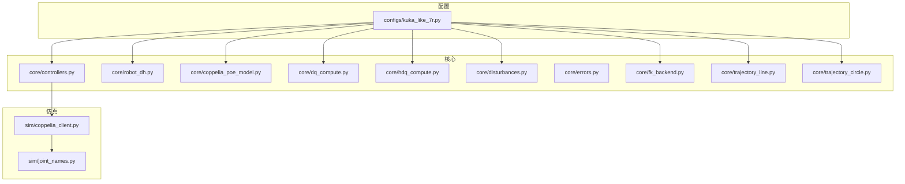
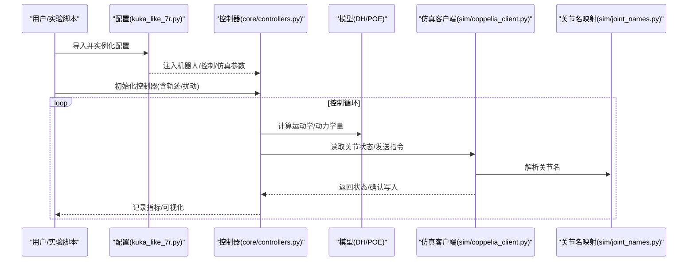
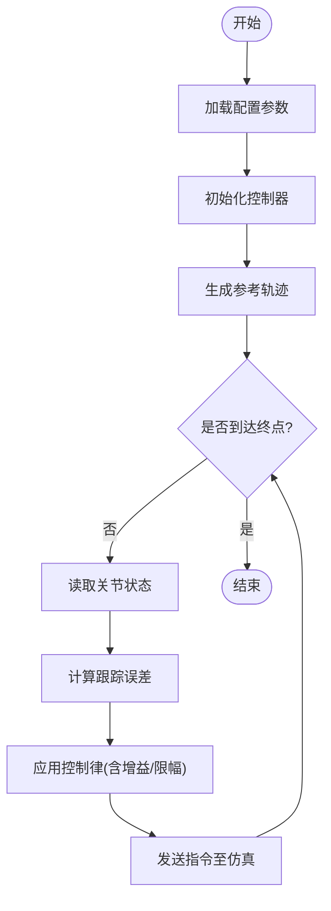
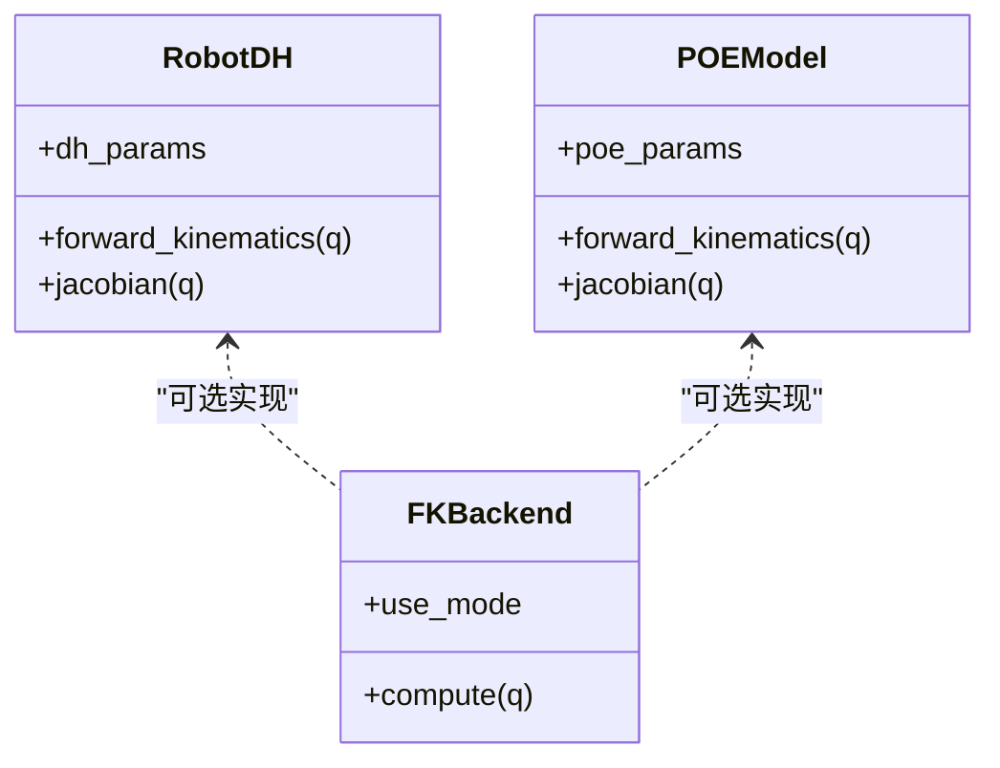
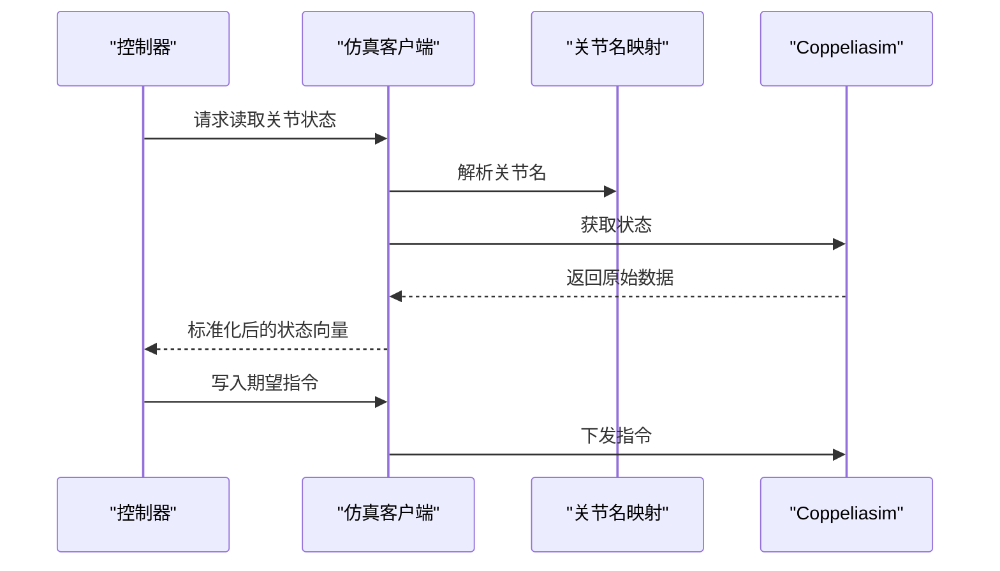
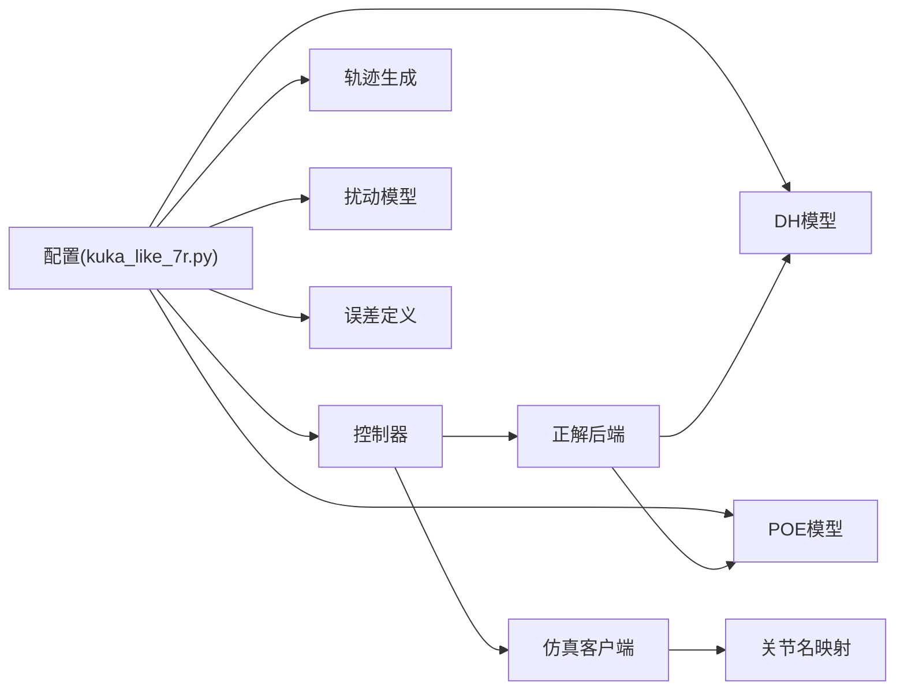
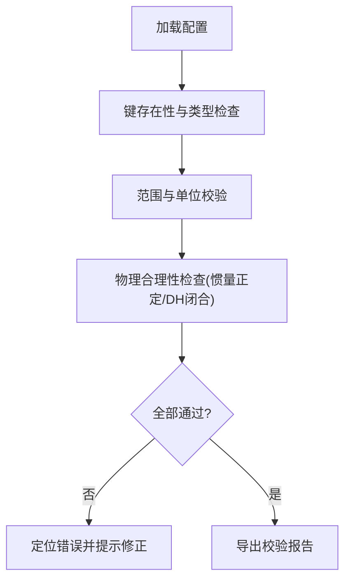

# 配置管理系统

<cite>
**本文引用的文件**   
- [kuka_like_7r.py](file://configs/kuka_like_7r.py)
- [controllers.py](file://core/controllers.py)
- [robot_dh.py](file://core/robot_dh.py)
- [coppelia_poe_model.py](file://core/coppelia_poe_model.py)
- [dq_compute.py](file://core/dq_compute.py)
- [hdq_compute.py](file://core/hdq_compute.py)
- [disturbances.py](file://core/disturbances.py)
- [errors.py](file://core/errors.py)
- [fk_backend.py](file://core/fk_backend.py)
- [trajectory_circle.py](file://core/trajectory_circle.py)
- [trajectory_line.py](file://core/trajectory_line.py)
- [coppelia_client.py](file://sim/coppelia_client.py)
- [joint_names.py](file://sim/joint_names.py)
</cite>

## 目录
1. [简介](#简介)
2. [项目结构](#项目结构)
3. [核心组件](#核心组件)
4. [架构总览](#架构总览)
5. [详细组件分析](#详细组件分析)
6. [依赖关系分析](#依赖关系分析)
7. [性能与稳定性考虑](#性能与稳定性考虑)
8. [故障排查指南](#故障排查指南)
9. [结论](#结论)
10. [附录：参数清单与验证流程](#附录参数清单与验证流程)

## 简介
本配置管理系统面向多机器人仿真与控制实验，提供统一的配置文件组织方式与参数管理机制。系统支持对机器人本体参数（如DH几何、惯性）、控制参数（控制器增益、轨迹跟踪策略）以及仿真设置（Coppeliasim连接、关节命名等）的分类管理。以KUKA型7自由度机械臂为例，文档给出完整的配置示例与调优建议，并说明多机器人扩展与参数继承机制，同时提供配置验证工具与常见错误诊断方法，帮助用户快速完成灵活而可靠的配置定制。

## 项目结构
仓库采用“配置-核心-仿真-实验”的分层组织方式：
- configs：存放各机型或场景的Python风格配置模块，便于按功能分类与按需导入。
- core：核心算法与模型实现，包括动力学/运动学计算、控制器、扰动模型、轨迹生成、误差定义等。
- sim：与Coppeliasim交互的客户端封装与关节名映射。
- experiments：运行脚本与实验用例，演示如何加载配置并驱动仿真/控制。

图表来源
- [kuka_like_7r.py](file://configs/kuka_like_7r.py)
- [controllers.py](file://core/controllers.py)
- [robot_dh.py](file://core/robot_dh.py)
- [coppelia_poe_model.py](file://core/coppelia_poe_model.py)
- [dq_compute.py](file://core/dq_compute.py)
- [hdq_compute.py](file://core/hdq_compute.py)
- [disturbances.py](file://core/disturbances.py)
- [errors.py](file://core/errors.py)
- [fk_backend.py](file://core/fk_backend.py)
- [trajectory_line.py](file://core/trajectory_line.py)
- [trajectory_circle.py](file://core/trajectory_circle.py)
- [coppelia_client.py](file://sim/coppelia_client.py)
- [joint_names.py](file://sim/joint_names.py)

章节来源
- [kuka_like_7r.py](file://configs/kuka_like_7r.py)
- [controllers.py](file://core/controllers.py)
- [robot_dh.py](file://core/robot_dh.py)
- [coppelia_poe_model.py](file://core/coppelia_poe_model.py)
- [dq_compute.py](file://core/dq_compute.py)
- [hdq_compute.py](file://core/hdq_compute.py)
- [disturbances.py](file://core/disturbances.py)
- [errors.py](file://core/errors.py)
- [fk_backend.py](file://core/fk_backend.py)
- [trajectory_line.py](file://core/trajectory_line.py)
- [trajectory_circle.py](file://core/trajectory_circle.py)
- [coppelia_client.py](file://sim/coppelia_client.py)
- [joint_names.py](file://sim/joint_names.py)

## 核心组件
- 配置模块（configs）：集中定义机器人本体参数、控制参数与仿真设置，按机型/任务组织，便于复用与继承。
- 控制器（core/controllers.py）：实现各类控制律（位置/速度/力矩等），读取配置中的增益与约束。
- 运动学与模型（core/robot_dh.py, core/coppelia_poe_model.py）：基于DH或POE建模，支撑正逆解与雅可比计算。
- 四元数/超四元数计算（core/dq_compute.py, core/hdq_compute.py）：用于姿态表示与相关运算。
- 扰动与误差（core/disturbances.py, core/errors.py）：提供外部扰动模型与误差度量。
- 轨迹生成（core/trajectory_line.py, core/trajectory_circle.py）：提供直线/圆弧等参考轨迹。
- 仿真接口（sim/coppelia_client.py, sim/joint_names.py）：封装Coppeliasim通信与关节名称映射。

章节来源
- [controllers.py](file://core/controllers.py)
- [robot_dh.py](file://core/robot_dh.py)
- [coppelia_poe_model.py](file://core/coppelia_poe_model.py)
- [dq_compute.py](file://core/dq_compute.py)
- [hdq_compute.py](file://core/hdq_compute.py)
- [disturbances.py](file://core/disturbances.py)
- [errors.py](file://core/errors.py)
- [trajectory_line.py](file://core/trajectory_line.py)
- [trajectory_circle.py](file://core/trajectory_circle.py)
- [coppelia_client.py](file://sim/coppelia_client.py)
- [joint_names.py](file://sim/joint_names.py)

## 架构总览
下图展示了从配置到控制执行的整体数据流：配置被加载后注入控制器与模型；控制器根据当前状态与参考轨迹输出指令；通过仿真客户端与Coppeliasim交互，读取关节状态并闭环控制。

图表来源
- [kuka_like_7r.py](file://configs/kuka_like_7r.py)
- [controllers.py](file://core/controllers.py)
- [robot_dh.py](file://core/robot_dh.py)
- [coppelia_poe_model.py](file://core/coppelia_poe_model.py)
- [coppelia_client.py](file://sim/coppelia_client.py)
- [joint_names.py](file://sim/joint_names.py)

## 详细组件分析

### 配置模块：KUKA型7自由度机械臂
- 目标：为KUKA型7R机械臂提供完整可运行的配置，包含DH几何、惯性参数、控制增益与仿真连接信息。
- 结构建议：
  - 机器人参数：DH表（a, α, d, θ）、连杆质量、转动惯量、摩擦/阻尼等。
  - 控制参数：控制器类型选择、比例/积分/微分增益、限幅、滤波时间常数、采样周期。
  - 仿真设置：Coppeliasim地址/端口、关节名映射、初始位姿、轨迹类型与时长。
- 使用方式：在实验脚本中直接import该配置模块，并将配置对象传入控制器与模型初始化函数。

章节来源
- [kuka_like_7r.py](file://configs/kuka_like_7r.py)

#### KUKA型7R配置要点
- DH参数定义：需保证每级关节的几何一致性，避免奇异点附近的数值不稳定。
- 惯性参数设置：质量与惯量矩阵应满足物理合理性（正定、对称）。
- 控制增益配置：先低增益稳定，再逐步提升响应速度；必要时引入前馈与抗饱和。

章节来源
- [kuka_like_7r.py](file://configs/kuka_like_7r.py)
- [robot_dh.py](file://core/robot_dh.py)
- [controllers.py](file://core/controllers.py)

### 控制器与轨迹
- 控制器（core/controllers.py）：读取配置中的增益与约束，结合模型输出期望关节力矩/速度。
- 轨迹生成（core/trajectory_line.py, core/trajectory_circle.py）：提供直线与圆弧参考轨迹，供跟踪控制使用。
- 典型调用序列：初始化控制器→加载轨迹→进入控制循环→读取状态→计算误差→输出指令。

图表来源
- [controllers.py](file://core/controllers.py)
- [trajectory_line.py](file://core/trajectory_line.py)
- [trajectory_circle.py](file://core/trajectory_circle.py)
- [coppelia_client.py](file://sim/coppelia_client.py)

章节来源
- [controllers.py](file://core/controllers.py)
- [trajectory_line.py](file://core/trajectory_line.py)
- [trajectory_circle.py](file://core/trajectory_circle.py)

### 运动学与模型
- DH建模（core/robot_dh.py）：依据配置的DH表构建变换链，提供正解与雅可比。
- POE建模（core/coppelia_poe_model.py）：基于指数积公式的另一种建模路径，可与DH结果对齐校验。
- 正解后端（core/fk_backend.py）：统一封装正解调用，屏蔽底层差异。

图表来源
- [robot_dh.py](file://core/robot_dh.py)
- [coppelia_poe_model.py](file://core/coppelia_poe_model.py)
- [fk_backend.py](file://core/fk_backend.py)

章节来源
- [robot_dh.py](file://core/robot_dh.py)
- [coppelia_poe_model.py](file://core/coppelia_poe_model.py)
- [fk_backend.py](file://core/fk_backend.py)

### 四元数与超四元数计算
- 四元数（core/dq_compute.py）：用于姿态表示与插值。
- 超四元数（core/hdq_compute.py）：扩展代数结构，用于更复杂的姿态/耦合动力学表达。

章节来源
- [dq_compute.py](file://core/dq_compute.py)
- [hdq_compute.py](file://core/hdq_compute.py)

### 扰动与误差
- 扰动模型（core/disturbances.py）：模拟风载、负载变化等外部扰动，用于鲁棒性测试。
- 误差定义（core/errors.py）：定义跟踪误差、能量范数等指标，便于分析与可视化。

章节来源
- [disturbances.py](file://core/disturbances.py)
- [errors.py](file://core/errors.py)

### 仿真客户端与关节名映射
- 仿真客户端（sim/coppelia_client.py）：封装Coppeliasim连接、读写关节状态与指令。
- 关节名映射（sim/joint_names.py）：将逻辑关节索引映射到仿真环境中的具体名称。

图表来源
- [coppelia_client.py](file://sim/coppelia_client.py)
- [joint_names.py](file://sim/joint_names.py)

章节来源
- [coppelia_client.py](file://sim/coppelia_client.py)
- [joint_names.py](file://sim/joint_names.py)

## 依赖关系分析
- 配置对核心模块的依赖：控制器、运动学模型、轨迹生成、扰动与误差模块均依赖配置提供的参数。
- 仿真层依赖：仿真客户端依赖关节名映射，确保逻辑与物理实体一致。
- 潜在耦合点：DH与POE两种建模路径可通过FK后端统一接入，降低耦合度。

图表来源
- [kuka_like_7r.py](file://configs/kuka_like_7r.py)
- [controllers.py](file://core/controllers.py)
- [robot_dh.py](file://core/robot_dh.py)
- [coppelia_poe_model.py](file://core/coppelia_poe_model.py)
- [fk_backend.py](file://core/fk_backend.py)
- [trajectory_line.py](file://core/trajectory_line.py)
- [trajectory_circle.py](file://core/trajectory_circle.py)
- [disturbances.py](file://core/disturbances.py)
- [errors.py](file://core/errors.py)
- [coppelia_client.py](file://sim/coppelia_client.py)
- [joint_names.py](file://sim/joint_names.py)

章节来源
- [kuka_like_7r.py](file://configs/kuka_like_7r.py)
- [controllers.py](file://core/controllers.py)
- [robot_dh.py](file://core/robot_dh.py)
- [coppelia_poe_model.py](file://core/coppelia_poe_model.py)
- [fk_backend.py](file://core/fk_backend.py)
- [trajectory_line.py](file://core/trajectory_line.py)
- [trajectory_circle.py](file://core/trajectory_circle.py)
- [disturbances.py](file://core/disturbances.py)
- [errors.py](file://core/errors.py)
- [coppelia_client.py](file://sim/coppelia_client.py)
- [joint_names.py](file://sim/joint_names.py)

## 性能与稳定性考虑
- 稳定性分析：优先保证闭环极点位于稳定区域，适当增加阻尼项抑制振荡。
- 响应速度优化：逐步提高比例增益，配合微分项改善相位裕度；注意传感器噪声放大。
- 鲁棒性增强：引入扰动观测器或自适应项；对模型不确定性进行边界估计与限幅保护。
- 数值稳健性：检查DH与惯性参数的单位一致性；避免接近奇异构型运行。

[本节为通用指导，不直接分析具体文件]

## 故障排查指南
- 配置缺失或类型错误：检查配置键是否存在、数据类型是否符合控制器/模型要求。
- 仿真连接失败：确认Coppeliasim地址/端口、防火墙设置与仿真场景已启动。
- 关节名不一致：核对joint_names映射与实际仿真场景中的关节命名。
- 轨迹异常：检查轨迹起点/终点与初始位姿是否匹配，时间戳与采样周期是否一致。
- 发散或振荡：降低增益、增加滤波、检查测量噪声与执行器饱和。

章节来源
- [errors.py](file://core/errors.py)
- [coppelia_client.py](file://sim/coppelia_client.py)
- [joint_names.py](file://sim/joint_names.py)

## 结论
本配置管理系统通过分层结构与模块化设计，实现了机器人参数、控制参数与仿真设置的清晰分离与统一管理。以KUKA型7R为例，提供了从DH/惯性到控制增益与仿真连接的完整配置范式，并配套了调优方法与故障排查流程。借助多机器人扩展与参数继承机制，用户可在保持核心代码稳定的前提下，快速定制不同机型与任务的配置。

[本节为总结性内容，不直接分析具体文件]

## 附录：参数清单与验证流程

### 参数清单（建议）
- 机器人参数
  - DH几何：a, α, d, θ（逐关节）
  - 惯性参数：质量、转动惯量、质心偏移
  - 摩擦/阻尼：粘性/库仑系数
- 控制参数
  - 控制器类型：位置/速度/力矩
  - 增益：Kp, Ki, Kd（可按轴独立）
  - 限幅：最大力矩/速度/加速度
  - 滤波：一阶/二阶滤波器时间常数
  - 采样周期：dt
- 仿真设置
  - Coppeliasim：地址、端口、场景路径
  - 关节名映射：逻辑索引到仿真名称
  - 初始位姿：q0
  - 轨迹：类型（直线/圆弧）、时长、步数

章节来源
- [kuka_like_7r.py](file://configs/kuka_like_7r.py)
- [controllers.py](file://core/controllers.py)
- [robot_dh.py](file://core/robot_dh.py)
- [coppelia_client.py](file://sim/coppelia_client.py)
- [joint_names.py](file://sim/joint_names.py)

### 配置验证流程

图表来源
- [kuka_like_7r.py](file://configs/kuka_like_7r.py)
- [errors.py](file://core/errors.py)

### 常见配置错误与诊断
- 关节维度不匹配：检查配置中关节数量与控制器/模型维度一致。
- 单位不一致：确保长度(m)、角度(rad)、质量(kg)、惯量(kg·m²)统一。
- 增益过大导致饱和：观察执行器输出是否达到限幅，必要时降增益或增大限幅。
- 轨迹与初始位姿冲突：调整轨迹起点或重置初始位姿。

章节来源
- [controllers.py](file://core/controllers.py)
- [robot_dh.py](file://core/robot_dh.py)
- [trajectory_line.py](file://core/trajectory_line.py)
- [trajectory_circle.py](file://core/trajectory_circle.py)
- [errors.py](file://core/errors.py)

### 多机器人扩展与参数继承
- 基类/模板配置：抽取公共参数（如采样周期、滤波器结构）到基础配置。
- 机型特定覆盖：在子类配置中仅覆盖差异部分（DH、惯量、增益）。
- 运行时合并：在控制器初始化时合并基础配置与机型覆盖，形成最终配置。
- 批量实验：通过遍历不同机型配置，自动切换参数集，无需修改核心代码。

章节来源
- [kuka_like_7r.py](file://configs/kuka_like_7r.py)
- [controllers.py](file://core/controllers.py)