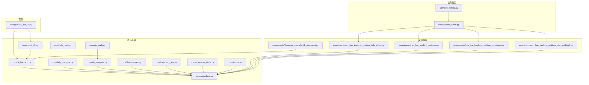
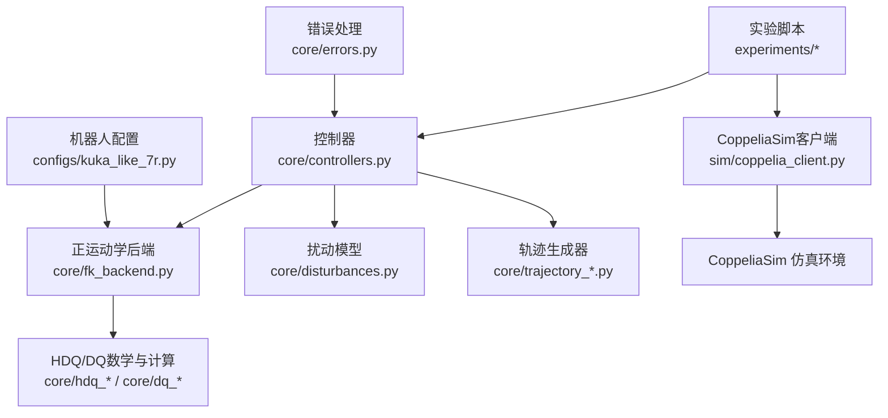
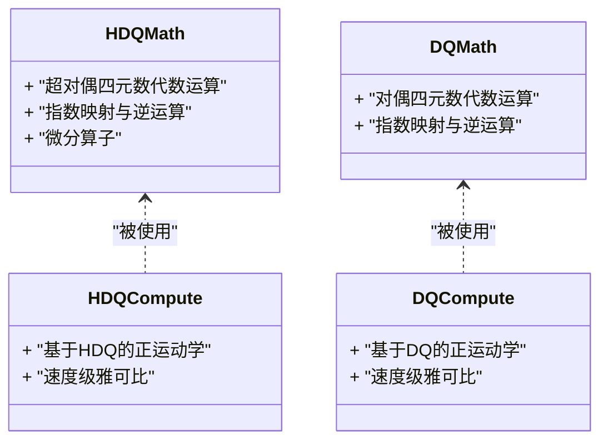
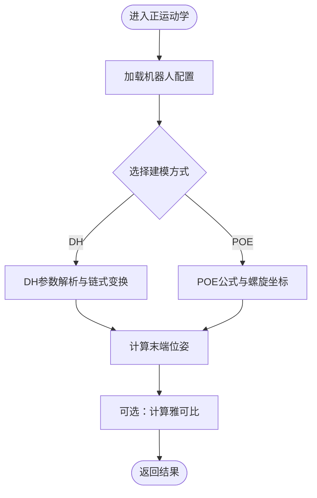
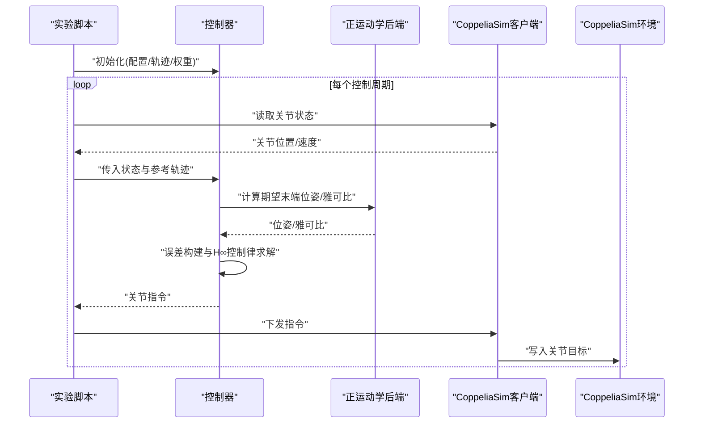
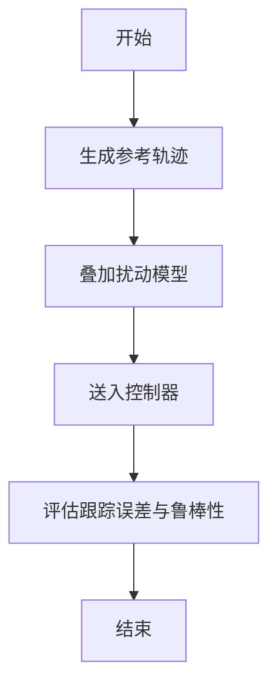
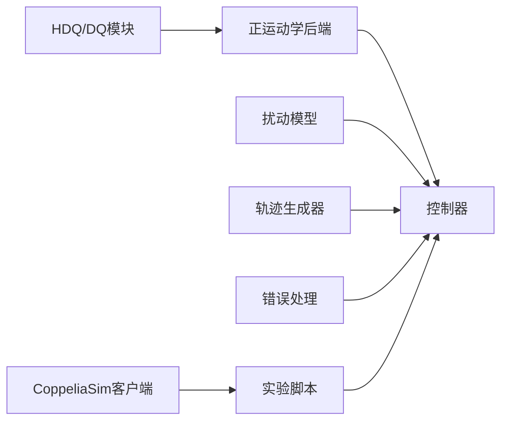

# 项目概述

<cite>
**本文引用的文件**   
- [configs/kuka_like_7r.py](file://configs/kuka_like_7r.py)
- [core/controllers.py](file://core/controllers.py)
- [core/coppelia_poe_model.py](file://core/coppelia_poe_model.py)
- [core/disturbances.py](file://core/disturbances.py)
- [core/dq_compute.py](file://core/dq_compute.py)
- [core/dq_math.py](file://core/dq_math.py)
- [core/errors.py](file://core/errors.py)
- [core/fk_backend.py](file://core/fk_backend.py)
- [core/hdq_compute.py](file://core/hdq_compute.py)
- [core/hdq_math.py](file://core/hdq_math.py)
- [core/robot_dh.py](file://core/robot_dh.py)
- [core/trajectory_circle.py](file://core/trajectory_circle.py)
- [core/trajectory_line.py](file://core/trajectory_line.py)
- [experiments/run_line_tracking_realtime_hdq_chain.py](file://experiments/run_line_tracking_realtime_hdq_chain.py)
- [experiments/run_line_tracking_realtime_calibrated.py](file://experiments/run_line_tracking_realtime_calibrated.py)
- [experiments/diagnose_coppelia_fk_alignment.py](file://experiments/diagnose_coppelia_fk_alignment.py)
- [experiments/run_joint_sine_motion.py](file://experiments/run_joint_sine_motion.py)
- [experiments/run_joint_sine_motion_realtime_read.py](file://experiments/run_joint_sine_motion_realtime_read.py)
- [experiments/run_joint_velocity_control.py](file://experiments/run_joint_velocity_control.py)
- [experiments/run_line_tracking_realtime.py](file://experiments/run_line_tracking_realtime.py)
- [experiments/run_line_tracking_realtime_consistent.py](file://experiments/run_line_tracking_realtime_consistent.py)
- [experiments/run_line_tracking_realtime_modified.py](file://experiments/run_line_tracking_realtime_modified.py)
- [experiments/run_line_tracking_realtime_sim_feedback.py](file://experiments/run_line_tracking_realtime_sim_feedback.py)
- [experiments/test_read_joints.py](file://experiments/test_read_joints.py)
- [sim/coppelia_client.py](file://sim/coppelia_client.py)
- [sim/joint_names.py](file://sim/joint_names.py)
</cite>

## 目录
1. [简介](#简介)
2. [项目结构](#项目结构)
3. [核心组件](#核心组件)
4. [架构总览](#架构总览)
5. [详细组件分析](#详细组件分析)
6. [依赖关系分析](#依赖关系分析)
7. [性能与实时性考虑](#性能与实时性考虑)
8. [故障排查指南](#故障排查指南)
9. [结论](#结论)
10. [附录](#附录)

## 简介
本项目面向机器人运动学建模与鲁棒控制仿真，围绕超对偶四元数（Hyperdual Quaternions, HDQ）理论在机器人正运动学与雅可比计算中的应用，结合H∞鲁棒控制算法，实现轨迹跟踪、扰动抑制与实时仿真验证。系统通过CoppeliaSim物理引擎进行高保真动力学仿真，提供从模型定义、控制器设计到实验脚本的完整闭环流程。

主要技术特色：
- 基于HDQ的正运动学与速度级雅可比推导与实现，避免传统DH参数符号歧义与数值不稳定问题。
- H∞鲁棒控制器用于轨迹跟踪与扰动抑制，支持多目标加权与频域指标约束。
- CoppeliaSim集成层提供关节状态读取与指令下发，支撑半实物或纯软件实时仿真。
- 模块化架构便于扩展新机型、新轨迹与新控制器策略。

典型应用场景：
- 轨迹跟踪控制（直线、圆弧等）
- 外部扰动与模型不确定性抑制
- 实时仿真验证与一致性诊断

## 项目结构
仓库采用分层组织方式：
- configs：机器人几何与参数配置（如KUKA型7R）。
- core：核心算法模块，包括HDQ/DQ数学库、正运动学后端、控制器、扰动模型、轨迹生成器、错误处理等。
- sim：CoppeliaSim通信客户端与关节命名映射。
- experiments：端到端实验脚本，覆盖离线与实时场景、不同反馈路径与一致性诊断。
- results：数据与绘图输出。

图表来源
- [configs/kuka_like_7r.py](file://configs/kuka_like_7r.py)
- [core/hdq_math.py](file://core/hdq_math.py)
- [core/hdq_compute.py](file://core/hdq_compute.py)
- [core/dq_math.py](file://core/dq_math.py)
- [core/dq_compute.py](file://core/dq_compute.py)
- [core/fk_backend.py](file://core/fk_backend.py)
- [core/robot_dh.py](file://core/robot_dh.py)
- [core/controllers.py](file://core/controllers.py)
- [core/disturbances.py](file://core/disturbances.py)
- [core/trajectory_line.py](file://core/trajectory_line.py)
- [core/trajectory_circle.py](file://core/trajectory_circle.py)
- [core/errors.py](file://core/errors.py)
- [sim/coppelia_client.py](file://sim/coppelia_client.py)
- [sim/joint_names.py](file://sim/joint_names.py)
- [experiments/run_line_tracking_realtime_hdq_chain.py](file://experiments/run_line_tracking_realtime_hdq_chain.py)
- [experiments/run_line_tracking_realtime.py](file://experiments/run_line_tracking_realtime.py)
- [experiments/run_line_tracking_realtime_consistent.py](file://experiments/run_line_tracking_realtime_consistent.py)
- [experiments/run_line_tracking_realtime_sim_feedback.py](file://experiments/run_line_tracking_realtime_sim_feedback.py)
- [experiments/diagnose_coppelia_fk_alignment.py](file://experiments/diagnose_coppelia_fk_alignment.py)

章节来源
- [configs/kuka_like_7r.py](file://configs/kuka_like_7r.py)
- [core/controllers.py](file://core/controllers.py)
- [core/coppelia_poe_model.py](file://core/coppelia_poe_model.py)
- [core/disturbances.py](file://core/disturbances.py)
- [core/dq_compute.py](file://core/dq_compute.py)
- [core/dq_math.py](file://core/dq_math.py)
- [core/errors.py](file://core/errors.py)
- [core/fk_backend.py](file://core/fk_backend.py)
- [core/hdq_compute.py](file://core/hdq_compute.py)
- [core/hdq_math.py](file://core/hdq_math.py)
- [core/robot_dh.py](file://core/robot_dh.py)
- [core/trajectory_circle.py](file://core/trajectory_circle.py)
- [core/trajectory_line.py](file://core/trajectory_line.py)
- [sim/coppelia_client.py](file://sim/coppelia_client.py)
- [sim/joint_names.py](file://sim/joint_names.py)
- [experiments/run_line_tracking_realtime_hdq_chain.py](file://experiments/run_line_tracking_realtime_hdq_chain.py)
- [experiments/run_line_tracking_realtime.py](file://experiments/run_line_tracking_realtime.py)
- [experiments/run_line_tracking_realtime_consistent.py](file://experiments/run_line_tracking_realtime_consistent.py)
- [experiments/run_line_tracking_realtime_sim_feedback.py](file://experiments/run_line_tracking_realtime_sim_feedback.py)
- [experiments/diagnose_coppelia_fk_alignment.py](file://experiments/diagnose_coppelia_fk_alignment.py)

## 核心组件
- HDQ/DQ数学与计算库
  - 负责超对偶四元数与对偶四元数的代数运算、指数映射、逆运算及微分算子，为HDQ正运动学与雅可比推导提供基础。
  - 关键文件：[core/hdq_math.py](file://core/hdq_math.py)、[core/hdq_compute.py](file://core/hdq_compute.py)、[core/dq_math.py](file://core/dq_math.py)、[core/dq_compute.py](file://core/dq_compute.py)。
- 正运动学后端
  - 统一封装基于DH与POE两种建模方式的正向运动学求解，并对外暴露一致的接口供控制器与诊断工具调用。
  - 关键文件：[core/fk_backend.py](file://core/fk_backend.py)、[core/robot_dh.py](file://core/robot_dh.py)、[core/coppelia_poe_model.py](file://core/coppelia_poe_model.py)。
- 控制器模块
  - 实现H∞鲁棒控制器与相关辅助逻辑，包含参考轨迹输入、误差构建、控制律合成与执行命令输出。
  - 关键文件：[core/controllers.py](file://core/controllers.py)。
- 扰动与轨迹生成
  - 提供常见扰动模型（如力矩扰动、传感器噪声）与标准轨迹（直线、圆弧）以供测试与对比。
  - 关键文件：[core/disturbances.py](file://core/disturbances.py)、[core/trajectory_line.py](file://core/trajectory_line.py)、[core/trajectory_circle.py](file://core/trajectory_circle.py)。
- 错误与异常
  - 集中定义与控制相关的异常类型与错误码，提升可维护性与调试效率。
  - 关键文件：[core/errors.py](file://core/errors.py)。
- CoppeliaSim接口
  - 封装与CoppeliaSim的通信细节，提供关节位置/速度读取与指令下发能力，屏蔽底层API差异。
  - 关键文件：[sim/coppelia_client.py](file://sim/coppelia_client.py)、[sim/joint_names.py](file://sim/joint_names.py)。
- 实验脚本
  - 覆盖多种运行模式：离线轨迹跟踪、实时闭环、仿真反馈、一致性诊断、正弦关节运动、速度控制等。
  - 关键文件：见“项目结构”中experiments目录所列。

章节来源
- [core/hdq_math.py](file://core/hdq_math.py)
- [core/hdq_compute.py](file://core/hdq_compute.py)
- [core/dq_math.py](file://core/dq_math.py)
- [core/dq_compute.py](file://core/dq_compute.py)
- [core/fk_backend.py](file://core/fk_backend.py)
- [core/robot_dh.py](file://core/robot_dh.py)
- [core/coppelia_poe_model.py](file://core/coppelia_poe_model.py)
- [core/controllers.py](file://core/controllers.py)
- [core/disturbances.py](file://core/disturbances.py)
- [core/trajectory_line.py](file://core/trajectory_line.py)
- [core/trajectory_circle.py](file://core/trajectory_circle.py)
- [core/errors.py](file://core/errors.py)
- [sim/coppelia_client.py](file://sim/coppelia_client.py)
- [sim/joint_names.py](file://sim/joint_names.py)
- [experiments/run_line_tracking_realtime_hdq_chain.py](file://experiments/run_line_tracking_realtime_hdq_chain.py)
- [experiments/run_line_tracking_realtime.py](file://experiments/run_line_tracking_realtime.py)
- [experiments/run_line_tracking_realtime_consistent.py](file://experiments/run_line_tracking_realtime_consistent.py)
- [experiments/run_line_tracking_realtime_sim_feedback.py](file://experiments/run_line_tracking_realtime_sim_feedback.py)
- [experiments/diagnose_coppelia_fk_alignment.py](file://experiments/diagnose_coppelia_fk_alignment.py)

## 架构总览
系统由三层构成：核心算法层、仿真接口层与实验验证框架。核心算法层提供HDQ/DQ数学、正运动学、控制器与扰动/轨迹生成；仿真接口层对接CoppeliaSim，完成状态采集与指令下发；实验验证框架串联上述模块，形成完整的轨迹跟踪与鲁棒控制闭环。

图表来源
- [core/controllers.py](file://core/controllers.py)
- [core/fk_backend.py](file://core/fk_backend.py)
- [core/hdq_math.py](file://core/hdq_math.py)
- [core/hdq_compute.py](file://core/hdq_compute.py)
- [core/dq_math.py](file://core/dq_math.py)
- [core/dq_compute.py](file://core/dq_compute.py)
- [core/disturbances.py](file://core/disturbances.py)
- [core/trajectory_line.py](file://core/trajectory_line.py)
- [core/trajectory_circle.py](file://core/trajectory_circle.py)
- [core/errors.py](file://core/errors.py)
- [sim/coppelia_client.py](file://sim/coppelia_client.py)
- [configs/kuka_like_7r.py](file://configs/kuka_like_7r.py)

## 详细组件分析

### HDQ/DQ数学与计算模块
- 功能要点
  - 提供超对偶四元数与对偶四元数的基本代数、指数映射、逆运算与微分算子。
  - 支撑HDQ正运动学与雅可比推导，提高符号一致性与数值稳定性。
- 复杂度与优化
  - 向量/矩阵乘法与四元数运算主导复杂度，建议批量向量化与缓存中间结果。
- 错误处理
  - 非法输入与奇异构型应抛出统一异常，便于上层捕获与降级。

图表来源
- [core/hdq_math.py](file://core/hdq_math.py)
- [core/hdq_compute.py](file://core/hdq_compute.py)
- [core/dq_math.py](file://core/dq_math.py)
- [core/dq_compute.py](file://core/dq_compute.py)

章节来源
- [core/hdq_math.py](file://core/hdq_math.py)
- [core/hdq_compute.py](file://core/hdq_compute.py)
- [core/dq_math.py](file://core/dq_math.py)
- [core/dq_compute.py](file://core/dq_compute.py)

### 正运动学后端（DH与POE）
- 功能要点
  - 统一封装DH与POE两种建模方式，对外暴露一致接口，便于控制器与诊断工具复用。
  - 支持从配置文件加载机器人几何参数，降低耦合度。
- 数据流
  - 输入：关节角/位移序列与机器人参数；输出：末端位姿与雅可比矩阵。
- 一致性诊断
  - 提供与CoppeliaSim的FK对齐诊断脚本，帮助定位建模与仿真装配差异。

图表来源
- [core/fk_backend.py](file://core/fk_backend.py)
- [core/robot_dh.py](file://core/robot_dh.py)
- [core/coppelia_poe_model.py](file://core/coppelia_poe_model.py)
- [configs/kuka_like_7r.py](file://configs/kuka_like_7r.py)
- [experiments/diagnose_coppelia_fk_alignment.py](file://experiments/diagnose_coppelia_fk_alignment.py)

章节来源
- [core/fk_backend.py](file://core/fk_backend.py)
- [core/robot_dh.py](file://core/robot_dh.py)
- [core/coppelia_poe_model.py](file://core/coppelia_poe_model.py)
- [configs/kuka_like_7r.py](file://configs/kuka_like_7r.py)
- [experiments/diagnose_coppelia_fk_alignment.py](file://experiments/diagnose_coppelia_fk_alignment.py)

### H∞鲁棒控制器
- 功能要点
  - 以轨迹跟踪为目标，构造误差动态与加权函数，合成H∞控制器以实现鲁棒稳定与性能折衷。
  - 支持在线更新参考轨迹与扰动观测，增强抗扰能力。
- 控制流程
  - 采样关节状态 → 计算期望末端位姿 → 构建误差 → 控制器求解 → 输出关节指令。
- 与仿真集成
  - 通过CoppeliaSim客户端读取实际关节状态，并将控制指令下发至仿真环境。

图表来源
- [core/controllers.py](file://core/controllers.py)
- [core/fk_backend.py](file://core/fk_backend.py)
- [sim/coppelia_client.py](file://sim/coppelia_client.py)
- [experiments/run_line_tracking_realtime.py](file://experiments/run_line_tracking_realtime.py)
- [experiments/run_line_tracking_realtime_sim_feedback.py](file://experiments/run_line_tracking_realtime_sim_feedback.py)

章节来源
- [core/controllers.py](file://core/controllers.py)
- [core/fk_backend.py](file://core/fk_backend.py)
- [sim/coppelia_client.py](file://sim/coppelia_client.py)
- [experiments/run_line_tracking_realtime.py](file://experiments/run_line_tracking_realtime.py)
- [experiments/run_line_tracking_realtime_sim_feedback.py](file://experiments/run_line_tracking_realtime_sim_feedback.py)

### 扰动与轨迹生成
- 扰动模型
  - 提供力矩扰动、传感器噪声等常见扰动注入点，便于评估鲁棒性。
- 轨迹生成
  - 直线与圆弧轨迹生成器，支持速度/加速度限制与平滑过渡。
- 使用建议
  - 将扰动与轨迹作为控制器的输入通道，分别评估稳态精度与瞬态响应。

图表来源
- [core/disturbances.py](file://core/disturbances.py)
- [core/trajectory_line.py](file://core/trajectory_line.py)
- [core/trajectory_circle.py](file://core/trajectory_circle.py)
- [core/controllers.py](file://core/controllers.py)

章节来源
- [core/disturbances.py](file://core/disturbances.py)
- [core/trajectory_line.py](file://core/trajectory_line.py)
- [core/trajectory_circle.py](file://core/trajectory_circle.py)
- [core/controllers.py](file://core/controllers.py)

### CoppeliaSim接口层
- 功能要点
  - 封装连接管理、关节名映射、状态读取与指令下发，屏蔽底层API差异。
  - 提供统一的错误处理与重试机制，提升鲁棒性。
- 使用建议
  - 在实验脚本中优先通过该接口访问仿真环境，避免硬编码连接细节。

章节来源
- [sim/coppelia_client.py](file://sim/coppelia_client.py)
- [sim/joint_names.py](file://sim/joint_names.py)

### 实验验证框架
- 覆盖场景
  - 直线轨迹跟踪（离线/实时）、仿真反馈回路、一致性诊断、正弦关节运动、速度控制、联合读取测试等。
- 推荐入口
  - 快速上手可从直线轨迹跟踪脚本入手，逐步引入仿真反馈与扰动注入。
- 数据与可视化
  - 结果保存在results目录，便于后续分析与复现实验。

章节来源
- [experiments/run_line_tracking_realtime_hdq_chain.py](file://experiments/run_line_tracking_realtime_hdq_chain.py)
- [experiments/run_line_tracking_realtime_calibrated.py](file://experiments/run_line_tracking_realtime_calibrated.py)
- [experiments/diagnose_coppelia_fk_alignment.py](file://experiments/diagnose_coppelia_fk_alignment.py)
- [experiments/run_joint_sine_motion.py](file://experiments/run_joint_sine_motion.py)
- [experiments/run_joint_sine_motion_realtime_read.py](file://experiments/run_joint_sine_motion_realtime_read.py)
- [experiments/run_joint_velocity_control.py](file://experiments/run_joint_velocity_control.py)
- [experiments/run_line_tracking_realtime.py](file://experiments/run_line_tracking_realtime.py)
- [experiments/run_line_tracking_realtime_consistent.py](file://experiments/run_line_tracking_realtime_consistent.py)
- [experiments/run_line_tracking_realtime_modified.py](file://experiments/run_line_tracking_realtime_modified.py)
- [experiments/run_line_tracking_realtime_sim_feedback.py](file://experiments/run_line_tracking_realtime_sim_feedback.py)
- [experiments/test_read_joints.py](file://experiments/test_read_joints.py)

## 依赖关系分析
- 模块内聚与耦合
  - HDQ/DQ数学与计算高度内聚，正运动学后端聚合DH与POE实现，控制器依赖两者与扰动/轨迹模块。
  - 仿真接口层独立于核心算法，通过实验脚本桥接，降低耦合。
- 外部依赖
  - CoppeliaSim客户端依赖仿真环境版本与网络/共享内存通信协议。
- 潜在循环依赖
  - 当前分层清晰，未见明显循环依赖；建议在新增模块时保持单向依赖原则。

图表来源
- [core/hdq_math.py](file://core/hdq_math.py)
- [core/hdq_compute.py](file://core/hdq_compute.py)
- [core/dq_math.py](file://core/dq_math.py)
- [core/dq_compute.py](file://core/dq_compute.py)
- [core/fk_backend.py](file://core/fk_backend.py)
- [core/controllers.py](file://core/controllers.py)
- [core/disturbances.py](file://core/disturbances.py)
- [core/trajectory_line.py](file://core/trajectory_line.py)
- [core/trajectory_circle.py](file://core/trajectory_circle.py)
- [core/errors.py](file://core/errors.py)
- [sim/coppelia_client.py](file://sim/coppelia_client.py)

章节来源
- [core/hdq_math.py](file://core/hdq_math.py)
- [core/hdq_compute.py](file://core/hdq_compute.py)
- [core/dq_math.py](file://core/dq_math.py)
- [core/dq_compute.py](file://core/dq_compute.py)
- [core/fk_backend.py](file://core/fk_backend.py)
- [core/controllers.py](file://core/controllers.py)
- [core/disturbances.py](file://core/disturbances.py)
- [core/trajectory_line.py](file://core/trajectory_line.py)
- [core/trajectory_circle.py](file://core/trajectory_circle.py)
- [core/errors.py](file://core/errors.py)
- [sim/coppelia_client.py](file://sim/coppelia_client.py)

## 性能与实时性考虑
- 计算开销
  - HDQ/DQ运算与正运动学为每步主要开销，建议向量化与缓存中间变量。
- 实时性
  - 控制周期需小于仿真步长，确保闭环稳定；必要时启用硬件加速或并行化。
- 通信延迟
  - CoppeliaSim客户端应避免阻塞I/O，采用异步或批量读写减少延迟抖动。
- 数值稳定性
  - 四元数归一化与奇异位形检测有助于提升鲁棒性。

## 故障排查指南
- 常见问题
  - 仿真连接失败：检查CoppeliaSim端口、防火墙与权限。
  - 关节名不匹配：核对joint_names映射与仿真场景中的关节命名。
  - FK不一致：使用一致性诊断脚本比对DH/POE与CoppeliaSim结果。
  - 控制发散：检查权重设置、采样频率与扰动强度。
- 定位步骤
  - 先断言FK正确性，再验证无扰动下的轨迹跟踪，最后引入扰动与仿真反馈。
  - 利用错误处理模块输出的异常信息快速定位问题模块。

章节来源
- [core/errors.py](file://core/errors.py)
- [sim/joint_names.py](file://sim/joint_names.py)
- [experiments/diagnose_coppelia_fk_alignment.py](file://experiments/diagnose_coppelia_fk_alignment.py)
- [experiments/test_read_joints.py](file://experiments/test_read_joints.py)

## 结论
本项目以HDQ理论为核心，结合H∞鲁棒控制与CoppeliaSim仿真，构建了从建模、控制到验证的完整闭环。模块化设计与清晰的接口契约使得系统易于扩展与维护，适用于轨迹跟踪、扰动抑制与实时仿真验证等多种场景。初学者可沿“配置→正运动学→控制器→仿真接口→实验脚本”的路径逐步上手，进阶用户可在现有基础上替换控制器策略、扩展扰动模型与轨迹族，或接入真实硬件平台。

## 附录
- 术语对照
  - HDQ：超对偶四元数
  - DQ：对偶四元数
  - FK：正向运动学
  - H∞：H无穷鲁棒控制
  - CoppeliaSim：物理仿真环境
- 快速开始建议
  - 使用直线轨迹跟踪脚本作为入门示例，逐步引入仿真反馈与扰动注入。
  - 若出现FK不一致，优先运行一致性诊断脚本进行定位与修正。